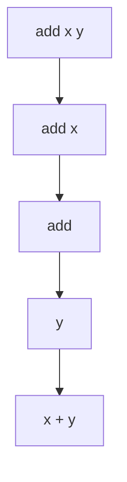
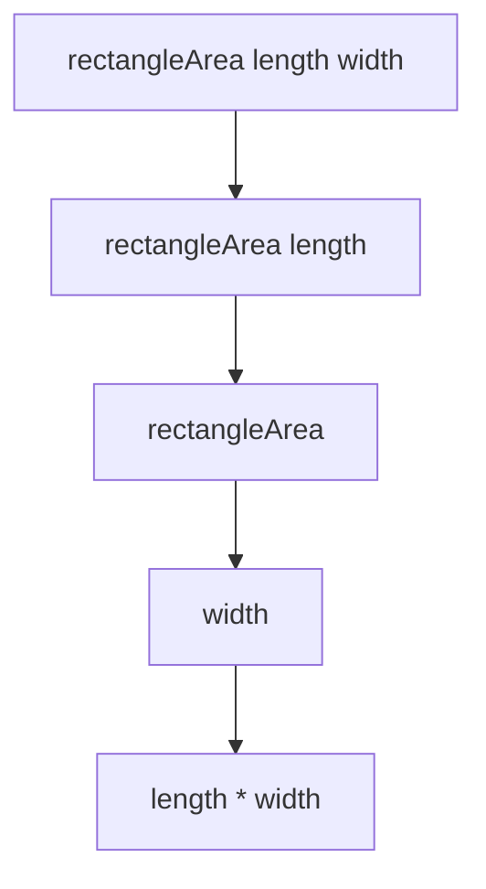

## 2.7 Currying and Partial Application

In the realm of functional programming, currying and partial application are two foundational concepts that empower developers to write more modular, reusable, and expressive code. In this section, we will delve into these concepts, explore their practical applications, and provide you with the tools to leverage them effectively in Haskell.

### Currying Explained

Currying is a technique that transforms a function with multiple arguments into a sequence of functions, each taking a single argument. This transformation allows for greater flexibility in function application and composition.

#### Understanding Currying

In Haskell, all functions are curried by default. This means that a function that appears to take multiple arguments is actually a series of nested functions, each taking one argument. Let's consider a simple example:

```haskell
-- A function that adds two numbers
add :: Int -> Int -> Int
add x y = x + y
```

The type signature `Int -> Int -> Int` indicates that `add` is a function that takes an `Int` and returns a function `Int -> Int`. This returned function then takes another `Int` and produces the final result.

#### Visualizing Currying

To better understand currying, let's visualize the transformation process using a diagram:



In this diagram, `add x y` is broken down into `add x`, which returns a function that takes `y` and computes `x + y`.

### Partial Application

Partial application is the process of fixing a few arguments of a function, producing another function that takes the remaining arguments. This technique is particularly useful for creating specialized functions from more general ones.

#### Implementing Partial Application

Consider the `add` function from earlier. We can create a new function that adds 5 to any given number by partially applying `add`:

```haskell
-- Partially applying the add function
addFive :: Int -> Int
addFive = add 5

-- Using the partially applied function
result = addFive 10 -- result is 15
```

In this example, `addFive` is a new function derived from `add` by fixing the first argument to 5. This demonstrates how partial application can simplify function usage.

### Practical Uses of Currying and Partial Application

Currying and partial application offer several practical benefits in Haskell programming:

1. **Simplifying Function Composition**: By breaking down functions into smaller components, currying facilitates function composition, allowing developers to build complex operations from simple ones.

2. **Enhancing Code Reusability**: Partial application enables the creation of specialized functions from general ones, promoting code reuse and reducing redundancy.

3. **Improving Readability**: Currying and partial application can lead to more concise and readable code, as they eliminate the need for repetitive boilerplate.

4. **Facilitating Higher-Order Functions**: These techniques are integral to the use of higher-order functions, which are functions that take other functions as arguments or return them as results.

### Code Examples

Let's explore some code examples to illustrate the power of currying and partial application in Haskell.

#### Example 1: Function Composition

```haskell
-- Define two simple functions
multiplyByTwo :: Int -> Int
multiplyByTwo x = x * 2

subtractThree :: Int -> Int
subtractThree x = x - 3

-- Compose the functions using currying
combinedFunction :: Int -> Int
combinedFunction = multiplyByTwo . subtractThree

-- Apply the composed function
result = combinedFunction 10 -- result is 14
```

In this example, we use currying to compose `multiplyByTwo` and `subtractThree`, creating a new function `combinedFunction` that applies both operations in sequence.

#### Example 2: Creating Specialized Functions

```haskell
-- A generic function to calculate the area of a rectangle
rectangleArea :: Double -> Double -> Double
rectangleArea length width = length * width

-- Create a specialized function for squares
squareArea :: Double -> Double
squareArea = rectangleArea 5

-- Calculate the area of a square
area = squareArea 4 -- area is 20
```

Here, we use partial application to create `squareArea`, a specialized function for calculating the area of squares with a fixed side length of 5.

### Visualizing Function Application

To further illustrate the concept of function application in Haskell, let's use a diagram:



This diagram shows how `rectangleArea` is transformed into a series of single-argument functions, demonstrating the power of currying.

### Haskell Unique Features

Haskell's type system and lazy evaluation model play a crucial role in enabling currying and partial application. The strong static typing ensures that functions are applied correctly, while lazy evaluation allows for efficient computation of partially applied functions.

### Differences and Similarities

Currying and partial application are often confused with each other, but they serve distinct purposes:

- **Currying**: Transforms a multi-argument function into a series of single-argument functions.
- **Partial Application**: Fixes some arguments of a function, creating a new function that takes the remaining arguments.

Both techniques are complementary and can be used together to create flexible and reusable code.

### Try It Yourself

To deepen your understanding of currying and partial application, try modifying the code examples provided. Experiment with different functions and see how currying and partial application can simplify your code.

### Knowledge Check

- **Question**: What is the primary purpose of currying in Haskell?
- **Challenge**: Create a partially applied function that multiplies a number by 10.

### Embrace the Journey

Remember, mastering currying and partial application is just the beginning of your journey into functional programming with Haskell. As you continue to explore these concepts, you'll discover new ways to write elegant and efficient code. Keep experimenting, stay curious, and enjoy the journey!

## Quiz: Currying and Partial Application



### What is currying in Haskell?

- [x] Transforming a function with multiple arguments into a series of single-argument functions.
- [ ] Fixing a few arguments of a function to produce another function.
- [ ] A technique for optimizing function performance.
- [ ] A method for handling errors in Haskell.

> **Explanation:** Currying is the process of transforming a function with multiple arguments into a series of single-argument functions.

### What does partial application allow you to do?

- [x] Fix a few arguments of a function, producing another function.
- [ ] Transform a function into a series of single-argument functions.
- [ ] Optimize the performance of a function.
- [ ] Handle errors in Haskell.

> **Explanation:** Partial application allows you to fix a few arguments of a function, creating a new function that takes the remaining arguments.

### How does currying enhance function composition?

- [x] By breaking down functions into smaller components, facilitating composition.
- [ ] By optimizing the performance of composed functions.
- [ ] By handling errors in composed functions.
- [ ] By making composed functions more readable.

> **Explanation:** Currying enhances function composition by breaking down functions into smaller components, making it easier to compose them.

### What is the result of partially applying the function `add 5`?

- [x] A new function that adds 5 to any given number.
- [ ] A function that subtracts 5 from any given number.
- [ ] A function that multiplies a number by 5.
- [ ] A function that divides a number by 5.

> **Explanation:** Partially applying `add 5` creates a new function that adds 5 to any given number.

### Which of the following is a benefit of partial application?

- [x] Enhancing code reusability.
- [ ] Optimizing function performance.
- [ ] Handling errors in Haskell.
- [ ] Making functions more readable.

> **Explanation:** Partial application enhances code reusability by allowing the creation of specialized functions from general ones.

### What is the type signature of a curried function that takes two `Int` arguments?

- [x] `Int -> Int -> Int`
- [ ] `(Int, Int) -> Int`
- [ ] `Int -> (Int -> Int)`
- [ ] `Int -> Int`

> **Explanation:** The type signature `Int -> Int -> Int` indicates a curried function that takes two `Int` arguments.

### How can currying improve code readability?

- [x] By eliminating repetitive boilerplate code.
- [ ] By optimizing function performance.
- [ ] By handling errors in Haskell.
- [ ] By making functions more concise.

> **Explanation:** Currying can improve code readability by eliminating repetitive boilerplate code.

### What is the relationship between currying and partial application?

- [x] They are complementary techniques that can be used together.
- [ ] They are the same technique with different names.
- [ ] They are unrelated techniques.
- [ ] They are mutually exclusive techniques.

> **Explanation:** Currying and partial application are complementary techniques that can be used together to create flexible and reusable code.

### True or False: In Haskell, all functions are curried by default.

- [x] True
- [ ] False

> **Explanation:** In Haskell, all functions are curried by default, meaning they are transformed into a series of single-argument functions.


