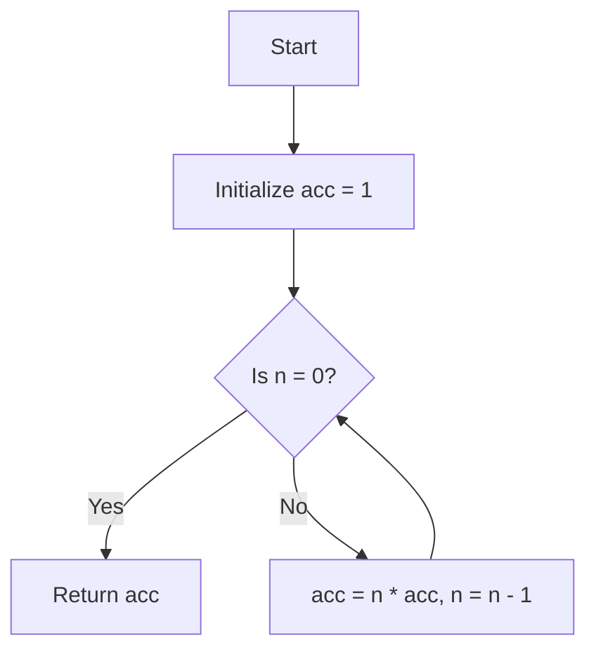

## 2.8 Recursion and Tail Recursion

Recursion is a fundamental concept in functional programming, and Haskell, being a purely functional language, leverages recursion extensively. In this section, we will delve into the intricacies of recursion and tail recursion, exploring their principles, optimizations, and practical applications in Haskell.

### Understanding Recursion

Recursion is a technique where a function calls itself to solve a problem. It is particularly useful for problems that can be broken down into smaller, similar sub-problems. In Haskell, recursion is often preferred over traditional iterative constructs like loops, which are not idiomatic in functional programming.

#### Basic Recursive Functions

Let's start with a simple example: calculating the factorial of a number. The factorial of a non-negative integer `n` is the product of all positive integers less than or equal to `n`.

```haskell
-- Factorial function using recursion
factorial :: Integer -> Integer
factorial 0 = 1
factorial n = n * factorial (n - 1)
```

In this example, the `factorial` function calls itself with a decremented value of `n` until it reaches the base case of `0`, where it returns `1`.

#### Key Concepts in Recursion

1. **Base Case**: The condition under which the recursive function stops calling itself. It prevents infinite recursion and stack overflow.
2. **Recursive Case**: The part of the function where the recursion occurs. It reduces the problem size and moves towards the base case.

### Tail Recursion and Optimization

Tail recursion is a special form of recursion where the recursive call is the last operation in the function. Tail-recursive functions can be optimized by the compiler to iterative loops, reducing the risk of stack overflow and improving performance.

#### Tail Recursive Functions

Consider the following tail-recursive version of the factorial function:

```haskell
-- Tail-recursive factorial function
factorialTail :: Integer -> Integer
factorialTail n = go n 1
  where
    go 0 acc = acc
    go n acc = go (n - 1) (n * acc)
```

In this version, the `go` helper function accumulates the result in the `acc` parameter. The recursive call to `go` is the last operation, making it tail-recursive.

#### Benefits of Tail Recursion

- **Stack Efficiency**: Tail recursion allows the compiler to optimize the recursion into a loop, using constant stack space.
- **Performance**: Tail-recursive functions can be more efficient, especially for large input sizes, as they avoid the overhead of maintaining multiple stack frames.

### Visualizing Recursion and Tail Recursion

To better understand the flow of recursion and tail recursion, let's visualize the process using a flowchart.

```mermaid
flowchart TD
    A[Start] --> B{Is n = 0?}
    B -- Yes --> C[Return 1]
    B -- No --> D[Return n * factorial(n - 1)]
    D --> B
```

This flowchart represents the recursive factorial function. The process continues until the base case is reached.

For the tail-recursive version, the flowchart would look like this:



Here, the accumulator `acc` carries the result through each iteration, and the function returns `acc` when `n` reaches `0`.

### Common Recursive Patterns in Haskell

Recursion is a versatile tool in Haskell, and several common patterns emerge in functional programming:

#### 1. **List Processing**

Recursion is often used to process lists. For example, calculating the sum of a list of numbers:

```haskell
-- Sum of a list using recursion
sumList :: [Integer] -> Integer
sumList [] = 0
sumList (x:xs) = x + sumList xs
```

This function recursively adds the head of the list `x` to the sum of the tail `xs`.

#### 2. **Tree Traversal**

Recursive functions are ideal for traversing tree structures. Consider a binary tree:

```haskell
data Tree a = Empty | Node a (Tree a) (Tree a)

-- In-order traversal of a binary tree
inOrder :: Tree a -> [a]
inOrder Empty = []
inOrder (Node x left right) = inOrder left ++ [x] ++ inOrder right
```

The `inOrder` function recursively visits the left subtree, the root node, and then the right subtree.

### Tail Recursion in Practice

Tail recursion is not just a theoretical concept; it has practical applications in real-world Haskell programming. Let's explore some scenarios where tail recursion can be beneficial.

#### Accumulating Parameters

As seen in the tail-recursive factorial example, using an accumulating parameter is a common technique to achieve tail recursion. This approach can be applied to various problems, such as computing the greatest common divisor (GCD):

```haskell
-- Tail-recursive GCD function
gcdTail :: Integer -> Integer -> Integer
gcdTail a 0 = a
gcdTail a b = gcdTail b (a `mod` b)
```

Here, the recursive call to `gcdTail` is the last operation, making it tail-recursive.

#### Avoiding Stack Overflow

For problems that require deep recursion, such as computing Fibonacci numbers, tail recursion can prevent stack overflow:

```haskell
-- Tail-recursive Fibonacci function
fibonacci :: Integer -> Integer
fibonacci n = fibHelper n 0 1
  where
    fibHelper 0 a _ = a
    fibHelper n a b = fibHelper (n - 1) b (a + b)
```

The `fibHelper` function uses two accumulators, `a` and `b`, to store the Fibonacci numbers, ensuring the function is tail-recursive.

### Try It Yourself

Experiment with the code examples provided. Try modifying the recursive functions to see how they behave with different inputs. For instance, implement a tail-recursive version of the sum of a list:

```haskell
-- Tail-recursive sum of a list
sumListTail :: [Integer] -> Integer
sumListTail xs = go xs 0
  where
    go [] acc = acc
    go (x:xs) acc = go xs (acc + x)
```

### Knowledge Check

1. What is the primary advantage of tail recursion over regular recursion?
2. How does tail recursion help in optimizing stack usage?
3. Can all recursive functions be converted to tail-recursive functions? Why or why not?

### Conclusion

Recursion and tail recursion are powerful tools in Haskell, enabling elegant solutions to complex problems. By understanding and applying these concepts, you can write efficient and maintainable Haskell code. Remember, recursion is not just about solving problems; it's about thinking in a functional way.

### Further Reading

- [Haskell Wiki: Recursion](https://wiki.haskell.org/Recursion)
- [Learn You a Haskell for Great Good! - Recursion](http://learnyouahaskell.com/recursion)
- [Real World Haskell - Recursion](http://book.realworldhaskell.org/read/recursion.html)

## Quiz: Recursion and Tail Recursion



### What is the primary advantage of tail recursion?

- [x] It allows the compiler to optimize the recursion into a loop, using constant stack space.
- [ ] It makes the code more readable.
- [ ] It increases the complexity of the code.
- [ ] It allows for more recursive calls.

> **Explanation:** Tail recursion allows the compiler to optimize the recursion into a loop, using constant stack space, which prevents stack overflow.

### How does tail recursion help in optimizing stack usage?

- [x] By transforming recursive calls into iterative loops.
- [ ] By reducing the number of recursive calls.
- [ ] By increasing the stack size.
- [ ] By using more memory.

> **Explanation:** Tail recursion transforms recursive calls into iterative loops, reducing the need for additional stack frames.

### Can all recursive functions be converted to tail-recursive functions?

- [ ] Yes, all recursive functions can be converted.
- [x] No, not all recursive functions can be converted.
- [ ] Only functions with a single recursive call can be converted.
- [ ] Only functions with multiple recursive calls can be converted.

> **Explanation:** Not all recursive functions can be converted to tail-recursive functions, especially those that require additional operations after the recursive call.

### What is a base case in recursion?

- [x] The condition under which the recursive function stops calling itself.
- [ ] The first call to the recursive function.
- [ ] The last call to the recursive function.
- [ ] The recursive call itself.

> **Explanation:** The base case is the condition under which the recursive function stops calling itself, preventing infinite recursion.

### What is an accumulating parameter?

- [x] A parameter that carries the result through each iteration in a tail-recursive function.
- [ ] A parameter that increases with each recursive call.
- [ ] A parameter that decreases with each recursive call.
- [ ] A parameter that remains constant throughout the recursion.

> **Explanation:** An accumulating parameter carries the result through each iteration in a tail-recursive function, enabling tail recursion.

### What is the role of the recursive case in a recursive function?

- [x] It reduces the problem size and moves towards the base case.
- [ ] It increases the problem size.
- [ ] It stops the recursion.
- [ ] It initializes the recursion.

> **Explanation:** The recursive case reduces the problem size and moves towards the base case, allowing the recursion to progress.

### Why is recursion preferred over loops in Haskell?

- [x] Because recursion is more idiomatic in functional programming.
- [ ] Because loops are not supported in Haskell.
- [ ] Because recursion is faster than loops.
- [ ] Because loops are more complex to implement.

> **Explanation:** Recursion is more idiomatic in functional programming, aligning with Haskell's functional nature.

### What is the purpose of the `go` function in the tail-recursive factorial example?

- [x] To accumulate the result and ensure the function is tail-recursive.
- [ ] To increase the complexity of the function.
- [ ] To decrease the readability of the function.
- [ ] To initialize the recursion.

> **Explanation:** The `go` function accumulates the result and ensures the function is tail-recursive by making the recursive call the last operation.

### How can you prevent stack overflow in recursive functions?

- [x] By using tail recursion.
- [ ] By increasing the stack size.
- [ ] By reducing the number of recursive calls.
- [ ] By using more memory.

> **Explanation:** Using tail recursion can prevent stack overflow by optimizing the recursion into a loop, using constant stack space.

### True or False: Tail recursion is always more efficient than regular recursion.

- [ ] True
- [x] False

> **Explanation:** Tail recursion is not always more efficient than regular recursion. It depends on the specific problem and implementation.


