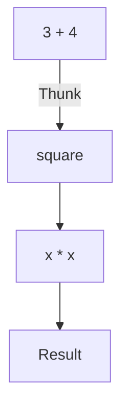

## 2.9 Lazy Evaluation and Infinite Data Structures

In the realm of functional programming, Haskell stands out with its unique approach to computation through lazy evaluation. This paradigm shift allows developers to define infinite data structures and perform computations in a more efficient and expressive manner. In this section, we will delve into the intricacies of lazy evaluation, explore the concept of infinite data structures, and understand how these features can be harnessed to build robust Haskell applications.

### Understanding Lazy Evaluation

Lazy evaluation, also known as call-by-need, is a strategy where expressions are not evaluated until their values are actually needed. This contrasts with eager evaluation, where expressions are evaluated as soon as they are bound to a variable. Lazy evaluation can lead to significant performance improvements, especially when dealing with large or infinite data structures.

#### Key Concepts of Lazy Evaluation

- **Deferred Computation**: Computations are postponed until their results are required.
- **Memoization**: Once a computation is performed, its result is stored for future use, avoiding redundant calculations.
- **Thunks**: Unevaluated expressions are represented as thunks, which are evaluated only when needed.

#### Benefits of Lazy Evaluation

1. **Efficiency**: By avoiding unnecessary computations, lazy evaluation can lead to more efficient programs.
2. **Modularity**: Functions can be composed more freely, as computations are only performed when needed.
3. **Infinite Data Structures**: Lazy evaluation enables the definition and manipulation of infinite data structures, which would be impossible in an eagerly evaluated language.

#### Potential Pitfalls

While lazy evaluation offers numerous advantages, it also introduces some challenges:

- **Space Leaks**: Holding onto unevaluated thunks can lead to increased memory usage.
- **Debugging Complexity**: The deferred nature of computation can make debugging more challenging, as the order of evaluation is not always intuitive.

### Infinite Data Structures

Infinite data structures are a natural extension of lazy evaluation. In Haskell, you can define data structures that conceptually have no end, such as infinite lists. These structures are only partially evaluated, as needed, allowing you to work with them as if they were finite.

#### Defining Infinite Lists

Let's explore how to define and work with infinite lists in Haskell:

```haskell
-- An infinite list of natural numbers
naturals :: [Integer]
naturals = [0..]

-- An infinite list of Fibonacci numbers
fibonacci :: [Integer]
fibonacci = 0 : 1 : zipWith (+) fibonacci (tail fibonacci)
```

In the above examples, `naturals` is an infinite list of natural numbers, and `fibonacci` is an infinite list of Fibonacci numbers. These lists are defined recursively and leverage Haskell's lazy evaluation to compute elements on demand.

#### Working with Infinite Data Structures

To effectively work with infinite data structures, you must use functions that can operate on potentially infinite inputs. Common functions include:

- **`take`**: Extracts a finite prefix from an infinite list.
- **`map`**: Applies a function to each element of a list.
- **`filter`**: Selects elements that satisfy a predicate.

Example:

```haskell
-- Take the first 10 natural numbers
firstTenNaturals :: [Integer]
firstTenNaturals = take 10 naturals

-- Take the first 10 even Fibonacci numbers
firstTenEvenFibonacci :: [Integer]
firstTenEvenFibonacci = take 10 (filter even fibonacci)
```

### Visualizing Lazy Evaluation

To better understand lazy evaluation, let's visualize how Haskell evaluates expressions using a simple example:

```haskell
-- Define a simple function
square :: Integer -> Integer
square x = x * x

-- Use the function in a lazy context
lazyExample :: Integer
lazyExample = square (3 + 4)
```

In an eagerly evaluated language, `3 + 4` would be computed immediately, followed by the multiplication. However, in Haskell, the expression `3 + 4` is represented as a thunk and only evaluated when `square` requires its value.



In this diagram, the computation of `3 + 4` is deferred until `square` is called, demonstrating the lazy evaluation process.

### Practical Applications of Lazy Evaluation

Lazy evaluation is not just a theoretical concept; it has practical applications in real-world Haskell programming:

#### Stream Processing

Lazy evaluation is ideal for stream processing, where data is processed incrementally as it becomes available. This is particularly useful for handling large datasets or real-time data streams.

Example:

```haskell
-- Process an infinite stream of data
processStream :: [Integer] -> [Integer]
processStream = map (*2) . filter even

-- Apply the function to an infinite list
processedData :: [Integer]
processedData = processStream naturals
```

In this example, `processStream` processes an infinite list of natural numbers, doubling each even number. The computation is performed lazily, allowing the program to handle potentially infinite data.

#### Infinite Search

Lazy evaluation enables infinite search algorithms, where you can search through an infinite space of possibilities without evaluating the entire space.

Example:

```haskell
-- Find the first prime number greater than 1000
isPrime :: Integer -> Bool
isPrime n = n > 1 && all (\x -> n `mod` x /= 0) [2..(n-1)]

firstPrimeOver1000 :: Integer
firstPrimeOver1000 = head (filter isPrime [1001..])
```

Here, `firstPrimeOver1000` finds the first prime number greater than 1000 by lazily filtering an infinite list of numbers.

### Working with Laziness: Benefits and Pitfalls

While lazy evaluation offers powerful capabilities, it requires careful handling to avoid common pitfalls:

#### Benefits

- **Reduced Computation**: Only necessary computations are performed, leading to potential performance gains.
- **Improved Modularity**: Functions can be composed more flexibly, as computations are deferred.
- **Expressive Code**: Infinite data structures and lazy evaluation enable more expressive and concise code.

#### Pitfalls

- **Space Leaks**: Holding onto unevaluated thunks can lead to increased memory usage, known as space leaks.
- **Complex Debugging**: The deferred nature of computation can make debugging more challenging, as the order of evaluation is not always intuitive.
- **Unexpected Laziness**: In some cases, laziness can lead to unexpected behavior if not properly managed.

### Managing Space Leaks

Space leaks occur when unevaluated thunks accumulate in memory, leading to increased memory usage. To manage space leaks, consider the following strategies:

- **Strict Evaluation**: Use strict evaluation to force the evaluation of expressions when needed. This can be achieved using the `seq` function or strict data types.
- **Profiling Tools**: Utilize Haskell's profiling tools to identify and address space leaks in your code.
- **Avoid Unnecessary Laziness**: Be mindful of where laziness is applied and avoid unnecessary deferred computations.

Example of strict evaluation:

```haskell
-- Force strict evaluation using seq
strictSum :: [Integer] -> Integer
strictSum [] = 0
strictSum (x:xs) = x `seq` (x + strictSum xs)
```

In this example, `seq` is used to force the evaluation of `x` before proceeding with the recursive sum, preventing the accumulation of thunks.

### Try It Yourself

Experiment with the following code examples to deepen your understanding of lazy evaluation and infinite data structures:

1. Modify the `naturals` list to start from a different number and observe the changes.
2. Create a new infinite list of prime numbers and extract the first 20 primes.
3. Implement a function that processes an infinite list of random numbers, filtering out those that are divisible by 3.

### Further Reading

To explore lazy evaluation and infinite data structures in more depth, consider the following resources:

- [Haskell Wiki: Lazy Evaluation](https://wiki.haskell.org/Lazy_evaluation)
- [Real World Haskell: Lazy Evaluation](http://book.realworldhaskell.org/read/functional-programming.html)
- [Learn You a Haskell for Great Good!](http://learnyouahaskell.com/chapters)

### Summary

Lazy evaluation and infinite data structures are powerful features of Haskell that enable efficient and expressive programming. By understanding and leveraging these concepts, you can build robust applications that handle large and complex data with ease. Remember to manage potential pitfalls, such as space leaks, and continue exploring the vast possibilities that lazy evaluation offers.

## Quiz: Lazy Evaluation and Infinite Data Structures



### What is lazy evaluation in Haskell?

- [x] Delaying computation until the result is required
- [ ] Evaluating all expressions immediately
- [ ] A method to optimize memory usage
- [ ] A technique to parallelize computations

> **Explanation:** Lazy evaluation delays computation until the result is actually needed, allowing for more efficient execution.

### Which of the following is an example of an infinite data structure in Haskell?

- [x] An infinite list of natural numbers
- [ ] A finite array of integers
- [ ] A binary tree with a fixed depth
- [ ] A hash map with a limited number of keys

> **Explanation:** An infinite list of natural numbers is an example of an infinite data structure, as it has no fixed size.

### What is a thunk in the context of lazy evaluation?

- [x] An unevaluated expression
- [ ] A fully evaluated expression
- [ ] A type of data structure
- [ ] A function that returns a value

> **Explanation:** A thunk is an unevaluated expression that is computed only when its value is needed.

### How can you extract a finite portion of an infinite list in Haskell?

- [x] Using the `take` function
- [ ] Using the `drop` function
- [ ] Using the `filter` function
- [ ] Using the `map` function

> **Explanation:** The `take` function extracts a finite prefix from an infinite list.

### What is a potential pitfall of lazy evaluation?

- [x] Space leaks
- [ ] Increased computation time
- [ ] Reduced code readability
- [ ] Limited expressiveness

> **Explanation:** Space leaks can occur when unevaluated thunks accumulate in memory, leading to increased memory usage.

### Which function can force strict evaluation in Haskell?

- [x] `seq`
- [ ] `map`
- [ ] `filter`
- [ ] `foldr`

> **Explanation:** The `seq` function can be used to force strict evaluation of an expression.

### What is the benefit of using lazy evaluation in stream processing?

- [x] Incremental processing of data as it becomes available
- [ ] Immediate processing of all data
- [ ] Reduced memory usage
- [ ] Simplified code structure

> **Explanation:** Lazy evaluation allows for incremental processing of data, making it ideal for stream processing.

### How can you manage space leaks in Haskell?

- [x] Use strict evaluation
- [ ] Avoid using infinite data structures
- [ ] Increase memory allocation
- [ ] Use more complex data structures

> **Explanation:** Using strict evaluation can help manage space leaks by forcing the evaluation of expressions when needed.

### What is the role of memoization in lazy evaluation?

- [x] Storing computed results for future use
- [ ] Delaying computation until needed
- [ ] Optimizing memory usage
- [ ] Parallelizing computations

> **Explanation:** Memoization stores computed results to avoid redundant calculations in the future.

### True or False: Lazy evaluation can lead to unexpected behavior if not properly managed.

- [x] True
- [ ] False

> **Explanation:** Lazy evaluation can lead to unexpected behavior if not properly managed, especially in terms of memory usage and evaluation order.


