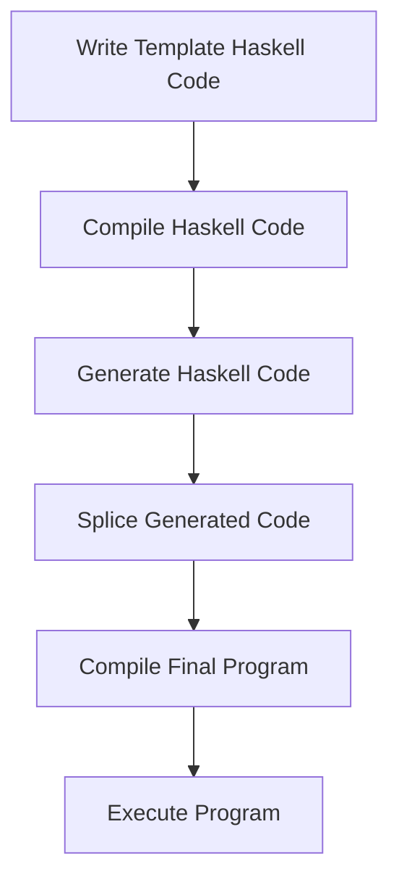

## 20.1 Utilizing Template Haskell for Metaprogramming

In the world of Haskell, Template Haskell (TH) stands out as a powerful tool for metaprogramming, allowing developers to generate and manipulate Haskell code at compile time. This capability can significantly enhance productivity by automating repetitive tasks, generating boilerplate code, and embedding domain-specific languages (DSLs). In this section, we will delve into the intricacies of Template Haskell, explore its applications, and provide practical examples to illustrate its use.

### Understanding Template Haskell

Template Haskell is a Haskell extension that provides a mechanism for compile-time metaprogramming. It allows you to write Haskell code that generates other Haskell code, which is then compiled as part of your program. This can be particularly useful for tasks such as:

- **Generating boilerplate code**: Automatically creating repetitive code structures.
- **Deriving instances**: Simplifying the process of implementing type class instances.
- **Embedding DSLs**: Creating specialized languages within Haskell for specific domains.

#### Key Concepts

Before we dive into examples, let's clarify some key concepts in Template Haskell:

- **Quasi-quotations**: A way to embed Haskell code within Haskell code, using special syntax to denote code that should be treated as data.
- **Splicing**: The process of inserting generated code into the program.
- **Reification**: The ability to inspect and manipulate the structure of Haskell code.

### Getting Started with Template Haskell

To use Template Haskell, you need to enable the extension by adding the following pragma at the top of your Haskell file:

```haskell
{-# LANGUAGE TemplateHaskell #-}
```

This enables the use of Template Haskell's syntax and functions.

### Basic Example: Generating Boilerplate Code

Let's start with a simple example of generating boilerplate code. Suppose we have a data type and we want to automatically generate a function that prints each field of the data type.

```haskell
{-# LANGUAGE TemplateHaskell #-}

module Main where

import Language.Haskell.TH

-- Define a simple data type
data Person = Person { name :: String, age :: Int }

-- Template Haskell function to generate a print function
generatePrintFunction :: Name -> Q [Dec]
generatePrintFunction typeName = do
  TyConI (DataD _ _ _ _ [RecC _ fields] _) <- reify typeName
  let printField (fieldName, _, _) = [| putStrLn $(litE (stringL (nameBase fieldName))) |]
  let printFields = map printField fields
  funD (mkName "printPerson") [clause [] (normalB (doE printFields)) []]

-- Use Template Haskell to generate the function
$(generatePrintFunction ''Person)

main :: IO ()
main = printPerson
```

In this example, we use Template Haskell to generate a `printPerson` function that prints the names of the fields in the `Person` data type. The `generatePrintFunction` function uses reification to inspect the `Person` type and constructs a list of statements to print each field name.

### Advanced Example: Deriving Instances

Template Haskell can also be used to derive instances for type classes. Let's create a simple example where we automatically derive a `Show` instance for a data type.

```haskell
{-# LANGUAGE TemplateHaskell #-}

module Main where

import Language.Haskell.TH

-- Define a data type
data Animal = Dog { breed :: String, age :: Int }
            | Cat { color :: String, age :: Int }

-- Template Haskell function to derive a Show instance
deriveShow :: Name -> Q [Dec]
deriveShow typeName = do
  TyConI (DataD _ _ _ _ constructors _) <- reify typeName
  let showClause (NormalC conName fields) = do
        let fieldNames = map (\i -> mkName ("x" ++ show i)) [1..length fields]
        let pat = conP conName (map varP fieldNames)
        let body = normalB [| showString $(litE (stringL (nameBase conName))) . showChar ' ' . showList $(listE (map varE fieldNames)) |]
        clause [pat] body []
  let clauses = map showClause constructors
  instanceD (cxt []) (appT (conT ''Show) (conT typeName)) [funD 'show clauses]

-- Use Template Haskell to derive the Show instance
$(deriveShow ''Animal)

main :: IO ()
main = print (Dog "Labrador" 5)
```

In this example, we define a `deriveShow` function that generates a `Show` instance for the `Animal` data type. The function uses Template Haskell's reification capabilities to inspect the constructors of the data type and generate appropriate `show` functions for each constructor.

### Embedding Domain-Specific Languages

One of the most powerful applications of Template Haskell is embedding DSLs within Haskell. This allows you to create specialized languages tailored to specific problem domains, while still leveraging Haskell's type system and tooling.

#### Example: A Simple Arithmetic DSL

Let's create a simple arithmetic DSL using Template Haskell. We'll define a DSL for basic arithmetic expressions and use Template Haskell to generate Haskell code that evaluates these expressions.

```haskell
{-# LANGUAGE TemplateHaskell #-}

module Main where

import Language.Haskell.TH

-- Define a simple arithmetic DSL
data Expr = Lit Int
          | Add Expr Expr
          | Mul Expr Expr

-- Template Haskell function to generate evaluation code
evalExpr :: Expr -> Q Exp
evalExpr (Lit n) = [| n |]
evalExpr (Add e1 e2) = [| $(evalExpr e1) + $(evalExpr e2) |]
evalExpr (Mul e1 e2) = [| $(evalExpr e1) * $(evalExpr e2) |]

-- Use Template Haskell to evaluate an expression
result :: Int
result = $(evalExpr (Add (Lit 3) (Mul (Lit 2) (Lit 4))))

main :: IO ()
main = print result
```

In this example, we define a simple arithmetic DSL with literals, addition, and multiplication. The `evalExpr` function uses Template Haskell to generate Haskell code that evaluates an expression. The `result` value is computed at compile time using this generated code.

### Visualizing Template Haskell Workflow

To better understand the workflow of Template Haskell, let's visualize the process of code generation and splicing using a flowchart.



**Figure 1**: The Template Haskell workflow involves writing Template Haskell code, compiling it to generate Haskell code, splicing the generated code into the program, and compiling the final program for execution.

### Design Considerations

When using Template Haskell, there are several design considerations to keep in mind:

- **Compile-Time Overhead**: Template Haskell introduces additional compile-time overhead, as code generation and splicing occur during compilation. This can increase compilation times, especially for large projects.
- **Debugging Complexity**: Debugging Template Haskell code can be challenging, as errors may occur in the generated code rather than the original Template Haskell code.
- **Portability**: Template Haskell is specific to GHC, the Glasgow Haskell Compiler. This can limit portability to other Haskell compilers.

### Haskell Unique Features

Template Haskell leverages several unique features of Haskell:

- **Strong Typing**: The strong typing of Haskell ensures that generated code adheres to type constraints, reducing runtime errors.
- **Purity**: Haskell's purity allows Template Haskell to generate code without side effects, ensuring predictable behavior.
- **Lazy Evaluation**: Lazy evaluation can be leveraged in Template Haskell to defer code generation until necessary.

### Differences and Similarities

Template Haskell is often compared to other metaprogramming tools in different languages, such as macros in Lisp or C++. However, Template Haskell operates at the level of Haskell's abstract syntax tree (AST), providing a more structured and type-safe approach to metaprogramming.

### Try It Yourself

To deepen your understanding of Template Haskell, try modifying the examples provided:

- **Extend the `generatePrintFunction`** to include the field values in the output.
- **Add support for subtraction and division** to the arithmetic DSL.
- **Create a Template Haskell function** that generates a `Read` instance for a data type.

### Knowledge Check

- What are the key components of Template Haskell?
- How does Template Haskell differ from runtime code generation?
- What are some common applications of Template Haskell in Haskell projects?

### Conclusion

Template Haskell is a powerful tool for metaprogramming in Haskell, enabling compile-time code generation, instance derivation, and DSL embedding. By leveraging Template Haskell, developers can automate repetitive tasks, reduce boilerplate code, and create specialized languages tailored to specific domains. As you explore Template Haskell, remember to consider the design considerations and unique features of Haskell that make this tool both powerful and challenging.

## Quiz: Utilizing Template Haskell for Metaprogramming



### What is the primary purpose of Template Haskell?

- [x] Compile-time metaprogramming
- [ ] Runtime code execution
- [ ] Dynamic type checking
- [ ] Memory management

> **Explanation:** Template Haskell is designed for compile-time metaprogramming, allowing developers to generate and manipulate code during compilation.

### Which of the following is a key feature of Template Haskell?

- [x] Quasi-quotations
- [ ] Garbage collection
- [ ] Dynamic dispatch
- [ ] Reflection

> **Explanation:** Quasi-quotations are a key feature of Template Haskell, enabling the embedding of Haskell code within Haskell code.

### What is the process of inserting generated code into a program called?

- [x] Splicing
- [ ] Reification
- [ ] Quoting
- [ ] Parsing

> **Explanation:** Splicing is the process of inserting generated code into a program in Template Haskell.

### What is reification in the context of Template Haskell?

- [x] Inspecting and manipulating code structure
- [ ] Generating runtime errors
- [ ] Performing garbage collection
- [ ] Managing memory allocation

> **Explanation:** Reification in Template Haskell refers to the ability to inspect and manipulate the structure of Haskell code.

### Which of the following is a common application of Template Haskell?

- [x] Deriving type class instances
- [ ] Managing memory allocation
- [ ] Performing runtime type checks
- [ ] Handling exceptions

> **Explanation:** Template Haskell is commonly used to derive type class instances, automating the process of implementing instances for data types.

### What is a potential drawback of using Template Haskell?

- [x] Increased compile-time overhead
- [ ] Reduced runtime performance
- [ ] Limited type safety
- [ ] Lack of portability

> **Explanation:** Template Haskell can introduce increased compile-time overhead due to the code generation and splicing processes.

### How does Template Haskell differ from macros in C++?

- [x] Operates at the level of Haskell's AST
- [ ] Provides runtime code execution
- [ ] Offers dynamic type checking
- [ ] Manages memory allocation

> **Explanation:** Template Haskell operates at the level of Haskell's abstract syntax tree (AST), providing a more structured and type-safe approach to metaprogramming compared to macros in C++.

### What is the role of quasi-quotations in Template Haskell?

- [x] Embedding Haskell code within Haskell code
- [ ] Managing memory allocation
- [ ] Performing runtime type checks
- [ ] Handling exceptions

> **Explanation:** Quasi-quotations in Template Haskell allow for the embedding of Haskell code within Haskell code, treating code as data.

### What is a benefit of using Template Haskell for DSL embedding?

- [x] Leveraging Haskell's type system
- [ ] Reducing runtime performance
- [ ] Limiting type safety
- [ ] Increasing memory usage

> **Explanation:** Template Haskell allows for the embedding of domain-specific languages (DSLs) while leveraging Haskell's type system for type safety and tooling support.

### True or False: Template Haskell can be used for runtime code generation.

- [ ] True
- [x] False

> **Explanation:** Template Haskell is used for compile-time code generation, not runtime code generation.



Remember, this is just the beginning. As you progress, you'll discover more advanced techniques and applications of Template Haskell. Keep experimenting, stay curious, and enjoy the journey!
