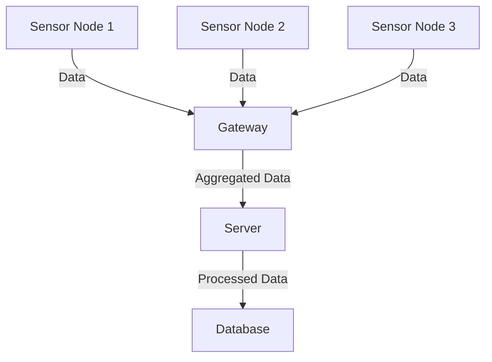

## 20.10 Internet of Things (IoT) Applications

The Internet of Things (IoT) represents a transformative shift in how we interact with technology, enabling devices to communicate and collaborate in real-time. As IoT systems become more prevalent, the need for reliable, efficient, and scalable software solutions becomes paramount. Haskell, with its strong emphasis on functional programming, concurrency, and type safety, offers unique advantages for developing IoT applications.

### Understanding IoT Challenges

IoT applications face several unique challenges that must be addressed to ensure successful deployment and operation:

- **Resource Constraints**: IoT devices often have limited processing power, memory, and energy resources. Efficient code is crucial to maximize performance and battery life.
- **Real-Time Data Processing**: IoT systems frequently require real-time data processing to respond to environmental changes promptly.
- **Scalability**: As the number of connected devices grows, systems must scale efficiently to handle increased data loads.
- **Reliability and Fault Tolerance**: IoT applications must be robust and capable of handling failures gracefully to maintain service continuity.
- **Security**: Protecting data and ensuring secure communication between devices is critical in IoT environments.

### Haskell's Role in IoT

Haskell's features make it well-suited for addressing the challenges of IoT applications:

- **Concurrency and Parallelism**: Haskell's lightweight concurrency model, supported by Software Transactional Memory (STM) and the `async` library, allows developers to write concurrent code efficiently.
- **Strong Static Typing**: Haskell's type system helps catch errors at compile time, reducing runtime failures and increasing reliability.
- **Immutability**: Immutable data structures simplify reasoning about code and enhance reliability, which is crucial for distributed IoT systems.
- **Lazy Evaluation**: Haskell's lazy evaluation model can help optimize resource usage by deferring computations until necessary.
- **Functional Abstractions**: Higher-order functions and monads provide powerful abstractions for managing side effects and state, which are common in IoT applications.

### Building IoT Applications with Haskell

Let's explore how Haskell can be used to build a simple IoT application, such as a sensor network that collects and processes environmental data.

#### Design Pattern: Sensor Network

**Intent**: Create a network of sensors that collect data and transmit it to a central server for processing and analysis.

**Key Participants**:
- **Sensors**: Devices that collect data from the environment.
- **Gateway**: A central node that aggregates data from sensors and forwards it to the server.
- **Server**: Processes and analyzes the data received from the gateway.

**Applicability**: Use this pattern when you need to collect and process data from multiple distributed sensors.

#### Sample Code Snippet

Below is a simplified example of a Haskell application that simulates a sensor network. The application consists of sensor nodes that generate random temperature data and send it to a central server for processing.

```haskell
{-# LANGUAGE OverloadedStrings #-}

import Control.Concurrent (forkIO, threadDelay)
import Control.Concurrent.STM
import Control.Monad (forever, replicateM_)
import Data.Text (Text)
import qualified Data.Text.IO as T
import System.Random (randomRIO)

-- Sensor data type
data SensorData = SensorData
  { sensorId :: Int
  , temperature :: Double
  } deriving (Show)

-- Function to simulate sensor data generation
generateSensorData :: Int -> IO SensorData
generateSensorData sensorId = do
  temp <- randomRIO (15.0, 30.0) -- Random temperature between 15 and 30
  return $ SensorData sensorId temp

-- Function to simulate a sensor node
sensorNode :: Int -> TQueue SensorData -> IO ()
sensorNode sensorId queue = forever $ do
  sensorData <- generateSensorData sensorId
  atomically $ writeTQueue queue sensorData
  threadDelay 1000000 -- 1 second delay

-- Function to simulate the server processing data
server :: TQueue SensorData -> IO ()
server queue = forever $ do
  sensorData <- atomically $ readTQueue queue
  T.putStrLn $ "Processing data: " <> (T.pack . show) sensorData

main :: IO ()
main = do
  queue <- newTQueueIO
  -- Start sensor nodes
  replicateM_ 5 $ \i -> forkIO $ sensorNode i queue
  -- Start server
  server queue
```

**Explanation**:
- **SensorData**: Represents the data collected by a sensor, including a sensor ID and temperature.
- **generateSensorData**: Simulates the generation of sensor data with random temperature values.
- **sensorNode**: Represents a sensor node that generates data and writes it to a queue.
- **server**: Processes data from the queue, simulating a central server.

### Design Considerations

- **Concurrency**: The use of `forkIO` and `TQueue` allows for concurrent execution of sensor nodes and the server, demonstrating Haskell's concurrency capabilities.
- **Scalability**: The system can be easily scaled by adding more sensor nodes or distributing the server across multiple machines.
- **Fault Tolerance**: Consider implementing error handling and retry mechanisms to enhance fault tolerance.

### Haskell Unique Features

- **STM (Software Transactional Memory)**: Provides a composable and safe way to manage shared state in concurrent applications.
- **Lazy Evaluation**: Helps optimize resource usage by deferring computations until necessary.
- **Type Safety**: Reduces runtime errors by catching issues at compile time.

### Differences and Similarities

- **Similarities**: The sensor network pattern shares similarities with the Publisher-Subscriber pattern, where sensors act as publishers and the server acts as a subscriber.
- **Differences**: Unlike traditional Publisher-Subscriber systems, the sensor network pattern focuses on real-time data collection and processing.

### Visualizing IoT Architecture

To better understand the architecture of an IoT application, let's visualize the components and their interactions using a Mermaid.js diagram.



**Diagram Description**: This diagram illustrates the flow of data from sensor nodes to a gateway, which aggregates the data and forwards it to a server for processing. The processed data is then stored in a database.

### Try It Yourself

Encourage experimentation by modifying the code example:

- **Add More Sensors**: Increase the number of sensor nodes to simulate a larger network.
- **Change Data Types**: Modify the `SensorData` type to include additional data, such as humidity or pressure.
- **Implement Error Handling**: Add error handling to manage potential failures in data transmission or processing.

### References and Links

- [Haskell STM Documentation](https://hackage.haskell.org/package/stm)
- [Concurrency in Haskell](https://wiki.haskell.org/Concurrency)
- [Real World Haskell](http://book.realworldhaskell.org/)

### Knowledge Check

- **Question**: What are the key challenges in IoT applications?
- **Exercise**: Modify the code example to include error handling for sensor data transmission.

### Embrace the Journey

Remember, this is just the beginning. As you progress, you'll build more complex IoT systems using Haskell. Keep experimenting, stay curious, and enjoy the journey!

## Quiz: Internet of Things (IoT) Applications



### What is a key challenge in IoT applications?

- [x] Resource constraints
- [ ] High bandwidth availability
- [ ] Unlimited processing power
- [ ] Infinite storage capacity

> **Explanation:** IoT devices often have limited resources, such as processing power and memory, making efficient code crucial.

### How does Haskell's type system benefit IoT applications?

- [x] Catches errors at compile time
- [ ] Increases runtime errors
- [ ] Reduces code readability
- [ ] Limits code flexibility

> **Explanation:** Haskell's strong static typing helps catch errors at compile time, reducing runtime failures.

### Which Haskell feature helps manage shared state in concurrent applications?

- [x] Software Transactional Memory (STM)
- [ ] Lazy Evaluation
- [ ] Type Classes
- [ ] Pattern Matching

> **Explanation:** STM provides a safe and composable way to manage shared state in concurrent Haskell applications.

### What is the role of the gateway in a sensor network?

- [x] Aggregates data from sensors
- [ ] Generates sensor data
- [ ] Processes data
- [ ] Stores data

> **Explanation:** The gateway collects data from sensors and forwards it to the server for processing.

### Which pattern is similar to the sensor network pattern?

- [x] Publisher-Subscriber
- [ ] Singleton
- [ ] Factory
- [ ] Decorator

> **Explanation:** The sensor network pattern is similar to the Publisher-Subscriber pattern, where sensors act as publishers and the server acts as a subscriber.

### What is a benefit of Haskell's lazy evaluation in IoT applications?

- [x] Optimizes resource usage
- [ ] Increases memory usage
- [ ] Decreases code efficiency
- [ ] Limits concurrency

> **Explanation:** Lazy evaluation defers computations until necessary, optimizing resource usage in IoT applications.

### How can you scale the sensor network system?

- [x] Add more sensor nodes
- [ ] Reduce the number of sensors
- [ ] Limit data processing
- [ ] Decrease server capacity

> **Explanation:** The system can be scaled by adding more sensor nodes or distributing the server across multiple machines.

### What is a key participant in the sensor network pattern?

- [x] Sensors
- [ ] Clients
- [ ] Databases
- [ ] User Interfaces

> **Explanation:** Sensors are key participants in the sensor network pattern, collecting data from the environment.

### Which Haskell feature helps optimize resource usage?

- [x] Lazy Evaluation
- [ ] Type Classes
- [ ] Pattern Matching
- [ ] Monads

> **Explanation:** Lazy evaluation helps optimize resource usage by deferring computations until necessary.

### True or False: Haskell's concurrency model is not suitable for IoT applications.

- [ ] True
- [x] False

> **Explanation:** Haskell's lightweight concurrency model is well-suited for IoT applications, allowing efficient concurrent code execution.


