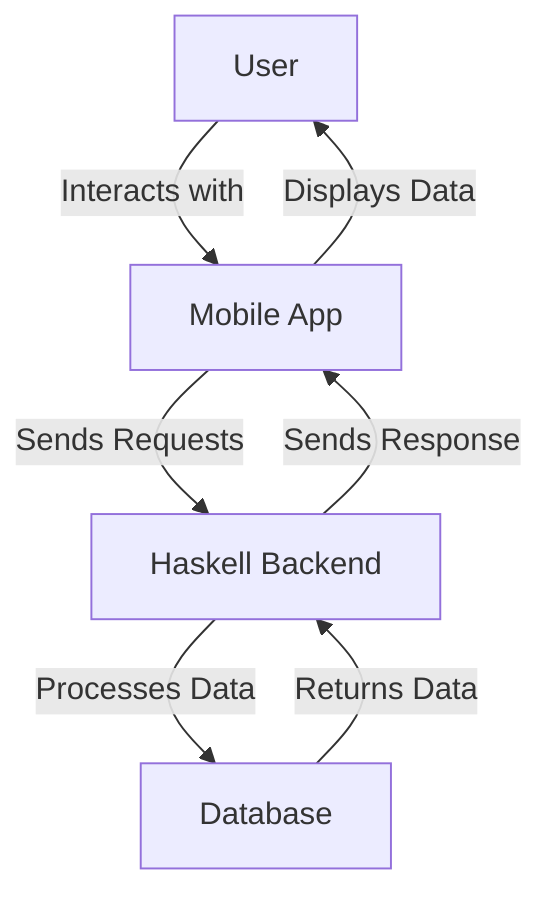

## 20.11 Mobile App Development with Haskell

Mobile app development has traditionally been dominated by languages like Java, Swift, and Kotlin. However, Haskell, with its strong emphasis on functional programming, offers unique advantages for building robust, maintainable, and scalable mobile applications. In this section, we will explore the landscape of mobile app development using Haskell, focusing on cross-compilation techniques, tools like Reflex Native, and integrating Haskell backends.

### Introduction to Mobile App Development with Haskell

Haskell is renowned for its strong type system, lazy evaluation, and pure functional programming paradigm. These features make it an excellent choice for developing applications that require high reliability and maintainability. However, mobile app development with Haskell is not as straightforward as with more traditional languages. Let's explore how we can leverage Haskell's strengths in this domain.

### Approaches to Mobile App Development with Haskell

#### Cross-Compilation with GHCJS

One of the primary approaches to using Haskell for mobile app development is through cross-compilation. GHCJS is a Haskell to JavaScript compiler that allows Haskell code to run in a web environment, which can be particularly useful for developing web-based mobile applications.

**Key Features of GHCJS:**

- **JavaScript Interoperability:** GHCJS provides seamless integration with JavaScript, allowing developers to use existing JavaScript libraries and frameworks.
- **Code Reuse:** By compiling Haskell code to JavaScript, developers can reuse existing Haskell libraries and codebases in web applications.
- **Functional UI Development:** Leverage Haskell's functional programming capabilities to create complex user interfaces with less code.

**Example:**

```haskell
{-# LANGUAGE OverloadedStrings #-}
import GHCJS.DOM
import GHCJS.DOM.Document
import GHCJS.DOM.Element
import GHCJS.DOM.Node

main :: IO ()
main = do
  Just doc <- currentDocument
  Just body <- getBody doc
  newElement <- createElement doc ("p" :: String)
  setInnerHTML newElement ("Hello, Haskell!" :: String)
  appendChild_ body newElement
```

This simple example demonstrates how to manipulate the DOM using Haskell compiled to JavaScript. The code creates a new paragraph element and appends it to the document body.

#### Reflex Native for Mobile Development

Reflex Native is a framework that allows developers to build mobile applications using Haskell. It is based on Reflex, a functional reactive programming (FRP) library for Haskell, and provides a way to write mobile apps with a functional paradigm.

**Key Features of Reflex Native:**

- **Functional Reactive Programming:** Use FRP to manage state and side effects in a declarative manner.
- **Cross-Platform Development:** Write code once and deploy it on both iOS and Android platforms.
- **Strong Typing and Safety:** Leverage Haskell's type system to catch errors at compile time.

**Example:**

```haskell
{-# LANGUAGE OverloadedStrings #-}
import Reflex.Dom

main :: IO ()
main = mainWidget $ el "div" $ do
  el "h1" $ text "Welcome to Reflex Native"
  el "p" $ text "This is a simple mobile app built with Haskell."
```

This example demonstrates a basic Reflex Native application that displays a heading and a paragraph. Reflex Native allows developers to build complex UIs using a functional approach.

### Tools for Mobile App Development with Haskell

#### Reflex Native

Reflex Native is a powerful tool for building mobile applications with Haskell. It provides a set of libraries and tools that enable developers to write mobile apps using Haskell's functional programming paradigm.

**Installation and Setup:**

To get started with Reflex Native, you need to set up your development environment. This involves installing Haskell, Reflex Native, and any necessary dependencies.

1. **Install Haskell:** Follow the instructions on the [Haskell website](https://www.haskell.org/downloads/) to install the Haskell Platform.
2. **Install Reflex Native:** Clone the Reflex Native repository and follow the setup instructions in the README file.
3. **Set Up Your Development Environment:** Configure your IDE or text editor to work with Haskell and Reflex Native.

#### GHCJS

GHCJS is another essential tool for mobile app development with Haskell. It allows you to compile Haskell code to JavaScript, enabling you to run Haskell code in a web environment.

**Installation and Setup:**

1. **Install GHCJS:** Follow the instructions on the [GHCJS GitHub page](https://github.com/ghcjs/ghcjs) to install GHCJS.
2. **Configure Your Project:** Set up your Haskell project to use GHCJS for compilation. This typically involves creating a Cabal or Stack project and configuring it to use GHCJS as the compiler.

### Creating Mobile Applications with Haskell Backends

One of the strengths of using Haskell for mobile app development is the ability to leverage Haskell backends. By using Haskell for both the frontend and backend, you can create a seamless and efficient development experience.

#### Building a Haskell Backend

To build a Haskell backend, you can use libraries like Servant or Yesod to create RESTful APIs that your mobile app can interact with.

**Example:**

```haskell
{-# LANGUAGE DataKinds #-}
{-# LANGUAGE TypeOperators #-}
import Servant

type API = "hello" :> Get '[PlainText] String

server :: Server API
server = return "Hello, Haskell!"

main :: IO ()
main = run 8080 (serve (Proxy :: Proxy API) server)
```

This example demonstrates a simple Haskell backend using Servant. The server listens on port 8080 and responds with "Hello, Haskell!" when accessed at the `/hello` endpoint.

#### Integrating Haskell Backend with Mobile App

Once you have a Haskell backend, you can integrate it with your mobile app using HTTP requests. This allows your mobile app to interact with the backend, fetching data and performing actions.

**Example:**

```haskell
import Network.HTTP.Simple

fetchGreeting :: IO ()
fetchGreeting = do
  response <- httpLBS "http://localhost:8080/hello"
  putStrLn $ "The server responded with: " ++ (show $ getResponseBody response)
```

This example demonstrates how to fetch data from a Haskell backend using HTTP requests. The `fetchGreeting` function sends a GET request to the `/hello` endpoint and prints the response.

### Design Patterns for Mobile App Development with Haskell

When developing mobile applications with Haskell, it's essential to apply design patterns that leverage Haskell's strengths. Here are some patterns to consider:

#### Functional Reactive Programming (FRP)

FRP is a powerful paradigm for managing state and side effects in a functional way. Reflex Native uses FRP to provide a declarative approach to building user interfaces.

**Key Concepts:**

- **Signals:** Represent time-varying values.
- **Events:** Represent discrete occurrences over time.
- **Behaviors:** Combine signals and events to model complex interactions.

#### Model-View-Update (MVU)

The MVU pattern is a functional approach to building user interfaces. It separates the application logic into three components: Model, View, and Update.

**Key Concepts:**

- **Model:** Represents the application state.
- **View:** Renders the UI based on the model.
- **Update:** Handles events and updates the model.

**Example:**

```haskell
data Model = Model { count :: Int }

view :: Model -> Html
view model = div [] [ text $ "Count: " ++ show (count model) ]

update :: Msg -> Model -> Model
update Increment model = model { count = count model + 1 }
update Decrement model = model { count = count model - 1 }
```

This example demonstrates a simple MVU pattern implementation. The `Model` represents the application state, the `view` function renders the UI, and the `update` function handles events.

### Challenges and Considerations

Developing mobile applications with Haskell presents unique challenges. Here are some considerations to keep in mind:

- **Performance:** Haskell's lazy evaluation can lead to performance issues if not managed carefully. Use profiling tools to identify and optimize bottlenecks.
- **Interoperability:** While GHCJS provides JavaScript interoperability, integrating with native mobile features may require additional effort.
- **Tooling:** The Haskell ecosystem for mobile development is still evolving. Be prepared to contribute to open-source projects and collaborate with the community.

### Visualizing Mobile App Development with Haskell

To better understand the architecture of a mobile app developed with Haskell, let's visualize the components and their interactions.



**Diagram Description:** This diagram illustrates the flow of data in a mobile app developed with Haskell. The user interacts with the mobile app, which sends requests to the Haskell backend. The backend processes the data, interacts with the database, and sends a response back to the mobile app.

### Try It Yourself

To deepen your understanding of mobile app development with Haskell, try modifying the examples provided in this section. Experiment with different UI components, backend endpoints, and data interactions. Consider building a simple mobile app that fetches data from a Haskell backend and displays it to the user.

### References and Further Reading

- [Haskell Language Documentation](https://www.haskell.org/documentation/)
- [GHCJS GitHub Repository](https://github.com/ghcjs/ghcjs)
- [Reflex Native GitHub Repository](https://github.com/reflex-frp/reflex-native)
- [Servant Documentation](https://haskell-servant.readthedocs.io/en/stable/)

### Knowledge Check

- What are the benefits of using Haskell for mobile app development?
- How does GHCJS enable Haskell code to run in a web environment?
- What is the role of Reflex Native in mobile app development?
- How can you integrate a Haskell backend with a mobile app?

### Embrace the Journey

Remember, mobile app development with Haskell is an exciting journey that combines the power of functional programming with the challenges of mobile platforms. As you explore this domain, you'll discover new ways to leverage Haskell's strengths and build robust, maintainable applications. Keep experimenting, stay curious, and enjoy the journey!

## Quiz: Mobile App Development with Haskell



### What is GHCJS used for in Haskell mobile app development?

- [x] Compiling Haskell code to JavaScript for web environments
- [ ] Creating native mobile applications
- [ ] Managing Haskell package dependencies
- [ ] Building user interfaces with Haskell

> **Explanation:** GHCJS is a Haskell to JavaScript compiler that allows Haskell code to run in web environments, making it useful for web-based mobile applications.

### Which framework is used for building mobile apps with Haskell using functional reactive programming?

- [x] Reflex Native
- [ ] Yesod
- [ ] Servant
- [ ] Warp

> **Explanation:** Reflex Native is a framework that allows developers to build mobile applications using Haskell and functional reactive programming.

### What is the primary benefit of using Haskell for both frontend and backend development in mobile apps?

- [x] Seamless integration and code reuse
- [ ] Faster performance
- [ ] Easier debugging
- [ ] Better graphics rendering

> **Explanation:** Using Haskell for both frontend and backend development allows for seamless integration and code reuse, enhancing maintainability and consistency.

### What pattern does Reflex Native use to manage state and side effects?

- [x] Functional Reactive Programming (FRP)
- [ ] Model-View-Controller (MVC)
- [ ] Singleton Pattern
- [ ] Observer Pattern

> **Explanation:** Reflex Native uses Functional Reactive Programming (FRP) to manage state and side effects in a declarative manner.

### What is a key challenge when developing mobile apps with Haskell?

- [x] Performance management due to lazy evaluation
- [ ] Lack of type safety
- [ ] Difficulty in writing concurrent code
- [ ] Limited support for functional programming

> **Explanation:** Haskell's lazy evaluation can lead to performance issues if not managed carefully, making performance management a key challenge.

### How does the MVU pattern separate application logic?

- [x] Into Model, View, and Update components
- [ ] Into Controller, View, and Model components
- [ ] Into State, Action, and Result components
- [ ] Into Input, Process, and Output components

> **Explanation:** The MVU pattern separates application logic into Model, View, and Update components, providing a functional approach to building user interfaces.

### What tool is essential for compiling Haskell code to JavaScript?

- [x] GHCJS
- [ ] Stack
- [ ] Cabal
- [ ] Reflex Native

> **Explanation:** GHCJS is essential for compiling Haskell code to JavaScript, enabling it to run in web environments.

### What is the role of Servant in Haskell mobile app development?

- [x] Creating RESTful APIs for Haskell backends
- [ ] Building user interfaces
- [ ] Managing package dependencies
- [ ] Compiling Haskell code to JavaScript

> **Explanation:** Servant is used to create RESTful APIs for Haskell backends, allowing mobile apps to interact with the backend.

### What is a common use case for Reflex Native?

- [x] Building cross-platform mobile applications
- [ ] Developing desktop applications
- [ ] Creating command-line tools
- [ ] Writing server-side scripts

> **Explanation:** Reflex Native is commonly used for building cross-platform mobile applications using Haskell.

### True or False: Haskell's type system is a disadvantage in mobile app development.

- [ ] True
- [x] False

> **Explanation:** Haskell's type system is an advantage in mobile app development, providing strong typing and safety that helps catch errors at compile time.


