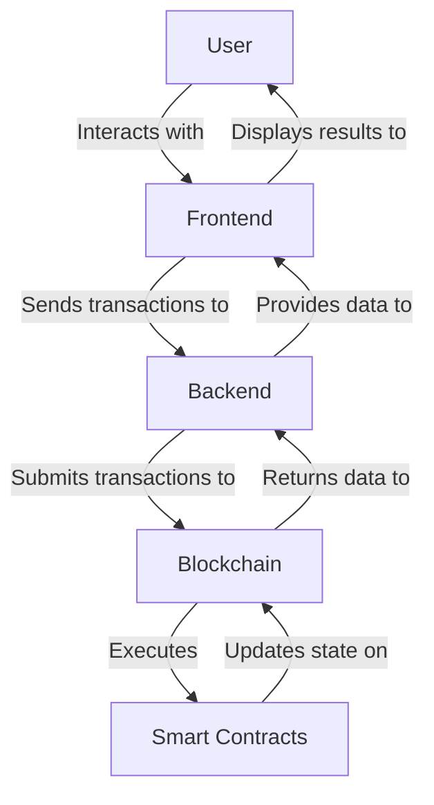

## 20.12 Blockchain and Smart Contracts with Haskell

Blockchain technology has revolutionized the way we think about data security, transparency, and decentralization. At the heart of this revolution are smart contracts, which automate and enforce agreements without the need for intermediaries. Haskell, with its strong emphasis on functional programming, immutability, and type safety, offers unique advantages for developing blockchain platforms and smart contracts. In this section, we will explore how Haskell is used in blockchain development, focusing on platforms like Cardano, and demonstrate how to write secure smart contracts and decentralized applications (dApps) using Haskell.

### Blockchain Platforms: Cardano and Haskell

Cardano is a prominent blockchain platform that leverages Haskell for its development. It is designed to provide a more secure and scalable infrastructure for the development of decentralized applications and smart contracts. Let's delve into why Haskell is chosen for Cardano and how it contributes to the platform's robustness.

#### Why Haskell for Blockchain?

1. **Immutability and Pure Functions**: Haskell's emphasis on immutability ensures that once data is created, it cannot be altered, which aligns perfectly with the immutable nature of blockchain ledgers.

2. **Strong Static Typing**: Haskell's type system helps catch errors at compile time, reducing runtime errors and enhancing the reliability of smart contracts.

3. **Concurrency and Parallelism**: Haskell's support for concurrent and parallel programming is crucial for handling the high throughput and scalability requirements of blockchain networks.

4. **Formal Verification**: Haskell's mathematical foundation makes it suitable for formal verification, ensuring that smart contracts behave as intended.

5. **Community and Ecosystem**: The Haskell community is known for its focus on correctness and reliability, which are essential qualities for blockchain development.

#### Cardano: A Haskell-Based Blockchain

Cardano is a third-generation blockchain platform that aims to address the scalability, interoperability, and sustainability issues faced by earlier blockchain systems. It uses Haskell for its core development, benefiting from the language's strengths in building secure and reliable systems.

- **Ouroboros Protocol**: Cardano's consensus algorithm, Ouroboros, is implemented in Haskell. It is a proof-of-stake protocol that offers security guarantees comparable to proof-of-work systems but with significantly lower energy consumption.

- **Plutus and Marlowe**: Cardano provides two smart contract languages, Plutus and Marlowe, both of which are based on Haskell. Plutus is a general-purpose smart contract language, while Marlowe is designed for financial contracts.

- **Formal Methods**: Cardano employs formal methods to verify the correctness of its protocols, ensuring that they meet their security and performance requirements.

### Smart Contracts: Writing Secure Contracts with Functional Languages

Smart contracts are self-executing contracts with the terms of the agreement directly written into code. They run on blockchain platforms and automatically enforce and verify the performance of the contract. Haskell's functional programming paradigm offers several advantages for writing secure smart contracts.

#### Key Features of Haskell for Smart Contracts

1. **Referential Transparency**: Haskell's referential transparency ensures that functions produce the same output for the same input, making smart contracts predictable and easier to reason about.

2. **Higher-Order Functions**: Haskell's support for higher-order functions allows for modular and reusable contract components, enhancing code maintainability.

3. **Monads and Effect Management**: Haskell's monads provide a structured way to handle side effects, which is crucial for managing state changes in smart contracts.

4. **Type Safety and Polymorphism**: Haskell's type system prevents many common programming errors, and its polymorphism allows for flexible contract design.

#### Developing Smart Contracts with Plutus

Plutus is Cardano's smart contract platform, and it is built on Haskell. It allows developers to write secure and efficient smart contracts using Haskell's functional programming features.

```haskell
-- A simple Plutus smart contract example
{-# LANGUAGE DataKinds #-}
{-# LANGUAGE NoImplicitPrelude #-}
{-# LANGUAGE TemplateHaskell #-}
{-# LANGUAGE ScopedTypeVariables #-}
{-# LANGUAGE OverloadedStrings #-}

module SimpleContract where

import PlutusTx.Prelude
import Plutus.Contract
import Ledger
import Ledger.Constraints as Constraints
import qualified PlutusTx

-- Define a simple contract that locks a certain amount of Ada
simpleContract :: Contract () BlockchainActions Text ()
simpleContract = do
    let tx = Constraints.mustPayToTheScript () (Ada.lovelaceValueOf 1000000)
    ledgerTx <- submitTxConstraints @Void tx
    void $ awaitTxConfirmed $ txId ledgerTx
    logInfo @String "Locked 1 ADA in the contract"
```

In this example, we define a simple Plutus contract that locks 1 ADA in the contract. The contract uses Haskell's type system to ensure that the transaction constraints are correctly specified, and it logs information about the transaction.

### Developing Decentralized Applications (dApps) in Haskell

Decentralized applications (dApps) are applications that run on a blockchain network rather than a centralized server. They leverage smart contracts to provide decentralized services. Haskell's functional programming paradigm is well-suited for developing dApps due to its emphasis on correctness and reliability.

#### Building a dApp with Haskell

To build a dApp in Haskell, we need to integrate smart contracts with a user interface and backend services. Here's a high-level overview of the process:

1. **Define Smart Contracts**: Use Plutus to define the smart contracts that will run on the Cardano blockchain.

2. **Develop the Backend**: Use Haskell to develop the backend services that interact with the blockchain and provide data to the frontend.

3. **Create the Frontend**: Use web technologies to create a user-friendly interface for interacting with the dApp.

4. **Integrate Components**: Ensure seamless communication between the frontend, backend, and blockchain.

#### Example: A Simple Voting dApp

Let's consider a simple voting dApp where users can vote on proposals using their ADA tokens. The dApp consists of a Plutus smart contract, a Haskell backend, and a web frontend.

```haskell
-- Voting smart contract in Plutus
{-# LANGUAGE DataKinds #-}
{-# LANGUAGE NoImplicitPrelude #-}
{-# LANGUAGE TemplateHaskell #-}
{-# LANGUAGE ScopedTypeVariables #-}
{-# LANGUAGE OverloadedStrings #-}

module VotingContract where

import PlutusTx.Prelude
import Plutus.Contract
import Ledger
import Ledger.Constraints as Constraints
import qualified PlutusTx

-- Define a voting contract
data Vote = Yes | No
PlutusTx.unstableMakeIsData ''Vote

votingContract :: Contract () BlockchainActions Text ()
votingContract = do
    let tx = Constraints.mustPayToTheScript Yes (Ada.lovelaceValueOf 500000)
    ledgerTx <- submitTxConstraints @Void tx
    void $ awaitTxConfirmed $ txId ledgerTx
    logInfo @String "Voted Yes with 0.5 ADA"
```

In this example, we define a simple voting contract where users can vote "Yes" by locking 0.5 ADA in the contract. The contract uses Haskell's type system to ensure that the vote data is correctly serialized and deserialized.

### Visualizing Blockchain and Smart Contract Architecture

To better understand the architecture of blockchain platforms and smart contracts, let's visualize the components and their interactions using Mermaid.js diagrams.



**Diagram Description**: This diagram illustrates the interaction between users, the frontend, backend, blockchain, and smart contracts in a decentralized application. Users interact with the frontend, which communicates with the backend to submit transactions to the blockchain. The blockchain executes smart contracts, updates its state, and returns data to the backend, which then provides the results to the frontend for display to the user.

### Design Considerations for Blockchain and Smart Contracts

When developing blockchain platforms and smart contracts with Haskell, consider the following design considerations:

1. **Security**: Ensure that smart contracts are secure and free from vulnerabilities. Use formal verification and thorough testing to validate contract behavior.

2. **Scalability**: Design blockchain systems to handle high throughput and large volumes of transactions. Use Haskell's concurrency features to optimize performance.

3. **Interoperability**: Ensure that the blockchain platform can interact with other systems and networks. Use standard protocols and interfaces for communication.

4. **Usability**: Design user-friendly interfaces for interacting with smart contracts and dApps. Provide clear documentation and support for developers and users.

5. **Compliance**: Ensure that the blockchain platform and smart contracts comply with relevant regulations and standards.

### Haskell Unique Features in Blockchain Development

Haskell offers several unique features that make it particularly well-suited for blockchain development:

- **Type-Level Programming**: Use Haskell's advanced type system to enforce contract invariants and prevent errors.

- **Lazy Evaluation**: Leverage Haskell's lazy evaluation to optimize resource usage and improve performance.

- **Functional Paradigms**: Use functional programming techniques to build modular and reusable contract components.

### Differences and Similarities with Other Platforms

Haskell-based blockchain platforms like Cardano differ from other platforms in several ways:

- **Formal Verification**: Cardano emphasizes formal verification, which is less common in platforms like Ethereum.

- **Proof-of-Stake**: Cardano uses a proof-of-stake consensus algorithm, while Ethereum initially used proof-of-work.

- **Functional Languages**: Cardano's use of Haskell contrasts with Ethereum's use of Solidity, an imperative language.

### Try It Yourself: Experimenting with Smart Contracts

To deepen your understanding of smart contracts in Haskell, try modifying the provided Plutus contract examples:

1. **Change the Voting Options**: Modify the `Vote` data type to include additional voting options.

2. **Adjust the Locked Amount**: Change the amount of ADA required to vote and observe the impact on the contract.

3. **Add Logging**: Enhance the contract with additional logging to track user interactions and contract state changes.

### Knowledge Check

Before moving on, let's reinforce your understanding with a few questions:

- What are the advantages of using Haskell for blockchain development?
- How does Cardano's use of Haskell differ from Ethereum's use of Solidity?
- What are the key features of Haskell that make it suitable for writing smart contracts?

### Embrace the Journey

Remember, this is just the beginning of your journey into blockchain and smart contract development with Haskell. As you progress, you'll build more complex and secure decentralized applications. Keep experimenting, stay curious, and enjoy the journey!

## Quiz: Blockchain and Smart Contracts with Haskell



### What is a key advantage of using Haskell for blockchain development?

- [x] Strong static typing
- [ ] Dynamic typing
- [ ] Lack of concurrency support
- [ ] Weak type system

> **Explanation:** Haskell's strong static typing helps catch errors at compile time, enhancing the reliability of blockchain applications.

### Which blockchain platform uses Haskell for its development?

- [x] Cardano
- [ ] Ethereum
- [ ] Bitcoin
- [ ] Ripple

> **Explanation:** Cardano is a blockchain platform that leverages Haskell for its core development.

### What is a smart contract?

- [x] A self-executing contract with terms written into code
- [ ] A traditional legal contract
- [ ] A contract that requires intermediaries
- [ ] A contract that cannot be automated

> **Explanation:** Smart contracts are self-executing contracts with the terms of the agreement directly written into code.

### What is Plutus?

- [x] A smart contract platform for Cardano
- [ ] A cryptocurrency
- [ ] A blockchain consensus algorithm
- [ ] A type of cryptocurrency wallet

> **Explanation:** Plutus is Cardano's smart contract platform, built on Haskell.

### How does Haskell's immutability benefit blockchain development?

- [x] Ensures data cannot be altered once created
- [ ] Allows data to be changed frequently
- [ ] Makes data mutable
- [ ] Reduces data security

> **Explanation:** Haskell's immutability aligns with the immutable nature of blockchain ledgers, ensuring data integrity.

### What is a decentralized application (dApp)?

- [x] An application that runs on a blockchain network
- [ ] An application that runs on a centralized server
- [ ] An application that requires intermediaries
- [ ] An application that cannot be decentralized

> **Explanation:** Decentralized applications (dApps) run on a blockchain network rather than a centralized server.

### Which consensus algorithm does Cardano use?

- [x] Proof-of-Stake
- [ ] Proof-of-Work
- [ ] Delegated Proof-of-Stake
- [ ] Byzantine Fault Tolerance

> **Explanation:** Cardano uses a proof-of-stake consensus algorithm called Ouroboros.

### What is formal verification in the context of smart contracts?

- [x] A process to ensure contracts behave as intended
- [ ] A method to make contracts mutable
- [ ] A way to simplify contract code
- [ ] A technique to reduce contract security

> **Explanation:** Formal verification is used to ensure that smart contracts behave as intended, enhancing their security and reliability.

### What is a key feature of Haskell that aids in smart contract development?

- [x] Referential transparency
- [ ] Lack of type safety
- [ ] Dynamic typing
- [ ] Weak concurrency support

> **Explanation:** Haskell's referential transparency ensures that functions produce the same output for the same input, making smart contracts predictable and easier to reason about.

### True or False: Haskell's lazy evaluation can optimize resource usage in blockchain applications.

- [x] True
- [ ] False

> **Explanation:** Haskell's lazy evaluation can optimize resource usage, improving the performance of blockchain applications.


