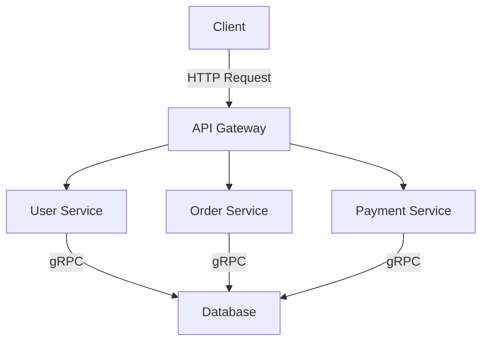

## 20.13 Cloud Computing and Distributed Systems

Cloud computing and distributed systems have become integral to modern software architecture, enabling applications to scale efficiently and handle large volumes of data and requests. Haskell, with its strong emphasis on functional programming and concurrency, offers unique advantages for building robust and scalable distributed systems. In this section, we will explore how Haskell can be leveraged in cloud environments, focusing on deploying applications and implementing distributed architectures.

### Cloud Integration

#### Deploying Haskell Applications in the Cloud

Deploying Haskell applications in the cloud involves several steps, from packaging the application to managing its runtime environment. Let's explore the key aspects of deploying Haskell applications in cloud environments.

**1. Containerization with Docker**

Docker is a popular tool for containerizing applications, making them portable across different environments. Haskell applications can be containerized using Docker, allowing them to be easily deployed to cloud platforms like AWS, Google Cloud, and Azure.

```dockerfile
# Use the official Haskell image as the base
FROM haskell:latest

# Set the working directory
WORKDIR /app

# Copy the application source code
COPY . .

# Build the Haskell application
RUN stack setup && stack build

# Expose the application port
EXPOSE 8080

# Run the application
CMD ["stack", "exec", "my-haskell-app"]
```

**2. Cloud Deployment Platforms**

Several cloud platforms support Haskell applications, each offering unique features and services:

- **AWS Lambda**: Use AWS Lambda for serverless deployment of Haskell functions. This approach allows you to run code in response to events without provisioning or managing servers.
- **Google Cloud Run**: Deploy containerized Haskell applications on Google Cloud Run, which automatically scales your application based on incoming traffic.
- **Azure Functions**: Similar to AWS Lambda, Azure Functions provides a serverless environment for running Haskell code.

**3. Continuous Integration and Deployment (CI/CD)**

Implementing CI/CD pipelines ensures that Haskell applications are automatically tested and deployed to the cloud. Tools like GitHub Actions, GitLab CI, and Jenkins can be used to automate the build and deployment process.

```yaml
# Example GitHub Actions workflow for deploying a Haskell application
name: CI/CD Pipeline

on:
  push:
    branches:
      - main

jobs:
  build:
    runs-on: ubuntu-latest

    steps:
    - name: Checkout code
      uses: actions/checkout@v2

    - name: Set up Haskell
      uses: actions/setup-haskell@v1
      with:
        haskell-version: '8.10'

    - name: Build
      run: stack build

    - name: Test
      run: stack test

    - name: Deploy
      run: ./deploy.sh
```

### Distributed Systems

#### Building Scalable Distributed Applications

Haskell's concurrency features make it well-suited for building distributed systems. Let's explore some of the key patterns and techniques for developing scalable distributed applications using Haskell.

**1. Concurrency with Haskell**

Haskell provides several concurrency primitives that allow developers to write concurrent and parallel programs:

- **Threads**: Lightweight threads in Haskell can be created using the `forkIO` function.
- **Software Transactional Memory (STM)**: STM provides a composable way to manage shared state in concurrent programs.
- **Async**: The `async` library allows for asynchronous programming, making it easier to manage concurrent tasks.

```haskell
import Control.Concurrent
import Control.Concurrent.Async

main :: IO ()
main = do
  -- Create a new thread
  forkIO $ putStrLn "Hello from a new thread!"

  -- Use async to run tasks concurrently
  a1 <- async $ return (sum [1..1000000])
  a2 <- async $ return (product [1..10])

  -- Wait for the results
  r1 <- wait a1
  r2 <- wait a2

  print (r1, r2)
```

**2. Distributed Communication**

Haskell supports various libraries for distributed communication, enabling the development of distributed systems:

- **Cloud Haskell**: A library that provides Erlang-style concurrency and distribution, allowing Haskell programs to communicate across networked nodes.
- **gRPC**: Use gRPC for efficient communication between distributed services, leveraging Haskell's strong type system for defining service interfaces.

**3. Microservices Architecture**

Microservices architecture is a popular approach for building distributed systems, where applications are composed of small, independent services. Haskell's type safety and concurrency features make it an excellent choice for implementing microservices.

- **Service Discovery**: Use tools like Consul or etcd for service discovery, allowing microservices to find and communicate with each other.
- **API Gateway**: Implement an API gateway to manage requests to microservices, providing a single entry point for clients.

```haskell
-- Example of a simple microservice in Haskell using Servant
{-# LANGUAGE DataKinds #-}
{-# LANGUAGE TypeOperators #-}

import Servant

type API = "hello" :> Get '[PlainText] String

server :: Server API
server = return "Hello, world!"

main :: IO ()
main = run 8080 (serve (Proxy :: Proxy API) server)
```

### Example: Implementing Microservices Architecture in Cloud Environments

Let's walk through an example of implementing a microservices architecture in a cloud environment using Haskell.

**1. Define the Microservices**

Suppose we have an application composed of three microservices: User Service, Order Service, and Payment Service. Each service is responsible for a specific domain and communicates with others via HTTP.

**2. Containerize the Services**

Each microservice is containerized using Docker, allowing them to be deployed independently.

```dockerfile
# Dockerfile for User Service
FROM haskell:latest
WORKDIR /user-service
COPY . .
RUN stack setup && stack build
EXPOSE 8081
CMD ["stack", "exec", "user-service"]
```

**3. Deploy to the Cloud**

Use a cloud platform like Kubernetes to orchestrate the deployment of microservices. Kubernetes provides features like load balancing, scaling, and service discovery.

```yaml
# Kubernetes deployment for User Service
apiVersion: apps/v1
kind: Deployment
metadata:
  name: user-service
spec:
  replicas: 3
  selector:
    matchLabels:
      app: user-service
  template:
    metadata:
      labels:
        app: user-service
    spec:
      containers:
      - name: user-service
        image: myregistry/user-service:latest
        ports:
        - containerPort: 8081
```

**4. Implement Service Communication**

Use HTTP or gRPC for communication between microservices. Haskell's Servant library can be used to define and implement RESTful APIs.

```haskell
-- Example of a RESTful API for User Service
{-# LANGUAGE DataKinds #-}
{-# LANGUAGE TypeOperators #-}

import Servant

type UserAPI = "users" :> Get '[JSON] [User]

data User = User
  { userId :: Int
  , userName :: String
  }

server :: Server UserAPI
server = return [User 1 "Alice", User 2 "Bob"]

main :: IO ()
main = run 8081 (serve (Proxy :: Proxy UserAPI) server)
```

### Design Considerations

When building cloud-based distributed systems with Haskell, consider the following:

- **Scalability**: Design services to scale horizontally, allowing them to handle increased load by adding more instances.
- **Fault Tolerance**: Implement retry mechanisms and circuit breakers to handle failures gracefully.
- **Security**: Ensure secure communication between services using TLS and implement authentication and authorization mechanisms.
- **Monitoring and Logging**: Use tools like Prometheus and Grafana for monitoring, and implement structured logging for better observability.

### Haskell Unique Features

Haskell's unique features, such as strong static typing, immutability, and concurrency support, make it well-suited for building reliable and maintainable distributed systems. The language's emphasis on pure functions and referential transparency ensures that code is predictable and easier to reason about, reducing the likelihood of bugs in complex distributed environments.

### Differences and Similarities

Haskell's approach to distributed systems shares similarities with other functional languages like Erlang, particularly in its use of lightweight concurrency and message passing. However, Haskell's strong type system and emphasis on pure functions provide additional guarantees that can lead to more robust and maintainable systems.

### Try It Yourself

Experiment with the code examples provided by modifying them to suit your needs. Try deploying a simple Haskell microservice to a cloud platform and explore how it can be scaled and managed in a distributed environment.

### Visualizing Cloud and Distributed Systems

Let's visualize the architecture of a cloud-based distributed system using Haskell:



**Diagram Description**: This diagram illustrates a typical microservices architecture where an API Gateway routes client requests to various services such as User Service, Order Service, and Payment Service. Each service communicates with a shared database using gRPC.

### Knowledge Check

- What are the benefits of using Haskell for cloud-based distributed systems?
- How can Docker and Kubernetes be used to deploy Haskell applications in the cloud?
- What are the key considerations when designing microservices in Haskell?

### Embrace the Journey

Remember, this is just the beginning of your journey into cloud computing and distributed systems with Haskell. As you progress, you'll discover more advanced patterns and techniques that will enable you to build even more robust and scalable applications. Keep experimenting, stay curious, and enjoy the journey!

## Quiz: Cloud Computing and Distributed Systems



### What is a key advantage of using Haskell for distributed systems?

- [x] Strong static typing and concurrency support
- [ ] Dynamic typing and mutable state
- [ ] Lack of concurrency primitives
- [ ] Weak type system

> **Explanation:** Haskell's strong static typing and concurrency support make it well-suited for distributed systems.

### Which tool is commonly used for containerizing Haskell applications?

- [x] Docker
- [ ] Kubernetes
- [ ] AWS Lambda
- [ ] Azure Functions

> **Explanation:** Docker is commonly used for containerizing applications, including those written in Haskell.

### What is the purpose of an API Gateway in a microservices architecture?

- [x] To manage requests to microservices and provide a single entry point for clients
- [ ] To store data for microservices
- [ ] To compile Haskell code
- [ ] To provide authentication for users

> **Explanation:** An API Gateway manages requests to microservices and provides a single entry point for clients.

### Which Haskell library is used for Erlang-style concurrency and distribution?

- [x] Cloud Haskell
- [ ] Servant
- [ ] Aeson
- [ ] Warp

> **Explanation:** Cloud Haskell provides Erlang-style concurrency and distribution capabilities.

### What is a common protocol used for communication between distributed services in Haskell?

- [x] gRPC
- [ ] FTP
- [ ] SMTP
- [ ] POP3

> **Explanation:** gRPC is a common protocol used for communication between distributed services.

### What is the role of Kubernetes in deploying Haskell applications?

- [x] Orchestrating the deployment of containerized applications
- [ ] Compiling Haskell code
- [ ] Providing a development environment
- [ ] Managing database connections

> **Explanation:** Kubernetes orchestrates the deployment of containerized applications, including those written in Haskell.

### Which concurrency primitive in Haskell allows for asynchronous programming?

- [x] Async
- [ ] STM
- [ ] MVar
- [ ] TVar

> **Explanation:** The `async` library allows for asynchronous programming in Haskell.

### What is a key consideration when designing microservices in Haskell?

- [x] Scalability and fault tolerance
- [ ] Using mutable state
- [ ] Avoiding type safety
- [ ] Ignoring concurrency

> **Explanation:** Scalability and fault tolerance are key considerations when designing microservices.

### Which cloud platform provides a serverless environment for running Haskell code?

- [x] AWS Lambda
- [ ] Docker
- [ ] Kubernetes
- [ ] GitHub Actions

> **Explanation:** AWS Lambda provides a serverless environment for running Haskell code.

### True or False: Haskell's emphasis on pure functions and referential transparency reduces the likelihood of bugs in distributed systems.

- [x] True
- [ ] False

> **Explanation:** Haskell's emphasis on pure functions and referential transparency ensures that code is predictable and easier to reason about, reducing the likelihood of bugs.


