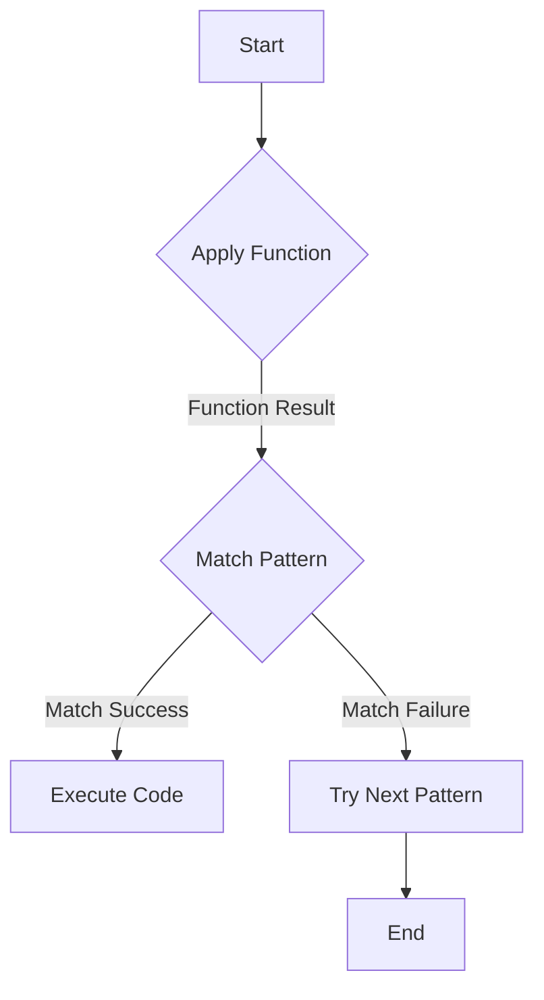

## 20.2 Advanced Pattern Matching with View Patterns and Pattern Synonyms

Pattern matching is a powerful feature in Haskell that allows developers to destructure data types and bind variables in a concise and readable manner. As Haskell developers become more advanced, they often seek ways to make their pattern matching more expressive and flexible. This is where **view patterns** and **pattern synonyms** come into play. These advanced features allow for more abstract and reusable code, enhancing both readability and maintainability.

### Understanding View Patterns

**View patterns** provide a way to pattern match using functions. They allow you to apply a function to a value and then match against the result. This can be particularly useful when you want to match against a transformed version of a value.

#### How View Patterns Work

A view pattern has the form `(f -> p)`, where `f` is a function and `p` is a pattern. When matching a value `v` against a view pattern, Haskell applies the function `f` to `v` and then matches the result against the pattern `p`.

#### Example of View Patterns

Consider a scenario where you want to match a list based on its length:

```haskell
{-# LANGUAGE ViewPatterns #-}

lengthView :: [a] -> Int
lengthView = length

describeList :: [a] -> String
describeList (lengthView -> 0) = "The list is empty."
describeList (lengthView -> 1) = "The list has one element."
describeList (lengthView -> _) = "The list has multiple elements."
```

In this example, `lengthView` is a function that computes the length of a list. The `describeList` function uses view patterns to match lists based on their length.

#### Benefits of View Patterns

- **Expressiveness**: View patterns allow you to express complex matching logic succinctly.
- **Reusability**: Functions used in view patterns can be reused across different pattern matches.
- **Abstraction**: They abstract away the details of how a value is transformed before matching.

### Exploring Pattern Synonyms

**Pattern synonyms** allow you to define custom patterns that can be used just like built-in patterns. They provide a way to create more readable and domain-specific pattern matches.

#### Defining Pattern Synonyms

A pattern synonym is defined using the `pattern` keyword, followed by the pattern name and the pattern itself. There are two types of pattern synonyms: **unidirectional** and **bidirectional**.

- **Unidirectional Pattern Synonyms**: Can only be used for pattern matching.
- **Bidirectional Pattern Synonyms**: Can be used for both pattern matching and construction.

#### Example of Pattern Synonyms

Let's define a pattern synonym for a tuple representing a 2D point:

```haskell
{-# LANGUAGE PatternSynonyms #-}

data Point = Point2D Int Int

pattern Point :: Int -> Int -> Point
pattern Point x y = Point2D x y

-- Usage
describePoint :: Point -> String
describePoint (Point 0 0) = "Origin"
describePoint (Point x y) = "Point at (" ++ show x ++ ", " ++ show y ++ ")"
```

In this example, `Point` is a pattern synonym for `Point2D`. It allows us to use a more intuitive pattern when matching points.

#### Benefits of Pattern Synonyms

- **Readability**: Pattern synonyms can make code more readable by providing meaningful names for patterns.
- **Abstraction**: They abstract away the underlying data representation.
- **Flexibility**: They allow for more flexible and reusable pattern matching.

### Combining View Patterns and Pattern Synonyms

View patterns and pattern synonyms can be combined to create powerful and expressive pattern matches. By using view patterns within pattern synonyms, you can define complex patterns that incorporate transformations.

#### Example of Combining View Patterns and Pattern Synonyms

Consider a scenario where you want to match a list of integers based on whether it contains a specific number:

```haskell
{-# LANGUAGE ViewPatterns #-}
{-# LANGUAGE PatternSynonyms #-}

pattern Contains :: Int -> [Int] -> Bool
pattern Contains n <- (elem n -> True)

describeList :: [Int] -> String
describeList (Contains 42) = "The list contains the answer to life, the universe, and everything."
describeList _ = "The list does not contain the answer."
```

In this example, `Contains` is a pattern synonym that uses a view pattern to check if a list contains a specific number.

### Design Considerations

When using view patterns and pattern synonyms, consider the following:

- **Performance**: View patterns can introduce additional function calls, which may impact performance. Use them judiciously in performance-critical code.
- **Complexity**: While these features can make code more expressive, they can also increase complexity. Ensure that their use enhances readability and maintainability.
- **Compatibility**: Ensure that your code is compatible with the Haskell extensions required for view patterns and pattern synonyms.

### Haskell Unique Features

Haskell's strong type system and support for higher-order functions make view patterns and pattern synonyms particularly powerful. They allow you to leverage the full expressiveness of Haskell's type system and functional programming paradigm.

### Differences and Similarities

View patterns and pattern synonyms are both advanced pattern matching techniques, but they serve different purposes:

- **View Patterns**: Focus on transforming values before matching.
- **Pattern Synonyms**: Focus on creating reusable and meaningful patterns.

### Try It Yourself

Experiment with the examples provided by modifying the functions and patterns. Try creating your own view patterns and pattern synonyms to match different data structures or conditions.

### Visualizing Pattern Matching

To better understand how view patterns and pattern synonyms work, let's visualize the process of pattern matching using a flowchart.



**Caption**: This flowchart illustrates the process of pattern matching with view patterns. The function is applied to the value, and the result is matched against the pattern.

### References and Links

- [View Patterns](https://downloads.haskell.org/~ghc/latest/docs/html/users_guide/exts/view_patterns.html)
- [Pattern Synonyms](https://downloads.haskell.org/~ghc/latest/docs/html/users_guide/exts/pattern_synonyms.html)

### Knowledge Check

- Can you define a view pattern that matches a list of even numbers?
- How would you use a pattern synonym to simplify matching a custom data type?
- What are the trade-offs of using view patterns in performance-critical code?

### Embrace the Journey

Remember, mastering advanced pattern matching techniques in Haskell is a journey. As you experiment with view patterns and pattern synonyms, you'll discover new ways to express complex logic more elegantly. Keep exploring, stay curious, and enjoy the process!

## Quiz: Advanced Pattern Matching with View Patterns and Pattern Synonyms



### What is the primary purpose of view patterns in Haskell?

- [x] To allow pattern matching using functions
- [ ] To define custom patterns for cleaner code
- [ ] To improve performance in pattern matching
- [ ] To replace pattern synonyms

> **Explanation:** View patterns allow you to apply a function to a value and match against the result, enhancing expressiveness in pattern matching.

### Which keyword is used to define pattern synonyms in Haskell?

- [ ] `view`
- [x] `pattern`
- [ ] `match`
- [ ] `synonym`

> **Explanation:** The `pattern` keyword is used to define pattern synonyms in Haskell.

### What is a key benefit of using pattern synonyms?

- [ ] They improve runtime performance.
- [x] They enhance code readability.
- [ ] They eliminate the need for view patterns.
- [ ] They simplify type inference.

> **Explanation:** Pattern synonyms enhance code readability by providing meaningful names for patterns.

### How do view patterns affect performance?

- [ ] They always improve performance.
- [ ] They have no impact on performance.
- [x] They can introduce additional function calls.
- [ ] They eliminate the need for pattern matching.

> **Explanation:** View patterns can introduce additional function calls, which may impact performance.

### Can pattern synonyms be used for both pattern matching and construction?

- [x] Yes, if they are bidirectional.
- [ ] No, they are only for pattern matching.
- [ ] Yes, if they are unidirectional.
- [ ] No, they are only for construction.

> **Explanation:** Bidirectional pattern synonyms can be used for both pattern matching and construction.

### What is a potential downside of using view patterns?

- [ ] They make code less readable.
- [ ] They are not supported in Haskell.
- [x] They can increase code complexity.
- [ ] They require additional libraries.

> **Explanation:** View patterns can increase code complexity, especially if overused.

### How do pattern synonyms improve code abstraction?

- [ ] By eliminating the need for functions.
- [x] By abstracting away the underlying data representation.
- [ ] By simplifying type signatures.
- [ ] By reducing the number of lines of code.

> **Explanation:** Pattern synonyms abstract away the underlying data representation, improving code abstraction.

### What is a similarity between view patterns and pattern synonyms?

- [ ] Both are used to improve performance.
- [x] Both enhance expressiveness in pattern matching.
- [ ] Both eliminate the need for type classes.
- [ ] Both are specific to Haskell.

> **Explanation:** Both view patterns and pattern synonyms enhance expressiveness in pattern matching.

### Can view patterns be combined with pattern synonyms?

- [x] Yes, they can be combined for more expressive patterns.
- [ ] No, they are mutually exclusive.
- [ ] Yes, but only in GHC 9.0 and above.
- [ ] No, they serve different purposes.

> **Explanation:** View patterns can be combined with pattern synonyms to create more expressive patterns.

### True or False: Pattern synonyms can only be used with built-in data types.

- [ ] True
- [x] False

> **Explanation:** Pattern synonyms can be used with both built-in and custom data types.


