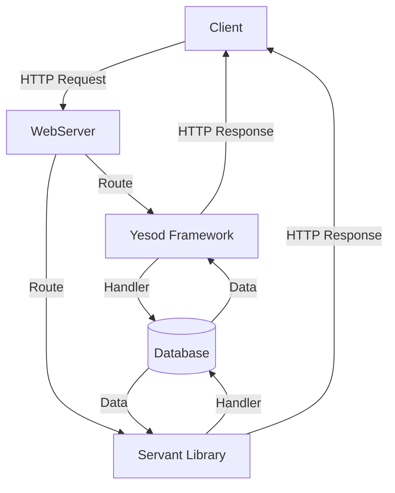

## 20.3 Functional Patterns in Web Development with Yesod and Servant

In the realm of web development, Haskell offers a unique approach through its powerful frameworks, Yesod and Servant. These frameworks leverage Haskell's strong type system and functional programming paradigms to create robust, type-safe, and maintainable web applications. In this section, we will explore the functional patterns employed by Yesod and Servant, providing insights into their architecture, usage, and benefits.

### Introduction to Yesod and Servant

#### Yesod Framework

Yesod is a Haskell web framework designed for creating type-safe, RESTful applications. It emphasizes compile-time guarantees, ensuring that many common runtime errors are caught during compilation. Yesod's approach to web development is centered around type safety, efficiency, and developer productivity.

#### Servant Library

Servant is a Haskell library that allows developers to define web APIs at the type level. By using types to describe APIs, Servant ensures that the implementation matches the specification, providing a high level of assurance and reducing the likelihood of errors. Servant's type-driven approach makes it a powerful tool for building web services that are both robust and flexible.

### Key Concepts and Patterns

#### Type Safety and Compile-Time Guarantees

Both Yesod and Servant leverage Haskell's type system to provide compile-time guarantees. This means that many potential errors are caught before the code is even run, leading to more reliable applications. By using types to represent routes, parameters, and responses, these frameworks ensure that the application logic aligns with the intended API design.

#### RESTful Design

REST (Representational State Transfer) is a widely adopted architectural style for designing networked applications. Yesod and Servant both facilitate the creation of RESTful services by providing abstractions that map closely to REST principles. This includes support for HTTP methods, status codes, and content negotiation.

#### Functional Abstractions

Functional programming principles are at the core of Yesod and Servant. These frameworks utilize higher-order functions, monads, and other functional abstractions to create clean and concise code. This approach not only enhances code readability but also promotes reusability and composability.

### Building Web Applications with Yesod

#### Setting Up a Yesod Project

To get started with Yesod, you need to set up a new project. Yesod provides a command-line tool that simplifies this process.

```bash
stack new my-yesod-project yesod-simple
cd my-yesod-project
stack build
stack exec -- yesod devel
```

This will create a new Yesod project with a basic structure, including a default homepage and routing setup.

#### Defining Routes

In Yesod, routes are defined in a separate file, typically named `config/routes`. This file uses a simple DSL to specify the routes and their corresponding handlers.

```
/ HomeR GET
/user/#UserId UserR GET POST
```

This defines two routes: a homepage and a user resource with dynamic user IDs.

#### Creating Handlers

Handlers in Yesod are responsible for processing requests and generating responses. They are defined as functions in the `Handler` monad.

```haskell
getHomeR :: Handler Html
getHomeR = defaultLayout [whamlet|<h1>Welcome to Yesod!|]

getUserR :: UserId -> Handler Html
getUserR userId = do
    user <- runDB $ get404 userId
    defaultLayout [whamlet|<h1>User: #{userName user}|]
```

These handlers use Yesod's templating system, Hamlet, to generate HTML responses.

#### Database Integration

Yesod integrates seamlessly with databases through Persistent, an ORM that supports multiple backends. You define your database schema using Haskell data types and Persistent's DSL.

```haskell
share [mkPersist sqlSettings, mkMigrate "migrateAll"] [persistLowerCase|
User
    name String
    age Int Maybe
    deriving Show
|]
```

This defines a `User` entity with `name` and `age` fields.

### Building Web APIs with Servant

#### Defining API Types

In Servant, APIs are defined using types. This type-level representation ensures that the implementation adheres to the specified API.

```haskell
type API = "users" :> Get '[JSON] [User]
      :<|> "user" :> Capture "userid" Int :> Get '[JSON] User
```

This defines an API with two endpoints: one for retrieving a list of users and another for fetching a specific user by ID.

#### Implementing Server Handlers

Server handlers in Servant are implemented as functions that correspond to the API type.

```haskell
server :: Server API
server = getUsers :<|> getUserById

  where
    getUsers :: Handler [User]
    getUsers = return [User "Alice" 30, User "Bob" 25]

    getUserById :: Int -> Handler User
    getUserById userId = return $ User "Alice" 30
```

These handlers use the `Handler` monad to perform actions and return responses.

#### Running the Servant Server

To run a Servant server, you need to use the `serve` function, which takes an API type and a server implementation.

```haskell
main :: IO ()
main = run 8080 $ serve (Proxy :: Proxy API) server
```

This starts a web server on port 8080, serving the defined API.

### Advanced Patterns and Techniques

#### Authentication and Authorization

Both Yesod and Servant provide mechanisms for handling authentication and authorization. Yesod offers built-in support for sessions and user authentication, while Servant can be extended with middleware for similar functionality.

#### Error Handling

Error handling in Yesod and Servant is achieved through the use of monads and custom error types. This allows for graceful error recovery and informative error messages.

#### Middleware and Extensions

Yesod and Servant can be extended with middleware to add functionality such as logging, compression, and security features. This extensibility makes them suitable for a wide range of applications.

### Visualizing Web Application Architecture

Below is a diagram illustrating the architecture of a web application built with Yesod and Servant, highlighting the flow of requests and responses.



### Try It Yourself

To deepen your understanding, try modifying the code examples provided. For instance, add a new route in Yesod or extend the Servant API with additional endpoints. Experiment with different types of responses and error handling strategies.

### References and Further Reading

- [Yesod Official Website](https://www.yesodweb.com/)
- [Servant Documentation](https://haskell-servant.readthedocs.io/)
- [Haskell Programming from First Principles](https://haskellbook.com/)
- [Real World Haskell](http://book.realworldhaskell.org/)

### Knowledge Check

- What are the benefits of using type-safe web frameworks like Yesod and Servant?
- How do Yesod and Servant handle routing and request processing?
- What role do monads play in error handling within these frameworks?

### Conclusion

Yesod and Servant exemplify the power of functional programming in web development. By leveraging Haskell's type system and functional paradigms, they provide a robust foundation for building scalable, maintainable web applications. As you continue to explore these frameworks, remember to embrace the functional patterns that make Haskell a unique and powerful language for web development.

## Quiz: Functional Patterns in Web Development (Yesod, Servant)



### What is the primary advantage of using Yesod for web development?

- [x] Type safety and compile-time guarantees
- [ ] Dynamic typing and runtime flexibility
- [ ] Built-in support for JavaScript frameworks
- [ ] Automatic database migrations

> **Explanation:** Yesod's primary advantage is its emphasis on type safety and compile-time guarantees, which help catch errors early in the development process.

### How does Servant define web APIs?

- [x] Using types to represent API endpoints
- [ ] Through XML configuration files
- [ ] By writing imperative code
- [ ] Using JSON schemas

> **Explanation:** Servant uses Haskell's type system to define web APIs, ensuring that the implementation matches the specification.

### Which of the following is a key feature of Yesod?

- [x] Type-safe routing
- [ ] Automatic UI generation
- [ ] Built-in machine learning capabilities
- [ ] Real-time data streaming

> **Explanation:** Yesod provides type-safe routing, ensuring that routes are checked at compile time for correctness.

### What is the role of the `Handler` monad in Yesod?

- [x] It is used for processing requests and generating responses
- [ ] It manages database connections
- [ ] It handles file uploads
- [ ] It is responsible for logging

> **Explanation:** The `Handler` monad in Yesod is used to process requests and generate responses, encapsulating the logic for handling web requests.

### How can Servant be extended to handle authentication?

- [x] By using middleware
- [ ] Through built-in authentication modules
- [ ] By writing custom JavaScript
- [ ] Using XML configuration

> **Explanation:** Servant can be extended with middleware to handle authentication and other cross-cutting concerns.

### What is a common use case for the `Proxy` type in Servant?

- [x] To specify the API type when running the server
- [ ] To handle HTTP requests
- [ ] To manage database transactions
- [ ] To generate HTML templates

> **Explanation:** The `Proxy` type is used in Servant to specify the API type when running the server, ensuring type-safe API handling.

### Which pattern is commonly used for error handling in Yesod and Servant?

- [x] Monad-based error handling
- [ ] Callback functions
- [ ] Global exception handlers
- [ ] Try-catch blocks

> **Explanation:** Monad-based error handling is commonly used in Yesod and Servant, allowing for graceful error recovery and informative error messages.

### What is the purpose of the `defaultLayout` function in Yesod?

- [x] To render HTML templates
- [ ] To manage database connections
- [ ] To handle file uploads
- [ ] To configure logging

> **Explanation:** The `defaultLayout` function in Yesod is used to render HTML templates, providing a consistent layout for web pages.

### How does Yesod integrate with databases?

- [x] Through the Persistent ORM
- [ ] Using raw SQL queries
- [ ] By generating database schemas automatically
- [ ] Through XML configuration files

> **Explanation:** Yesod integrates with databases through the Persistent ORM, which supports multiple backends and provides a type-safe interface for database operations.

### True or False: Servant allows for the definition of APIs at the type level.

- [x] True
- [ ] False

> **Explanation:** True. Servant allows developers to define APIs at the type level, ensuring that the implementation adheres to the specified API.


