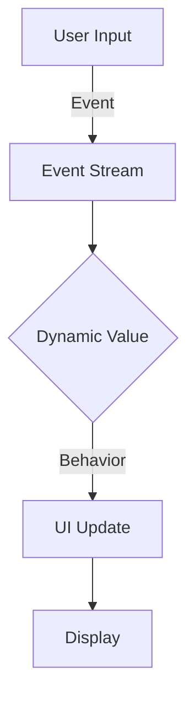

## 20.4 Modern User Interface Development with Reflex FRP

In the realm of functional programming, Reflex FRP (Functional Reactive Programming) stands out as a powerful library for building modern user interfaces in Haskell. Reflex FRP allows developers to create highly interactive and dynamic web applications by leveraging the principles of reactive programming. This section delves into the intricacies of Reflex FRP, providing expert insights into its features, design patterns, and practical applications.

### Understanding Reflex FRP

Reflex FRP is a Haskell library designed for building reactive applications. It provides a declarative approach to UI development, where the UI is described as a function of time-varying values. This paradigm shift from imperative to declarative programming simplifies the management of state and events in complex applications.

#### Key Features of Reflex FRP

- **Declarative UI**: Define what the UI should look like at any given time, rather than how to change it.
- **Seamless Event Handling**: Handle user interactions and other events in a straightforward, composable manner.
- **Dynamic Content**: Easily create UIs that respond to changes in data or user input.
- **Composable Abstractions**: Build complex UIs by composing smaller, reusable components.

### Core Concepts of Reflex FRP

To effectively use Reflex FRP, it's essential to understand its core concepts, including Events, Behaviors, and Dynamics.

#### Events

In Reflex, an `Event` represents a stream of occurrences over time. Events are central to handling user interactions and other asynchronous activities.

```haskell
-- Example of creating an Event in Reflex
import Reflex

main :: IO ()
main = mainWidget $ do
  evClick <- button "Click me"
  display =<< count evClick
```

In this example, `evClick` is an event that fires each time the button is clicked. The `count` function tracks the number of times the event has occurred.

#### Behaviors

A `Behavior` is a time-varying value that represents the current state of some part of the application. Unlike events, behaviors have a value at all times.

```haskell
-- Example of using a Behavior in Reflex
import Reflex

main :: IO ()
main = mainWidget $ do
  t <- textInput def
  let bValue = _textInput_value t
  display bValue
```

Here, `bValue` is a behavior that reflects the current value of the text input.

#### Dynamics

A `Dynamic` is a combination of an initial value and an event that updates it. It provides a convenient way to work with values that change over time.

```haskell
-- Example of using a Dynamic in Reflex
import Reflex

main :: IO ()
main = mainWidget $ do
  t <- textInput def
  let dValue = _textInput_value t
  display dValue
```

In this example, `dValue` is a dynamic value that updates whenever the text input changes.

### Building a Simple Reflex Application

Let's build a simple Reflex application to demonstrate these concepts in action. We'll create a basic counter application where users can increment and decrement a counter.

```haskell
{-# LANGUAGE OverloadedStrings #-}

import Reflex.Dom

main :: IO ()
main = mainWidget $ do
  el "h1" $ text "Counter"
  rec
    let eAdd = (+1) <$ button "Increment"
        eSub = subtract 1 <$ button "Decrement"
        eChange = leftmost [eAdd, eSub]
    dCount <- foldDyn ($) (0 :: Int) eChange
    display dCount
  return ()
```

#### Explanation

- **`el "h1" $ text "Counter"`**: Creates a header for the counter application.
- **`button "Increment"` and `button "Decrement"`**: Create buttons that generate events when clicked.
- **`leftmost [eAdd, eSub]`**: Combines the increment and decrement events into a single event stream.
- **`foldDyn ($) (0 :: Int) eChange`**: Accumulates changes to the counter, starting from 0.

### Advanced Reflex Patterns

Reflex FRP supports advanced patterns that enable the creation of sophisticated UIs. Let's explore some of these patterns.

#### Dynamic Lists

Dynamic lists allow you to manage collections of items that can change over time. This is useful for applications like to-do lists or chat applications.

```haskell
{-# LANGUAGE RecursiveDo #-}

import Reflex.Dom

main :: IO ()
main = mainWidget $ do
  rec
    let eAddItem = tagPromptlyDyn dInput $ keypress Enter tInput
    dItems <- foldDyn (:) [] eAddItem
    tInput <- textInput def
    dInput <- holdDyn "" $ _textInput_input tInput
  el "ul" $ simpleList dItems $ \dItem -> el "li" $ dynText dItem
```

#### Explanation

- **`tagPromptlyDyn dInput $ keypress Enter tInput`**: Captures the input value when the Enter key is pressed.
- **`foldDyn (:) [] eAddItem`**: Accumulates a list of items.
- **`simpleList dItems $ \dItem -> el "li" $ dynText dItem`**: Displays the list of items dynamically.

### Visualizing Reflex FRP

To better understand the flow of data and events in Reflex FRP, let's visualize a simple application using Mermaid.js.



**Diagram Description**: This diagram illustrates the flow of data in a Reflex FRP application. User input generates events, which update dynamic values. These values are then used to update the UI.

### Design Considerations

When using Reflex FRP, consider the following design considerations:

- **State Management**: Use behaviors and dynamics to manage state effectively.
- **Performance**: Be mindful of the performance implications of dynamic updates.
- **Composability**: Leverage Reflex's composable abstractions to build reusable components.

### Haskell Unique Features

Reflex FRP leverages Haskell's unique features, such as strong static typing and lazy evaluation, to provide a robust framework for UI development. The type system ensures that UI components are composed safely, while lazy evaluation allows for efficient handling of dynamic content.

### Differences and Similarities

Reflex FRP shares similarities with other reactive programming frameworks, such as React and Angular, in its declarative approach to UI development. However, Reflex's use of Haskell's type system and functional paradigms sets it apart, offering a more expressive and type-safe environment.

### Try It Yourself

To deepen your understanding of Reflex FRP, try modifying the code examples provided. Experiment with adding new features, such as additional buttons or input fields, and observe how Reflex handles these changes seamlessly.

### Knowledge Check

- How does Reflex FRP handle dynamic content?
- What are the key differences between Events, Behaviors, and Dynamics in Reflex?
- How does Reflex FRP leverage Haskell's type system to ensure safe UI composition?

### Embrace the Journey

Remember, mastering Reflex FRP is a journey. As you explore its capabilities, you'll discover new ways to build interactive and responsive applications. Stay curious, keep experimenting, and enjoy the process!

### References and Links

- [Reflex FRP Official Website](https://reflex-frp.org/)
- [Functional Reactive Programming in Haskell](https://www.haskell.org/frp/)
- [Haskell Documentation](https://www.haskell.org/documentation/)

## Quiz: Modern User Interface Development with Reflex FRP



### What is the primary purpose of Reflex FRP in Haskell?

- [x] To build reactive user interfaces
- [ ] To manage database connections
- [ ] To perform mathematical computations
- [ ] To handle file I/O operations

> **Explanation:** Reflex FRP is primarily used for building reactive user interfaces in Haskell.

### Which of the following is a key feature of Reflex FRP?

- [x] Declarative UI
- [ ] Imperative state management
- [ ] Synchronous event handling
- [ ] Manual memory management

> **Explanation:** Reflex FRP provides a declarative approach to UI development, allowing developers to describe what the UI should look like at any given time.

### In Reflex FRP, what does an `Event` represent?

- [x] A stream of occurrences over time
- [ ] A static value
- [ ] A database transaction
- [ ] A file operation

> **Explanation:** An `Event` in Reflex FRP represents a stream of occurrences over time, such as user interactions.

### What is a `Behavior` in Reflex FRP?

- [x] A time-varying value
- [ ] A static configuration
- [ ] A network request
- [ ] A file descriptor

> **Explanation:** A `Behavior` is a time-varying value that represents the current state of some part of the application.

### How does Reflex FRP handle user interactions?

- [x] Through events and dynamic updates
- [ ] By polling the UI
- [ ] Using synchronous callbacks
- [ ] By modifying the DOM directly

> **Explanation:** Reflex FRP handles user interactions through events and dynamic updates, allowing for seamless and reactive UI changes.

### What is the role of a `Dynamic` in Reflex FRP?

- [x] To combine an initial value with an event that updates it
- [ ] To store static data
- [ ] To manage network connections
- [ ] To handle file operations

> **Explanation:** A `Dynamic` in Reflex FRP combines an initial value with an event that updates it, providing a convenient way to work with values that change over time.

### Which of the following is a design consideration when using Reflex FRP?

- [x] State management
- [ ] Manual memory allocation
- [ ] Direct DOM manipulation
- [ ] Synchronous event handling

> **Explanation:** State management is a crucial design consideration when using Reflex FRP, as it involves managing behaviors and dynamics effectively.

### How does Reflex FRP leverage Haskell's type system?

- [x] By ensuring safe UI composition
- [ ] By allowing dynamic typing
- [ ] By enabling manual memory management
- [ ] By supporting imperative programming

> **Explanation:** Reflex FRP leverages Haskell's type system to ensure safe UI composition, providing a type-safe environment for building user interfaces.

### What is a common use case for dynamic lists in Reflex FRP?

- [x] Managing collections of items that change over time
- [ ] Performing mathematical calculations
- [ ] Handling file I/O operations
- [ ] Managing database connections

> **Explanation:** Dynamic lists in Reflex FRP are commonly used for managing collections of items that change over time, such as to-do lists or chat applications.

### True or False: Reflex FRP is similar to React and Angular in its declarative approach to UI development.

- [x] True
- [ ] False

> **Explanation:** Reflex FRP shares similarities with React and Angular in its declarative approach to UI development, allowing developers to describe what the UI should look like at any given time.




