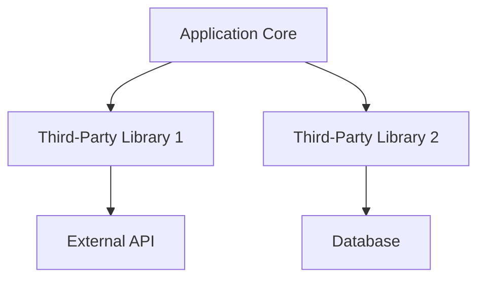

## 20.5 Leveraging Third-Party Libraries and Ecosystems

In the realm of Haskell development, leveraging third-party libraries and ecosystems is not just a convenience but a necessity for building robust, scalable, and efficient applications. This section delves into the importance of utilizing these resources, highlights some popular libraries, and provides strategies for effectively integrating them into your projects.

### Importance of Leveraging Third-Party Libraries

Third-party libraries in Haskell offer pre-built solutions to common problems, allowing developers to focus on the unique aspects of their applications. By reusing existing solutions, you can:

- **Accelerate Development**: Save time by not reinventing the wheel.
- **Enhance Functionality**: Integrate advanced features with minimal effort.
- **Improve Code Quality**: Benefit from community-tested and peer-reviewed code.
- **Stay Updated**: Leverage the latest advancements in technology and best practices.

### Popular Libraries in the Haskell Ecosystem

The Haskell ecosystem is rich with libraries that cater to various needs. Here, we explore some of the most popular and widely used libraries:

#### 1. Aeson for JSON Handling

**Aeson** is the go-to library for JSON parsing and encoding in Haskell. It provides a robust and efficient way to work with JSON data, which is crucial for web applications and APIs.

```haskell
{-# LANGUAGE OverloadedStrings #-}

import Data.Aeson
import qualified Data.ByteString.Lazy.Char8 as B

data Person = Person
  { name :: String
  , age  :: Int
  } deriving (Show)

instance FromJSON Person where
  parseJSON = withObject "Person" $ \v -> Person
    <$> v .: "name"
    <*> v .: "age"

instance ToJSON Person where
  toJSON (Person name age) =
    object ["name" .= name, "age" .= age]

main :: IO ()
main = do
  let personJson = "{\"name\":\"John Doe\",\"age\":30}"
  let decoded = decode (B.pack personJson) :: Maybe Person
  print decoded
  let encoded = encode (Person "Jane Doe" 25)
  B.putStrLn encoded
```

**Key Features**:
- **Automatic Derivation**: Simplifies the creation of JSON instances.
- **Performance**: Highly optimized for speed and efficiency.
- **Flexibility**: Supports custom parsing and encoding logic.

#### 2. Conduit for Streaming Data

**Conduit** is a powerful library for handling streaming data in Haskell. It allows you to process data incrementally, which is essential for working with large datasets or continuous data streams.

```haskell
import Conduit

main :: IO ()
main = runConduitRes
  $ yieldMany [1..10]
  .| mapC (*2)
  .| sinkList >>= liftIO . print
```

**Key Features**:
- **Resource Safety**: Ensures resources are properly managed and released.
- **Composability**: Easily compose complex data processing pipelines.
- **Efficiency**: Designed for high performance with minimal memory overhead.

### Strategies for Leveraging Libraries

When integrating third-party libraries into your Haskell projects, consider the following strategies:

#### Assessing Library Quality

- **Community Support**: Check for active maintenance and a supportive community.
- **Documentation**: Ensure comprehensive and clear documentation is available.
- **Popularity**: Popular libraries are often more reliable due to widespread use and testing.

#### Understanding Dependencies

- **Dependency Management**: Use tools like Cabal or Stack to manage dependencies effectively.
- **Version Compatibility**: Ensure library versions are compatible with your project's dependencies.
- **Security**: Regularly update libraries to patch vulnerabilities and improve security.

#### Integrating Libraries

- **Modular Design**: Design your application to be modular, making it easier to integrate and swap libraries.
- **Testing**: Thoroughly test library integrations to ensure they work as expected within your application.
- **Performance Monitoring**: Monitor the performance impact of libraries and optimize as needed.

### Visualizing Library Integration

To better understand how third-party libraries fit into a Haskell application, consider the following diagram illustrating a typical architecture:



**Diagram Description**: This diagram shows the application core interacting with two third-party libraries. Library 1 interfaces with an external API, while Library 2 connects to a database. This modular approach allows for flexibility and scalability.

### Haskell Unique Features

Haskell's unique features, such as its strong type system and purity, make it particularly well-suited for leveraging third-party libraries. These features ensure that integrations are safe, predictable, and maintainable.

- **Type Safety**: Haskell's type system catches many errors at compile time, reducing runtime issues.
- **Purity**: Pure functions make it easier to reason about code and ensure consistent behavior.
- **Lazy Evaluation**: Allows for efficient handling of large data structures and complex computations.

### Differences and Similarities with Other Languages

While many programming languages support third-party libraries, Haskell's approach is distinct due to its functional nature and emphasis on immutability. This can lead to differences in how libraries are used and integrated:

- **Immutability**: Unlike mutable state in imperative languages, Haskell libraries often emphasize immutable data structures.
- **Function Composition**: Haskell's focus on function composition allows for more elegant and concise integration of library functions.
- **Concurrency**: Libraries in Haskell often leverage its strong concurrency model, providing efficient solutions for parallel processing.

### Try It Yourself

To deepen your understanding, try modifying the provided code examples. Experiment with different JSON structures in the Aeson example or create a more complex data processing pipeline with Conduit. This hands-on approach will reinforce your learning and help you discover new possibilities.

### Knowledge Check

Before moving on, consider these questions to test your understanding:

- What are the benefits of using third-party libraries in Haskell?
- How does Aeson simplify JSON handling in Haskell?
- What are the key features of the Conduit library?
- Why is it important to assess library quality before integration?
- How does Haskell's type system enhance the use of third-party libraries?

### Embrace the Journey

Remember, leveraging third-party libraries is just one part of the Haskell development journey. As you continue to explore and experiment, you'll uncover new ways to enhance your applications and solve complex problems. Stay curious, keep learning, and enjoy the process!

## Quiz: Leveraging Third-Party Libraries and Ecosystems



### What is a primary benefit of using third-party libraries in Haskell?

- [x] Accelerating development by reusing existing solutions
- [ ] Eliminating the need for testing
- [ ] Reducing the need for documentation
- [ ] Avoiding dependency management

> **Explanation:** Third-party libraries allow developers to reuse existing solutions, which accelerates development by saving time and effort.

### Which library is commonly used for JSON handling in Haskell?

- [x] Aeson
- [ ] Conduit
- [ ] Warp
- [ ] Lens

> **Explanation:** Aeson is the most popular library for JSON parsing and encoding in Haskell.

### What is a key feature of the Conduit library?

- [x] Resource safety and composability
- [ ] Automatic memory management
- [ ] Built-in JSON support
- [ ] GUI development tools

> **Explanation:** Conduit is known for its resource safety and composability, making it ideal for streaming data processing.

### Why is it important to assess library quality before integration?

- [x] To ensure reliability and support
- [ ] To avoid writing any code
- [ ] To eliminate testing
- [ ] To reduce application size

> **Explanation:** Assessing library quality ensures that the library is reliable, well-supported, and suitable for your project's needs.

### How does Haskell's type system benefit third-party library usage?

- [x] By catching errors at compile time
- [ ] By eliminating the need for testing
- [ ] By reducing code size
- [ ] By simplifying syntax

> **Explanation:** Haskell's strong type system helps catch errors at compile time, enhancing the reliability of third-party library integrations.

### What is a common strategy for managing dependencies in Haskell?

- [x] Using tools like Cabal or Stack
- [ ] Manually downloading libraries
- [ ] Avoiding dependencies altogether
- [ ] Using a global package manager

> **Explanation:** Tools like Cabal and Stack are commonly used in Haskell to manage dependencies effectively.

### What does the Aeson library primarily handle?

- [x] JSON parsing and encoding
- [ ] XML parsing
- [ ] Database connections
- [ ] Network requests

> **Explanation:** Aeson is specifically designed for handling JSON parsing and encoding in Haskell.

### What is a benefit of using Conduit for data processing?

- [x] Efficient handling of large datasets
- [ ] Built-in GUI components
- [ ] Automatic error handling
- [ ] Simplified syntax

> **Explanation:** Conduit is designed for efficient handling of large datasets through streaming data processing.

### How does Haskell's purity affect library integration?

- [x] It ensures consistent behavior and easier reasoning
- [ ] It complicates error handling
- [ ] It reduces performance
- [ ] It limits library choices

> **Explanation:** Haskell's purity ensures consistent behavior and makes it easier to reason about code, which is beneficial for library integration.

### True or False: Haskell's lazy evaluation can lead to performance issues if not managed properly.

- [x] True
- [ ] False

> **Explanation:** While lazy evaluation is powerful, it can lead to performance issues such as space leaks if not managed properly.



By understanding and leveraging third-party libraries and ecosystems, you can significantly enhance your Haskell development process. This knowledge not only accelerates development but also opens up new possibilities for creating innovative and efficient applications.
