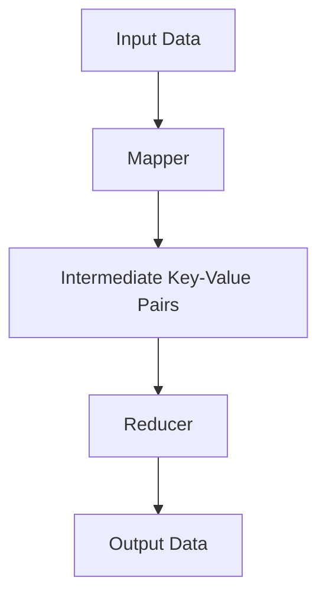

## 20.6 Patterns for Data-Intensive Applications

In the realm of data-intensive applications, handling large volumes of data efficiently is paramount. Haskell, with its strong functional programming paradigm, offers unique advantages for implementing patterns that are crucial in processing vast amounts of data. This section delves into the patterns and tools available in Haskell for data-intensive applications, focusing on MapReduce, streaming, and batch processing.

### Challenges in Data-Intensive Applications

Data-intensive applications face several challenges, including:

- **Scalability**: The ability to handle increasing volumes of data without performance degradation.
- **Efficiency**: Processing data quickly and with minimal resource consumption.
- **Fault Tolerance**: Ensuring the system continues to operate in the event of failures.
- **Consistency**: Maintaining data integrity across distributed systems.
- **Latency**: Minimizing the time taken to process and respond to data queries.

### Patterns for Data-Intensive Applications

#### MapReduce Pattern

**Intent**: The MapReduce pattern is designed to process large data sets with a distributed algorithm on a cluster. It simplifies the processing by breaking down tasks into smaller sub-tasks that can be executed in parallel.

**Key Participants**:
- **Mapper**: Processes input data and produces intermediate key-value pairs.
- **Reducer**: Aggregates the intermediate data and produces the final output.

**Applicability**: Use MapReduce when you need to process large data sets in parallel across a distributed system.

**Sample Code Snippet**:

```haskell
import Data.List (groupBy, sort)
import Data.Function (on)

-- Define a type alias for key-value pairs
type KeyValue k v = (k, v)

-- Mapper function: Takes an input and produces a list of key-value pairs
mapper :: String -> [KeyValue String Int]
mapper document = [(word, 1) | word <- words document]

-- Reducer function: Aggregates values for each key
reducer :: String -> [Int] -> KeyValue String Int
reducer key values = (key, sum values)

-- MapReduce function: Applies the mapper and reducer to a list of documents
mapReduce :: [String] -> [KeyValue String Int]
mapReduce documents =
  let mapped = concatMap mapper documents
      grouped = groupBy ((==) `on` fst) . sort $ mapped
  in map (\group -> reducer (fst (head group)) (map snd group)) grouped

-- Example usage
main :: IO ()
main = do
  let documents = ["haskell is great", "haskell is functional", "functional programming"]
  print $ mapReduce documents
```

**Design Considerations**: Ensure that the mapper and reducer functions are pure and stateless to maximize parallelism and scalability.

**Haskell Unique Features**: Haskell's lazy evaluation and strong typing make it well-suited for implementing the MapReduce pattern, allowing for efficient memory usage and type-safe operations.

**Differences and Similarities**: MapReduce is similar to the fold pattern in functional programming but is designed for distributed systems.

#### Streaming Pattern

**Intent**: The streaming pattern is used to process data in real-time as it arrives, rather than processing it in batches. This is crucial for applications that require low latency and immediate data processing.

**Key Participants**:
- **Source**: Produces data streams.
- **Processor**: Transforms or analyzes the data.
- **Sink**: Consumes the processed data.

**Applicability**: Use streaming when you need to process data in real-time, such as in financial trading systems or live data analytics.

**Sample Code Snippet**:

```haskell
import Conduit

-- Define a simple data processing conduit
processData :: (Monad m) => ConduitT Int Int m ()
processData = do
  awaitForever $ \x -> do
    let result = x * 2  -- Example processing: doubling the input
    yield result

-- Example usage
main :: IO ()
main = runConduitRes $ yieldMany [1..10] .| processData .| mapM_C print
```

**Design Considerations**: Consider backpressure and flow control to handle varying data rates and prevent resource exhaustion.

**Haskell Unique Features**: Haskell's Conduit library provides a powerful abstraction for building streaming data pipelines with composability and resource safety.

**Differences and Similarities**: Streaming is similar to reactive programming but focuses on data flow rather than event handling.

#### Batch Processing Pattern

**Intent**: Batch processing involves processing data in large chunks at scheduled intervals. It is suitable for tasks that do not require immediate processing and can tolerate some latency.

**Key Participants**:
- **Batch Job**: A unit of work that processes a batch of data.
- **Scheduler**: Manages the execution of batch jobs.
- **Data Store**: Stores the input and output data for batch processing.

**Applicability**: Use batch processing for tasks like data aggregation, report generation, and ETL (Extract, Transform, Load) processes.

**Sample Code Snippet**:

```haskell
import Control.Monad (forM_)

-- Define a batch processing function
processBatch :: [Int] -> [Int]
processBatch batch = map (* 2) batch  -- Example processing: doubling each element

-- Example usage
main :: IO ()
main = do
  let batches = [[1..5], [6..10], [11..15]]
  forM_ batches $ \batch -> do
    let result = processBatch batch
    print result
```

**Design Considerations**: Ensure that batch jobs are idempotent and can be retried in case of failure.

**Haskell Unique Features**: Haskell's strong typing and pure functions make it easy to reason about batch processing logic and ensure correctness.

**Differences and Similarities**: Batch processing is similar to traditional job scheduling but focuses on data processing rather than task execution.

### Tools for Data-Intensive Applications

Haskell offers several libraries and tools for implementing data-intensive applications:

- **HadoopStreaming**: Allows Haskell programs to interact with Hadoop's MapReduce framework.
- **Spark Bindings**: Provides Haskell bindings for Apache Spark, enabling distributed data processing.
- **Conduit**: A library for building streaming data pipelines with composability and resource safety.
- **Pipes**: An alternative to Conduit for building streaming data pipelines with a focus on simplicity and composability.

### Visualizing Data Processing Patterns

To better understand the flow of data in these patterns, let's visualize the MapReduce pattern using a Mermaid.js diagram:



**Diagram Description**: This diagram illustrates the flow of data in the MapReduce pattern, where input data is processed by the mapper to produce intermediate key-value pairs, which are then aggregated by the reducer to produce the final output.

### Knowledge Check

- **Question**: What are the key differences between streaming and batch processing patterns?
- **Exercise**: Modify the MapReduce code example to count the frequency of each word in a list of documents.

### Embrace the Journey

Remember, mastering data-intensive patterns in Haskell is a journey. As you progress, you'll build more complex and efficient data processing systems. Keep experimenting, stay curious, and enjoy the journey!

### Quiz: Patterns for Data-Intensive Applications



### What is the primary advantage of the MapReduce pattern?

- [x] It allows parallel processing of large data sets.
- [ ] It reduces the need for data storage.
- [ ] It simplifies data visualization.
- [ ] It eliminates data redundancy.

> **Explanation:** MapReduce is designed to process large data sets in parallel, making it highly efficient for distributed systems.

### Which library is commonly used in Haskell for building streaming data pipelines?

- [ ] HadoopStreaming
- [x] Conduit
- [ ] Spark Bindings
- [ ] Pipes

> **Explanation:** Conduit is a popular library in Haskell for building streaming data pipelines with composability and resource safety.

### What is a key consideration when implementing batch processing?

- [ ] Ensuring real-time data processing
- [x] Making batch jobs idempotent
- [ ] Reducing data latency
- [ ] Increasing data redundancy

> **Explanation:** Batch jobs should be idempotent to ensure they can be retried without adverse effects in case of failure.

### How does Haskell's strong typing benefit data-intensive applications?

- [x] It ensures type-safe operations and reduces runtime errors.
- [ ] It increases the complexity of code.
- [ ] It limits the flexibility of data processing.
- [ ] It slows down data processing.

> **Explanation:** Haskell's strong typing ensures type-safe operations, reducing the likelihood of runtime errors and improving code reliability.

### What is the role of the reducer in the MapReduce pattern?

- [ ] To produce input data
- [ ] To transform data streams
- [x] To aggregate intermediate data
- [ ] To schedule batch jobs

> **Explanation:** The reducer aggregates intermediate data produced by the mapper to generate the final output.

### Which pattern is best suited for real-time data processing?

- [ ] Batch Processing
- [x] Streaming
- [ ] MapReduce
- [ ] ETL

> **Explanation:** Streaming is designed for real-time data processing, allowing immediate handling of incoming data.

### What is a common challenge in data-intensive applications?

- [ ] Reducing data storage
- [x] Ensuring scalability
- [ ] Simplifying data visualization
- [ ] Eliminating data redundancy

> **Explanation:** Scalability is a common challenge in data-intensive applications, as they need to handle increasing data volumes efficiently.

### Which tool allows Haskell programs to interact with Hadoop's MapReduce framework?

- [x] HadoopStreaming
- [ ] Conduit
- [ ] Spark Bindings
- [ ] Pipes

> **Explanation:** HadoopStreaming enables Haskell programs to interact with Hadoop's MapReduce framework for distributed data processing.

### What is the primary focus of the streaming pattern?

- [ ] Data storage
- [x] Real-time data processing
- [ ] Data aggregation
- [ ] Data visualization

> **Explanation:** The streaming pattern focuses on real-time data processing, handling data as it arrives.

### True or False: Batch processing is suitable for tasks that require immediate processing.

- [ ] True
- [x] False

> **Explanation:** Batch processing is not suitable for tasks that require immediate processing, as it processes data in large chunks at scheduled intervals.



By understanding and applying these patterns, you can build robust and efficient data-intensive applications in Haskell. Keep exploring and refining your skills to tackle the challenges of processing large volumes of data.
