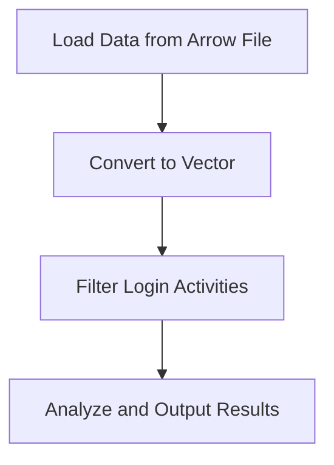

## 20.7 Big Data Processing with Haskell

In the realm of big data, processing vast amounts of information efficiently and effectively is crucial. Haskell, with its strong emphasis on functional programming, offers unique advantages for big data processing. In this section, we will explore how Haskell can be leveraged for big data tasks, focusing on its integration with powerful libraries like Apache Arrow and Hadoop. We will also provide practical examples to illustrate how Haskell's functional paradigm can be applied to process large datasets.

### Introduction to Big Data Processing with Haskell

Big data processing involves handling and analyzing large volumes of data that traditional data processing software cannot manage effectively. Haskell's functional programming paradigm, with its emphasis on immutability, pure functions, and strong typing, provides a robust foundation for building scalable and maintainable data processing systems.

#### Why Haskell for Big Data?

- **Immutability and Concurrency**: Haskell's immutable data structures and pure functions make it easier to write concurrent and parallel programs, which are essential for processing large datasets.
- **Strong Typing**: Haskell's type system helps catch errors at compile time, reducing runtime errors and improving code reliability.
- **Lazy Evaluation**: Haskell's lazy evaluation model allows for efficient memory usage, enabling the processing of large datasets without loading them entirely into memory.
- **Expressive Syntax**: Haskell's concise and expressive syntax allows developers to write complex data processing logic in a clear and maintainable way.

### Key Libraries for Big Data Processing in Haskell

To effectively process big data with Haskell, we can leverage several libraries that provide interfaces to popular big data frameworks and tools.

#### Apache Arrow

Apache Arrow is a cross-language development platform for in-memory data. It provides a standardized columnar memory format optimized for analytics, enabling efficient data interchange between different systems.

- **Haskell Interface**: The `arrow` library in Haskell provides bindings to Apache Arrow, allowing Haskell programs to read and write Arrow data efficiently.
- **Benefits**: Using Apache Arrow with Haskell enables zero-copy reads for analytics operations, reducing the overhead of data serialization and deserialization.

#### Hadoop Integration

Hadoop is a widely used framework for distributed storage and processing of large datasets. Haskell can interact with Hadoop through various libraries and tools.

- **Hadoop Streaming**: Haskell can be used to write MapReduce jobs using Hadoop Streaming, which allows any executable to be used as a mapper or reducer.
- **HDFS Access**: Libraries like `hdfs` provide Haskell bindings to interact with the Hadoop Distributed File System (HDFS), enabling data storage and retrieval.

### Processing Large Datasets in a Functional Paradigm

Let's explore how Haskell's functional paradigm can be applied to process large datasets. We will demonstrate this with a practical example using Apache Arrow.

#### Example: Analyzing Large Datasets with Apache Arrow

Suppose we have a large dataset containing user activity logs, and we want to analyze this data to extract insights. We can use Haskell and Apache Arrow to perform this analysis efficiently.

```haskell
{-# LANGUAGE OverloadedStrings #-}

import qualified Data.Vector as V
import qualified Data.Arrow as A
import qualified Data.Arrow.Table as AT
import qualified Data.Arrow.Table.Column as ATC

-- Define a schema for the dataset
data UserActivity = UserActivity
  { userId :: Int
  , activityType :: String
  , timestamp :: Int
  }

-- Function to load data from an Arrow file
loadData :: FilePath -> IO (V.Vector UserActivity)
loadData filePath = do
  table <- A.readTable filePath
  let userActivities = AT.toVector table
  return userActivities

-- Function to analyze user activity
analyzeActivity :: V.Vector UserActivity -> IO ()
analyzeActivity activities = do
  let loginActivities = V.filter (\ua -> activityType ua == "login") activities
  putStrLn $ "Total logins: " ++ show (V.length loginActivities)

main :: IO ()
main = do
  activities <- loadData "user_activity.arrow"
  analyzeActivity activities
```

In this example, we define a `UserActivity` data type to represent each record in our dataset. We then use the `arrow` library to load data from an Arrow file and analyze it by filtering for login activities.

### Visualizing Data Processing with Haskell

To better understand how Haskell processes data, let's visualize the flow of data through a Haskell program using a Mermaid.js diagram.



This diagram illustrates the steps involved in processing data with Haskell: loading data from an Arrow file, converting it to a vector, filtering for specific activities, and analyzing the results.

### Design Considerations for Big Data Processing in Haskell

When using Haskell for big data processing, there are several design considerations to keep in mind:

- **Memory Management**: Haskell's lazy evaluation can lead to space leaks if not managed carefully. Use strict evaluation where necessary to control memory usage.
- **Concurrency and Parallelism**: Leverage Haskell's concurrency libraries, such as `async` and `parallel`, to process data in parallel and improve performance.
- **Error Handling**: Use Haskell's strong type system and error handling constructs, such as `Either` and `Maybe`, to handle errors gracefully and ensure data integrity.

### Haskell Unique Features for Big Data

Haskell offers several unique features that make it well-suited for big data processing:

- **Type Classes**: Haskell's type classes enable generic programming, allowing you to write reusable data processing functions that work with different data types.
- **Monads and Functors**: Use monads and functors to build composable data processing pipelines, making your code more modular and maintainable.
- **Laziness**: Haskell's lazy evaluation model allows you to work with infinite data structures and process data on-demand, which is particularly useful for streaming data.

### Differences and Similarities with Other Languages

Haskell's approach to big data processing differs from other languages in several ways:

- **Immutability**: Unlike languages that rely on mutable state, Haskell's immutability ensures that data processing functions do not have side effects, leading to more predictable and reliable code.
- **Functional Paradigm**: Haskell's functional paradigm encourages the use of higher-order functions and function composition, which can lead to more concise and expressive data processing logic compared to imperative languages.
- **Integration with Existing Ecosystems**: While Haskell can integrate with existing big data ecosystems like Hadoop, it may require additional effort compared to languages with native support, such as Java or Python.

### Try It Yourself: Experiment with Haskell and Apache Arrow

To deepen your understanding of big data processing with Haskell, try modifying the example code provided. Here are some suggestions:

- **Add More Filters**: Extend the `analyzeActivity` function to filter activities by different types, such as "purchase" or "logout".
- **Aggregate Data**: Implement a function to aggregate data, such as counting the number of activities per user.
- **Visualize Results**: Use a library like `Chart` to visualize the results of your analysis in a graph or chart.

### Knowledge Check

Before we conclude, let's reinforce what we've learned with a few questions:

1. What are the benefits of using Haskell's functional programming paradigm for big data processing?
2. How does Apache Arrow facilitate efficient data interchange in Haskell?
3. What are some design considerations when using Haskell for big data processing?

### Conclusion

Haskell's functional programming paradigm, combined with powerful libraries like Apache Arrow and Hadoop integration, makes it a compelling choice for big data processing. By leveraging Haskell's unique features, such as immutability, strong typing, and lazy evaluation, you can build scalable and maintainable data processing systems. Remember, this is just the beginning. As you continue to explore Haskell's capabilities, you'll discover even more ways to harness its power for big data applications.

## Quiz: Big Data Processing with Haskell



### What is a key advantage of using Haskell for big data processing?

- [x] Immutability and concurrency
- [ ] Dynamic typing
- [ ] Lack of libraries
- [ ] Imperative programming

> **Explanation:** Haskell's immutability and concurrency features make it well-suited for big data processing, allowing for safe and efficient parallel computations.

### Which library provides Haskell bindings to Apache Arrow?

- [x] arrow
- [ ] hdfs
- [ ] async
- [ ] parallel

> **Explanation:** The `arrow` library provides Haskell bindings to Apache Arrow, enabling efficient data interchange and processing.

### How can Haskell interact with Hadoop?

- [x] Hadoop Streaming
- [ ] Direct Java integration
- [ ] Python scripts
- [ ] SQL queries

> **Explanation:** Haskell can interact with Hadoop using Hadoop Streaming, which allows any executable to be used as a mapper or reducer.

### What is a potential pitfall of Haskell's lazy evaluation in big data processing?

- [x] Space leaks
- [ ] Type errors
- [ ] Slow execution
- [ ] Lack of concurrency

> **Explanation:** Haskell's lazy evaluation can lead to space leaks if not managed carefully, as it may defer computations and accumulate memory usage.

### Which feature of Haskell allows for generic programming in data processing?

- [x] Type classes
- [ ] Mutable state
- [ ] Dynamic typing
- [ ] Imperative loops

> **Explanation:** Haskell's type classes enable generic programming, allowing developers to write reusable functions that work with different data types.

### What is the role of the `Either` type in Haskell?

- [x] Error handling
- [ ] Data serialization
- [ ] Concurrency management
- [ ] Type inference

> **Explanation:** The `Either` type in Haskell is used for error handling, allowing functions to return a result or an error.

### How does Apache Arrow improve data processing efficiency?

- [x] Zero-copy reads
- [ ] Dynamic typing
- [ ] Mutable data structures
- [ ] Imperative loops

> **Explanation:** Apache Arrow enables zero-copy reads, reducing the overhead of data serialization and deserialization, thus improving data processing efficiency.

### What is a common use case for the `async` library in Haskell?

- [x] Concurrency
- [ ] Data serialization
- [ ] Type inference
- [ ] Error handling

> **Explanation:** The `async` library in Haskell is commonly used for concurrency, allowing developers to run computations in parallel.

### Which Haskell feature allows for processing infinite data structures?

- [x] Lazy evaluation
- [ ] Mutable state
- [ ] Dynamic typing
- [ ] Imperative loops

> **Explanation:** Haskell's lazy evaluation allows for processing infinite data structures by evaluating data on-demand.

### True or False: Haskell's functional paradigm encourages the use of mutable state for data processing.

- [ ] True
- [x] False

> **Explanation:** Haskell's functional paradigm discourages the use of mutable state, instead favoring immutability and pure functions for data processing.


