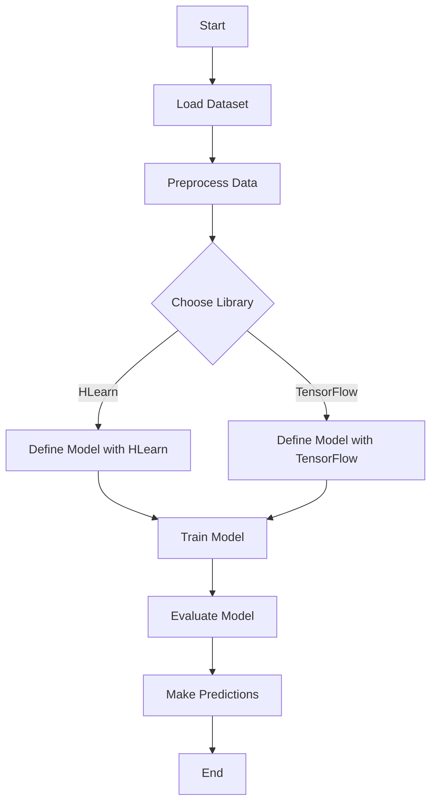

## 20.8 Data Science and Machine Learning Libraries in Haskell: HLearn and TensorFlow

In the realm of data science and machine learning, Haskell offers unique opportunities through libraries like **HLearn** and the **TensorFlow Haskell Binding**. These libraries enable developers to leverage Haskell's functional programming paradigms to build robust, scalable, and efficient machine learning models. In this section, we will delve into the capabilities of these libraries, provide practical examples, and explore how they can be integrated into Haskell-based projects.

### Introduction to HLearn

**HLearn** is a Haskell library designed to implement machine learning algorithms. It emphasizes the use of algebraic structures to create efficient and composable models. HLearn leverages Haskell's strong type system and functional programming features to offer a unique approach to machine learning.

#### Key Features of HLearn

- **Algebraic Approach**: HLearn uses algebraic structures like monoids and groups to define machine learning algorithms, allowing for composability and parallelism.
- **Type Safety**: HLearn benefits from Haskell's strong type system, ensuring that models are type-safe and reducing runtime errors.
- **Efficiency**: By using algebraic structures, HLearn can optimize computations, making it suitable for large-scale data processing.

#### Getting Started with HLearn

To begin using HLearn, you need to install it via Haskell's package manager. You can do this using Cabal or Stack:

```bash
cabal update
cabal install HLearn
```

Or with Stack:

```bash
stack update
stack install HLearn
```

#### Example: Building a Simple Predictive Model with HLearn

Let's build a simple predictive model using HLearn. We'll use a basic dataset and implement a k-nearest neighbors (k-NN) algorithm.

```haskell
{-# LANGUAGE DataKinds #-}
import HLearn.Algebra
import HLearn.Models.Classifiers.KNN
import HLearn.Data.SpaceTree

-- Define a simple dataset
data Point = Point { x :: Double, y :: Double } deriving (Show, Eq)

-- Create a list of points
dataset :: [Point]
dataset = [Point 1.0 2.0, Point 2.0 3.0, Point 3.0 4.0]

-- Define a function to calculate distance
distance :: Point -> Point -> Double
distance p1 p2 = sqrt ((x p1 - x p2)^2 + (y p1 - y p2)^2)

-- Implement k-NN using HLearn
knnModel :: KNN 3 Point
knnModel = train dataset

-- Predict the class of a new point
predict :: Point -> Point
predict newPoint = classify knnModel newPoint

main :: IO ()
main = do
    let newPoint = Point 2.5 3.5
    print $ predict newPoint
```

In this example, we define a simple dataset of points and use HLearn's k-NN implementation to predict the class of a new point. The `train` function builds the model, and `classify` is used to make predictions.

### TensorFlow Haskell Binding

The **TensorFlow Haskell Binding** provides an interface to the TensorFlow library, enabling Haskell developers to utilize TensorFlow's powerful machine learning capabilities. This binding allows for the creation of complex neural networks and deep learning models within Haskell.

#### Key Features of TensorFlow Haskell Binding

- **Integration with TensorFlow**: Access TensorFlow's extensive machine learning functionalities directly from Haskell.
- **Functional API**: Leverage Haskell's functional programming paradigms to define and train models.
- **Interoperability**: Seamlessly integrate with existing TensorFlow models and workflows.

#### Getting Started with TensorFlow Haskell Binding

To use TensorFlow with Haskell, you need to install the `tensorflow-haskell` package. Ensure you have TensorFlow installed on your system before proceeding.

```bash
cabal update
cabal install tensorflow
```

Or with Stack:

```bash
stack update
stack install tensorflow
```

#### Example: Building a Neural Network with TensorFlow Haskell

Let's create a simple neural network using the TensorFlow Haskell Binding. We'll implement a basic feedforward network for classification.

```haskell
{-# LANGUAGE OverloadedStrings #-}
import TensorFlow.Core
import TensorFlow.Minimize
import TensorFlow.Ops
import TensorFlow.Session
import TensorFlow.Variable

-- Define the model
model :: Tensor Build Float -> Tensor Build Float
model input = relu (matMul input weights + biases)
  where
    weights = variable "weights" [2, 2] (randomNormal (vector [2, 2]))
    biases = variable "biases" [2] (zeros [2])

-- Define the loss function
loss :: Tensor Build Float -> Tensor Build Float -> Tensor Build Float
loss labels predictions = reduceMean (square (labels - predictions))

main :: IO ()
main = runSession $ do
    -- Define input and labels
    let input = constant [2, 2] [1.0, 2.0, 3.0, 4.0]
    let labels = constant [2, 2] [0.0, 1.0, 1.0, 0.0]

    -- Build the model
    let predictions = model input

    -- Calculate loss
    let lossValue = loss labels predictions

    -- Train the model
    trainStep <- minimizeWith (gradientDescent 0.01) lossValue []

    -- Run the training step
    run trainStep

    -- Output the loss value
    finalLoss <- run lossValue
    liftIO $ print finalLoss
```

In this example, we define a simple neural network with one hidden layer using TensorFlow's Haskell API. The model is trained using gradient descent, and the final loss value is printed.

### Visualizing Machine Learning Workflows

To better understand the flow of data and operations in machine learning models, we can use diagrams. Below is a simple flowchart illustrating the process of training a machine learning model using HLearn and TensorFlow.



This diagram shows the typical steps involved in building a machine learning model, from loading the dataset to making predictions.

### Design Considerations

When choosing between HLearn and TensorFlow for your Haskell projects, consider the following:

- **Complexity**: TensorFlow is more suitable for complex models, such as deep neural networks, while HLearn is ideal for simpler, algebraic models.
- **Performance**: TensorFlow offers optimized performance for large-scale data and complex computations.
- **Integration**: TensorFlow's interoperability with other languages and platforms can be advantageous for multi-language projects.

### Haskell Unique Features

Haskell's unique features, such as its strong type system, lazy evaluation, and functional programming paradigms, make it an excellent choice for implementing machine learning models. These features ensure that models are both efficient and reliable.

### Differences and Similarities

While both HLearn and TensorFlow can be used for machine learning in Haskell, they serve different purposes. HLearn focuses on algebraic models and composability, whereas TensorFlow is designed for complex neural networks and deep learning.

### Try It Yourself

Experiment with the provided code examples by modifying the dataset, changing model parameters, or implementing different algorithms. This hands-on approach will deepen your understanding of how HLearn and TensorFlow can be used in Haskell.

### References and Links

- [HLearn GitHub Repository](https://github.com/mikeizbicki/HLearn)
- [TensorFlow Haskell GitHub Repository](https://github.com/tensorflow/haskell)
- [TensorFlow Official Documentation](https://www.tensorflow.org/)

### Knowledge Check

- What are the key differences between HLearn and TensorFlow in Haskell?
- How does Haskell's type system benefit machine learning model implementation?
- What are the advantages of using algebraic structures in HLearn?

### Embrace the Journey

Remember, this is just the beginning of your journey into machine learning with Haskell. As you progress, you'll discover more advanced techniques and models. Keep experimenting, stay curious, and enjoy the journey!

## Quiz: Data Science and Machine Learning Libraries (HLearn, TensorFlow)



### What is a key feature of HLearn?

- [x] Algebraic approach to machine learning
- [ ] Integration with TensorFlow
- [ ] Object-oriented design
- [ ] Dynamic typing

> **Explanation:** HLearn uses algebraic structures to define machine learning algorithms, allowing for composability and parallelism.

### Which library is more suitable for complex neural networks?

- [ ] HLearn
- [x] TensorFlow
- [ ] Both are equally suitable
- [ ] Neither

> **Explanation:** TensorFlow is designed for complex neural networks and deep learning, making it more suitable for such tasks.

### How does Haskell's type system benefit machine learning models?

- [x] Ensures type safety and reduces runtime errors
- [ ] Allows dynamic typing
- [ ] Increases runtime errors
- [ ] Makes models slower

> **Explanation:** Haskell's strong type system ensures that models are type-safe, reducing runtime errors.

### What is the primary focus of HLearn?

- [x] Algebraic models and composability
- [ ] Deep learning
- [ ] Image processing
- [ ] Natural language processing

> **Explanation:** HLearn focuses on algebraic models and composability, leveraging Haskell's functional programming features.

### Which library provides an interface to TensorFlow?

- [ ] HLearn
- [x] TensorFlow Haskell Binding
- [ ] Both
- [ ] Neither

> **Explanation:** The TensorFlow Haskell Binding provides an interface to the TensorFlow library.

### What is a benefit of using algebraic structures in HLearn?

- [x] Optimizes computations
- [ ] Increases complexity
- [ ] Reduces performance
- [ ] Decreases composability

> **Explanation:** Algebraic structures in HLearn allow for optimized computations, making it suitable for large-scale data processing.

### Which library is more suitable for large-scale data and complex computations?

- [ ] HLearn
- [x] TensorFlow
- [ ] Both
- [ ] Neither

> **Explanation:** TensorFlow offers optimized performance for large-scale data and complex computations.

### What is a common use case for TensorFlow in Haskell?

- [x] Building neural networks
- [ ] Algebraic data processing
- [ ] Simple arithmetic operations
- [ ] String manipulation

> **Explanation:** TensorFlow is commonly used for building neural networks and deep learning models.

### How can you install HLearn using Cabal?

- [x] `cabal install HLearn`
- [ ] `cabal install tensorflow`
- [ ] `cabal update HLearn`
- [ ] `cabal get HLearn`

> **Explanation:** The command `cabal install HLearn` installs the HLearn library using Cabal.

### True or False: HLearn is designed for deep neural networks.

- [ ] True
- [x] False

> **Explanation:** HLearn is not specifically designed for deep neural networks; it focuses on algebraic models and composability.


