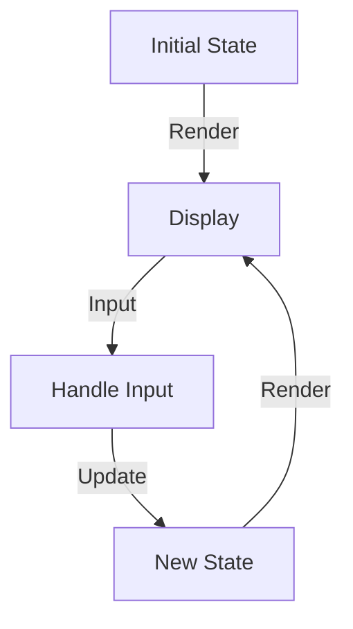

## 20.9 Game Development Patterns in Haskell

Game development in Haskell offers a unique approach by leveraging the language's functional programming paradigms. This section explores various design patterns and techniques that can be employed to create efficient, scalable, and maintainable games using Haskell. We'll delve into the use of libraries like Gloss and SDL2, and demonstrate how functional patterns can be applied to game logic and architecture.

### Functional Game Development

Functional programming in Haskell provides several advantages for game development, including immutability, pure functions, and strong typing. These features help in creating predictable and bug-resistant code, which is crucial in complex game systems.

#### Using Haskell's Purity for Game Logic

Haskell's purity ensures that functions have no side effects, making it easier to reason about game logic. This is particularly beneficial in game development, where complex interactions and state changes are common.

- **Immutability**: Game state can be represented as immutable data structures, reducing the risk of unintended side effects.
- **Pure Functions**: Game logic can be encapsulated in pure functions, ensuring consistent behavior across different game states.
- **Strong Typing**: Haskell's type system helps catch errors at compile time, reducing runtime errors.

### Key Libraries for Game Development

Several libraries facilitate game development in Haskell by providing tools for graphics, input handling, and more.

#### Gloss

Gloss is a Haskell library that simplifies the process of creating 2D graphics. It abstracts away the complexities of OpenGL, allowing developers to focus on game logic.

- **Ease of Use**: Gloss provides a simple API for rendering graphics, making it ideal for prototyping and educational purposes.
- **Interactive Graphics**: Supports animations and interactive graphics with minimal setup.

#### SDL2

SDL2 is a cross-platform library that provides low-level access to audio, keyboard, mouse, joystick, and graphics hardware. The Haskell bindings for SDL2 allow developers to create more complex and performance-intensive games.

- **Cross-Platform**: SDL2 supports multiple platforms, including Windows, macOS, and Linux.
- **Comprehensive Features**: Offers a wide range of features for handling graphics, sound, and input.

### References

- [Gloss](http://gloss.ouroborus.net/)
- [SDL2](https://hackage.haskell.org/package/sdl2)

### Example: Creating Simple Games with Functional Patterns

Let's explore how to create a simple game using functional patterns in Haskell. We'll use Gloss for rendering graphics and demonstrate how to implement game logic using pure functions.

#### Game Concept: A Simple Pong Game

We'll create a basic Pong game to illustrate the use of functional patterns in game development. The game will consist of two paddles and a ball, with the objective of bouncing the ball past the opponent's paddle.

#### Setting Up the Environment

First, ensure you have Haskell and the necessary libraries installed. You can install Gloss using Cabal or Stack:

```bash
cabal update
cabal install gloss
```

#### Defining the Game State

We'll start by defining the game state using a Haskell data structure. The game state will include the positions of the paddles and the ball, as well as the ball's velocity.

```haskell
-- Define the game state
data GameState = GameState
  { ballPos   :: (Float, Float)  -- Ball position (x, y)
  , ballVel   :: (Float, Float)  -- Ball velocity (vx, vy)
  , paddle1   :: Float           -- Paddle 1 position (y)
  , paddle2   :: Float           -- Paddle 2 position (y)
  } deriving Show

-- Initial game state
initialState :: GameState
initialState = GameState
  { ballPos = (0, 0)
  , ballVel = (100, 100)
  , paddle1 = 0
  , paddle2 = 0
  }
```

#### Rendering the Game

Next, we'll define a function to render the game state using Gloss. This function will convert the game state into a picture that can be displayed on the screen.

```haskell
import Graphics.Gloss

-- Convert game state to a picture
render :: GameState -> Picture
render game = pictures
  [ ball
  , paddle (-300) (paddle1 game)
  , paddle 300 (paddle2 game)
  ]
  where
    -- Render the ball
    ball = uncurry translate (ballPos game) $ color ballColor $ circleSolid 10
    ballColor = dark red

    -- Render a paddle
    paddle x y = translate x y $ color paddleColor $ rectangleSolid 10 80
    paddleColor = light blue
```

#### Updating the Game State

We'll define a function to update the game state based on the passage of time. This function will be a pure function that takes the current game state and returns a new game state.

```haskell
-- Update the game state
update :: Float -> GameState -> GameState
update seconds game = game { ballPos = (x', y') }
  where
    -- Update ball position
    (x, y) = ballPos game
    (vx, vy) = ballVel game
    x' = x + vx * seconds
    y' = y + vy * seconds
```

#### Handling Input

Finally, we'll define a function to handle user input. This function will update the game state based on keyboard events.

```haskell
-- Handle input events
handleInput :: Event -> GameState -> GameState
handleInput (EventKey (Char 'w') Down _ _) game = game { paddle1 = paddle1 game + 10 }
handleInput (EventKey (Char 's') Down _ _) game = game { paddle1 = paddle1 game - 10 }
handleInput (EventKey (Char 'o') Down _ _) game = game { paddle2 = paddle2 game + 10 }
handleInput (EventKey (Char 'l') Down _ _) game = game { paddle2 = paddle2 game - 10 }
handleInput _ game = game
```

#### Running the Game

Now that we have defined the game logic, we can run the game using Gloss's `play` function.

```haskell
main :: IO ()
main = play
  (InWindow "Pong" (800, 600) (100, 100))  -- Window settings
  black                                      -- Background color
  60                                         -- Frames per second
  initialState                               -- Initial state
  render                                     -- Render function
  handleInput                                -- Input handler
  update                                     -- Update function
```

### Try It Yourself

Experiment with the code by modifying the ball's velocity, paddle size, or window dimensions. Try adding new features, such as scoring or AI-controlled paddles.

### Visualizing Game Architecture

To better understand the architecture of our game, let's visualize the flow of data and control using a Mermaid.js diagram.



**Diagram Description**: This diagram illustrates the flow of data in our Pong game. The game starts with an initial state, which is rendered to the display. User input is then handled to update the game state, which is subsequently rendered again.

### Design Considerations

When developing games in Haskell, consider the following:

- **Performance**: While Haskell's purity and immutability offer many benefits, they can also introduce performance overhead. Use profiling tools to identify bottlenecks and optimize critical sections of code.
- **Concurrency**: Haskell's concurrency model can be leveraged to handle complex game logic and rendering in parallel.
- **Libraries**: Choose libraries that best fit your game's requirements. Gloss is excellent for simple 2D games, while SDL2 offers more control for complex applications.

### Haskell Unique Features

Haskell's unique features, such as lazy evaluation and type classes, can be leveraged to create efficient and flexible game architectures. For example, lazy evaluation allows for the creation of infinite data structures, which can be useful for procedural content generation.

### Differences and Similarities

Functional game development in Haskell differs from traditional object-oriented approaches. Instead of mutable objects, games are built around immutable data structures and pure functions. This shift in paradigm can lead to more predictable and maintainable code.

### Conclusion

Game development in Haskell offers a unique and powerful approach to building games. By leveraging functional programming paradigms, developers can create scalable and maintainable game architectures. Whether you're building a simple 2D game or a complex simulation, Haskell provides the tools and patterns needed to succeed.

## Quiz: Game Development Patterns in Haskell



### What is a key advantage of using Haskell's purity in game development?

- [x] It ensures functions have no side effects, making code more predictable.
- [ ] It allows for mutable state, which simplifies game logic.
- [ ] It provides direct access to hardware for performance optimization.
- [ ] It enables dynamic typing for flexible code.

> **Explanation:** Haskell's purity ensures that functions have no side effects, making it easier to reason about game logic and predict behavior.

### Which library is recommended for creating simple 2D graphics in Haskell?

- [x] Gloss
- [ ] SDL2
- [ ] OpenGL
- [ ] Vulkan

> **Explanation:** Gloss is a Haskell library that simplifies the process of creating 2D graphics, making it ideal for simple games and educational purposes.

### What is a benefit of using immutable data structures in game development?

- [x] They reduce the risk of unintended side effects.
- [ ] They allow for direct manipulation of memory.
- [ ] They enable faster rendering of graphics.
- [ ] They simplify network communication.

> **Explanation:** Immutable data structures reduce the risk of unintended side effects, which is crucial in complex game systems.

### How does Haskell's strong typing benefit game development?

- [x] It helps catch errors at compile time, reducing runtime errors.
- [ ] It allows for dynamic type changes during execution.
- [ ] It simplifies the integration with other languages.
- [ ] It provides automatic memory management.

> **Explanation:** Haskell's strong typing helps catch errors at compile time, reducing the likelihood of runtime errors.

### What is the purpose of the `update` function in the Pong game example?

- [x] To update the game state based on the passage of time.
- [ ] To render the game state to the screen.
- [ ] To handle user input events.
- [ ] To initialize the game window.

> **Explanation:** The `update` function is responsible for updating the game state based on the passage of time.

### Which feature of Haskell can be leveraged for procedural content generation?

- [x] Lazy evaluation
- [ ] Mutable state
- [ ] Dynamic typing
- [ ] Direct hardware access

> **Explanation:** Haskell's lazy evaluation allows for the creation of infinite data structures, which can be useful for procedural content generation.

### What is a potential downside of using Haskell's purity in game development?

- [x] It can introduce performance overhead.
- [ ] It makes code less predictable.
- [ ] It complicates error handling.
- [ ] It limits the use of third-party libraries.

> **Explanation:** While Haskell's purity offers many benefits, it can also introduce performance overhead due to the lack of mutable state.

### How can concurrency be leveraged in Haskell game development?

- [x] To handle complex game logic and rendering in parallel.
- [ ] To simplify the integration with other languages.
- [ ] To enable dynamic typing for flexible code.
- [ ] To provide direct access to hardware.

> **Explanation:** Haskell's concurrency model can be leveraged to handle complex game logic and rendering in parallel, improving performance.

### What is the role of the `render` function in the Pong game example?

- [x] To convert the game state into a picture for display.
- [ ] To update the game state based on user input.
- [ ] To handle network communication.
- [ ] To initialize the game logic.

> **Explanation:** The `render` function is responsible for converting the game state into a picture that can be displayed on the screen.

### True or False: SDL2 is a Haskell library specifically designed for 2D graphics.

- [ ] True
- [x] False

> **Explanation:** SDL2 is a cross-platform library that provides low-level access to audio, keyboard, mouse, joystick, and graphics hardware, not specifically designed for 2D graphics.



Remember, this is just the beginning. As you progress, you'll build more complex and interactive games. Keep experimenting, stay curious, and enjoy the journey!
