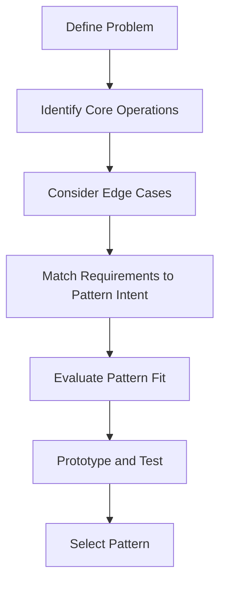

## 21.1 Selecting the Right Pattern for the Problem

In the world of software engineering, design patterns are invaluable tools that provide solutions to common problems. However, selecting the right pattern for a specific problem is crucial to the success of a project. In Haskell, a functional programming language with unique features, this selection process requires a deep understanding of both the problem at hand and the capabilities of the language. This section will guide you through the process of selecting the most appropriate design pattern for your Haskell projects.

### Importance of Pattern Selection

Choosing the right design pattern is essential for several reasons:

- **Efficiency**: The correct pattern can lead to more efficient code, both in terms of performance and resource usage.
- **Maintainability**: Patterns that align well with the problem domain make the codebase easier to understand and maintain.
- **Scalability**: Proper pattern selection can facilitate scaling the application as requirements grow.
- **Readability**: Patterns provide a common language for developers, improving communication and understanding within a team.

### Evaluation Criteria

When selecting a design pattern, consider the following criteria:

#### Complexity of the Problem

- **Simple Problems**: For straightforward problems, simpler patterns like Functors or basic recursion might suffice.
- **Complex Problems**: More complex problems may require advanced patterns like Monads, Free Monads, or even custom DSLs (Domain-Specific Languages).

#### Performance Considerations

- **Time Complexity**: Evaluate how the pattern affects the time complexity of your operations.
- **Space Complexity**: Consider the memory footprint of the pattern, especially in a language like Haskell where lazy evaluation can lead to space leaks if not managed properly.

#### Maintainability and Scalability

- **Code Readability**: Choose patterns that make the codebase easier to read and understand.
- **Future Growth**: Consider how the pattern will accommodate future changes and scaling needs.

### Guidelines for Pattern Selection

#### Analyzing Problem Requirements

1. **Define the Problem**: Clearly articulate the problem you are trying to solve. This includes understanding the inputs, outputs, and any constraints.
2. **Identify Core Operations**: Determine the core operations that need to be performed and their relationships.
3. **Consider Edge Cases**: Think about potential edge cases and how different patterns might handle them.

#### Mapping Requirements to Patterns

1. **Match Requirements to Pattern Intent**: Align the problem requirements with the intent of various design patterns.
2. **Evaluate Pattern Fit**: Assess how well each pattern fits the problem in terms of the evaluation criteria.
3. **Prototype and Test**: Implement a prototype using the selected pattern to test its effectiveness.

### Example: Deciding Between Monad and Applicative

Let's explore an example where we need to decide between using a Monad or an Applicative for a specific computational context.

#### Problem Statement

Suppose we are building a data processing pipeline that involves multiple stages of computation, each of which may fail. We need to decide whether to use a Monad or an Applicative to model this pipeline.

#### Analysis

- **Monad**: Provides a way to chain computations that depend on the results of previous computations. It is suitable when each stage of the pipeline depends on the output of the previous stage.
- **Applicative**: Allows for computations that can be performed independently and then combined. It is suitable when stages can be executed in parallel or do not depend on each other.

#### Code Example

Let's implement a simple data processing pipeline using both Monad and Applicative to illustrate the differences.

```haskell
-- Using Monad
processWithMonad :: Maybe Int -> Maybe Int
processWithMonad input = do
  a <- input
  b <- Just (a + 1)
  c <- Just (b * 2)
  return c

-- Using Applicative
processWithApplicative :: Maybe Int -> Maybe Int
processWithApplicative input =
  (+) <$> input <*> Just 1 >>= \b ->
  (*) <$> Just b <*> Just 2
```

In the `processWithMonad` function, each computation depends on the result of the previous one, making Monad a suitable choice. In contrast, `processWithApplicative` demonstrates how computations can be combined without explicit dependencies, showcasing the power of Applicative.

### Visualizing the Decision Process

To better understand the decision-making process, let's visualize it using a flowchart.



This flowchart outlines the steps involved in selecting the right pattern, from defining the problem to prototyping and testing.

### Haskell Unique Features

Haskell's unique features, such as lazy evaluation, strong static typing, and higher-order functions, influence pattern selection:

- **Lazy Evaluation**: Be mindful of space leaks and choose patterns that manage resources efficiently.
- **Strong Typing**: Leverage Haskell's type system to enforce constraints and ensure correctness.
- **Higher-Order Functions**: Utilize higher-order functions to create flexible and reusable patterns.

### Differences and Similarities

Some patterns may appear similar but have distinct use cases:

- **Monad vs. Applicative**: While both are used for sequencing computations, Monads allow for dependent computations, whereas Applicatives are for independent computations.
- **Functor vs. Monad**: Functors provide a way to apply a function over a wrapped value, while Monads allow for chaining operations that produce wrapped values.

### Design Considerations

When selecting a pattern, consider the following:

- **When to Use**: Use patterns that align with the problem's requirements and constraints.
- **Pitfalls**: Be aware of potential pitfalls, such as overusing complex patterns for simple problems.

### Try It Yourself

Experiment with the code examples provided by modifying the computations or introducing new stages to the pipeline. Observe how the choice of Monad or Applicative affects the implementation.

### References and Links

For further reading on Haskell design patterns, consider the following resources:

- [Haskell Programming from First Principles](https://haskellbook.com/)
- [Real World Haskell](http://book.realworldhaskell.org/)
- [Learn You a Haskell for Great Good!](http://learnyouahaskell.com/)

### Knowledge Check

To reinforce your understanding, consider the following questions:

- What are the key differences between Monad and Applicative in Haskell?
- How does lazy evaluation affect pattern selection in Haskell?
- Why is it important to consider edge cases when selecting a design pattern?

### Embrace the Journey

Remember, selecting the right pattern is a skill that improves with practice. As you gain experience, you'll become more adept at identifying the most suitable patterns for your projects. Keep experimenting, stay curious, and enjoy the journey!

## Quiz: Selecting the Right Pattern for the Problem



### What is the primary advantage of selecting the right design pattern?

- [x] Improved efficiency and maintainability
- [ ] Increased code complexity
- [ ] Reduced readability
- [ ] Decreased performance

> **Explanation:** Selecting the right design pattern improves efficiency and maintainability, making the codebase easier to manage and scale.

### Which criterion is NOT typically considered when selecting a design pattern?

- [ ] Complexity of the problem
- [ ] Performance considerations
- [ ] Maintainability and scalability
- [x] The number of developers on the team

> **Explanation:** The number of developers on the team is not a direct criterion for selecting a design pattern.

### What is a key difference between Monad and Applicative in Haskell?

- [x] Monads allow for dependent computations, while Applicatives are for independent computations.
- [ ] Applicatives allow for dependent computations, while Monads are for independent computations.
- [ ] Both are used for independent computations.
- [ ] Both are used for dependent computations.

> **Explanation:** Monads allow for chaining computations where each step depends on the previous one, while Applicatives are used for combining independent computations.

### How does lazy evaluation influence pattern selection in Haskell?

- [x] It requires careful management of resources to avoid space leaks.
- [ ] It simplifies pattern selection by reducing complexity.
- [ ] It has no impact on pattern selection.
- [ ] It eliminates the need for design patterns.

> **Explanation:** Lazy evaluation can lead to space leaks if not managed properly, influencing the choice of design patterns that handle resources efficiently.

### Which pattern is suitable for a data processing pipeline with independent stages?

- [x] Applicative
- [ ] Monad
- [ ] Functor
- [ ] State Monad

> **Explanation:** Applicative is suitable for pipelines where stages can be executed independently and then combined.

### What is the first step in the pattern selection process?

- [x] Define the problem
- [ ] Prototype and test
- [ ] Evaluate pattern fit
- [ ] Consider edge cases

> **Explanation:** Defining the problem is the first step in the pattern selection process, as it sets the foundation for subsequent steps.

### Why is it important to prototype and test a selected pattern?

- [x] To verify its effectiveness and suitability for the problem
- [ ] To increase the complexity of the solution
- [ ] To ensure it is the most popular pattern
- [ ] To avoid using other patterns

> **Explanation:** Prototyping and testing help verify the pattern's effectiveness and suitability for the specific problem.

### What is a potential pitfall of overusing complex patterns?

- [x] Increased code complexity and reduced readability
- [ ] Improved performance
- [ ] Simplified codebase
- [ ] Enhanced maintainability

> **Explanation:** Overusing complex patterns can lead to increased code complexity and reduced readability, making the codebase harder to manage.

### Which Haskell feature can enforce constraints and ensure correctness in pattern selection?

- [x] Strong static typing
- [ ] Lazy evaluation
- [ ] Higher-order functions
- [ ] Pattern matching

> **Explanation:** Haskell's strong static typing can enforce constraints and ensure correctness, aiding in pattern selection.

### True or False: Functors and Monads are used for the same purpose in Haskell.

- [ ] True
- [x] False

> **Explanation:** Functors and Monads serve different purposes; Functors apply functions over wrapped values, while Monads allow for chaining operations that produce wrapped values.


