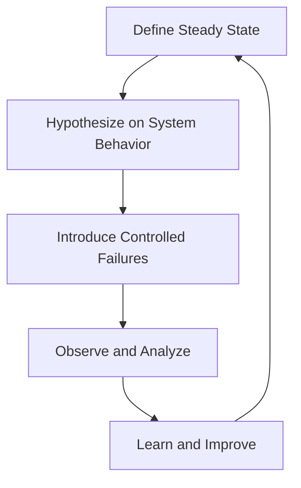

## 21.10 Chaos Engineering in Functional Systems

Chaos Engineering is a discipline that focuses on improving system resilience by deliberately introducing failures into a system to uncover weaknesses. In the context of functional systems, particularly those built using Haskell, Chaos Engineering can be a powerful tool to ensure that applications are robust, fault-tolerant, and capable of handling unexpected disruptions.

### Understanding Chaos Engineering

**Chaos Engineering Concept**: At its core, Chaos Engineering is about proactively testing the robustness of a system by introducing controlled failures. This practice helps identify potential weaknesses before they manifest as real-world outages.

- **Goals**:
  - **Identify Weaknesses**: Discover vulnerabilities in the system that could lead to failures.
  - **Improve Resilience**: Enhance the system's ability to withstand and recover from failures.
  - **Build Confidence**: Ensure that the system behaves as expected under adverse conditions.

### Implementing Chaos Engineering in Haskell

Implementing Chaos Engineering in Haskell involves injecting faults into applications to observe how they respond. This process can be broken down into several steps:

1. **Define Steady State**: Establish what normal operation looks like for your system. This includes metrics like response time, error rates, and throughput.

2. **Hypothesize on System Behavior**: Predict how the system should behave under certain failure conditions.

3. **Introduce Controlled Failures**: Use tools and techniques to simulate failures, such as network latency, server crashes, or resource exhaustion.

4. **Observe and Analyze**: Monitor the system's behavior during the experiment to identify any deviations from the expected behavior.

5. **Learn and Improve**: Use the insights gained to strengthen the system's resilience.

### Tools for Chaos Engineering

While Netflix's Chaos Monkey is a popular tool for Chaos Engineering, it serves as a conceptual reference for implementing similar strategies in Haskell applications. In the Haskell ecosystem, you can leverage libraries and frameworks to simulate failures and test system resilience.

#### Example: Simulating Network Failures

Let's explore a simple example of simulating network failures in a Haskell application to test its resilience.

```haskell
{-# LANGUAGE OverloadedStrings #-}

import Control.Concurrent (threadDelay)
import Control.Exception (SomeException, catch)
import Network.HTTP.Client (defaultManagerSettings, newManager)
import Network.HTTP.Simple (httpLBS, parseRequest, getResponseBody)

-- Simulate a network request with potential failure
simulateNetworkRequest :: IO ()
simulateNetworkRequest = do
    manager <- newManager defaultManagerSettings
    request <- parseRequest "http://example.com"
    response <- httpLBS request `catch` handleNetworkFailure
    putStrLn $ "Response: " ++ show (getResponseBody response)

-- Handle network failure by retrying
handleNetworkFailure :: SomeException -> IO ()
handleNetworkFailure _ = do
    putStrLn "Network failure occurred. Retrying in 5 seconds..."
    threadDelay 5000000
    simulateNetworkRequest

main :: IO ()
main = simulateNetworkRequest
```

In this example, we simulate a network request and introduce a failure handling mechanism that retries the request after a delay. This simple approach helps test how the application behaves under network disruptions.

### Visualizing Chaos Engineering Workflow

To better understand the workflow of Chaos Engineering in functional systems, let's visualize the process using a flowchart.



**Figure 1**: Chaos Engineering Workflow in Functional Systems

### Key Considerations for Chaos Engineering in Haskell

When implementing Chaos Engineering in Haskell, consider the following:

- **Functional Paradigms**: Leverage Haskell's functional paradigms, such as immutability and pure functions, to create predictable and testable components.
- **Concurrency and Parallelism**: Utilize Haskell's concurrency features to simulate real-world scenarios, such as handling multiple requests simultaneously.
- **Error Handling**: Implement robust error handling using Haskell's type system and monads to gracefully manage failures.
- **Monitoring and Logging**: Ensure comprehensive monitoring and logging to capture detailed insights during chaos experiments.

### Haskell Unique Features for Chaos Engineering

Haskell offers unique features that can enhance Chaos Engineering practices:

- **Strong Typing**: Haskell's strong static typing helps catch errors at compile time, reducing runtime failures.
- **Lazy Evaluation**: Lazy evaluation allows for efficient resource usage, which can be beneficial when simulating resource exhaustion scenarios.
- **Monads and Functors**: Use monads and functors to manage side effects and encapsulate failure handling logic.

### Differences and Similarities with Other Patterns

Chaos Engineering shares similarities with other testing and resilience patterns, such as:

- **Fault Injection**: Both involve introducing failures, but Chaos Engineering focuses on observing system behavior under real-world conditions.
- **Resilience Testing**: Chaos Engineering is a subset of resilience testing, emphasizing proactive failure introduction.

### Try It Yourself: Experiment with Chaos Engineering

To deepen your understanding, try modifying the provided code example to simulate different types of failures, such as:

- **Resource Exhaustion**: Simulate scenarios where system resources are depleted.
- **Latency Injection**: Introduce artificial delays to test timeout handling.
- **Service Unavailability**: Simulate service outages and observe recovery mechanisms.

### Knowledge Check

- **What is the primary goal of Chaos Engineering?**
- **How can Haskell's strong typing aid in Chaos Engineering?**
- **What are some common failure scenarios to simulate in Chaos Engineering?**

### Embrace the Journey

Remember, Chaos Engineering is an ongoing process of learning and improvement. As you experiment with different failure scenarios, you'll gain valuable insights into your system's resilience. Stay curious, keep testing, and enjoy the journey of building robust functional systems with Haskell!

## Quiz: Chaos Engineering in Functional Systems



### What is the primary goal of Chaos Engineering?

- [x] Identifying weaknesses before they cause outages.
- [ ] Increasing system complexity.
- [ ] Reducing system performance.
- [ ] Simplifying system architecture.

> **Explanation:** The primary goal of Chaos Engineering is to identify weaknesses in a system before they lead to outages, thereby improving system resilience.

### Which Haskell feature is beneficial for managing side effects in Chaos Engineering?

- [x] Monads
- [ ] Lists
- [ ] Arrays
- [ ] Strings

> **Explanation:** Monads in Haskell are used to manage side effects, making them beneficial for handling failures and side effects in Chaos Engineering.

### What is the first step in the Chaos Engineering workflow?

- [x] Define Steady State
- [ ] Introduce Controlled Failures
- [ ] Observe and Analyze
- [ ] Learn and Improve

> **Explanation:** The first step in the Chaos Engineering workflow is to define the steady state, which establishes what normal operation looks like for the system.

### How does Haskell's strong typing aid in Chaos Engineering?

- [x] It catches errors at compile time.
- [ ] It increases runtime errors.
- [ ] It simplifies code syntax.
- [ ] It reduces code readability.

> **Explanation:** Haskell's strong typing helps catch errors at compile time, reducing the likelihood of runtime failures and aiding in Chaos Engineering.

### What is a common failure scenario to simulate in Chaos Engineering?

- [x] Network Failures
- [ ] Code Refactoring
- [ ] User Interface Changes
- [ ] Database Schema Updates

> **Explanation:** Network failures are a common scenario to simulate in Chaos Engineering to test how the system handles disruptions in connectivity.

### Which tool is a conceptual reference for Chaos Engineering?

- [x] Netflix's Chaos Monkey
- [ ] GitHub
- [ ] Docker
- [ ] Kubernetes

> **Explanation:** Netflix's Chaos Monkey is a well-known tool and conceptual reference for implementing Chaos Engineering practices.

### What is the purpose of introducing controlled failures in Chaos Engineering?

- [x] To observe system behavior under failure conditions.
- [ ] To increase system complexity.
- [ ] To reduce system performance.
- [ ] To simplify system architecture.

> **Explanation:** The purpose of introducing controlled failures is to observe how the system behaves under failure conditions, helping identify weaknesses and improve resilience.

### What is a benefit of using lazy evaluation in Haskell for Chaos Engineering?

- [x] Efficient resource usage
- [ ] Increased runtime errors
- [ ] Simplified code syntax
- [ ] Reduced code readability

> **Explanation:** Lazy evaluation allows for efficient resource usage, which can be beneficial when simulating resource exhaustion scenarios in Chaos Engineering.

### Which of the following is a key consideration for Chaos Engineering in Haskell?

- [x] Functional Paradigms
- [ ] Object-Oriented Design
- [ ] Procedural Programming
- [ ] Imperative Syntax

> **Explanation:** Leveraging Haskell's functional paradigms, such as immutability and pure functions, is a key consideration for Chaos Engineering in Haskell.

### True or False: Chaos Engineering is a one-time process.

- [ ] True
- [x] False

> **Explanation:** Chaos Engineering is not a one-time process; it is an ongoing practice of learning and improvement to ensure system resilience.


