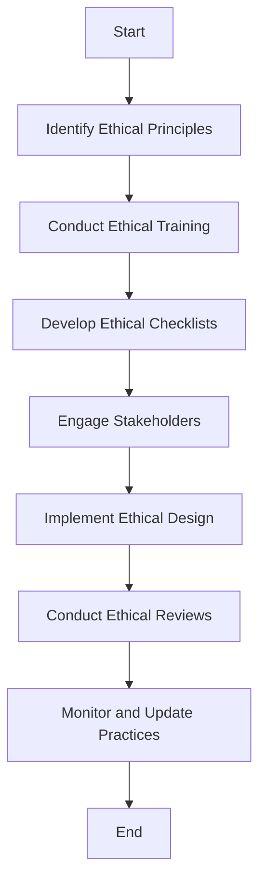

## 21.11 Ethical Considerations in Software Design

As software engineers and architects, we wield significant power in shaping the digital world. With this power comes the responsibility to consider the ethical implications of our designs. This section explores the ethical considerations in software design, focusing on privacy, security, and accessibility. We will discuss principles, best practices, and provide examples to guide you in incorporating ethics into your development processes.

### Understanding the Impact of Software on Society

Software permeates every aspect of our lives, influencing how we communicate, work, and interact with the world. As developers, we must recognize the societal impact of our creations. Ethical software design is not just about avoiding harm; it's about actively contributing to the well-being of individuals and communities.

#### Key Ethical Principles

1. **Privacy**: Protecting user data and respecting their right to control personal information.
2. **Security**: Ensuring systems are resilient against unauthorized access and data breaches.
3. **Accessibility**: Designing inclusive software that is usable by people with diverse abilities.

### Privacy: A Fundamental Right

Privacy is a cornerstone of ethical software design. Users trust us with their data, and it is our duty to protect it. This involves implementing robust data protection measures and ensuring transparency in data collection and usage.

#### Best Practices for Privacy

- **Data Minimization**: Collect only the data necessary for the application's functionality.
- **User Consent**: Clearly inform users about data collection practices and obtain explicit consent.
- **Anonymization**: Use techniques to anonymize data, reducing the risk of identifying individuals.
- **Transparency**: Provide users with access to their data and the ability to modify or delete it.

#### Example: Ensuring Data Encryption and User Consent

Consider an application that collects user location data. To ensure privacy:

```haskell
import Data.Time.Clock (getCurrentTime)
import Data.Maybe (fromMaybe)

-- Function to encrypt user data
encryptData :: String -> String
encryptData = reverse -- Simple example, use a proper encryption algorithm

-- Function to obtain user consent
getUserConsent :: IO Bool
getUserConsent = do
  putStrLn "Do you consent to share your location data? (yes/no)"
  response <- getLine
  return (response == "yes")

-- Main function to handle data collection
main :: IO ()
main = do
  consent <- getUserConsent
  if consent
    then do
      currentTime <- getCurrentTime
      let locationData = "User's location at " ++ show currentTime
      let encryptedData = encryptData locationData
      putStrLn $ "Data collected and encrypted: " ++ encryptedData
    else
      putStrLn "Data collection aborted due to lack of consent."
```

This code snippet demonstrates obtaining user consent before collecting and encrypting location data. It highlights the importance of transparency and user control over personal information.

### Security: Safeguarding Systems and Data

Security is paramount in protecting both users and systems from malicious activities. Ethical software design requires a proactive approach to identifying and mitigating security risks.

#### Best Practices for Security

- **Secure Coding**: Follow secure coding standards to prevent vulnerabilities.
- **Regular Audits**: Conduct security audits and penetration testing to identify weaknesses.
- **Encryption**: Use strong encryption for data at rest and in transit.
- **Access Control**: Implement robust authentication and authorization mechanisms.

#### Example: Implementing Secure Authentication

Consider a web application that requires user authentication. Implementing secure authentication involves:

```haskell
import Crypto.BCrypt (hashPasswordUsingPolicy, slowerBcryptHashingPolicy)

-- Function to hash a password
hashPassword :: String -> IO (Maybe String)
hashPassword password = do
  hashed <- hashPasswordUsingPolicy slowerBcryptHashingPolicy (pack password)
  return (fmap unpack hashed)

-- Function to verify a password
verifyPassword :: String -> String -> Bool
verifyPassword password hashedPassword =
  validatePassword (pack hashedPassword) (pack password)

main :: IO ()
main = do
  putStrLn "Enter your password:"
  password <- getLine
  hashed <- hashPassword password
  case hashed of
    Just hp -> putStrLn $ "Your hashed password is: " ++ hp
    Nothing -> putStrLn "Failed to hash password."
```

This example demonstrates hashing passwords using the BCrypt library, a common practice to enhance security by protecting stored passwords.

### Accessibility: Designing for All

Accessibility ensures that software is usable by everyone, regardless of their abilities. Ethical design involves creating inclusive experiences that accommodate diverse user needs.

#### Best Practices for Accessibility

- **Universal Design**: Design interfaces that are usable by all people, to the greatest extent possible, without the need for adaptation.
- **Assistive Technologies**: Ensure compatibility with screen readers and other assistive technologies.
- **Color Contrast**: Use sufficient color contrast to aid users with visual impairments.
- **Keyboard Navigation**: Ensure all functionality is accessible via keyboard for users with mobility impairments.

#### Example: Implementing Accessible User Interfaces

Consider a web application that needs to be accessible to users with visual impairments. Implementing accessibility features involves:

```html
<!DOCTYPE html>
<html lang="en">
<head>
  <meta charset="UTF-8">
  <meta name="viewport" content="width=device-width, initial-scale=1.0">
  <title>Accessible Web Page</title>
  <style>
    body {
      font-size: 1.2em;
      line-height: 1.5;
    }
    .high-contrast {
      background-color: #000;
      color: #fff;
    }
  </style>
</head>
<body class="high-contrast">
  <h1>Welcome to Our Accessible Web Page</h1>
  <p>This page is designed with accessibility in mind.</p>
  <a href="#main-content" accesskey="1">Skip to main content</a>
  <main id="main-content">
    <h2>Main Content</h2>
    <p>All content is accessible via keyboard navigation.</p>
  </main>
</body>
</html>
```

This HTML snippet demonstrates a high-contrast design and keyboard navigation features, enhancing accessibility for users with visual and mobility impairments.

### Incorporating Ethical Reviews in Development Cycles

Ethical considerations should be integrated into every stage of the software development lifecycle. This involves conducting ethical reviews and assessments to identify potential ethical issues and address them proactively.

#### Steps to Incorporate Ethical Reviews

1. **Ethical Training**: Provide training for developers on ethical principles and practices.
2. **Ethical Checklists**: Use checklists to ensure ethical considerations are addressed in design and implementation.
3. **Stakeholder Engagement**: Involve diverse stakeholders, including end-users, in the design process to gather feedback and perspectives.
4. **Continuous Monitoring**: Regularly review and update ethical practices to adapt to new challenges and technologies.

### Visualizing Ethical Considerations in Software Design

To better understand how ethical considerations integrate into software design, let's visualize the process using a flowchart.



This flowchart illustrates the steps involved in incorporating ethical considerations into software design, from identifying principles to continuous monitoring.

### Knowledge Check

Let's pause and reflect on what we've covered so far. Consider the following questions:

- How can you ensure user privacy in your applications?
- What are some common security practices to protect user data?
- How can you design software that is accessible to all users?

### Embrace the Journey

Remember, ethical software design is an ongoing journey. As technology evolves, so do the ethical challenges we face. Stay curious, keep learning, and strive to create software that positively impacts society.

### References and Further Reading

- [The ACM Code of Ethics and Professional Conduct](https://www.acm.org/code-of-ethics)
- [The IEEE Global Initiative on Ethics of Autonomous and Intelligent Systems](https://ethicsinaction.ieee.org/)
- [Web Content Accessibility Guidelines (WCAG)](https://www.w3.org/WAI/standards-guidelines/wcag/)

### Quiz: Ethical Considerations in Software Design



### What is a key principle of ethical software design?

- [x] Privacy
- [ ] Profitability
- [ ] Complexity
- [ ] Speed

> **Explanation:** Privacy is a fundamental principle of ethical software design, ensuring that user data is protected and respected.

### Which practice helps ensure user consent in data collection?

- [x] Explicit user consent
- [ ] Implicit consent
- [ ] Data mining
- [ ] Data sharing

> **Explanation:** Explicit user consent involves clearly informing users about data collection practices and obtaining their agreement.

### What is a common method for securing stored passwords?

- [x] Hashing
- [ ] Plain text storage
- [ ] Encryption
- [ ] Compression

> **Explanation:** Hashing is a common method for securing stored passwords, making them difficult to reverse-engineer.

### How can software be made accessible to users with visual impairments?

- [x] High contrast design
- [ ] Complex interfaces
- [ ] Small fonts
- [ ] Flashy animations

> **Explanation:** High contrast design improves readability for users with visual impairments, making content more accessible.

### What is an important step in incorporating ethical reviews in development?

- [x] Stakeholder engagement
- [ ] Ignoring feedback
- [ ] Focusing solely on profits
- [ ] Avoiding user input

> **Explanation:** Engaging stakeholders, including end-users, helps gather diverse perspectives and ensures ethical considerations are addressed.

### What is the purpose of ethical training for developers?

- [x] To educate on ethical principles and practices
- [ ] To increase coding speed
- [ ] To reduce costs
- [ ] To focus on aesthetics

> **Explanation:** Ethical training educates developers on ethical principles and practices, ensuring they are equipped to address ethical challenges.

### How can data be anonymized to protect user privacy?

- [x] Removing personally identifiable information
- [ ] Sharing data with third parties
- [ ] Storing data in plain text
- [ ] Collecting more data

> **Explanation:** Anonymization involves removing personally identifiable information, reducing the risk of identifying individuals.

### What is a benefit of conducting regular security audits?

- [x] Identifying vulnerabilities
- [ ] Increasing complexity
- [ ] Reducing transparency
- [ ] Ignoring user feedback

> **Explanation:** Regular security audits help identify vulnerabilities, allowing developers to address them proactively.

### Which practice enhances accessibility for users with mobility impairments?

- [x] Keyboard navigation
- [ ] Mouse-only interfaces
- [ ] Complex gestures
- [ ] Small touch targets

> **Explanation:** Keyboard navigation ensures all functionality is accessible via keyboard, aiding users with mobility impairments.

### True or False: Ethical software design is a one-time effort.

- [ ] True
- [x] False

> **Explanation:** Ethical software design is an ongoing journey, requiring continuous monitoring and adaptation to new challenges.



By embracing ethical considerations in software design, we contribute to a more inclusive, secure, and respectful digital world. Let's continue to learn, adapt, and innovate with ethics at the forefront of our development processes.
