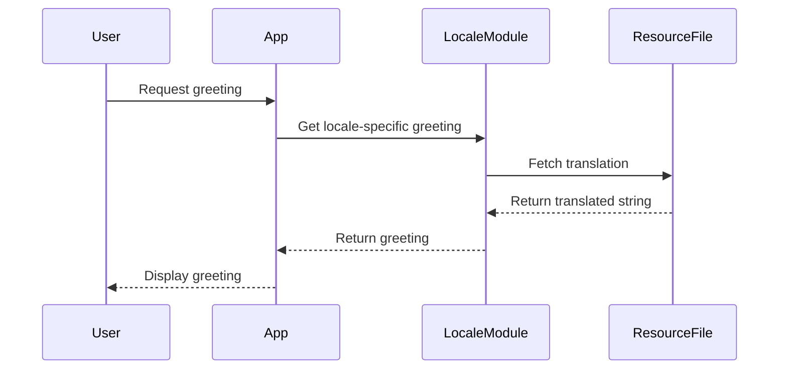

## 21.12 Internationalization and Localization

In today's interconnected world, software applications are expected to reach a global audience. This necessitates the need for internationalization (i18n) and localization (l10n) to ensure that applications can be adapted for different languages and regions without requiring engineering changes. In this section, we will explore how to effectively implement internationalization and localization in Haskell applications, leveraging its powerful type system and functional paradigms.

### Importance of Internationalization and Localization

Internationalization and localization are crucial for making applications accessible and user-friendly to a diverse audience. By supporting multiple languages and locales, applications can:

- **Increase Market Reach**: By catering to users in different regions, applications can tap into new markets and expand their user base.
- **Enhance User Experience**: Providing content in a user's native language improves usability and satisfaction.
- **Comply with Legal Requirements**: Some regions have regulations requiring software to be available in the local language.

### Key Concepts

Before diving into implementation details, let's clarify some key concepts:

- **Internationalization (i18n)**: The process of designing software so that it can be adapted to various languages and regions without requiring changes to the codebase. This involves extracting translatable strings and supporting multiple locales.
- **Localization (l10n)**: The process of adapting software for a specific region or language by translating text and adjusting formats for dates, times, currencies, etc.

### Techniques for Internationalization

#### Extracting Translatable Strings

The first step in internationalization is to identify and extract all user-facing strings from the codebase. This can be achieved by:

- **Using Resource Files**: Store translatable strings in separate resource files, such as JSON or YAML, which can be easily modified without altering the code.
- **String Identifiers**: Use unique identifiers for each string, which can be mapped to translations in different languages.

#### Supporting Multiple Locales

Supporting multiple locales involves more than just translating text. It requires handling various regional formats for dates, times, numbers, and currencies. This can be achieved by:

- **Locale-Sensitive Functions**: Use functions that adapt their behavior based on the current locale.
- **Date and Time Formatting**: Utilize libraries that provide locale-aware date and time formatting.

### Haskell Libraries for Internationalization

Haskell offers several libraries to facilitate internationalization and localization:

- **gettext**: A library for managing message catalogs and translations.
- **hgettext**: A tool for extracting translatable strings from Haskell source code.
- **text-icu**: Provides support for Unicode and internationalization, including locale-sensitive string comparison and formatting.

### Example: Creating a Multilingual Application

Let's walk through an example of creating a simple multilingual application in Haskell that supports English and Spanish. We'll focus on extracting translatable strings and formatting dates according to the locale.

#### Step 1: Setting Up the Project

Create a new Haskell project using Stack:

```bash
stack new multilingual-app
cd multilingual-app
```

Add the necessary dependencies to your `package.yaml`:

```yaml
dependencies:
- base >= 4.7 && < 5
- text
- gettext
- text-icu
```

#### Step 2: Extracting Translatable Strings

Create a resource file `messages.pot` to store translatable strings:

```plaintext
msgid "greeting"
msgstr "Hello, World!"

msgid "date_format"
msgstr "%A, %B %d, %Y"
```

#### Step 3: Implementing Locale Support

Create a module `Localization.hs` to handle locale-specific logic:

```haskell
module Localization (getGreeting, formatDate) where

import Data.Text (Text)
import qualified Data.Text as T
import Data.Time (UTCTime, formatTime, defaultTimeLocale)
import System.Locale (TimeLocale)

-- Function to get a greeting message based on the locale
getGreeting :: String -> Text
getGreeting locale = case locale of
    "es" -> "¡Hola, Mundo!"
    _    -> "Hello, World!"

-- Function to format date based on the locale
formatDate :: String -> UTCTime -> Text
formatDate locale date = T.pack $ formatTime (localeToTimeLocale locale) "%A, %B %d, %Y" date

-- Helper function to convert locale string to TimeLocale
localeToTimeLocale :: String -> TimeLocale
localeToTimeLocale "es" = spanishTimeLocale
localeToTimeLocale _    = defaultTimeLocale

-- Define a Spanish TimeLocale
spanishTimeLocale :: TimeLocale
spanishTimeLocale = defaultTimeLocale { ... } -- Customize for Spanish
```

#### Step 4: Using the Localization Module

In your `Main.hs`, use the `Localization` module to display messages and format dates:

```haskell
module Main where

import Localization (getGreeting, formatDate)
import Data.Time.Clock (getCurrentTime)

main :: IO ()
main = do
    let locale = "es" -- Change to "en" for English
    putStrLn $ "Greeting: " ++ (getGreeting locale)
    currentTime <- getCurrentTime
    putStrLn $ "Current Date: " ++ (formatDate locale currentTime)
```

### Try It Yourself

Experiment with the code by adding more languages and customizing the date formats. Try changing the locale variable to see how the output changes.

### Visualizing the Process

To better understand the flow of internationalization and localization, let's visualize the process using a sequence diagram:



This diagram illustrates how the application fetches locale-specific strings from resource files and displays them to the user.

### Best Practices

- **Use Unicode**: Ensure your application supports Unicode to handle a wide range of characters and symbols.
- **Avoid Hardcoding Strings**: Keep all user-facing strings in external resource files for easy translation.
- **Test with Different Locales**: Regularly test your application with different locales to ensure correct behavior.
- **Consider Cultural Differences**: Be mindful of cultural nuances when translating content.

### Knowledge Check

- **What is the difference between internationalization and localization?**
- **Why is it important to use Unicode in multilingual applications?**
- **How can you extract translatable strings from a Haskell application?**

### Summary

In this section, we've explored the importance of internationalization and localization in making applications accessible to a global audience. We've covered techniques for extracting translatable strings, supporting multiple locales, and using Haskell libraries to facilitate these processes. By following best practices, you can create applications that provide a seamless experience for users worldwide.

Remember, this is just the beginning. As you progress, you'll build more complex and interactive applications. Keep experimenting, stay curious, and enjoy the journey!

## Quiz: Internationalization and Localization



### What is the primary goal of internationalization in software development?

- [x] To design software that can be adapted to various languages and regions without code changes
- [ ] To translate software into multiple languages
- [ ] To create software for a specific region
- [ ] To improve software performance

> **Explanation:** Internationalization focuses on designing software that can be easily adapted to different languages and regions without altering the codebase.

### Which Haskell library is commonly used for managing message catalogs and translations?

- [x] gettext
- [ ] text-icu
- [ ] hgettext
- [ ] aeson

> **Explanation:** The `gettext` library is widely used for managing message catalogs and translations in Haskell applications.

### What is the difference between internationalization (i18n) and localization (l10n)?

- [x] Internationalization is designing software for adaptation; localization is adapting software for a specific region
- [ ] Internationalization is translating text; localization is formatting dates
- [ ] Internationalization is a subset of localization
- [ ] Localization is designing software for adaptation; internationalization is adapting software for a specific region

> **Explanation:** Internationalization involves designing software for adaptation, while localization involves adapting software for a specific region or language.

### Why is Unicode important in multilingual applications?

- [x] It supports a wide range of characters and symbols
- [ ] It improves application performance
- [ ] It simplifies code structure
- [ ] It reduces memory usage

> **Explanation:** Unicode is essential for supporting a wide range of characters and symbols, making it crucial for multilingual applications.

### Which of the following is a best practice for internationalization?

- [x] Avoid hardcoding strings
- [ ] Use locale-specific code
- [ ] Translate code comments
- [ ] Store translations in the codebase

> **Explanation:** Avoiding hardcoded strings and storing them in external resource files is a best practice for internationalization.

### What is the role of the `text-icu` library in Haskell?

- [x] Provides support for Unicode and internationalization
- [ ] Manages message catalogs
- [ ] Extracts translatable strings
- [ ] Formats JSON data

> **Explanation:** The `text-icu` library provides support for Unicode and internationalization, including locale-sensitive string comparison and formatting.

### How can you test your application with different locales?

- [x] Change the locale setting and verify behavior
- [ ] Use a single locale for all tests
- [ ] Translate the codebase
- [ ] Ignore locale differences

> **Explanation:** Regularly testing your application with different locales ensures correct behavior and adaptation.

### What is a common format for storing translatable strings?

- [x] JSON or YAML
- [ ] XML
- [ ] CSV
- [ ] Plain text

> **Explanation:** JSON or YAML are common formats for storing translatable strings due to their readability and ease of use.

### What should you consider when translating content for localization?

- [x] Cultural differences and nuances
- [ ] Code structure
- [ ] Performance optimization
- [ ] Memory usage

> **Explanation:** Considering cultural differences and nuances is important when translating content to ensure it resonates with the target audience.

### True or False: Localization involves designing software for adaptation to various languages.

- [ ] True
- [x] False

> **Explanation:** Localization involves adapting software for a specific region or language, while internationalization involves designing software for adaptation.


