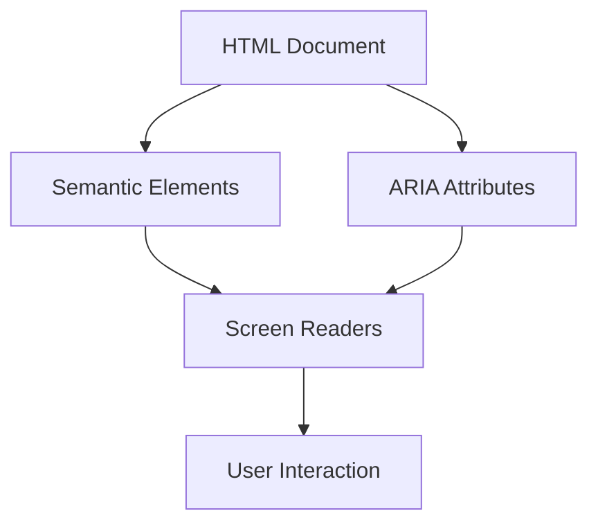

## 21.13 Designing for Accessibility

Designing for accessibility is a crucial aspect of software development that ensures applications are usable by everyone, including people with disabilities. In this section, we will explore how to design accessible Haskell applications, focusing on web applications, but also touching on general software accessibility principles. We will cover accessibility goals, standards, implementation strategies, and provide practical examples.

### Accessibility Goals

The primary goal of accessibility is to make software usable by as many people as possible, regardless of their abilities or disabilities. This involves:

- **Ensuring Compatibility with Assistive Technologies**: Such as screen readers, magnifiers, and alternative input devices.
- **Providing Alternative Text for Non-Text Content**: Ensuring that images, videos, and other non-text content are accessible.
- **Designing for Keyboard Navigation**: Ensuring that all functionality is accessible via keyboard.
- **Maintaining Readability and Understandability**: Using clear language and providing instructions and feedback.

### Accessibility Standards

To achieve these goals, developers should adhere to established accessibility standards, such as:

- **WCAG (Web Content Accessibility Guidelines)**: A set of guidelines developed by the World Wide Web Consortium (W3C) to make web content more accessible.
- **ARIA (Accessible Rich Internet Applications)**: A set of attributes that define ways to make web content and web applications more accessible to people with disabilities.

#### Key WCAG Principles

The WCAG guidelines are organized around four principles, often abbreviated as POUR:

1. **Perceivable**: Information and user interface components must be presentable to users in ways they can perceive.
2. **Operable**: User interface components and navigation must be operable.
3. **Understandable**: Information and the operation of the user interface must be understandable.
4. **Robust**: Content must be robust enough to be interpreted reliably by a wide variety of user agents, including assistive technologies.

### Implementing Accessibility in Haskell Applications

Implementing accessibility in Haskell applications, particularly web applications, involves several strategies:

#### Semantic HTML and ARIA

Using semantic HTML elements and ARIA attributes is crucial for creating accessible web applications. Semantic HTML provides meaning to the web content, while ARIA attributes enhance accessibility by providing additional information to assistive technologies.

```haskell
{-# LANGUAGE OverloadedStrings #-}

import Lucid

-- Example of a semantic HTML form with ARIA attributes
myForm :: Html ()
myForm = form_ [role_ "form", ariaLabel_ "User Information Form"] $ do
  label_ [for_ "name"] "Name:"
  input_ [type_ "text", id_ "name", name_ "name", ariaRequired_ "true"]
  label_ [for_ "email"] "Email:"
  input_ [type_ "email", id_ "email", name_ "email", ariaRequired_ "true"]
  button_ [type_ "submit"] "Submit"
```

In this example, we use the `Lucid` library to generate HTML with semantic elements and ARIA attributes. The `role_` and `ariaLabel_` attributes provide additional context for assistive technologies.

#### Keyboard Navigation

Ensuring that all functionality is accessible via keyboard is essential for users who cannot use a mouse. This involves:

- **Providing Logical Tab Order**: Ensuring that the tab order follows the visual order.
- **Using `tabindex`**: To control the tab order and make non-interactive elements focusable.
- **Handling Keyboard Events**: To provide keyboard shortcuts and ensure all interactive elements are accessible.

```haskell
-- Example of handling keyboard events in a Haskell web application
handleKeyPress :: Event -> IO ()
handleKeyPress event = do
  let key = eventKey event
  when (key == "Enter") $ putStrLn "Enter key pressed!"
```

#### Color Contrast and Text Readability

Ensuring sufficient color contrast and text readability is crucial for users with visual impairments. Use tools to check color contrast ratios and ensure they meet WCAG standards.

#### Providing Alternative Text

All non-text content, such as images and videos, should have alternative text descriptions. This can be achieved using the `alt` attribute for images and providing transcripts or captions for videos.

```haskell
-- Example of an image with alternative text
imageWithAlt :: Html ()
imageWithAlt = img_ [src_ "logo.png", alt_ "Company Logo"]
```

### Example: Developing an Accessible Web Application

Let's develop a simple web application using Haskell that is accessible via screen readers and keyboard navigation.

#### Setting Up the Project

First, create a new Haskell project using `stack`:

```bash
stack new accessible-web-app
cd accessible-web-app
```

Add the `Lucid` library to your `package.yaml`:

```yaml
dependencies:
- base >= 4.7 && < 5
- lucid
```

#### Creating the Main Application

Create a file `Main.hs` and add the following code:

```haskell
{-# LANGUAGE OverloadedStrings #-}

import Lucid
import Web.Scotty

main :: IO ()
main = scotty 3000 $ do
  get "/" $ html $ renderText myPage

myPage :: Html ()
myPage = doctypehtml_ $ do
  head_ $ do
    title_ "Accessible Web App"
    meta_ [charset_ "utf-8"]
  body_ $ do
    h1_ "Welcome to the Accessible Web App"
    myForm
    p_ "Use the tab key to navigate through the form."
```

#### Running the Application

Run the application using `stack`:

```bash
stack build
stack exec accessible-web-app
```

Visit `http://localhost:3000` in your browser to see the accessible web application in action.

### Try It Yourself

Encourage experimentation by suggesting modifications to the code examples. Try adding more form fields, using different ARIA roles, or implementing additional keyboard shortcuts.

### Visualizing Accessibility Concepts

To better understand the relationship between HTML elements, ARIA attributes, and assistive technologies, let's visualize the structure of an accessible web page.



**Diagram Description**: This diagram illustrates how semantic HTML elements and ARIA attributes work together to enhance accessibility for screen readers, ultimately improving user interaction.

### References and Links

- [WCAG Guidelines](https://www.w3.org/WAI/standards-guidelines/wcag/)
- [ARIA Authoring Practices](https://www.w3.org/TR/wai-aria-practices/)
- [Lucid Haskell Library](https://hackage.haskell.org/package/lucid)
- [Scotty Haskell Library](https://hackage.haskell.org/package/scotty)

### Knowledge Check

- What are the four principles of WCAG?
- How can ARIA attributes enhance accessibility?
- Why is keyboard navigation important for accessibility?

### Embrace the Journey

Remember, designing for accessibility is an ongoing process. As you continue to develop Haskell applications, keep experimenting with new techniques and stay curious about the latest accessibility standards. Enjoy the journey of creating inclusive software!

### Quiz: Designing for Accessibility



### What is the primary goal of accessibility in software design?

- [x] To make software usable by as many people as possible, regardless of their abilities or disabilities.
- [ ] To increase the performance of the software.
- [ ] To reduce the cost of software development.
- [ ] To make software more visually appealing.

> **Explanation:** The primary goal of accessibility is to ensure that software can be used by everyone, including people with disabilities.

### Which of the following is NOT a principle of WCAG?

- [ ] Perceivable
- [ ] Operable
- [ ] Understandable
- [x] Scalable

> **Explanation:** The four principles of WCAG are Perceivable, Operable, Understandable, and Robust.

### What does ARIA stand for?

- [x] Accessible Rich Internet Applications
- [ ] Advanced Rich Internet Applications
- [ ] Accessible Responsive Internet Applications
- [ ] Advanced Responsive Internet Applications

> **Explanation:** ARIA stands for Accessible Rich Internet Applications, which is a set of attributes to enhance web accessibility.

### Why is keyboard navigation important for accessibility?

- [x] It ensures that all functionality is accessible to users who cannot use a mouse.
- [ ] It improves the visual design of the application.
- [ ] It reduces the complexity of the code.
- [ ] It increases the loading speed of the application.

> **Explanation:** Keyboard navigation is crucial for users who rely on keyboards instead of mice, such as those with motor disabilities.

### What is the purpose of the `alt` attribute in HTML?

- [x] To provide alternative text for images.
- [ ] To enhance the visual appearance of images.
- [ ] To increase the loading speed of images.
- [ ] To change the size of images.

> **Explanation:** The `alt` attribute provides alternative text for images, making them accessible to screen readers.

### Which library is used in the example to generate HTML in Haskell?

- [x] Lucid
- [ ] Scotty
- [ ] Warp
- [ ] Snap

> **Explanation:** The `Lucid` library is used to generate HTML in the Haskell example.

### What role does the `role_` attribute play in accessibility?

- [x] It provides additional context for assistive technologies.
- [ ] It changes the visual style of the element.
- [ ] It increases the performance of the application.
- [ ] It reduces the size of the HTML document.

> **Explanation:** The `role_` attribute provides additional context for assistive technologies, enhancing accessibility.

### How can you ensure sufficient color contrast in your application?

- [x] Use tools to check color contrast ratios and ensure they meet WCAG standards.
- [ ] Use only black and white colors.
- [ ] Avoid using any colors in the application.
- [ ] Use random colors for all elements.

> **Explanation:** Ensuring sufficient color contrast involves using tools to check color contrast ratios and adhering to WCAG standards.

### What is the purpose of the `ariaLabel_` attribute?

- [x] To provide a label for an element that can be read by assistive technologies.
- [ ] To change the color of an element.
- [ ] To increase the size of an element.
- [ ] To hide an element from view.

> **Explanation:** The `ariaLabel_` attribute provides a label for an element that can be read by assistive technologies, enhancing accessibility.

### True or False: Accessibility is only important for web applications.

- [ ] True
- [x] False

> **Explanation:** Accessibility is important for all types of software applications, not just web applications.



By following these guidelines and best practices, you can ensure that your Haskell applications are accessible to a wider audience, fostering inclusivity and compliance with accessibility standards.
