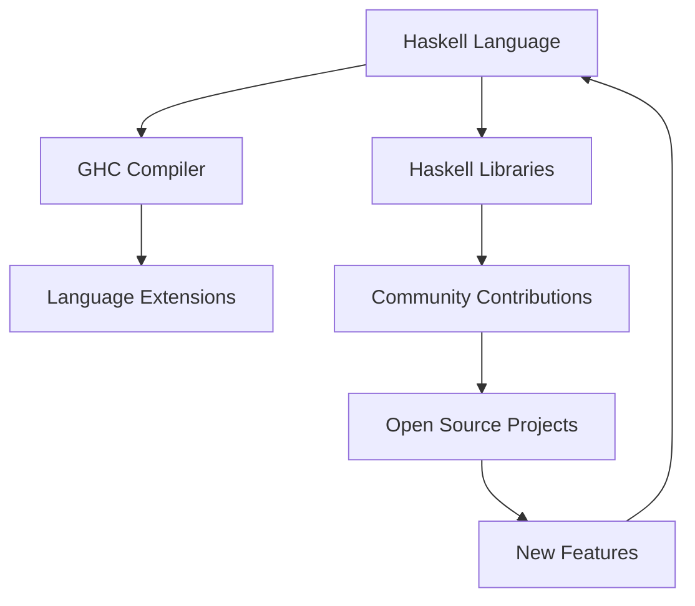

## 21.14 Staying Current with Haskell Features

In the rapidly evolving world of software development, staying current with the latest features and best practices is crucial for maintaining a competitive edge. This is especially true for Haskell, a language known for its rich type system, functional purity, and powerful abstractions. In this section, we will explore strategies and resources to help you stay updated with Haskell's evolving ecosystem.

### Continual Learning: The Key to Mastery

Continual learning is the cornerstone of expertise in any field. For Haskell developers, this means not only understanding the core language features but also keeping abreast of new libraries, tools, and paradigms that emerge over time. Let's delve into some effective strategies for continual learning.

#### 1. Engage with the Haskell Community

The Haskell community is vibrant and welcoming, offering numerous opportunities for learning and collaboration. Here are some ways to engage:

- **Mailing Lists and Forums**: Join Haskell mailing lists such as [Haskell-Cafe](https://mail.haskell.org/mailman/listinfo/haskell-cafe) to participate in discussions and ask questions.
- **Online Communities**: Platforms like [Reddit's Haskell Community](https://www.reddit.com/r/haskell/) and [Stack Overflow](https://stackoverflow.com/questions/tagged/haskell) are excellent for sharing knowledge and solving problems.
- **Conferences and Meetups**: Attend events like [Haskell Symposium](https://icfpconference.org/icfp2024/haskell.html) and local Haskell meetups to network with other developers and learn from experts.

#### 2. Leverage Online Resources

The internet is a treasure trove of information for Haskell developers. Here are some recommended resources:

- **Official Documentation**: The [Haskell.org](https://www.haskell.org/) website is the go-to source for official documentation and updates.
- **Blogs and Tutorials**: Follow blogs like [FP Complete](https://www.fpcomplete.com/blog/) and [Haskell for All](http://www.haskellforall.com/) for in-depth articles and tutorials.
- **Video Courses and Webinars**: Platforms like [Udemy](https://www.udemy.com/) and [Coursera](https://www.coursera.org/) offer courses on Haskell programming.

#### 3. Experiment with New Language Features

Haskell is known for its extensibility and the introduction of new language features. Regularly experimenting with these features can enhance your understanding and broaden your skill set.

- **Language Extensions**: Haskell's [GHC](https://www.haskell.org/ghc/) compiler supports numerous language extensions that can be enabled to experiment with new syntax and semantics.
- **Try It Yourself**: Modify existing codebases to incorporate new features and observe the impact on performance and readability.

```haskell
{-# LANGUAGE OverloadedStrings #-}

import Data.Text

-- Example of using OverloadedStrings extension
greet :: Text -> Text
greet name = "Hello, " <> name <> "!"

main :: IO ()
main = putStrLn $ unpack (greet "Haskell")
```

#### 4. Regularly Update Dependencies

Keeping your project's dependencies up-to-date ensures compatibility with the latest features and security patches.

- **Cabal and Stack**: Use tools like [Cabal](https://www.haskell.org/cabal/) and [Stack](https://docs.haskellstack.org/en/stable/README/) to manage dependencies and automate updates.
- **Version Constraints**: Specify version constraints in your project's configuration files to avoid breaking changes.

#### 5. Contribute to Open Source Projects

Contributing to open source projects is a great way to learn from others and give back to the community.

- **Find Projects**: Explore platforms like [GitHub](https://github.com/) and [GitLab](https://gitlab.com/) to find Haskell projects that interest you.
- **Submit Pull Requests**: Contribute code, documentation, or bug fixes to existing projects.

### Visualizing Haskell's Ecosystem

To better understand the interconnectedness of Haskell's ecosystem, let's visualize the relationships between various components using a Mermaid.js diagram.



**Diagram Description**: This diagram illustrates the cyclical nature of Haskell's ecosystem, where the language, compiler, libraries, and community contributions continuously influence and enhance each other.

### Knowledge Check

To reinforce your understanding, consider the following questions:

1. How can engaging with the Haskell community benefit your learning journey?
2. What are some effective strategies for experimenting with new language features?
3. Why is it important to regularly update your project's dependencies?

### Embrace the Journey

Remember, staying current with Haskell features is a journey, not a destination. As you explore new concepts and tools, you'll not only enhance your skills but also contribute to the growth of the Haskell community. Keep experimenting, stay curious, and enjoy the journey!

### Quiz: Staying Current with Haskell Features



### How can engaging with the Haskell community benefit your learning journey?

- [x] It provides opportunities for collaboration and knowledge sharing.
- [ ] It guarantees immediate solutions to all programming problems.
- [ ] It replaces the need for official documentation.
- [ ] It is only beneficial for beginners.

> **Explanation:** Engaging with the community allows for collaboration, knowledge sharing, and learning from others' experiences, which is invaluable for continual learning.

### What is a key benefit of experimenting with new Haskell language features?

- [x] It enhances understanding and broadens skill sets.
- [ ] It guarantees improved performance in all cases.
- [ ] It eliminates the need for testing.
- [ ] It is only useful for academic purposes.

> **Explanation:** Experimenting with new features helps developers understand their applications and potential benefits, thereby broadening their skill sets.

### Why is it important to regularly update your project's dependencies?

- [x] To ensure compatibility with the latest features and security patches.
- [ ] To increase the project's file size.
- [ ] To make the code more complex.
- [ ] To avoid using any new features.

> **Explanation:** Regular updates ensure that the project remains compatible with the latest features and security patches, maintaining its robustness and security.

### Which tool can be used to manage Haskell project dependencies?

- [x] Cabal
- [ ] Docker
- [ ] Jenkins
- [ ] Kubernetes

> **Explanation:** Cabal is a tool specifically designed for managing Haskell project dependencies and automating updates.

### What is a benefit of contributing to open source projects?

- [x] Learning from others and giving back to the community.
- [ ] Gaining complete control over the project.
- [ ] Avoiding collaboration with others.
- [ ] Ensuring that the project remains private.

> **Explanation:** Contributing to open source projects allows developers to learn from others, share their knowledge, and contribute to the community.

### What is the role of GHC in the Haskell ecosystem?

- [x] It is the compiler that supports language extensions.
- [ ] It is a version control system.
- [ ] It is a dependency management tool.
- [ ] It is a cloud hosting service.

> **Explanation:** GHC is the Glasgow Haskell Compiler, which supports various language extensions and is central to the Haskell ecosystem.

### How can you visualize the interconnectedness of Haskell's ecosystem?

- [x] Using diagrams like Mermaid.js
- [ ] By reading lengthy documentation
- [ ] By memorizing all library functions
- [ ] By avoiding community interaction

> **Explanation:** Diagrams like Mermaid.js help visualize complex relationships and structures, making it easier to understand the interconnectedness of Haskell's ecosystem.

### What is the purpose of specifying version constraints in project configuration files?

- [x] To avoid breaking changes when updating dependencies.
- [ ] To increase the project's complexity.
- [ ] To ensure all dependencies are outdated.
- [ ] To prevent any updates.

> **Explanation:** Specifying version constraints helps avoid breaking changes by ensuring that updates do not introduce incompatibilities.

### Which platform is recommended for finding Haskell open source projects?

- [x] GitHub
- [ ] LinkedIn
- [ ] Facebook
- [ ] Twitter

> **Explanation:** GitHub is a widely used platform for hosting and collaborating on open source projects, including those written in Haskell.

### True or False: Staying current with Haskell features is a journey, not a destination.

- [x] True
- [ ] False

> **Explanation:** Continual learning and adaptation are essential in the ever-evolving field of software development, making it a journey rather than a destination.



By following these strategies and engaging with the Haskell community, you'll be well-equipped to stay current with the latest features and advancements in the Haskell ecosystem.
