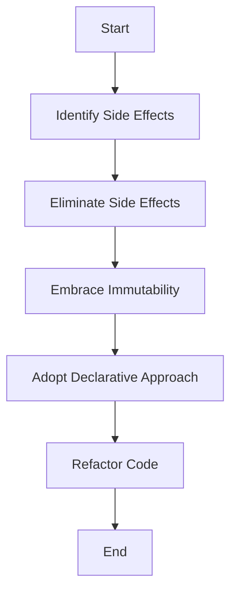

## 21.15 Embracing Functional Paradigms Fully

In the realm of software development, embracing functional paradigms is not merely a choice but a necessity for those seeking to harness the full potential of Haskell. This section delves into the core principles of functional programming, illustrating how they can be leveraged to create robust, maintainable, and efficient software systems. We will explore the practices of using pure functions, immutability, and declarative code, and examine the benefits these paradigms offer, such as easier reasoning about code and reduced side effects. Additionally, we will provide practical examples, including refactoring imperative-style code to a functional style, to demonstrate the transformative power of functional programming in Haskell.

### Understanding Functional Paradigms

Functional programming is a paradigm that treats computation as the evaluation of mathematical functions and avoids changing state or mutable data. It emphasizes the application of functions, in contrast to the imperative programming paradigm, which emphasizes changes in state.

#### Key Concepts

1. **Pure Functions**: Functions that have no side effects and return the same output given the same input.
2. **Immutability**: Data that cannot be changed once created, ensuring that functions do not alter the state.
3. **Declarative Code**: Code that expresses the logic of computation without describing its control flow.

### Practices for Embracing Functional Paradigms

#### Pure Functions

Pure functions are the cornerstone of functional programming. They are deterministic, meaning they always produce the same output for the same input, and they have no side effects, which makes them easier to test and reason about.

```haskell
-- A pure function that calculates the square of a number
square :: Int -> Int
square x = x * x
```

**Benefits**:
- **Predictability**: Pure functions are predictable and easier to debug.
- **Testability**: They can be tested in isolation without the need for complex setup.
- **Concurrency**: Pure functions can be executed in parallel without concerns about shared state.

#### Immutability

Immutability ensures that data structures cannot be altered after they are created. This leads to safer code, as it eliminates the possibility of unintended side effects.

```haskell
-- Using immutable data structures
let numbers = [1, 2, 3, 4, 5]
let newNumbers = map (*2) numbers
```

**Benefits**:
- **Safety**: Immutable data structures prevent accidental data modification.
- **Concurrency**: Immutability simplifies concurrent programming by avoiding race conditions.

#### Declarative Code

Declarative programming focuses on what the program should accomplish rather than how it should be done. This approach leads to more readable and maintainable code.

```haskell
-- Declarative style using list comprehension
evens = [x | x <- [1..10], even x]
```

**Benefits**:
- **Readability**: Declarative code is often more concise and easier to understand.
- **Maintainability**: It is easier to modify and extend declarative code.

### Refactoring Imperative-Style Code to Functional Style

Refactoring imperative code to a functional style involves identifying and eliminating side effects, embracing immutability, and adopting a declarative approach.

#### Imperative Example

```haskell
-- Imperative-style code to sum a list of numbers
sumList :: [Int] -> Int
sumList xs = go xs 0
  where
    go [] acc = acc
    go (x:xs) acc = go xs (acc + x)
```

#### Functional Refactoring

```haskell
-- Functional-style code using fold
sumList :: [Int] -> Int
sumList = foldl (+) 0
```

**Key Differences**:
- **State Management**: The functional version eliminates explicit state management.
- **Conciseness**: The functional version is more concise and expressive.

### Visualizing Functional Paradigms

To better understand the transition from imperative to functional paradigms, let's visualize the process using a flowchart.



**Diagram Description**: This flowchart illustrates the process of refactoring imperative-style code to a functional style by identifying and eliminating side effects, embracing immutability, and adopting a declarative approach.

### Haskell's Unique Features

Haskell offers several unique features that make it an ideal language for embracing functional paradigms:

- **Lazy Evaluation**: Haskell's lazy evaluation allows for efficient computation by only evaluating expressions when needed.
- **Strong Static Typing**: Haskell's type system catches errors at compile time, ensuring robust code.
- **Type Classes**: Haskell's type classes enable polymorphism and code reuse.

### Differences and Similarities with Other Paradigms

While functional programming shares some similarities with other paradigms, such as object-oriented programming, it also has distinct differences:

- **State Management**: Functional programming avoids mutable state, unlike object-oriented programming, which often relies on it.
- **Code Structure**: Functional programming emphasizes functions and immutability, whereas object-oriented programming focuses on objects and encapsulation.

### Design Considerations

When embracing functional paradigms, consider the following:

- **Performance**: While functional programming offers many benefits, it can sometimes lead to performance overhead due to immutability and recursion.
- **Learning Curve**: Transitioning to functional programming can be challenging for developers accustomed to imperative paradigms.

### Try It Yourself

Experiment with the provided code examples by modifying them to explore different functional programming concepts. For instance, try implementing a pure function that calculates the factorial of a number using recursion.

### References and Further Reading

- [Haskell Language Documentation](https://www.haskell.org/documentation/)
- [Functional Programming Principles](https://www.manning.com/books/functional-programming-in-scala)
- [Purely Functional Data Structures](https://www.cambridge.org/core/books/purely-functional-data-structures/)

### Knowledge Check

- What are the benefits of using pure functions in Haskell?
- How does immutability contribute to safer code?
- What is the difference between declarative and imperative programming?

### Embrace the Journey

Remember, embracing functional paradigms is a journey. As you progress, you'll discover new ways to leverage Haskell's strengths to build more robust and efficient software systems. Keep experimenting, stay curious, and enjoy the journey!

## Quiz: Embracing Functional Paradigms Fully



### What is a pure function in Haskell?

- [x] A function that returns the same output for the same input and has no side effects.
- [ ] A function that can modify global state.
- [ ] A function that depends on external variables.
- [ ] A function that performs I/O operations.

> **Explanation:** A pure function in Haskell is one that consistently returns the same output for the same input and does not cause any side effects.

### How does immutability benefit concurrent programming?

- [x] It prevents race conditions by ensuring data cannot be modified.
- [ ] It allows multiple threads to modify data simultaneously.
- [ ] It requires locking mechanisms to manage data access.
- [ ] It increases the complexity of managing shared state.

> **Explanation:** Immutability prevents race conditions in concurrent programming by ensuring that data cannot be modified, eliminating the need for complex locking mechanisms.

### What is the main advantage of declarative programming?

- [x] It focuses on what the program should accomplish, leading to more readable code.
- [ ] It requires detailed control flow management.
- [ ] It emphasizes state changes and mutable data.
- [ ] It is less efficient than imperative programming.

> **Explanation:** Declarative programming focuses on what the program should accomplish, making the code more readable and maintainable.

### Which Haskell feature allows for efficient computation by delaying evaluation until necessary?

- [x] Lazy Evaluation
- [ ] Strong Static Typing
- [ ] Type Classes
- [ ] Immutability

> **Explanation:** Lazy evaluation in Haskell allows for efficient computation by delaying the evaluation of expressions until their values are needed.

### What is a common challenge when transitioning to functional programming?

- [x] The learning curve for developers accustomed to imperative paradigms.
- [ ] The lack of support for immutability.
- [ ] The inability to perform I/O operations.
- [ ] The absence of a type system.

> **Explanation:** A common challenge when transitioning to functional programming is the learning curve for developers who are used to imperative paradigms.

### How can pure functions improve testability?

- [x] They can be tested in isolation without complex setup.
- [ ] They require extensive mocking of external dependencies.
- [ ] They depend on global state for their behavior.
- [ ] They are difficult to test due to side effects.

> **Explanation:** Pure functions improve testability because they can be tested in isolation without the need for complex setup or dependency mocking.

### What is the role of type classes in Haskell?

- [x] They enable polymorphism and code reuse.
- [ ] They enforce immutability in data structures.
- [ ] They provide lazy evaluation capabilities.
- [ ] They manage side effects in I/O operations.

> **Explanation:** Type classes in Haskell enable polymorphism and code reuse by allowing functions to operate on different types.

### Why is immutability important in functional programming?

- [x] It ensures data safety by preventing accidental modifications.
- [ ] It allows for mutable state management.
- [ ] It complicates concurrent programming.
- [ ] It reduces code readability.

> **Explanation:** Immutability is important in functional programming because it ensures data safety by preventing accidental modifications, leading to more robust code.

### What is a key difference between functional and object-oriented programming?

- [x] Functional programming avoids mutable state, while object-oriented programming often relies on it.
- [ ] Functional programming focuses on objects and encapsulation.
- [ ] Object-oriented programming emphasizes functions and immutability.
- [ ] Functional programming lacks a type system.

> **Explanation:** A key difference is that functional programming avoids mutable state, whereas object-oriented programming often relies on it for managing state.

### True or False: Functional programming in Haskell can lead to performance overhead due to immutability and recursion.

- [x] True
- [ ] False

> **Explanation:** True. While functional programming offers many benefits, it can sometimes lead to performance overhead due to immutability and recursion.


