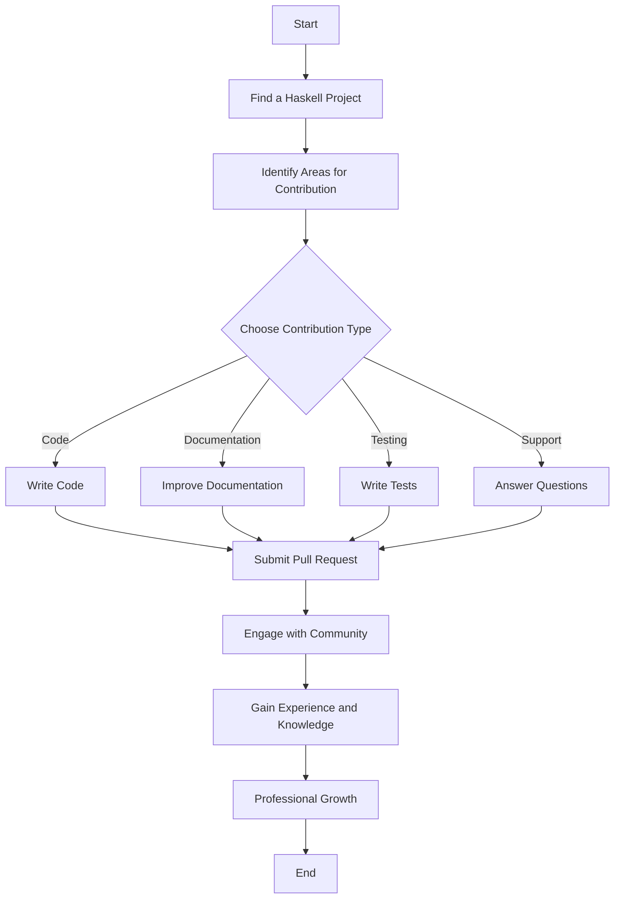

## 21.16 Collaboration and Community Involvement

In the world of software development, collaboration and community involvement are pivotal for both personal growth and the advancement of technology. This is especially true in the Haskell ecosystem, where the community plays a crucial role in shaping the language and its libraries. In this section, we will explore the various ways you can engage with the Haskell community, contribute to open-source projects, and leverage these interactions for professional growth.

### Community Engagement: Participating in the Haskell Community

Engaging with the Haskell community offers numerous benefits, from networking opportunities to knowledge sharing. Let's delve into how you can become an active participant in this vibrant community.

#### Contributions to Open-Source Projects

Contributing to open-source projects is one of the most effective ways to engage with the Haskell community. Here are some ways you can contribute:

- **Code Contributions**: Write code for existing projects. This could involve fixing bugs, adding new features, or improving performance.
- **Documentation**: Good documentation is crucial for any project. You can help by writing or improving documentation, making it easier for others to understand and use the project.
- **Testing and Bug Reporting**: Use the software and report any bugs you find. You can also write tests to ensure the software behaves as expected.
- **Community Support**: Help others by answering questions on forums, mailing lists, or platforms like Stack Overflow.

#### Benefits of Community Involvement

Engaging with the Haskell community can lead to numerous personal and professional benefits:

- **Networking**: Connect with other Haskell developers, which can lead to job opportunities, collaborations, and friendships.
- **Knowledge Sharing**: Learn from others and share your knowledge. This can lead to a deeper understanding of Haskell and software development in general.
- **Professional Growth**: Gain experience working on real-world projects, which can enhance your resume and career prospects.
- **Staying Updated**: Keep up with the latest developments in the Haskell ecosystem, including new libraries, tools, and best practices.

#### Resources for Community Engagement

There are numerous resources available for engaging with the Haskell community:

- **Haskell Forums**: Participate in discussions on forums such as the Haskell-Cafe mailing list or Reddit's Haskell community.
- **GitHub Repositories**: Explore and contribute to Haskell projects on GitHub. This is a great way to find projects that interest you and start contributing.
- **Stack Overflow**: Ask and answer questions related to Haskell. This is a valuable resource for both learning and helping others.
- **Meetups and Conferences**: Attend Haskell meetups and conferences to meet other developers in person and learn from experts in the field.

### Code Examples and Exercises

To illustrate the importance of community involvement, let's look at a simple example of contributing to an open-source Haskell project. Suppose you find a Haskell library on GitHub that you use frequently, but it lacks comprehensive documentation.

```haskell
-- Example of a simple Haskell function that could use better documentation
-- This function calculates the factorial of a number using recursion.
factorial :: Integer -> Integer
factorial 0 = 1
factorial n = n * factorial (n - 1)
```

**Task**: Improve the documentation for this function.

**Solution**: You could add comments explaining what the function does, its parameters, and its return value.

```haskell
-- | Calculate the factorial of a non-negative integer.
-- The factorial of a number n is the product of all positive integers less than or equal to n.
-- For example, factorial 5 = 5 * 4 * 3 * 2 * 1 = 120.
-- 
-- ==== __Examples__
--
-- >>> factorial 5
-- 120
--
-- >>> factorial 0
-- 1
--
-- @param n A non-negative integer.
-- @return The factorial of n.
factorial :: Integer -> Integer
factorial 0 = 1
factorial n = n * factorial (n - 1)
```

**Try It Yourself**: Find a Haskell project on GitHub that you use and see if you can improve its documentation or add a new feature.

### Visualizing Community Involvement

To better understand how community involvement can benefit you and the Haskell ecosystem, let's visualize the process using a flowchart.



**Diagram Description**: This flowchart illustrates the process of contributing to a Haskell project, from finding a project to gaining professional growth through community engagement.

### Knowledge Check

Let's test your understanding of community involvement in Haskell with a few questions:

1. What are some ways you can contribute to open-source Haskell projects?
2. How can community involvement benefit your professional growth?
3. What resources are available for engaging with the Haskell community?

### Embrace the Journey

Remember, getting involved in the Haskell community is a journey. Start small, perhaps by improving documentation or fixing a minor bug, and gradually take on more significant contributions. As you engage with the community, you'll build valuable skills, make meaningful connections, and contribute to the growth of the Haskell ecosystem. Keep experimenting, stay curious, and enjoy the journey!

### Quiz: Collaboration and Community Involvement



### What is one way to contribute to an open-source Haskell project?

- [x] Improve documentation
- [ ] Ignore issues
- [ ] Avoid testing
- [ ] Keep code changes private

> **Explanation:** Improving documentation is a valuable contribution to open-source projects, making them more accessible to others.


### How can community involvement benefit your career?

- [x] Networking opportunities
- [ ] Isolation from peers
- [ ] Lack of learning
- [ ] Decreased job prospects

> **Explanation:** Community involvement provides networking opportunities, which can lead to job prospects and collaborations.


### Which platform is NOT mentioned as a resource for engaging with the Haskell community?

- [ ] GitHub
- [ ] Stack Overflow
- [ ] Haskell Forums
- [x] LinkedIn

> **Explanation:** LinkedIn is not mentioned as a resource in this context; the focus is on GitHub, Stack Overflow, and Haskell Forums.


### What is a benefit of contributing to open-source projects?

- [x] Gaining real-world experience
- [ ] Keeping skills stagnant
- [ ] Avoiding collaboration
- [ ] Limiting knowledge

> **Explanation:** Contributing to open-source projects allows you to gain real-world experience and improve your skills.


### What should you do if you find a bug in a Haskell project?

- [x] Report the bug
- [ ] Ignore it
- [ ] Keep it secret
- [ ] Use it to your advantage

> **Explanation:** Reporting bugs helps improve the project and is a valuable contribution.


### What is a good starting point for contributing to a Haskell project?

- [x] Improving documentation
- [ ] Rewriting the entire codebase
- [ ] Ignoring existing issues
- [ ] Avoiding communication with maintainers

> **Explanation:** Improving documentation is a manageable starting point for new contributors.


### How can you stay updated with the latest developments in Haskell?

- [x] Participate in forums and discussions
- [ ] Avoid community events
- [ ] Ignore new libraries
- [ ] Stay isolated

> **Explanation:** Participating in forums and discussions helps you stay updated with the latest developments.


### What is a key benefit of attending Haskell meetups?

- [x] Meeting other developers
- [ ] Avoiding new connections
- [ ] Keeping knowledge to yourself
- [ ] Decreasing collaboration

> **Explanation:** Attending meetups allows you to meet other developers and expand your network.


### What is the first step in contributing to a Haskell project?

- [x] Find a project that interests you
- [ ] Submit a pull request immediately
- [ ] Ignore the project's guidelines
- [ ] Avoid reading the documentation

> **Explanation:** The first step is to find a project that interests you and aligns with your skills.


### True or False: Community involvement can lead to professional growth.

- [x] True
- [ ] False

> **Explanation:** Community involvement can lead to professional growth through networking, learning, and gaining experience.



By actively engaging with the Haskell community, you not only contribute to the growth of the ecosystem but also enhance your own skills and career prospects. Embrace the opportunities for collaboration and community involvement, and you'll find yourself on a rewarding path of continuous learning and development.
