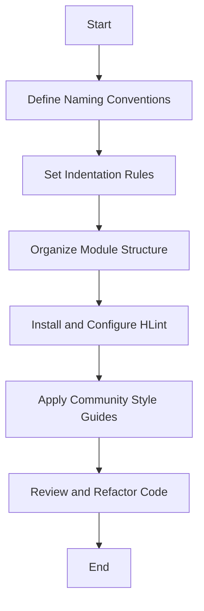

## 21.17 Code Style Guidelines (e.g., HLint)

In the realm of software development, especially in functional programming with Haskell, maintaining a consistent code style is paramount. It not only enhances readability and maintainability but also fosters collaboration among developers. This section delves into the intricacies of Haskell code style guidelines, emphasizing the role of tools like HLint in achieving code consistency.

### Consistency in Code Style

Consistency in code style is crucial for several reasons. It reduces cognitive load, making it easier for developers to understand and navigate codebases. It also minimizes errors and facilitates easier code reviews and maintenance. Let's explore some key guidelines to achieve consistency in Haskell code.

#### Naming Conventions

Adopting a consistent naming convention is the first step towards a readable codebase. In Haskell, the following conventions are widely accepted:

- **Functions and Variables**: Use camelCase for naming functions and variables. For example, `calculateSum`, `userName`.
- **Types and Constructors**: Use PascalCase for naming types and constructors. For example, `UserProfile`, `OrderStatus`.
- **Modules**: Use PascalCase for module names, reflecting the directory structure. For example, `Data.List`, `Network.HTTP`.

#### Indentation and Formatting

Proper indentation and formatting are essential for readability. Haskell's syntax relies heavily on indentation, making it crucial to follow these guidelines:

- **Indentation**: Use spaces instead of tabs, typically two or four spaces per indentation level.
- **Line Length**: Limit lines to 80 characters to enhance readability across different devices and editors.
- **Alignment**: Align related code elements vertically to improve visual structure.

#### Module Structure

Organizing modules effectively is key to maintaining a clean codebase. Consider the following practices:

- **Exports**: Explicitly list exported functions and types to control module interfaces.
- **Imports**: Group imports logically, separating standard library imports from third-party and local imports.
- **Documentation**: Include module-level documentation to describe the purpose and usage of the module.

### Tools for Code Style: HLint

HLint is a powerful tool for suggesting improvements to Haskell code. It analyzes code for potential issues and provides style suggestions, helping developers adhere to best practices.

#### Installing HLint

To install HLint, use the following command:

```bash
cabal update
cabal install hlint
```

Alternatively, if you're using Stack:

```bash
stack install hlint
```

#### Running HLint

Once installed, you can run HLint on your Haskell files or projects:

```bash
hlint src/
```

This command will analyze all Haskell files in the `src` directory and provide suggestions for improvements.

#### Customizing HLint

HLint can be customized to suit your project's specific style guidelines. Create an `.hlint.yaml` file in your project root to override default settings:

```yaml
- ignore: {name: "Use camelCase"}
- warn: {name: "Use let"}
```

This configuration ignores suggestions for camelCase and adds a warning for using `let`.

### Implementation of Community-Accepted Style Guides

Applying community-accepted style guides ensures that your code aligns with industry standards. The [Haskell Style Guide](https://github.com/tibbe/haskell-style-guide) is a widely recognized resource that provides comprehensive guidelines for Haskell code.

#### Key Recommendations

- **Use of Language Extensions**: Enable language extensions explicitly in the source file using `{-# LANGUAGE ... #-}` pragmas.
- **Type Annotations**: Provide type annotations for top-level functions to improve code clarity and facilitate type inference.
- **Avoiding Partial Functions**: Avoid using partial functions like `head` and `tail` without checks. Use safe alternatives like `headMay` from the `safe` package.

### Code Examples

Let's explore some code examples that demonstrate these guidelines in action.

#### Example 1: Naming Conventions

```haskell
-- Define a data type using PascalCase
data UserProfile = UserProfile
  { userName :: String  -- Use camelCase for fields
  , userAge  :: Int
  }

-- Define a function using camelCase
calculateAge :: UserProfile -> Int
calculateAge profile = userAge profile
```

#### Example 2: Indentation and Formatting

```haskell
-- Proper indentation and alignment
sumList :: [Int] -> Int
sumList xs = sum xs

-- Aligning related elements
addNumbers :: Int -> Int -> Int
addNumbers x y =
  let result = x + y
  in result
```

#### Example 3: Module Structure

```haskell
-- Module declaration with explicit exports
module Data.UserProfile
  ( UserProfile(..)
  , calculateAge
  ) where

-- Importing standard and third-party libraries
import Data.List (sort)
import Control.Monad (when)
```

### Visualizing Code Style Guidelines

To better understand the flow of code style guidelines, let's visualize the process of applying these practices using a flowchart.



This flowchart illustrates the sequential steps involved in implementing code style guidelines in a Haskell project.

### References

For further reading and resources, consider the following:

- [Haskell Style Guide](https://github.com/tibbe/haskell-style-guide): A comprehensive guide to Haskell coding standards.
- [HLint Documentation](https://github.com/ndmitchell/hlint): Official documentation for HLint, including installation and configuration details.
- [Safe Haskell](https://hackage.haskell.org/package/safe): A package providing safe alternatives to partial functions.

### Knowledge Check

To reinforce your understanding of Haskell code style guidelines, consider the following questions:

1. Why is consistency in code style important in Haskell development?
2. What are the recommended naming conventions for functions and types in Haskell?
3. How can HLint be customized to fit specific project needs?
4. What are some common pitfalls to avoid when formatting Haskell code?

### Embrace the Journey

Remember, mastering code style guidelines is an ongoing journey. As you continue to develop in Haskell, keep refining your style and exploring new tools and techniques. Stay curious, collaborate with others, and enjoy the process of writing clean, maintainable code.

## Quiz: Code Style Guidelines (e.g., HLint)



### What is the primary benefit of maintaining a consistent code style in Haskell?

- [x] Enhances readability and maintainability
- [ ] Increases code execution speed
- [ ] Reduces memory usage
- [ ] Improves network performance

> **Explanation:** Consistent code style improves readability and maintainability, making it easier for developers to understand and work with the code.

### Which naming convention is recommended for Haskell functions?

- [x] camelCase
- [ ] snake_case
- [ ] kebab-case
- [ ] PascalCase

> **Explanation:** Haskell functions typically use camelCase for naming, which is a widely accepted convention.

### What tool is commonly used for suggesting style improvements in Haskell code?

- [x] HLint
- [ ] GHC
- [ ] Stack
- [ ] Cabal

> **Explanation:** HLint is a tool specifically designed to analyze Haskell code and suggest style improvements.

### How can you customize HLint's behavior for a specific project?

- [x] By creating an `.hlint.yaml` file
- [ ] By modifying the Haskell source code
- [ ] By changing the GHC settings
- [ ] By using a different IDE

> **Explanation:** An `.hlint.yaml` file allows you to customize HLint's behavior for a specific project.

### What is the recommended line length for Haskell code to enhance readability?

- [x] 80 characters
- [ ] 120 characters
- [ ] 60 characters
- [ ] 100 characters

> **Explanation:** Limiting lines to 80 characters is a common practice to enhance readability across different devices and editors.

### Which of the following is a partial function that should be avoided in Haskell?

- [x] head
- [ ] map
- [ ] filter
- [ ] foldr

> **Explanation:** `head` is a partial function that can cause runtime errors if used on an empty list, so it should be avoided or used with caution.

### What is the purpose of providing type annotations for top-level functions?

- [x] To improve code clarity and facilitate type inference
- [ ] To increase execution speed
- [ ] To reduce memory usage
- [ ] To enhance network performance

> **Explanation:** Type annotations improve code clarity and help the compiler with type inference, making the code more understandable.

### Which module structure practice is recommended for controlling module interfaces?

- [x] Explicitly listing exported functions and types
- [ ] Importing all functions from other modules
- [ ] Using wildcard imports
- [ ] Avoiding module documentation

> **Explanation:** Explicitly listing exported functions and types helps control module interfaces and improves code maintainability.

### True or False: HLint can only be used with Cabal projects.

- [ ] True
- [x] False

> **Explanation:** HLint can be used with both Cabal and Stack projects, making it versatile for different Haskell setups.

### What is the primary focus of the Haskell Style Guide?

- [x] Providing comprehensive guidelines for Haskell coding standards
- [ ] Offering performance optimization techniques
- [ ] Teaching Haskell syntax
- [ ] Explaining Haskell's type system

> **Explanation:** The Haskell Style Guide provides comprehensive guidelines for coding standards, helping developers maintain consistency and quality in their code.


