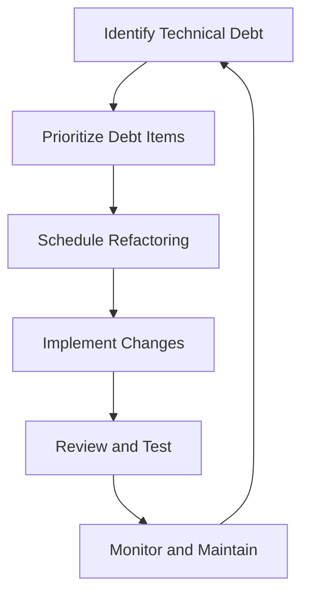

## 21.18 Handling Technical Debt

Technical debt is an inevitable aspect of software development, often arising from the trade-offs between short-term delivery pressures and long-term code maintainability. In Haskell, a language known for its strong type system and functional purity, managing technical debt requires a nuanced approach that leverages the language's unique features. This section delves into the concept of technical debt, strategies for identifying and managing it, and how to apply Haskell-specific techniques to mitigate its impact.

### Understanding Technical Debt

**Technical Debt Concept**: Technical debt refers to the implied cost of additional rework caused by choosing an easy solution now instead of using a better approach that would take longer. It is akin to financial debt, where interest accumulates over time, leading to increased costs if not addressed.

#### Types of Technical Debt

1. **Deliberate Debt**: This is incurred consciously, often due to time constraints or strategic decisions. It involves knowingly taking shortcuts with a plan to address them later.
2. **Accidental Debt**: This arises unintentionally, often due to lack of knowledge or oversight. It can result from poor design choices or inadequate understanding of the problem domain.
3. **Bit Rot**: Over time, codebases can degrade due to changes in requirements, dependencies, or technology, leading to increased maintenance costs.

### Identifying Technical Debt

**Identification**: Recognizing technical debt is crucial for managing it effectively. Here are some indicators:

- **Code Smells**: These are symptoms of deeper problems in the codebase, such as duplicated code, long methods, or large classes.
- **Complexity**: High cyclomatic complexity or deeply nested logic can indicate potential debt.
- **Lack of Tests**: Insufficient test coverage can lead to fragile code that is difficult to change.
- **Outdated Documentation**: When documentation does not match the code, it can signal underlying issues.

#### Tools and Techniques for Identification

- **Static Analysis Tools**: Use tools like HLint to identify code smells and potential issues in Haskell code.
- **Code Reviews**: Regular peer reviews can help catch debt early and ensure adherence to best practices.
- **Technical Debt Backlog**: Maintain a backlog of known debt items to prioritize and address them systematically.

### Managing Technical Debt

**Management Strategies**: Effective management of technical debt involves balancing immediate needs with long-term goals. Here are some strategies:

1. **Regular Refactoring**: Continuously improve the codebase by refactoring to reduce complexity and improve readability.
2. **Code Reviews**: Implement regular code reviews to ensure quality and catch potential debt early.
3. **Prioritization**: Use a risk-based approach to prioritize debt items based on their impact on the project.
4. **Automated Testing**: Increase test coverage to ensure that changes do not introduce new issues.

#### Example: Prioritizing Code Cleanup Tasks

Consider a Haskell project with several modules that have accumulated technical debt. Prioritize cleanup tasks by:

- **Assessing Impact**: Determine which modules are most critical to the application's functionality and focus on those first.
- **Estimating Effort**: Evaluate the effort required to address each debt item and balance it against the potential benefits.
- **Scheduling Regular Maintenance**: Allocate time in each development cycle for addressing technical debt, ensuring it does not accumulate unchecked.

### Haskell-Specific Techniques for Managing Technical Debt

Haskell's features can be leveraged to manage technical debt effectively:

#### Leveraging Strong Typing

- **Type Safety**: Use Haskell's strong type system to catch errors at compile time, reducing runtime issues and potential debt.
- **Type-Driven Development**: Design your system around types, ensuring that the code is more robust and easier to maintain.

#### Functional Purity

- **Immutability**: Embrace immutability to prevent side effects and make the codebase easier to reason about.
- **Pure Functions**: Use pure functions to ensure that code is predictable and testable, reducing the likelihood of debt.

#### Advanced Haskell Features

- **Monads and Functors**: Use monads and functors to encapsulate side effects and manage state changes cleanly.
- **Lenses and Optics**: Apply lenses and optics to manage complex data structures without introducing unnecessary complexity.

### Code Example: Refactoring with Lenses

Let's explore how lenses can be used to refactor a Haskell codebase, reducing technical debt by improving data access patterns.

```haskell
{-# LANGUAGE TemplateHaskell #-}

import Control.Lens

-- Define a data structure
data User = User
  { _userId :: Int
  , _userName :: String
  , _userEmail :: String
  } deriving (Show)

-- Generate lenses for the User data structure
makeLenses ''User

-- Example function to update a user's email
updateEmail :: User -> String -> User
updateEmail user newEmail = user & userEmail .~ newEmail

main :: IO ()
main = do
  let user = User 1 "Alice" "alice@example.com"
  print $ updateEmail user "alice@newdomain.com"
```

In this example, we use lenses to update the `userEmail` field of a `User` data structure. This approach simplifies data manipulation and reduces the risk of introducing errors, thereby managing technical debt effectively.

### Visualizing Technical Debt Management

Below is a diagram illustrating the process of identifying, prioritizing, and addressing technical debt in a Haskell project.



This flowchart represents a continuous cycle of managing technical debt, ensuring that it is addressed systematically and does not hinder project progress.

### Knowledge Check

- **Question**: What are some indicators of technical debt in a codebase?
- **Challenge**: Refactor a piece of Haskell code using lenses to improve data access patterns.

### Embrace the Journey

Remember, managing technical debt is an ongoing process. As you progress in your Haskell projects, continue to apply these strategies and techniques to maintain a clean, efficient codebase. Keep experimenting, stay curious, and enjoy the journey of mastering Haskell design patterns!

### References and Further Reading

- [Martin Fowler's Technical Debt Quadrant](https://martinfowler.com/bliki/TechnicalDebtQuadrant.html)
- [HLint: Haskell Linter](https://github.com/ndmitchell/hlint)
- [Refactoring: Improving the Design of Existing Code](https://www.amazon.com/Refactoring-Improving-Design-Existing-Code/dp/0201485672)

## Quiz: Handling Technical Debt



### What is technical debt?

- [x] The implied cost of additional rework caused by choosing an easy solution now instead of using a better approach that would take longer.
- [ ] The financial cost of developing software.
- [ ] The time taken to write documentation.
- [ ] The effort required to learn a new programming language.

> **Explanation:** Technical debt refers to the future cost of rework due to taking shortcuts in the present.

### Which of the following is a type of technical debt?

- [x] Deliberate Debt
- [x] Accidental Debt
- [ ] Financial Debt
- [ ] Emotional Debt

> **Explanation:** Deliberate and accidental debts are types of technical debt, while financial and emotional debts are unrelated.

### What is a common tool for identifying code smells in Haskell?

- [x] HLint
- [ ] GHC
- [ ] Cabal
- [ ] Stack

> **Explanation:** HLint is a tool used to identify code smells and potential issues in Haskell code.

### Which Haskell feature can help manage state changes cleanly?

- [x] Monads
- [ ] Lists
- [ ] Arrays
- [ ] Strings

> **Explanation:** Monads are used to encapsulate side effects and manage state changes in Haskell.

### What is the benefit of using lenses in Haskell?

- [x] Simplifies data manipulation
- [x] Reduces the risk of introducing errors
- [ ] Increases code complexity
- [ ] Decreases code readability

> **Explanation:** Lenses simplify data manipulation and reduce the risk of errors, making code more maintainable.

### What is a key strategy for managing technical debt?

- [x] Regular Refactoring
- [ ] Ignoring it
- [ ] Adding more features
- [ ] Removing tests

> **Explanation:** Regular refactoring is essential for managing technical debt effectively.

### What is the role of code reviews in managing technical debt?

- [x] Ensuring quality and catching potential debt early
- [ ] Increasing development speed
- [ ] Reducing the number of developers needed
- [ ] Eliminating the need for testing

> **Explanation:** Code reviews help ensure quality and catch potential debt early in the development process.

### How can Haskell's strong type system help manage technical debt?

- [x] By catching errors at compile time
- [ ] By increasing runtime errors
- [ ] By making code harder to read
- [ ] By reducing code performance

> **Explanation:** Haskell's strong type system helps catch errors at compile time, reducing runtime issues and potential debt.

### What is the purpose of a technical debt backlog?

- [x] To prioritize and address debt items systematically
- [ ] To ignore debt items
- [ ] To increase the amount of debt
- [ ] To reduce the number of developers

> **Explanation:** A technical debt backlog helps prioritize and address debt items systematically.

### True or False: Technical debt is only a concern for large projects.

- [ ] True
- [x] False

> **Explanation:** Technical debt can affect projects of any size, not just large ones.


