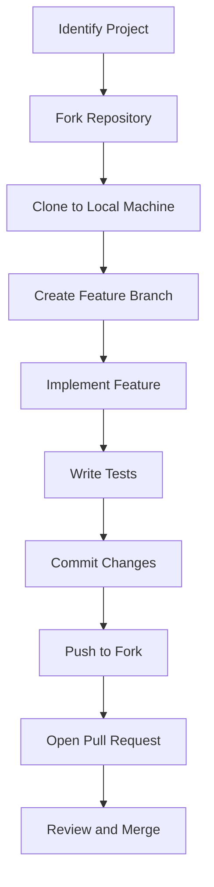

## 21.19 Licensing and Open Source Contributions

In the world of software development, particularly in the Haskell ecosystem, understanding licensing and contributing to open source projects are crucial skills for expert software engineers and architects. This section will guide you through the complexities of software licensing, best practices for open source contributions, and how these elements can enhance your Haskell projects.

### Understanding Licensing

Licensing is a legal framework that governs how software can be used, modified, and distributed. As a Haskell developer, it's essential to comprehend the implications of different licenses to ensure compliance and protect your work.

#### Common Licenses

1. **MIT License**: A permissive license that allows for reuse within proprietary software, provided that all copies include the original license terms. It's simple and has high compatibility with other licenses.

2. **Apache 2.0 License**: Similar to the MIT License but includes an explicit grant of patent rights from contributors to users. It also provides an express grant of patent rights from contributors to users.

3. **GNU General Public License (GPL)**: A copyleft license that requires derived works to be open-sourced under the same license. It ensures that the software remains free and open.

#### Choosing the Right License

When selecting a license for your Haskell project, consider the following:

- **Project Goals**: Determine whether you want your project to remain open source or if you allow proprietary use.
- **Compatibility**: Ensure compatibility with the licenses of your project's dependencies.
- **Community Norms**: Align with the licensing norms of the Haskell community to facilitate collaboration.

### Best Practices for Licensing

1. **Clearly Document License Terms**: Include a `LICENSE` file in your repository with the full text of the chosen license. This transparency helps users understand their rights and obligations.

2. **Respect Dependency Licenses**: When using third-party libraries, ensure that your use complies with their license terms. This respect fosters a healthy open source ecosystem.

3. **Regularly Review Licenses**: As your project evolves, periodically review your licensing strategy to ensure it still aligns with your goals and legal requirements.

### Open Source Contributions

Contributing to open source projects is a rewarding way to enhance your skills, collaborate with others, and give back to the community. Here are some guidelines to make effective contributions.

#### Finding Projects to Contribute To

- **Interest and Expertise**: Choose projects that align with your interests and expertise. This alignment will keep you motivated and allow you to make meaningful contributions.
- **Community Engagement**: Look for projects with active communities. Engaging with other contributors can provide valuable learning opportunities and support.

#### Making Contributions

1. **Understand the Project**: Before contributing, take the time to understand the project's goals, codebase, and contribution guidelines. This understanding will help you make relevant and valuable contributions.

2. **Communicate Effectively**: Use clear and respectful communication when interacting with project maintainers and other contributors. Good communication fosters collaboration and helps resolve issues efficiently.

3. **Follow Contribution Guidelines**: Adhere to the project's contribution guidelines, which typically include coding standards, testing requirements, and documentation practices.

4. **Submit Quality Code**: Ensure that your contributions are well-tested, documented, and adhere to the project's coding standards. Quality contributions are more likely to be accepted and appreciated.

### Code Example: Adding a Feature to an Open Source Haskell Project

Let's walk through a simple example of contributing a new feature to an open source Haskell project.

```haskell
-- Suppose we are contributing to a Haskell library that provides basic arithmetic operations.
-- We want to add a new function for calculating the factorial of a number.

-- Step 1: Fork the repository and clone it to your local machine.

-- Step 2: Create a new branch for your feature.
-- git checkout -b add-factorial-function

-- Step 3: Implement the new feature in the appropriate module.
module Arithmetic (factorial) where

-- | Calculate the factorial of a non-negative integer.
-- The factorial of n is the product of all positive integers less than or equal to n.
factorial :: Integer -> Integer
factorial n
  | n < 0     = error "Factorial is not defined for negative numbers"
  | n == 0    = 1
  | otherwise = n * factorial (n - 1)

-- Step 4: Write tests for your new function.
-- In the test suite, add cases to verify the correctness of the factorial function.

-- Step 5: Commit your changes with a descriptive message.
-- git commit -m "Add factorial function to Arithmetic module"

-- Step 6: Push your branch to your forked repository.
-- git push origin add-factorial-function

-- Step 7: Open a pull request to the original repository.
-- Provide a clear description of your changes and any relevant context.
```

### Visualizing the Contribution Process

Below is a diagram illustrating the typical workflow for contributing to an open source project.



**Diagram Description**: This flowchart represents the steps involved in contributing to an open source project, from identifying a project to merging your changes.

### Resources for Licensing and Contributions

- [Choose an Open Source License](https://choosealicense.com/): A helpful resource for selecting the right license for your project.
- [Open Source Guides](https://opensource.guide/): Comprehensive guides on how to contribute to open source projects.
- [Haskell Community](https://www.haskell.org/community/): Engage with the Haskell community to find projects and collaborators.

### Knowledge Check

- **Question**: What are the key differences between the MIT and GPL licenses?
- **Challenge**: Fork a Haskell project on GitHub and add a small feature or fix a bug. Document your process and submit a pull request.

### Embrace the Journey

Remember, contributing to open source is not just about writing code. It's about collaboration, learning, and growing as a developer. As you engage with the community, you'll gain insights and skills that will enhance your Haskell projects and professional development. Keep experimenting, stay curious, and enjoy the journey!

## Quiz: Licensing and Open Source Contributions



### Which license is known for its permissive nature, allowing reuse within proprietary software?

- [x] MIT License
- [ ] GPL License
- [ ] Apache 2.0 License
- [ ] Creative Commons License

> **Explanation:** The MIT License is known for its permissive nature, allowing reuse within proprietary software, provided the original license terms are included.

### What is a key feature of the Apache 2.0 License?

- [x] Explicit grant of patent rights
- [ ] Requirement to open source derived works
- [ ] Restriction on commercial use
- [ ] No attribution required

> **Explanation:** The Apache 2.0 License includes an explicit grant of patent rights from contributors to users, which is a key feature.

### What should you include in your repository to clearly document license terms?

- [x] LICENSE file
- [ ] README file
- [ ] CONTRIBUTING file
- [ ] CHANGELOG file

> **Explanation:** Including a LICENSE file in your repository helps clearly document the license terms for users.

### What is an important consideration when choosing a license for your project?

- [x] Compatibility with dependencies
- [ ] Popularity of the license
- [ ] Length of the license text
- [ ] Number of contributors

> **Explanation:** Ensuring compatibility with the licenses of your project's dependencies is crucial when choosing a license.

### What is a recommended practice when contributing to open source projects?

- [x] Follow contribution guidelines
- [ ] Ignore existing codebase
- [ ] Submit code without testing
- [ ] Avoid communication with maintainers

> **Explanation:** Following contribution guidelines is a recommended practice to ensure your contributions align with the project's standards.

### What is the first step in contributing to an open source project?

- [x] Identify a project to contribute to
- [ ] Write code immediately
- [ ] Open a pull request
- [ ] Delete the repository

> **Explanation:** The first step is to identify a project to contribute to, ensuring it aligns with your interests and expertise.

### What is a benefit of contributing to open source projects?

- [x] Enhancing skills and collaboration
- [ ] Gaining financial rewards
- [ ] Avoiding community engagement
- [ ] Working in isolation

> **Explanation:** Contributing to open source projects enhances skills and collaboration, providing valuable learning opportunities.

### What should you do before submitting a pull request?

- [x] Write tests for your changes
- [ ] Delete your branch
- [ ] Ignore feedback from others
- [ ] Skip documentation

> **Explanation:** Writing tests for your changes ensures they are well-tested and more likely to be accepted.

### What is the purpose of a pull request?

- [x] To propose changes to a project
- [ ] To delete a repository
- [ ] To ignore contribution guidelines
- [ ] To bypass code review

> **Explanation:** A pull request is used to propose changes to a project, allowing maintainers to review and merge them.

### True or False: Licensing is only important for proprietary software.

- [ ] True
- [x] False

> **Explanation:** Licensing is important for both open source and proprietary software to ensure legal compliance and protect intellectual property.


