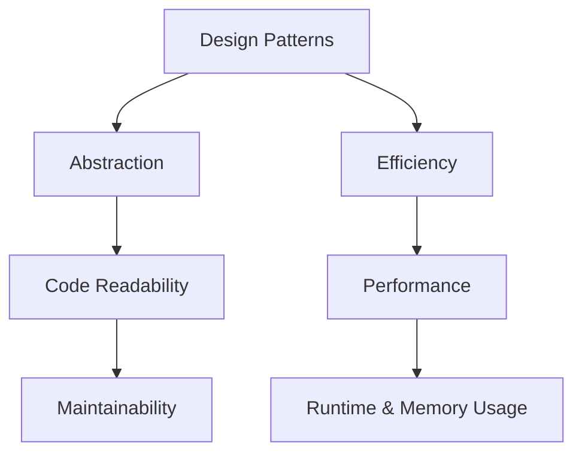

## 21.2 Assessing Patterns' Impact on Performance

In the realm of software development, performance is a critical factor that can make or break an application. As expert software engineers and architects, understanding how design patterns impact performance in Haskell is essential. This section delves into the performance considerations of using design patterns in Haskell, providing insights into analysis techniques, trade-offs, and practical examples.

### Performance Considerations

Design patterns offer a structured approach to solving common software design problems. However, they can also introduce performance overheads if not used judiciously. In Haskell, a language known for its strong emphasis on functional programming and type safety, assessing the performance impact of design patterns involves understanding both runtime and memory usage.

#### Evaluating Runtime and Memory Usage

1. **Runtime Performance**: This refers to the time it takes for a program to execute. In Haskell, lazy evaluation can sometimes lead to unexpected performance bottlenecks if not managed properly. Understanding how patterns influence evaluation order and execution time is crucial.

2. **Memory Usage**: Haskell's immutability and persistent data structures can lead to increased memory consumption. Patterns that involve complex data transformations or large data structures need careful consideration to avoid excessive memory usage.

### Analysis Techniques

To effectively assess the impact of design patterns on performance, we must employ robust analysis techniques. Here are some key methods:

#### Profiling Code with GHC Tools

The Glasgow Haskell Compiler (GHC) provides powerful profiling tools that help identify performance bottlenecks in Haskell programs. Profiling involves measuring various aspects of program execution, such as time spent in functions and memory allocation.

- **GHC Profiler**: Use the GHC profiler to gather detailed information about your program's execution. It provides insights into which functions consume the most time and memory, allowing you to pinpoint areas for optimization.

- **Heap Profiling**: This technique helps analyze memory usage patterns. By understanding how memory is allocated and retained, you can identify potential memory leaks or inefficiencies.

```haskell
-- Example: Profiling a simple Haskell function
import System.CPUTime

factorial :: Integer -> Integer
factorial 0 = 1
factorial n = n * factorial (n - 1)

main :: IO ()
main = do
    start <- getCPUTime
    print (factorial 20)
    end <- getCPUTime
    print ("Execution time: " ++ show (end - start) ++ " picoseconds")
```

#### Benchmarking Critical Sections

Benchmarking involves measuring the performance of specific code sections to understand their impact on overall application performance. In Haskell, the `criterion` library is widely used for benchmarking.

- **Criterion Library**: Use this library to perform detailed benchmarking of Haskell functions. It provides statistical analysis of execution times, helping you make informed decisions about performance trade-offs.

```haskell
-- Example: Benchmarking a Haskell function using Criterion
import Criterion.Main

fib :: Int -> Int
fib 0 = 0
fib 1 = 1
fib n = fib (n - 1) + fib (n - 2)

main :: IO ()
main = defaultMain [
    bgroup "fib" [ bench "10" $ whnf fib 10
                 , bench "20" $ whnf fib 20
                 , bench "30" $ whnf fib 30
                 ]
    ]
```

### Trade-Offs

Design patterns often involve trade-offs between abstraction and efficiency. While patterns can enhance code readability and maintainability, they may introduce performance overheads. Understanding these trade-offs is crucial for making informed design decisions.

#### Balancing Abstraction with Efficiency

1. **Abstraction**: Design patterns promote abstraction, making code more modular and easier to understand. However, excessive abstraction can lead to performance issues, especially in performance-critical applications.

2. **Efficiency**: In some cases, optimizing for performance may require sacrificing some level of abstraction. This involves writing more specialized code that is tightly coupled to the problem domain.

### Example: Understanding the Overhead of Monad Transformers

Monad transformers are a powerful tool in Haskell for composing monadic effects. However, they can introduce performance overhead due to the additional layers of abstraction.

#### Monad Transformers in Large Monadic Stacks

When using monad transformers, each layer in the stack adds a level of indirection. This can lead to increased runtime and memory usage, especially in deep stacks.

```haskell
-- Example: Using Monad Transformers
import Control.Monad.Trans.Class
import Control.Monad.Trans.Reader
import Control.Monad.Trans.State

type App = ReaderT String (StateT Int IO)

runApp :: App ()
runApp = do
    env <- ask
    liftIO $ putStrLn ("Environment: " ++ env)
    modify (+1)
    count <- get
    liftIO $ putStrLn ("Count: " ++ show count)

main :: IO ()
main = evalStateT (runReaderT runApp "Production") 0
```

#### Performance Considerations

- **Overhead**: Each transformer layer adds overhead, impacting performance. Consider using specialized monads or effect systems like `mtl` or `freer-simple` for better performance.

- **Optimization**: Use profiling and benchmarking to identify bottlenecks in monadic stacks. Consider flattening the stack or using alternative patterns if performance is a concern.

### Visualizing Performance Impact

To better understand the performance impact of design patterns, let's visualize the relationship between abstraction, efficiency, and performance using a simple diagram.



**Diagram Description**: This diagram illustrates the trade-offs between abstraction and efficiency in design patterns. While abstraction enhances code readability and maintainability, it can impact runtime and memory usage, affecting overall performance.

### Haskell Unique Features

Haskell's unique features, such as lazy evaluation and strong static typing, play a significant role in how design patterns impact performance. Understanding these features is crucial for optimizing Haskell applications.

#### Lazy Evaluation

Lazy evaluation allows Haskell to defer computation until the result is needed. While this can improve performance by avoiding unnecessary calculations, it can also lead to space leaks if not managed properly.

- **Space Leaks**: These occur when memory is retained longer than necessary due to deferred computations. Use strict evaluation strategies to mitigate space leaks.

#### Strong Static Typing

Haskell's type system provides compile-time guarantees, reducing runtime errors. However, complex type-level programming can introduce performance overheads.

- **Type-Level Programming**: While powerful, excessive use of type-level programming can lead to increased compilation times and runtime overhead. Balance type safety with performance considerations.

### Differences and Similarities

When assessing patterns' impact on performance, it's important to distinguish between patterns that are commonly confused. Here are some key differences and similarities:

#### Differences

- **Monad Transformers vs. Effect Systems**: Monad transformers provide a way to compose effects, but can introduce overhead. Effect systems like `freer-simple` offer an alternative with potentially better performance.

- **Lazy vs. Strict Evaluation**: Lazy evaluation defers computation, while strict evaluation forces it immediately. Understanding when to use each is crucial for performance optimization.

#### Similarities

- **Abstraction in Functional and Object-Oriented Patterns**: Both paradigms use abstraction to manage complexity, but the performance implications differ due to language features.

### Try It Yourself

To deepen your understanding of how design patterns impact performance in Haskell, try modifying the code examples provided. Experiment with different monad transformers, benchmarking techniques, and evaluation strategies to see how they affect performance.

### Knowledge Check

Before we wrap up, let's pose a few questions to reinforce your understanding:

1. What are the key performance considerations when using design patterns in Haskell?
2. How can profiling and benchmarking help assess the impact of design patterns on performance?
3. What are the trade-offs between abstraction and efficiency in design patterns?
4. How do monad transformers affect performance in large monadic stacks?
5. What role does lazy evaluation play in Haskell's performance characteristics?

### Embrace the Journey

Remember, assessing patterns' impact on performance is an ongoing journey. As you continue to explore Haskell's rich ecosystem, keep experimenting with different patterns and techniques. Stay curious, and enjoy the process of optimizing your Haskell applications for performance.

### Quiz: Assessing Patterns' Impact on Performance



### What is a key performance consideration when using design patterns in Haskell?

- [x] Runtime and memory usage
- [ ] Code readability
- [ ] Compilation time
- [ ] Error handling

> **Explanation:** Runtime and memory usage are critical performance considerations when using design patterns in Haskell.

### Which tool is commonly used for profiling Haskell code?

- [x] GHC Profiler
- [ ] HLint
- [ ] Stack
- [ ] Cabal

> **Explanation:** The GHC Profiler is a powerful tool for profiling Haskell code and identifying performance bottlenecks.

### What is a trade-off of using monad transformers in Haskell?

- [x] Increased runtime and memory usage
- [ ] Improved code readability
- [ ] Reduced compilation time
- [ ] Enhanced error handling

> **Explanation:** Monad transformers can introduce performance overhead due to additional layers of abstraction, leading to increased runtime and memory usage.

### How can lazy evaluation impact performance in Haskell?

- [x] It can lead to space leaks if not managed properly
- [ ] It always improves performance
- [ ] It reduces memory usage
- [ ] It forces immediate computation

> **Explanation:** Lazy evaluation can lead to space leaks if deferred computations retain memory longer than necessary.

### What is the purpose of benchmarking in Haskell?

- [x] Measuring the performance of specific code sections
- [ ] Improving code readability
- [ ] Reducing compilation time
- [ ] Enhancing error handling

> **Explanation:** Benchmarking involves measuring the performance of specific code sections to understand their impact on overall application performance.

### Which library is commonly used for benchmarking in Haskell?

- [x] Criterion
- [ ] Hspec
- [ ] QuickCheck
- [ ] Aeson

> **Explanation:** The Criterion library is widely used for benchmarking Haskell functions and provides statistical analysis of execution times.

### What is a potential downside of excessive abstraction in design patterns?

- [x] Performance issues in performance-critical applications
- [ ] Improved code readability
- [ ] Enhanced maintainability
- [ ] Reduced memory usage

> **Explanation:** Excessive abstraction can lead to performance issues, particularly in performance-critical applications.

### How can you mitigate space leaks in Haskell?

- [x] Use strict evaluation strategies
- [ ] Increase memory allocation
- [ ] Reduce code complexity
- [ ] Use more monad transformers

> **Explanation:** Using strict evaluation strategies can help mitigate space leaks by forcing computations to occur immediately.

### What is a similarity between functional and object-oriented design patterns?

- [x] Both use abstraction to manage complexity
- [ ] Both prioritize performance over readability
- [ ] Both rely on mutable state
- [ ] Both use inheritance extensively

> **Explanation:** Both functional and object-oriented design patterns use abstraction to manage complexity, though the performance implications differ.

### True or False: Type-level programming in Haskell can lead to increased compilation times.

- [x] True
- [ ] False

> **Explanation:** Type-level programming can lead to increased compilation times due to the complexity of type computations.



By understanding and applying these concepts, you'll be well-equipped to assess the impact of design patterns on performance in Haskell, ensuring your applications are both efficient and maintainable.
