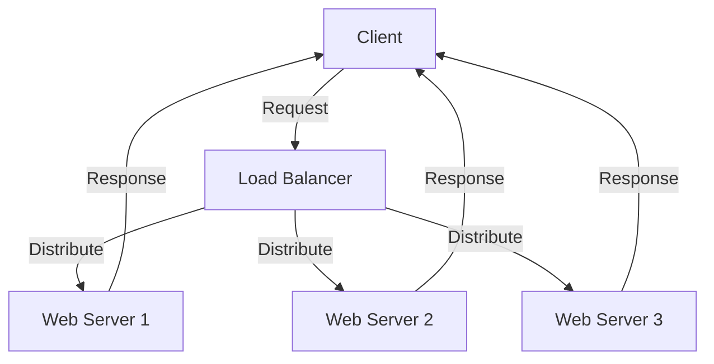

## 21.3 Scalability Considerations in Functional Design

Scalability is a critical aspect of software design, especially in today's world where applications must handle increasing loads and user demands. In this section, we will explore how functional design, particularly in Haskell, addresses scalability challenges. We will delve into patterns for scalability, implementation strategies, and provide a comprehensive example of designing a scalable web server.

### Understanding Scalability Challenges

Scalability refers to the ability of a system to handle growing amounts of work or its potential to accommodate growth. In functional programming, scalability challenges often arise from:

- **Resource Bottlenecks**: Limited CPU, memory, or I/O resources can become bottlenecks as demand increases.
- **Concurrency and Parallelism**: Efficiently managing multiple tasks simultaneously is crucial for scalability.
- **Data Handling**: Managing large datasets and ensuring efficient data processing is essential.

#### Recognizing Potential Bottlenecks

Identifying potential bottlenecks in functional applications involves understanding the limitations of your system and how functional paradigms can both help and hinder scalability. Key areas to focus on include:

- **Lazy Evaluation**: While beneficial for deferring computation, it can lead to unexpected memory usage if not managed properly.
- **Immutable Data Structures**: These can lead to increased memory usage and require efficient algorithms to manage.
- **Concurrency Models**: Choosing the right concurrency model is crucial for scalability.

### Patterns for Scalability

Functional programming offers several patterns that can enhance scalability. In Haskell, these patterns leverage the language's strengths in lazy evaluation, concurrency, and parallelism.

#### Lazy Evaluation Strategies

Lazy evaluation is a cornerstone of Haskell's design, allowing computations to be deferred until their results are needed. This can lead to significant performance improvements by avoiding unnecessary calculations. However, it requires careful management to prevent memory leaks.

- **Thunks**: Haskell uses thunks to represent deferred computations. Understanding and managing thunks is essential for optimizing memory usage.
- **Strictness Annotations**: Use strictness annotations to force evaluation when necessary, preventing the buildup of thunks.

```haskell
-- Example of using strictness annotations
data Point = Point !Double !Double

distance :: Point -> Point -> Double
distance (Point x1 y1) (Point x2 y2) = sqrt ((x2 - x1)^2 + (y2 - y1)^2)
```

#### Concurrency and Parallelism

Concurrency and parallelism are vital for building scalable applications. Haskell provides several abstractions and libraries to facilitate concurrent and parallel programming.

- **Concurrency**: Use lightweight threads and Software Transactional Memory (STM) for managing concurrent tasks.
- **Parallelism**: Leverage the `par` and `pseq` combinators for parallel execution of pure computations.

```haskell
import Control.Parallel (par, pseq)

-- Example of parallel computation
parSum :: [Int] -> Int
parSum xs = let (ys, zs) = splitAt (length xs `div` 2) xs
                sumYs = sum ys
                sumZs = sum zs
            in sumYs `par` (sumZs `pseq` (sumYs + sumZs))
```

### Implementation Strategies

Implementing scalable solutions in Haskell involves using the right tools and techniques to manage resources effectively.

#### Using Haskell's Concurrency Primitives

Haskell's concurrency primitives, such as `forkIO`, `MVar`, and STM, provide powerful tools for building scalable applications.

- **`forkIO`**: Create lightweight threads for concurrent execution.
- **`MVar`**: Use mutable variables for communication between threads.
- **STM**: Use Software Transactional Memory for safe and composable concurrent transactions.

```haskell
import Control.Concurrent
import Control.Concurrent.STM

-- Example of using STM for concurrent transactions
type Account = TVar Int

transfer :: Account -> Account -> Int -> STM ()
transfer from to amount = do
    fromBalance <- readTVar from
    toBalance <- readTVar to
    writeTVar from (fromBalance - amount)
    writeTVar to (toBalance + amount)

main :: IO ()
main = do
    account1 <- atomically $ newTVar 1000
    account2 <- atomically $ newTVar 500
    atomically $ transfer account1 account2 200
    balance1 <- atomically $ readTVar account1
    balance2 <- atomically $ readTVar account2
    putStrLn $ "Account 1 balance: " ++ show balance1
    putStrLn $ "Account 2 balance: " ++ show balance2
```

### Example: Designing a Scalable Web Server

Let's design a simple web server in Haskell that can handle an increasing number of concurrent connections. We'll use the `warp` library, which is known for its performance and scalability.

#### Setting Up the Web Server

First, we'll set up a basic web server using the `warp` library.

```haskell
{-# LANGUAGE OverloadedStrings #-}

import Network.Wai
import Network.Wai.Handler.Warp
import Network.HTTP.Types (status200)
import Data.ByteString.Lazy.Char8 (pack)

-- Simple application that responds with "Hello, World!"
app :: Application
app _ respond = respond $ responseLBS status200 [("Content-Type", "text/plain")] "Hello, World!"

main :: IO ()
main = do
    putStrLn "Starting server on port 8080"
    run 8080 app
```

#### Handling Concurrent Connections

To handle concurrent connections, `warp` uses lightweight threads under the hood. However, we can further optimize our server by using Haskell's concurrency primitives.

- **Thread Pooling**: Use a thread pool to manage connections efficiently.
- **Load Balancing**: Distribute requests across multiple threads to balance load.

```haskell
import Control.Concurrent (forkIO)
import Control.Concurrent.STM
import Network.Wai.Handler.Warp (runSettings, setPort, defaultSettings)

-- Example of using a thread pool for handling requests
main :: IO ()
main = do
    putStrLn "Starting server with thread pool on port 8080"
    let settings = setPort 8080 defaultSettings
    runSettings settings app
```

#### Scaling with Load Balancers

For even greater scalability, consider using a load balancer to distribute traffic across multiple instances of your web server. This approach allows you to scale horizontally by adding more servers as demand increases.

### Visualizing Scalability in Haskell

To better understand the scalability considerations in Haskell, let's visualize the architecture of a scalable web server using Mermaid.js.



**Diagram Description**: This diagram illustrates a scalable web server architecture where a load balancer distributes incoming client requests across multiple web server instances, each capable of handling concurrent connections.

### Key Takeaways

- **Lazy Evaluation**: Use lazy evaluation to defer computations, but manage memory usage carefully.
- **Concurrency and Parallelism**: Leverage Haskell's concurrency primitives and parallelism combinators to build scalable applications.
- **Scalable Architecture**: Design systems that can scale horizontally by distributing load across multiple instances.

### Knowledge Check

- What are the potential bottlenecks in functional applications?
- How can lazy evaluation impact scalability?
- What concurrency primitives does Haskell provide for building scalable applications?
- How can you design a web server to handle increasing numbers of concurrent connections?

### Embrace the Journey

Remember, scalability is not just about handling more users or data; it's about designing systems that can grow and adapt to changing demands. As you explore scalability in functional design, keep experimenting, stay curious, and enjoy the journey!

## Quiz: Scalability Considerations in Functional Design



### What is a potential bottleneck in functional applications?

- [x] Resource limitations such as CPU and memory
- [ ] Lack of object-oriented design
- [ ] Absence of design patterns
- [ ] Use of imperative programming

> **Explanation:** Resource limitations, such as CPU and memory, can become bottlenecks as demand increases in functional applications.

### How does lazy evaluation affect scalability?

- [x] It can improve performance by deferring computations
- [ ] It always increases memory usage
- [ ] It makes code execution faster by default
- [ ] It eliminates the need for concurrency

> **Explanation:** Lazy evaluation can improve performance by deferring computations until their results are needed, but it requires careful management to prevent memory leaks.

### Which Haskell concurrency primitive is used for creating lightweight threads?

- [x] forkIO
- [ ] MVar
- [ ] STM
- [ ] par

> **Explanation:** `forkIO` is used for creating lightweight threads in Haskell.

### What is the purpose of Software Transactional Memory (STM) in Haskell?

- [x] To manage concurrent transactions safely
- [ ] To create immutable data structures
- [ ] To enforce strict evaluation
- [ ] To handle I/O operations

> **Explanation:** STM is used to manage concurrent transactions safely and composably in Haskell.

### How can you scale a web server to handle more concurrent connections?

- [x] Use a load balancer to distribute traffic
- [ ] Increase the number of database queries
- [ ] Reduce the number of server instances
- [ ] Use a single-threaded server model

> **Explanation:** Using a load balancer to distribute traffic across multiple server instances allows you to scale a web server to handle more concurrent connections.

### What is a thunk in Haskell?

- [x] A deferred computation
- [ ] A strict evaluation
- [ ] A type class instance
- [ ] A concurrency primitive

> **Explanation:** A thunk is a deferred computation in Haskell, used to implement lazy evaluation.

### Which combinator is used for parallel execution of pure computations in Haskell?

- [x] par
- [ ] forkIO
- [ ] MVar
- [ ] STM

> **Explanation:** The `par` combinator is used for parallel execution of pure computations in Haskell.

### What is the benefit of using strictness annotations in Haskell?

- [x] To prevent the buildup of thunks
- [ ] To increase code readability
- [ ] To enforce type safety
- [ ] To simplify concurrency

> **Explanation:** Strictness annotations are used to force evaluation and prevent the buildup of thunks, optimizing memory usage.

### What is the role of a load balancer in a scalable web server architecture?

- [x] To distribute incoming requests across multiple server instances
- [ ] To increase the speed of database queries
- [ ] To handle all server-side computations
- [ ] To manage client-side rendering

> **Explanation:** A load balancer distributes incoming requests across multiple server instances, allowing for horizontal scaling.

### True or False: Immutable data structures always lead to increased memory usage.

- [ ] True
- [x] False

> **Explanation:** While immutable data structures can lead to increased memory usage, efficient algorithms and data structures can mitigate this effect.


