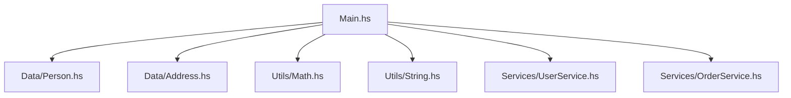

## 21.4 Documentation and Maintainability

In the realm of software engineering, documentation and maintainability are crucial components that ensure the longevity and adaptability of a codebase. This is especially true in Haskell, where the functional paradigm and advanced type system can present unique challenges and opportunities for documentation. In this section, we will explore the importance of documentation, best practices for maintaining a Haskell codebase, and tools that can aid in these processes.

### Importance of Documentation

Documentation serves as the bridge between the developer's intent and the user's understanding. It is not merely an afterthought but a critical aspect of software development that enhances code readability, facilitates collaboration, and ensures maintainability. In Haskell, where code can often be terse and abstract, documentation becomes even more essential.

#### Key Benefits of Documentation

1. **Clarity and Understanding**: Well-documented code is easier to understand, reducing the cognitive load on developers who are new to the codebase.
2. **Collaboration**: Documentation fosters collaboration by providing a shared understanding of the code's purpose and functionality.
3. **Maintenance**: As code evolves, documentation helps maintain consistency and ensures that changes do not introduce unintended consequences.
4. **Onboarding**: New team members can quickly get up to speed with comprehensive documentation, reducing the time required for onboarding.

### Best Practices for Documentation

To achieve effective documentation in Haskell, consider the following best practices:

#### Writing Clear Comments and Documentation Strings

- **Use Descriptive Comments**: Comments should explain the "why" behind the code, not just the "what." Avoid stating the obvious and focus on providing insights that are not immediately apparent from the code itself.

```haskell
-- | Calculate the factorial of a number.
-- This function uses recursion to compute the factorial.
factorial :: Integer -> Integer
factorial 0 = 1
factorial n = n * factorial (n - 1)
```

- **Document Function Signatures**: Use comments to describe the purpose of functions, their parameters, and return values. This is especially important for public APIs.

```haskell
-- | 'add' takes two integers and returns their sum.
-- It is a simple addition function.
add :: Int -> Int -> Int
add x y = x + y
```

- **Leverage Haddock for Documentation**: Haddock is the standard documentation tool for Haskell. It allows you to generate HTML documentation from annotated source code.

```haskell
-- | The 'Person' data type represents an individual with a name and age.
data Person = Person
  { name :: String  -- ^ The name of the person.
  , age  :: Int     -- ^ The age of the person.
  }
```

#### Using Haddock for Generating Documentation

Haddock is a powerful tool that can automatically generate documentation from your Haskell source code. It supports a variety of annotations and can produce comprehensive documentation that is easy to navigate.

- **Install Haddock**: Ensure Haddock is installed and configured in your Haskell environment. It is typically included with the GHC compiler.

- **Annotate Your Code**: Use Haddock annotations to describe modules, functions, and data types. These annotations are similar to comments but are specifically formatted for Haddock.

- **Generate Documentation**: Run Haddock to generate HTML documentation. This can be done using the command line or integrated into your build process with tools like Cabal or Stack.

```bash
haddock --html MyModule.hs
```

#### Code Organization

Organizing your code effectively is another critical aspect of maintainability. A well-structured codebase is easier to navigate, understand, and modify.

- **Logical Module Structure**: Group related functions and types into modules. This not only improves readability but also helps manage dependencies and encapsulation.

- **Consistent Naming Conventions**: Use consistent naming conventions for functions, variables, and modules. This makes it easier to understand the purpose and scope of each component.

- **Limit Module Size**: Avoid large, monolithic modules. Instead, break them down into smaller, focused modules that each handle a specific aspect of the application.

#### Example of a Well-Organized Haskell Project

```plaintext
src/
  ├── Main.hs
  ├── Data/
  │   ├── Person.hs
  │   └── Address.hs
  ├── Utils/
  │   ├── Math.hs
  │   └── String.hs
  └── Services/
      ├── UserService.hs
      └── OrderService.hs
```

### Visualizing Code Organization

To better understand how to organize a Haskell project, let's visualize the structure using a Mermaid.js diagram:



This diagram illustrates a modular structure where each module has a clear responsibility, making the codebase easier to maintain and extend.

### References and Links

For further reading and resources on documentation and maintainability in Haskell, consider the following:

- [Haddock Documentation](https://www.haskell.org/haddock/)
- [Haskell Wiki: Documentation](https://wiki.haskell.org/Documentation)
- [Real World Haskell](http://book.realworldhaskell.org/)

### Knowledge Check

To reinforce your understanding of documentation and maintainability in Haskell, consider the following questions:

1. Why is documentation important in Haskell, and what benefits does it provide?
2. How can Haddock be used to generate documentation from Haskell source code?
3. What are some best practices for organizing a Haskell codebase?

### Embrace the Journey

Remember, documentation and maintainability are ongoing processes. As you continue to develop in Haskell, strive to improve your documentation practices and maintain a clean, organized codebase. This will not only benefit you but also your team and future developers who work with your code.

### Try It Yourself

Experiment with Haddock by annotating a small Haskell project and generating HTML documentation. Consider modifying the structure of your project to improve maintainability and see how it affects the generated documentation.

## Quiz: Documentation and Maintainability



### What is the primary purpose of documentation in a Haskell project?

- [x] To enhance code readability and maintainability
- [ ] To increase the size of the codebase
- [ ] To make the code run faster
- [ ] To obfuscate the code

> **Explanation:** Documentation is primarily used to enhance code readability and maintainability, making it easier for developers to understand and work with the code.

### Which tool is commonly used for generating documentation in Haskell?

- [x] Haddock
- [ ] Javadoc
- [ ] Doxygen
- [ ] Sphinx

> **Explanation:** Haddock is the standard tool used in Haskell for generating documentation from annotated source code.

### What should comments in Haskell code focus on explaining?

- [x] The "why" behind the code
- [ ] The "what" of the code
- [ ] The "how" of the code
- [ ] The "when" of the code

> **Explanation:** Comments should focus on explaining the "why" behind the code, providing insights that are not immediately apparent from the code itself.

### How can you generate HTML documentation using Haddock?

- [x] By running the `haddock --html` command
- [ ] By writing HTML manually
- [ ] By using a web browser
- [ ] By compiling the code with GHC

> **Explanation:** You can generate HTML documentation using Haddock by running the `haddock --html` command on your Haskell source files.

### What is a benefit of using consistent naming conventions in a Haskell project?

- [x] It improves readability and understanding
- [ ] It makes the code run faster
- [ ] It reduces the number of lines of code
- [ ] It increases the complexity of the code

> **Explanation:** Consistent naming conventions improve readability and understanding, making it easier to identify the purpose and scope of each component.

### Why should large, monolithic modules be avoided in Haskell?

- [x] They can be difficult to navigate and maintain
- [ ] They make the code run slower
- [ ] They increase the number of bugs
- [ ] They are harder to compile

> **Explanation:** Large, monolithic modules can be difficult to navigate and maintain, so it's better to break them down into smaller, focused modules.

### What is the role of Haddock annotations in Haskell?

- [x] To describe modules, functions, and data types
- [ ] To increase the performance of the code
- [ ] To reduce the size of the codebase
- [ ] To obfuscate the code

> **Explanation:** Haddock annotations are used to describe modules, functions, and data types, allowing Haddock to generate comprehensive documentation.

### What is the advantage of using a logical module structure in Haskell?

- [x] It helps manage dependencies and encapsulation
- [ ] It makes the code run faster
- [ ] It reduces the number of lines of code
- [ ] It increases the complexity of the code

> **Explanation:** A logical module structure helps manage dependencies and encapsulation, improving the maintainability of the codebase.

### What is a key aspect of maintainability in a Haskell codebase?

- [x] Code organization
- [ ] Code obfuscation
- [ ] Code duplication
- [ ] Code minimization

> **Explanation:** Code organization is a key aspect of maintainability, as it affects how easily the code can be understood and modified.

### True or False: Documentation is only necessary for public APIs in Haskell.

- [ ] True
- [x] False

> **Explanation:** Documentation is important for all parts of a Haskell codebase, not just public APIs, as it aids in understanding and maintaining the code.



By following these best practices and utilizing the tools available, you can ensure that your Haskell projects are well-documented and maintainable, setting the stage for successful development and collaboration.
