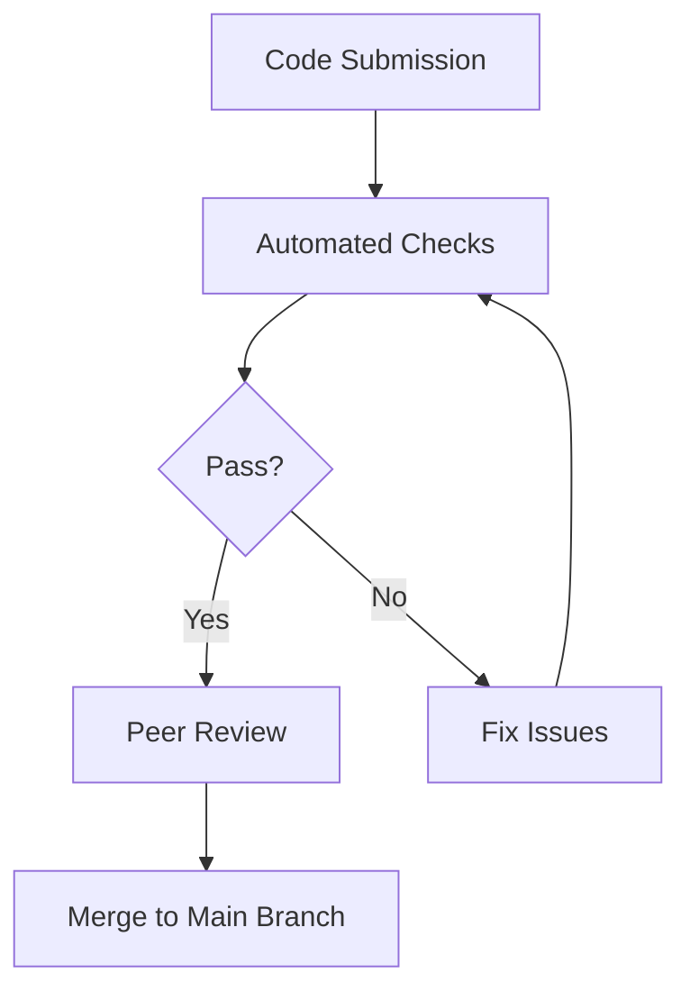

## 21.5 Code Quality and Review Practices in Haskell

In the world of software development, ensuring high code quality is paramount for building robust, maintainable, and scalable applications. Haskell, with its strong type system and functional programming paradigm, offers unique opportunities and challenges in achieving code excellence. In this section, we will explore the best practices for maintaining code quality in Haskell, including effective peer review processes and the use of automated tools.

### Code Quality Metrics

To measure the quality of Haskell code, we must first understand the key metrics that define it. These metrics help in assessing the code's readability, maintainability, and performance. Here are some essential code quality metrics:

1. **Cyclomatic Complexity**: This measures the number of linearly independent paths through a program's source code. Lower complexity often indicates simpler, more maintainable code.

2. **Code Coverage**: This metric assesses the percentage of code executed during testing. High coverage suggests thorough testing, though it should be complemented with quality tests.

3. **Code Readability**: While subjective, readability can be evaluated through consistent naming conventions, clear documentation, and logical code structure.

4. **Type Safety**: Leveraging Haskell's strong type system to catch errors at compile time enhances code reliability.

5. **Performance Metrics**: These include execution time and memory usage, which are crucial for optimizing Haskell applications.

### Peer Review Processes

Peer reviews are a critical component of maintaining high code quality. They provide an opportunity for developers to share knowledge, catch potential issues early, and ensure adherence to coding standards. Here’s how to conduct effective code reviews in Haskell:

#### Conducting Effective Code Reviews

- **Set Clear Objectives**: Define what the review aims to achieve, such as finding bugs, improving design, or ensuring code consistency.

- **Use Checklists**: Create a checklist of common issues to look for, such as adherence to style guides, proper use of Haskell idioms, and potential performance bottlenecks.

- **Focus on Key Areas**: Prioritize reviewing complex logic, new features, and areas with known issues.

- **Encourage Constructive Feedback**: Provide specific, actionable feedback and encourage open discussion.

- **Limit Review Size**: Smaller, incremental reviews are more manageable and effective than large, infrequent ones.

#### Utilizing Tools for Collaborative Development

Platforms like **GitHub** and **GitLab** offer robust tools for conducting code reviews. Here’s how to leverage them effectively:

- **Pull Requests**: Use pull requests to propose changes, discuss them, and review code collaboratively.

- **Code Annotations**: Annotate specific lines of code with comments to highlight issues or suggest improvements.

- **Automated Checks**: Integrate automated checks to ensure code meets predefined standards before review.

- **Continuous Integration**: Set up CI pipelines to automatically run tests and linters on new code.

### Automated Tools

Automated tools can significantly enhance code quality by catching common issues and enforcing coding standards. In Haskell, **HLint** is a popular tool for this purpose.

#### Using HLint

**HLint** is a linter for Haskell that suggests improvements to your code. It helps in maintaining consistency and catching potential issues early. Here’s how to use HLint effectively:

- **Installation**: Install HLint using Cabal or Stack:

  ```bash
  cabal install hlint
  ```

- **Running HLint**: Run HLint on your codebase to get suggestions:

  ```bash
  hlint src/
  ```

- **Customizing Rules**: Customize HLint rules to fit your project’s coding standards by creating a `.hlint.yaml` file.

- **Integrating with CI**: Add HLint to your CI pipeline to automatically lint code on each commit.

#### Example HLint Output

```haskell
-- Original Code
sumList :: [Int] -> Int
sumList xs = foldl (+) 0 xs

-- HLint Suggestion
sumList :: [Int] -> Int
sumList = sum
```

> **Explanation**: HLint suggests using the `sum` function directly instead of `foldl (+) 0`, which is more idiomatic and concise.

### Visualizing Code Quality Processes

To better understand the flow of code quality processes, let's visualize a typical workflow using a Mermaid.js diagram.



> **Diagram Description**: This flowchart illustrates the process from code submission to merging, highlighting the role of automated checks and peer reviews.

### References and Links

- [HLint GitHub Repository](https://github.com/ndmitchell/hlint): Official repository for HLint, a linter for Haskell.
- [GitHub Code Review Guide](https://docs.github.com/en/pull-requests/collaborating-with-pull-requests): Guide on conducting code reviews using GitHub.
- [GitLab Code Review Documentation](https://docs.gitlab.com/ee/user/project/merge_requests/code_reviews.html): Documentation on code review processes in GitLab.

### Knowledge Check

- **Question**: What are the benefits of using HLint in a Haskell project?
- **Exercise**: Run HLint on a sample Haskell project and identify areas for improvement.

### Embrace the Journey

Remember, maintaining code quality is an ongoing process. As you continue to develop in Haskell, keep refining your practices, learning from peers, and leveraging tools to enhance your code. Stay curious, and enjoy the journey of mastering Haskell!

## Quiz: Code Quality and Review Practices in Haskell



### What is the primary purpose of using HLint in Haskell projects?

- [x] To suggest improvements and catch common issues
- [ ] To compile Haskell code
- [ ] To manage Haskell packages
- [ ] To deploy Haskell applications

> **Explanation:** HLint is used to suggest improvements and catch common issues in Haskell code.

### Which of the following is a benefit of peer code reviews?

- [x] Knowledge sharing among team members
- [x] Early detection of potential issues
- [ ] Automatic code deployment
- [ ] Code obfuscation

> **Explanation:** Peer code reviews facilitate knowledge sharing and early detection of potential issues.

### What is a key metric for assessing code readability?

- [x] Consistent naming conventions
- [ ] Execution time
- [ ] Memory usage
- [ ] Cyclomatic complexity

> **Explanation:** Consistent naming conventions are a key metric for assessing code readability.

### How can GitHub be used in the code review process?

- [x] By using pull requests for collaborative reviews
- [ ] By compiling Haskell code
- [ ] By deploying applications
- [ ] By managing databases

> **Explanation:** GitHub can be used for collaborative reviews through pull requests.

### What does cyclomatic complexity measure?

- [x] The number of linearly independent paths through code
- [ ] The execution time of a program
- [ ] The memory usage of a program
- [ ] The number of functions in a program

> **Explanation:** Cyclomatic complexity measures the number of linearly independent paths through code.

### Which tool can be integrated into CI pipelines for automated checks?

- [x] HLint
- [ ] GHC
- [ ] Cabal
- [ ] Stack

> **Explanation:** HLint can be integrated into CI pipelines for automated checks.

### What is a common practice to ensure code quality during reviews?

- [x] Using checklists for common issues
- [ ] Ignoring style guides
- [ ] Skipping tests
- [ ] Merging without review

> **Explanation:** Using checklists for common issues is a common practice to ensure code quality.

### What is the role of continuous integration in code quality?

- [x] To automatically run tests and linters on new code
- [ ] To manually review code
- [ ] To deploy applications
- [ ] To write documentation

> **Explanation:** Continuous integration automatically runs tests and linters on new code.

### What is the advantage of smaller, incremental code reviews?

- [x] They are more manageable and effective
- [ ] They are less thorough
- [ ] They require more resources
- [ ] They are less frequent

> **Explanation:** Smaller, incremental code reviews are more manageable and effective.

### True or False: Code coverage is the percentage of code executed during testing.

- [x] True
- [ ] False

> **Explanation:** Code coverage is indeed the percentage of code executed during testing.


