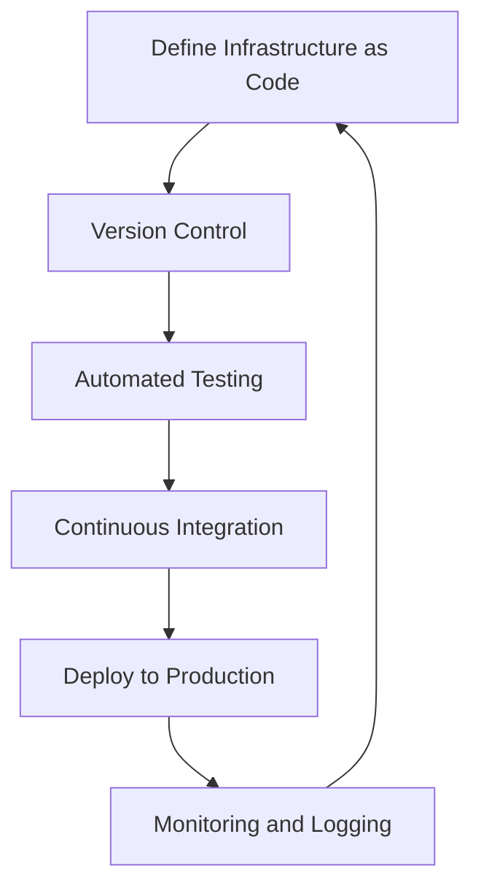

## 21.6 Immutable Infrastructure and DevOps

In the ever-evolving landscape of software development, the principles of functional programming have found a new home in the realm of infrastructure management. By embracing the concept of immutable infrastructure, we can achieve greater reliability, scalability, and maintainability in our systems. This section explores how immutable infrastructure and DevOps practices can be enhanced using functional programming principles, particularly in the context of Haskell.

### Understanding Immutable Infrastructure

**Immutable Infrastructure** refers to the practice of managing infrastructure in such a way that components are never modified after they are deployed. Instead, any changes are implemented by replacing the existing infrastructure with a new version. This approach is akin to the concept of immutability in functional programming, where data structures are not altered but replaced with new versions when changes are needed.

#### Key Benefits of Immutable Infrastructure

1. **Consistency and Predictability**: By ensuring that infrastructure components are immutable, we eliminate the risk of configuration drift, where systems diverge from their intended state over time. This leads to more predictable and consistent environments.

2. **Simplified Rollbacks**: Since infrastructure changes are implemented by deploying new versions, rolling back to a previous state is as simple as redeploying an earlier version.

3. **Enhanced Security**: Immutable infrastructure reduces the attack surface by minimizing the number of changes made to live systems, thereby reducing the risk of unauthorized modifications.

4. **Improved Testing and Validation**: With immutable infrastructure, environments can be easily replicated for testing and validation, ensuring that changes are thoroughly vetted before being deployed to production.

### Implementing Immutable Infrastructure with Infrastructure as Code (IaC)

**Infrastructure as Code (IaC)** is a key enabler of immutable infrastructure. By defining infrastructure configurations in code, we can apply version control, automated testing, and continuous integration practices to infrastructure management.

#### Tools for Immutable Infrastructure

1. **Nix**: Nix is a powerful package manager and build system that allows for reproducible builds and deployments. It uses a purely functional language to describe package dependencies and build processes, ensuring that builds are deterministic and environments are consistent.

2. **Terraform**: Terraform is an open-source tool for building, changing, and versioning infrastructure safely and efficiently. It allows you to define infrastructure as code using a high-level configuration language, and it provides a consistent workflow for managing infrastructure across multiple providers.

### Using Nix for Immutable Infrastructure

Nix provides a unique approach to managing software environments and infrastructure. By leveraging its purely functional language, Nix ensures that builds are reproducible and environments are consistent across different systems.

#### Key Features of Nix

- **Reproducibility**: Nix ensures that builds are deterministic, meaning that the same input will always produce the same output. This is achieved by isolating builds from the host environment and specifying all dependencies explicitly.

- **Isolation**: Nix builds are performed in isolated environments, preventing interference from the host system and ensuring that builds are consistent across different machines.

- **Atomic Upgrades and Rollbacks**: Nix allows for atomic upgrades and rollbacks, meaning that changes can be applied or reverted without affecting the running system.

#### Example: Using Nix to Manage a Haskell Development Environment

```nix
{ pkgs ? import <nixpkgs> {} }:

pkgs.mkShell {
  buildInputs = [
    pkgs.ghc
    pkgs.cabal-install
    pkgs.haskellPackages.hlint
  ];
}
```

In this example, we define a Nix shell environment that includes the GHC compiler, Cabal build tool, and HLint linter. By running `nix-shell`, we can enter a development environment with these tools available, ensuring consistency across different systems.

### Using Terraform for Immutable Infrastructure

Terraform provides a declarative approach to infrastructure management, allowing you to define infrastructure components and their dependencies in code. It supports a wide range of providers, making it a versatile tool for managing infrastructure across different platforms.

#### Key Features of Terraform

- **Declarative Configuration**: Terraform uses a high-level configuration language to define infrastructure components and their dependencies. This allows you to specify the desired state of your infrastructure, and Terraform will automatically determine the necessary steps to achieve that state.

- **State Management**: Terraform maintains a state file that tracks the current state of your infrastructure. This allows Terraform to determine the changes needed to bring your infrastructure in line with the desired state.

- **Plan and Apply Workflow**: Terraform provides a two-step workflow for applying changes to infrastructure. First, the `terraform plan` command generates an execution plan that shows the changes that will be made. Then, the `terraform apply` command applies those changes.

#### Example: Using Terraform to Deploy a Simple Web Application

```hcl
provider "aws" {
  region = "us-west-2"
}

resource "aws_instance" "web" {
  ami           = "ami-0c55b159cbfafe1f0"
  instance_type = "t2.micro"

  tags = {
    Name = "WebServer"
  }
}

output "instance_ip" {
  value = aws_instance.web.public_ip
}
```

In this example, we define a simple Terraform configuration that deploys an EC2 instance on AWS. The configuration specifies the desired state of the infrastructure, and Terraform will automatically determine the necessary steps to achieve that state.

### Integrating Immutable Infrastructure with DevOps Practices

The principles of immutable infrastructure align closely with DevOps practices, particularly in the areas of continuous integration and continuous delivery (CI/CD). By treating infrastructure as code, we can apply the same DevOps practices to infrastructure management as we do to application development.

#### Key DevOps Practices for Immutable Infrastructure

1. **Version Control**: Store infrastructure configurations in version control systems like Git, allowing for collaboration, change tracking, and rollback capabilities.

2. **Automated Testing**: Implement automated tests for infrastructure configurations to ensure that changes are validated before being deployed to production.

3. **Continuous Integration and Delivery**: Use CI/CD pipelines to automate the deployment of infrastructure changes, ensuring that changes are applied consistently and reliably.

4. **Monitoring and Logging**: Implement monitoring and logging solutions to track the state of your infrastructure and detect any issues that arise.

### Visualizing Immutable Infrastructure and DevOps Workflow

To better understand the workflow of immutable infrastructure and DevOps, let's visualize the process using a flowchart.



**Figure 1**: This flowchart illustrates the workflow of immutable infrastructure and DevOps, highlighting the cyclical nature of the process and the integration of key practices.

### Challenges and Considerations

While immutable infrastructure offers many benefits, it also presents some challenges and considerations:

- **State Management**: Managing the state of infrastructure can be complex, particularly when dealing with large and dynamic environments. Tools like Terraform provide state management capabilities, but it's important to understand how they work and how to manage state files effectively.

- **Cost and Resource Management**: Rebuilding infrastructure components can be resource-intensive, particularly in cloud environments where costs are based on usage. It's important to consider the cost implications of immutable infrastructure and optimize resource usage where possible.

- **Cultural Shift**: Adopting immutable infrastructure requires a cultural shift within organizations, as it involves changes to existing processes and workflows. It's important to ensure that teams are aligned and that there is buy-in from stakeholders.

### Conclusion

Immutable infrastructure, when combined with DevOps practices, offers a powerful approach to managing infrastructure in a reliable, scalable, and maintainable way. By applying functional programming principles to infrastructure management, we can achieve greater consistency and predictability in our systems. As you continue your journey in software development, consider how immutable infrastructure and DevOps practices can enhance your projects and contribute to the success of your organization.

### Try It Yourself

Experiment with the code examples provided in this section. Try modifying the Nix shell environment to include additional tools, or extend the Terraform configuration to deploy additional resources. By experimenting with these tools, you'll gain a deeper understanding of how immutable infrastructure and DevOps practices can be applied in real-world scenarios.

### References and Further Reading

- [Nix](https://nixos.org/)
- [Terraform](https://www.terraform.io/)
- [Infrastructure as Code: Managing Servers in the Cloud](https://www.oreilly.com/library/view/infrastructure-as-code/9781491924358/)

## Quiz: Immutable Infrastructure and DevOps



### What is the primary benefit of immutable infrastructure?

- [x] Consistency and predictability
- [ ] Reduced cost
- [ ] Increased complexity
- [ ] Manual configuration

> **Explanation:** Immutable infrastructure ensures that environments remain consistent and predictable by eliminating configuration drift.

### Which tool is known for using a purely functional language to describe package dependencies?

- [x] Nix
- [ ] Terraform
- [ ] Ansible
- [ ] Chef

> **Explanation:** Nix uses a purely functional language to describe package dependencies and build processes, ensuring reproducibility.

### What is a key feature of Terraform?

- [x] Declarative configuration
- [ ] Imperative scripting
- [ ] Manual state management
- [ ] Lack of provider support

> **Explanation:** Terraform uses a declarative configuration language to define infrastructure components and their dependencies.

### How does immutable infrastructure enhance security?

- [x] By reducing the attack surface
- [ ] By increasing the number of changes
- [ ] By allowing manual modifications
- [ ] By disabling monitoring

> **Explanation:** Immutable infrastructure reduces the attack surface by minimizing changes to live systems.

### What is a challenge associated with immutable infrastructure?

- [x] State management
- [ ] Increased manual intervention
- [ ] Lack of automation
- [ ] Reduced consistency

> **Explanation:** Managing the state of infrastructure can be complex, particularly in large and dynamic environments.

### Which DevOps practice is essential for managing infrastructure as code?

- [x] Version control
- [ ] Manual testing
- [ ] Ad-hoc deployments
- [ ] Lack of monitoring

> **Explanation:** Version control is essential for managing infrastructure as code, allowing for collaboration and change tracking.

### What is a benefit of using Nix for managing software environments?

- [x] Reproducibility
- [ ] Increased complexity
- [ ] Manual configuration
- [ ] Lack of isolation

> **Explanation:** Nix ensures reproducibility by isolating builds and specifying all dependencies explicitly.

### How does Terraform manage the state of infrastructure?

- [x] By maintaining a state file
- [ ] By using manual scripts
- [ ] By ignoring state changes
- [ ] By disabling state tracking

> **Explanation:** Terraform maintains a state file that tracks the current state of infrastructure, allowing it to determine necessary changes.

### What is a key consideration when adopting immutable infrastructure?

- [x] Cultural shift
- [ ] Increased manual intervention
- [ ] Lack of automation
- [ ] Reduced consistency

> **Explanation:** Adopting immutable infrastructure requires a cultural shift within organizations, as it involves changes to existing processes.

### True or False: Immutable infrastructure simplifies rollbacks by allowing manual modifications to live systems.

- [ ] True
- [x] False

> **Explanation:** Immutable infrastructure simplifies rollbacks by deploying new versions rather than modifying live systems.


