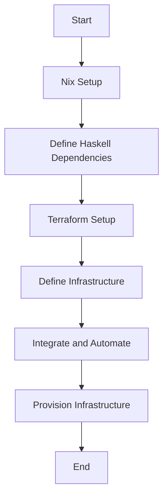

## 21.7 Infrastructure as Code (IaC) with Nix and Terraform

Infrastructure as Code (IaC) is a transformative approach to managing and provisioning computing infrastructure through machine-readable definition files, rather than physical hardware configuration or interactive configuration tools. This section explores how to leverage Nix and Terraform to manage Haskell project dependencies and define cloud infrastructure.

### Understanding IaC Principles

Infrastructure as Code (IaC) is a key DevOps practice that enables teams to manage infrastructure with the same rigor as application code. The main principles of IaC include:

- **Version Control**: Infrastructure configurations are stored in version control systems, enabling tracking of changes and collaboration.
- **Reproducibility**: Ensures that environments can be recreated consistently across different stages of development and production.
- **Automation**: Reduces manual intervention by automating the provisioning and management of infrastructure.
- **Scalability**: Facilitates scaling of infrastructure by automating the deployment of additional resources.

### Nix: A Purely Functional Package Manager

Nix is a powerful package manager and build system that uses a purely functional approach to manage software dependencies. It is particularly well-suited for Haskell projects due to its emphasis on immutability and reproducibility.

#### Key Features of Nix

- **Immutability**: Packages are stored in a read-only store, ensuring that builds are reproducible and isolated.
- **Declarative Configuration**: Nix expressions describe the desired state of the system, making it easy to reproduce environments.
- **Dependency Management**: Nix can manage dependencies for Haskell projects, ensuring that the correct versions of libraries are used.

#### Managing Haskell Project Dependencies with Nix

To manage Haskell project dependencies with Nix, you can create a `default.nix` file that specifies the dependencies and build instructions. Here's an example:

```nix
{ pkgs ? import <nixpkgs> {} }:

pkgs.haskellPackages.callCabal2nix "my-haskell-project" ./. {}
```

This Nix expression imports the Nix package collection and uses `callCabal2nix` to generate a Nix build expression for the Haskell project located in the current directory.

### Terraform: Declarative Infrastructure Provisioning

Terraform is an open-source tool that allows you to define and provision infrastructure using a high-level configuration language. It is widely used for managing cloud infrastructure due to its support for various providers like AWS, Azure, and Google Cloud.

#### Key Features of Terraform

- **Declarative Configuration**: Infrastructure is defined using a declarative language, allowing you to specify the desired state.
- **State Management**: Terraform maintains a state file to track the current state of infrastructure, enabling incremental updates.
- **Provider Ecosystem**: Supports a wide range of cloud providers and services, making it versatile for different environments.

#### Defining Cloud Infrastructure with Terraform

To define cloud infrastructure with Terraform, you create configuration files using the HashiCorp Configuration Language (HCL). Here's a simple example of a Terraform configuration for deploying an AWS EC2 instance:

```hcl
provider "aws" {
  region = "us-west-2"
}

resource "aws_instance" "example" {
  ami           = "ami-0c55b159cbfafe1f0"
  instance_type = "t2.micro"

  tags = {
    Name = "ExampleInstance"
  }
}
```

This configuration specifies the AWS provider and defines an EC2 instance resource with a specific Amazon Machine Image (AMI) and instance type.

### Implementing IaC with Nix and Terraform

Combining Nix and Terraform allows you to manage both software dependencies and infrastructure in a consistent and reproducible manner. Here's how you can implement IaC for a Haskell project:

#### Step 1: Set Up Nix for Dependency Management

1. **Install Nix**: Follow the [Nix installation guide](https://nixos.org/download.html) to install Nix on your system.
2. **Create a `default.nix` File**: Define your Haskell project dependencies using Nix expressions.
3. **Build the Project**: Use the `nix-build` command to build your Haskell project with the specified dependencies.

#### Step 2: Define Infrastructure with Terraform

1. **Install Terraform**: Download and install Terraform from the [official website](https://www.terraform.io/downloads.html).
2. **Create Terraform Configuration Files**: Define your infrastructure using HCL in `.tf` files.
3. **Initialize Terraform**: Run `terraform init` to initialize the Terraform working directory.
4. **Apply the Configuration**: Use `terraform apply` to provision the defined infrastructure.

#### Step 3: Integrate Nix and Terraform

- **Use Nix to Manage Terraform Dependencies**: Create a `shell.nix` file to specify the Terraform version and dependencies required for your project.
- **Automate Infrastructure Provisioning**: Write scripts to automate the execution of Nix and Terraform commands, ensuring a seamless workflow.

### Example: Setting Up a Replicable Development Environment

Let's walk through an example of setting up a development environment for a Haskell project using Nix and Terraform.

#### Step 1: Define Haskell Dependencies with Nix

Create a `default.nix` file for your Haskell project:

```nix
{ pkgs ? import <nixpkgs> {} }:

pkgs.haskellPackages.callCabal2nix "my-haskell-project" ./. {}
```

#### Step 2: Define Infrastructure with Terraform

Create a `main.tf` file to define the infrastructure:

```hcl
provider "aws" {
  region = "us-west-2"
}

resource "aws_instance" "example" {
  ami           = "ami-0c55b159cbfafe1f0"
  instance_type = "t2.micro"

  tags = {
    Name = "ExampleInstance"
  }
}
```

#### Step 3: Integrate and Automate

Create a `shell.nix` file to manage Terraform dependencies:

```nix
{ pkgs ? import <nixpkgs> {} }:

pkgs.mkShell {
  buildInputs = [ pkgs.terraform ];
}
```

Write a script to automate the setup:

```bash
#!/bin/bash

# Enter the Nix shell
nix-shell

# Initialize Terraform
terraform init

# Apply the Terraform configuration
terraform apply
```

### Visualizing the IaC Workflow

Below is a diagram illustrating the workflow of using Nix and Terraform for IaC:



### Knowledge Check

- **What are the main principles of Infrastructure as Code?**
- **How does Nix ensure reproducibility in software builds?**
- **What is the role of the Terraform state file?**
- **How can you integrate Nix and Terraform in a project?**

### Try It Yourself

Experiment with the provided code examples by:

- Modifying the `default.nix` file to include additional Haskell dependencies.
- Changing the Terraform configuration to deploy different types of resources.
- Automating the entire setup process with a custom script.

### Conclusion

By using Nix and Terraform together, you can achieve a high level of automation and reproducibility in managing both software dependencies and infrastructure. This approach not only enhances consistency across environments but also streamlines the development and deployment process.

Remember, this is just the beginning. As you progress, you'll be able to build more complex and scalable systems using these powerful tools. Keep experimenting, stay curious, and enjoy the journey!

## Quiz: Infrastructure as Code (IaC) with Nix and Terraform



### What is the primary benefit of using Infrastructure as Code (IaC)?

- [x] Reproducibility and automation of infrastructure
- [ ] Manual configuration of hardware
- [ ] Increased hardware costs
- [ ] Reduced software development speed

> **Explanation:** IaC allows for reproducibility and automation, ensuring consistent environments.

### Which tool is used for managing Haskell project dependencies in a purely functional way?

- [x] Nix
- [ ] Terraform
- [ ] Docker
- [ ] Ansible

> **Explanation:** Nix is a purely functional package manager suitable for managing Haskell dependencies.

### What is the main purpose of Terraform?

- [x] Declarative infrastructure provisioning
- [ ] Building container images
- [ ] Continuous integration
- [ ] Code linting

> **Explanation:** Terraform is used for declarative infrastructure provisioning.

### How does Nix ensure that builds are reproducible?

- [x] By using a purely functional approach and immutable package store
- [ ] By manually configuring each build
- [ ] By using mutable state
- [ ] By relying on external scripts

> **Explanation:** Nix's purely functional approach and immutable store ensure reproducibility.

### What is the role of the Terraform state file?

- [x] To track the current state of infrastructure
- [ ] To store application logs
- [ ] To manage user access
- [ ] To compile Haskell code

> **Explanation:** The state file tracks the current state of infrastructure, enabling incremental updates.

### How can you automate the integration of Nix and Terraform?

- [x] By writing scripts to execute Nix and Terraform commands
- [ ] By manually running each command
- [ ] By using a GUI tool
- [ ] By editing configuration files directly

> **Explanation:** Automation scripts can streamline the integration of Nix and Terraform.

### What is a key feature of Nix that benefits Haskell projects?

- [x] Immutability and reproducibility
- [ ] High memory usage
- [ ] Complex syntax
- [ ] Limited package support

> **Explanation:** Nix's immutability and reproducibility are beneficial for Haskell projects.

### Which language is used to define Terraform configurations?

- [x] HashiCorp Configuration Language (HCL)
- [ ] YAML
- [ ] JSON
- [ ] XML

> **Explanation:** Terraform uses HCL for defining configurations.

### What is the purpose of a `shell.nix` file in a project?

- [x] To specify the development environment and dependencies
- [ ] To store application data
- [ ] To compile Haskell code
- [ ] To manage user permissions

> **Explanation:** A `shell.nix` file specifies the development environment and dependencies.

### True or False: Terraform can only be used with AWS.

- [ ] True
- [x] False

> **Explanation:** Terraform supports multiple cloud providers, not just AWS.


