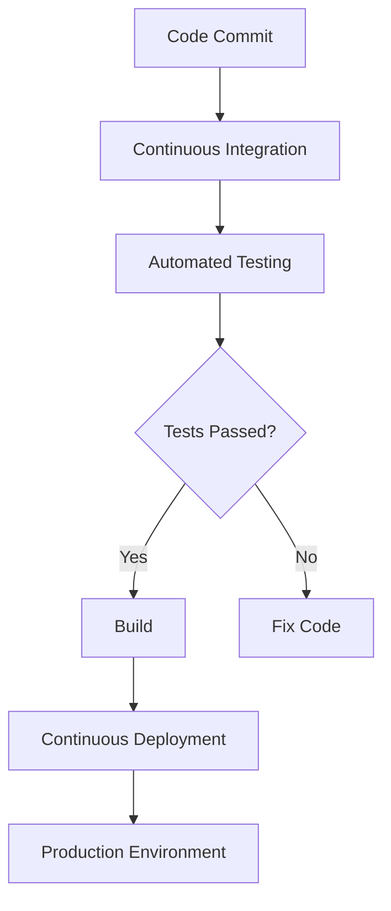

## 21.8 DevOps and Continuous Delivery Practices

In the ever-evolving landscape of software development, DevOps and Continuous Delivery (CD) have emerged as critical practices for ensuring rapid, reliable, and efficient software deployment. This section delves into the integration of DevOps principles with Haskell projects, focusing on Continuous Integration/Continuous Deployment (CI/CD) pipelines, automation, and the tools that facilitate these processes.

### DevOps Culture: Bridging Development and Operations

DevOps is a cultural and professional movement that emphasizes collaboration between software developers and IT operations. The goal is to shorten the development lifecycle while delivering features, fixes, and updates frequently in close alignment with business objectives. In the context of Haskell, a functional programming language known for its strong type system and purity, integrating DevOps practices can enhance the reliability and maintainability of applications.

#### Key Principles of DevOps

1. **Collaboration and Communication**: Foster a culture where developers and operations teams work together seamlessly.
2. **Automation**: Automate repetitive tasks to reduce errors and increase efficiency.
3. **Continuous Improvement**: Regularly assess and improve processes and tools.
4. **Infrastructure as Code (IaC)**: Manage infrastructure using code to ensure consistency and repeatability.

### Continuous Integration/Continuous Deployment (CI/CD)

CI/CD is a set of practices designed to improve software delivery by automating the integration and deployment processes. In Haskell projects, CI/CD can be particularly beneficial due to the language's emphasis on correctness and type safety.

#### Continuous Integration (CI)

Continuous Integration involves automatically testing and integrating code changes into a shared repository. This practice helps catch bugs early and ensures that the codebase remains in a deployable state.

- **Automated Testing**: Run unit tests, property-based tests, and integration tests automatically on each commit.
- **Build Automation**: Use tools like Cabal or Stack to automate the build process.

#### Continuous Deployment (CD)

Continuous Deployment extends CI by automatically deploying code changes to production environments. This practice ensures that new features and bug fixes are delivered to users as soon as they are ready.

- **Deployment Automation**: Use scripts and tools to automate the deployment process.
- **Monitoring and Rollback**: Implement monitoring to detect issues and rollback mechanisms to revert problematic deployments.

### Tools for CI/CD in Haskell

Several tools are available to implement CI/CD pipelines for Haskell projects. These tools help automate testing, building, and deployment processes, ensuring a smooth and efficient workflow.

#### CircleCI

CircleCI is a popular CI/CD platform that supports Haskell projects. It allows you to define workflows using YAML configuration files, enabling you to automate testing and deployment processes.

```yaml
version: 2.1

jobs:
  build:
    docker:
      - image: haskell:8.10
    steps:
      - checkout
      - run:
          name: Install Dependencies
          command: stack setup
      - run:
          name: Build Project
          command: stack build
      - run:
          name: Run Tests
          command: stack test

workflows:
  version: 2
  build_and_test:
    jobs:
      - build
```

#### Travis CI

Travis CI is another widely used CI/CD service that integrates seamlessly with GitHub. It provides a simple way to automate the testing and deployment of Haskell projects.

```yaml
language: haskell

ghc:
  - 8.10.4

install:
  - stack setup
  - stack build

script:
  - stack test
```

#### GitHub Actions

GitHub Actions is a powerful CI/CD tool that allows you to automate workflows directly within your GitHub repository. It supports Haskell projects and provides a flexible way to define custom workflows.

```yaml
name: Haskell CI

on:
  push:
    branches: [ main ]
  pull_request:
    branches: [ main ]

jobs:
  build:
    runs-on: ubuntu-latest

    steps:
    - uses: actions/checkout@v2
    - name: Set up Haskell
      uses: actions/setup-haskell@v1
      with:
        ghc-version: '8.10.4'
    - name: Install dependencies
      run: stack setup
    - name: Build
      run: stack build
    - name: Test
      run: stack test
```

### Implementing CI/CD Pipelines for Haskell Projects

Implementing CI/CD pipelines in Haskell projects involves setting up automated workflows that handle code integration, testing, and deployment. Here's a step-by-step guide to setting up a basic CI/CD pipeline using GitHub Actions.

#### Step 1: Define the Workflow

Create a `.github/workflows/main.yml` file in your repository to define the CI/CD workflow. This file specifies the events that trigger the workflow, the jobs to run, and the steps within each job.

#### Step 2: Set Up the Environment

Use the `actions/setup-haskell` action to set up the Haskell environment. Specify the GHC version and any additional setup steps required for your project.

#### Step 3: Install Dependencies

Run `stack setup` to install the necessary dependencies for your Haskell project. This step ensures that all required libraries and tools are available for building and testing.

#### Step 4: Build and Test

Use `stack build` to compile the project and `stack test` to run the test suite. These steps ensure that the code is correct and ready for deployment.

#### Step 5: Deploy

If the build and tests are successful, deploy the application to the desired environment. This step can involve deploying to a cloud provider, updating a server, or any other deployment action.

### Visualizing a CI/CD Pipeline

Below is a Mermaid.js diagram illustrating a typical CI/CD pipeline for a Haskell project.



**Diagram Description**: This diagram represents a CI/CD pipeline where code commits trigger continuous integration, followed by automated testing. If tests pass, the code is built and deployed to the production environment. If tests fail, the code is fixed and the process is repeated.

### References and Further Reading

- [GitHub Actions](https://github.com/features/actions)
- [CircleCI Documentation](https://circleci.com/docs/)
- [Travis CI Documentation](https://docs.travis-ci.com/)
- [Haskell Stack](https://docs.haskellstack.org/en/stable/README/)

### Knowledge Check

- Explain the benefits of using CI/CD in Haskell projects.
- Describe the role of automation in DevOps practices.
- How does GitHub Actions facilitate CI/CD for Haskell projects?

### Try It Yourself

Experiment with setting up a CI/CD pipeline for a simple Haskell project using GitHub Actions. Modify the workflow to include additional steps, such as code linting or deployment to a staging environment.

### Embrace the Journey

Remember, implementing DevOps and Continuous Delivery practices is an ongoing journey. As you integrate these practices into your Haskell projects, you'll discover new ways to enhance efficiency and reliability. Keep experimenting, stay curious, and enjoy the process!

## Quiz: DevOps and Continuous Delivery Practices



### What is the primary goal of DevOps?

- [x] To shorten the development lifecycle and deliver features frequently
- [ ] To increase the number of developers in a team
- [ ] To eliminate the need for testing
- [ ] To focus solely on code quality

> **Explanation:** DevOps aims to shorten the development lifecycle while delivering features, fixes, and updates frequently in close alignment with business objectives.

### Which tool is NOT commonly used for CI/CD in Haskell projects?

- [ ] CircleCI
- [ ] Travis CI
- [x] Microsoft Word
- [ ] GitHub Actions

> **Explanation:** Microsoft Word is not a tool used for CI/CD processes.

### What does CI stand for in the context of DevOps?

- [x] Continuous Integration
- [ ] Continuous Improvement
- [ ] Continuous Innovation
- [ ] Continuous Inspection

> **Explanation:** CI stands for Continuous Integration, which involves automatically testing and integrating code changes into a shared repository.

### What is the purpose of automated testing in CI/CD?

- [x] To catch bugs early and ensure codebase deployability
- [ ] To increase the complexity of the code
- [ ] To replace manual testing entirely
- [ ] To slow down the development process

> **Explanation:** Automated testing helps catch bugs early and ensures that the codebase remains in a deployable state.

### Which of the following is a benefit of using GitHub Actions for CI/CD?

- [x] Automating workflows directly within GitHub repositories
- [ ] Replacing all manual coding tasks
- [ ] Increasing the size of the codebase
- [ ] Eliminating the need for version control

> **Explanation:** GitHub Actions allows you to automate workflows directly within your GitHub repository, facilitating CI/CD processes.

### What is the role of Infrastructure as Code (IaC) in DevOps?

- [x] To manage infrastructure using code for consistency and repeatability
- [ ] To eliminate the need for infrastructure
- [ ] To increase manual configuration tasks
- [ ] To focus solely on hardware management

> **Explanation:** IaC involves managing infrastructure using code to ensure consistency and repeatability.

### In a CI/CD pipeline, what happens if tests fail?

- [x] The code is fixed and the process is repeated
- [ ] The code is deployed anyway
- [ ] The pipeline is permanently stopped
- [ ] The developers are replaced

> **Explanation:** If tests fail, the code is fixed and the process is repeated to ensure quality.

### What is the benefit of using Docker in CI/CD pipelines?

- [x] To provide consistent environments for building and testing
- [ ] To increase the size of the application
- [ ] To eliminate the need for testing
- [ ] To slow down the deployment process

> **Explanation:** Docker provides consistent environments for building and testing, which is beneficial in CI/CD pipelines.

### Which of the following is NOT a principle of DevOps?

- [ ] Collaboration and Communication
- [ ] Automation
- [x] Isolation and Segregation
- [ ] Continuous Improvement

> **Explanation:** Isolation and Segregation are not principles of DevOps, which focuses on collaboration and integration.

### True or False: Continuous Deployment automatically deploys code changes to production environments.

- [x] True
- [ ] False

> **Explanation:** Continuous Deployment involves automatically deploying code changes to production environments.


