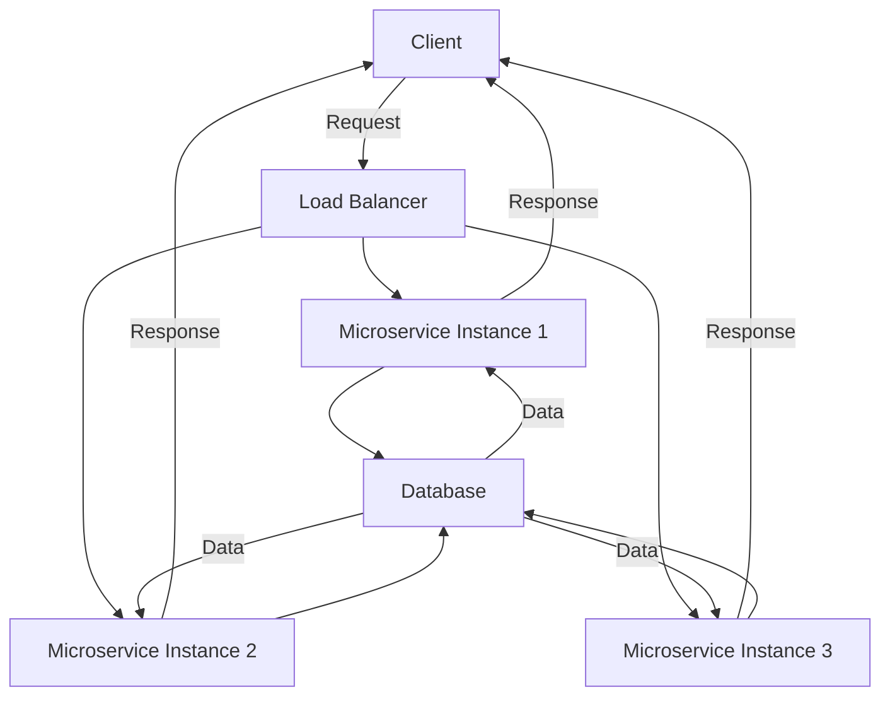

## 21.9 Designing for Resilience and Scalability

In the world of software engineering, resilience and scalability are two critical attributes that ensure systems can withstand failures and handle growth in demand. As expert software engineers and architects, understanding how to design systems that embody these qualities is essential. In this section, we will explore the concepts of resilience and scalability, delve into specific patterns and strategies, and demonstrate how to implement these in Haskell applications.

### Understanding Resilience in Software

Resilience refers to the ability of a system to recover from failures and continue to operate. It is about building systems that can gracefully handle unexpected conditions and maintain functionality. Resilient systems are designed to anticipate failures and have mechanisms in place to recover from them.

#### Key Concepts of Resilience

1. **Fault Tolerance**: The ability of a system to continue operating in the event of a failure of some of its components.
2. **Graceful Degradation**: The ability of a system to maintain limited functionality even when parts of it are compromised.
3. **Redundancy**: Having backup components or systems that can take over in case of failure.
4. **Isolation**: Ensuring that failures in one part of the system do not cascade to others.

### Scalability Strategies

Scalability is the capability of a system to handle increased load by adding resources. It can be achieved through two primary strategies:

1. **Horizontal Scaling**: Adding more machines or nodes to distribute the load.
2. **Vertical Scaling**: Adding more power (CPU, RAM) to existing machines.

#### Horizontal vs. Vertical Scaling

- **Horizontal Scaling**: Often preferred for its flexibility and cost-effectiveness. It involves distributing the workload across multiple nodes.
- **Vertical Scaling**: Involves upgrading the existing hardware. It can be limited by the capacity of a single machine.

### Resilience and Scalability Patterns

To design systems that are both resilient and scalable, we can employ several design patterns:

#### Bulkhead Pattern

The Bulkhead pattern is inspired by the compartments in a ship that prevent water from flooding the entire vessel. In software, it involves isolating different parts of the system so that a failure in one does not affect the others.

**Implementation in Haskell**:

```haskell
-- Define a Bulkhead type to isolate components
data Bulkhead a = Bulkhead { runBulkhead :: IO a }

-- Example function to run a task within a bulkhead
runIsolatedTask :: Bulkhead a -> IO (Either SomeException a)
runIsolatedTask (Bulkhead task) = try task
```

#### Circuit Breaker Pattern

The Circuit Breaker pattern prevents a system from repeatedly trying to execute an operation that is likely to fail. It acts as a switch that opens when failures reach a threshold, allowing the system to recover.

**Implementation in Haskell**:

```haskell
import Control.Concurrent.STM
import Control.Exception

data CircuitBreakerState = Closed | Open | HalfOpen

data CircuitBreaker = CircuitBreaker
  { state :: TVar CircuitBreakerState
  , failureCount :: TVar Int
  , threshold :: Int
  }

-- Function to execute an action with a circuit breaker
executeWithCircuitBreaker :: CircuitBreaker -> IO a -> IO (Either SomeException a)
executeWithCircuitBreaker cb action = atomically (readTVar (state cb)) >>= \case
  Open -> return $ Left (toException (userError "Circuit is open"))
  _ -> do
    result <- try action
    case result of
      Left _ -> atomically $ modifyTVar' (failureCount cb) (+1)
      Right _ -> atomically $ writeTVar (failureCount cb) 0
    return result
```

#### Fallback Procedures

Fallback procedures provide alternative solutions when a primary operation fails. This can involve returning a default value or redirecting to a backup service.

**Implementation in Haskell**:

```haskell
-- Function to attempt an action with a fallback
attemptWithFallback :: IO a -> IO a -> IO a
attemptWithFallback primary fallback = catch primary (\\(_ :: SomeException) -> fallback)
```

### Implementing Resilience Patterns in Haskell Applications

Haskell's strong type system and functional nature make it well-suited for implementing resilience patterns. By leveraging Haskell's features, we can create robust systems that handle failures gracefully.

#### Example: Ensuring a Microservice Remains Responsive Under High Load

Consider a microservice that processes requests from clients. To ensure it remains responsive under high load, we can apply the following strategies:

1. **Rate Limiting**: Control the number of requests processed in a given time frame.
2. **Load Balancing**: Distribute incoming requests across multiple instances.
3. **Graceful Shutdown**: Ensure the service can shut down without losing data.

**Rate Limiting Example**:

```haskell
import Control.Concurrent
import Control.Concurrent.STM

-- Rate limiter using STM
rateLimiter :: Int -> IO (IO Bool)
rateLimiter maxRequests = do
  counter <- newTVarIO 0
  return $ atomically $ do
    count <- readTVar counter
    if count < maxRequests
      then writeTVar counter (count + 1) >> return True
      else return False

-- Example usage
main :: IO ()
main = do
  limiter <- rateLimiter 5
  replicateM_ 10 $ do
    allowed <- limiter
    if allowed
      then putStrLn "Request processed"
      else putStrLn "Rate limit exceeded"
```

### Visualizing Resilience and Scalability

To better understand the concepts of resilience and scalability, let's visualize the architecture of a resilient and scalable system using Mermaid.js diagrams.



**Diagram Description**: This diagram illustrates a system where a load balancer distributes client requests across multiple microservice instances. Each instance interacts with a shared database, ensuring data consistency and availability.

### References and Further Reading

- [Resilience Engineering](https://resilience-engineering-association.org/)
- [Scalability Principles](https://www.scalability.org/)
- [Haskell STM](https://hackage.haskell.org/package/stm)

### Knowledge Check

Let's reinforce our understanding of resilience and scalability with a few questions:

1. What is the primary difference between horizontal and vertical scaling?
2. How does the Bulkhead pattern contribute to system resilience?
3. Describe a scenario where a Circuit Breaker pattern would be beneficial.
4. What are some strategies for ensuring a microservice remains responsive under high load?

### Embrace the Journey

Designing for resilience and scalability is a continuous journey. As you build and refine your systems, remember that these principles are not just about handling failures or scaling resources. They are about creating systems that are robust, adaptable, and capable of meeting the demands of the future. Keep experimenting, stay curious, and enjoy the journey!

## Quiz: Designing for Resilience and Scalability



### What is the primary goal of resilience in software systems?

- [x] To recover from failures and maintain functionality
- [ ] To increase the speed of processing
- [ ] To reduce the cost of operations
- [ ] To enhance user interface design

> **Explanation:** Resilience is about ensuring that systems can recover from failures and continue to operate effectively.

### Which scaling strategy involves adding more machines to handle increased load?

- [x] Horizontal scaling
- [ ] Vertical scaling
- [ ] Diagonal scaling
- [ ] Linear scaling

> **Explanation:** Horizontal scaling involves adding more machines or nodes to distribute the load.

### What pattern is inspired by ship compartments to prevent cascading failures?

- [x] Bulkhead pattern
- [ ] Circuit breaker pattern
- [ ] Singleton pattern
- [ ] Factory pattern

> **Explanation:** The Bulkhead pattern isolates different parts of the system to prevent failures from affecting other components.

### In the Circuit Breaker pattern, what happens when the circuit is open?

- [x] The system stops attempting the operation
- [ ] The system retries the operation continuously
- [ ] The system switches to a backup operation
- [ ] The system logs the failure and continues

> **Explanation:** When the circuit is open, the system stops attempting the operation to allow time for recovery.

### Which Haskell feature is particularly useful for implementing resilience patterns?

- [x] Strong type system
- [ ] Dynamic typing
- [ ] Weak typing
- [ ] Loose coupling

> **Explanation:** Haskell's strong type system helps in creating robust systems that handle failures gracefully.

### What is a common strategy to ensure a microservice remains responsive under high load?

- [x] Rate limiting
- [ ] Increasing the number of developers
- [ ] Reducing the number of servers
- [ ] Disabling logging

> **Explanation:** Rate limiting controls the number of requests processed to prevent overload.

### How does the Circuit Breaker pattern help in system resilience?

- [x] By preventing repeated execution of failing operations
- [ ] By increasing the speed of operations
- [ ] By reducing the number of components
- [ ] By enhancing the user interface

> **Explanation:** The Circuit Breaker pattern prevents the system from repeatedly trying operations that are likely to fail.

### What is the benefit of using fallback procedures in a system?

- [x] They provide alternative solutions when primary operations fail
- [ ] They increase the complexity of the system
- [ ] They reduce the need for error handling
- [ ] They enhance the graphical user interface

> **Explanation:** Fallback procedures offer alternative solutions, ensuring the system continues to operate even when primary operations fail.

### Which pattern is used to distribute client requests across multiple instances?

- [x] Load balancing
- [ ] Singleton pattern
- [ ] Observer pattern
- [ ] Decorator pattern

> **Explanation:** Load balancing distributes incoming requests across multiple instances to manage load effectively.

### True or False: Vertical scaling involves adding more machines to handle increased load.

- [ ] True
- [x] False

> **Explanation:** Vertical scaling involves adding more power (CPU, RAM) to existing machines, not adding more machines.




