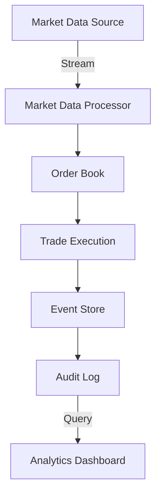

## 22.1 Developing a Financial Trading System in Haskell

Building a financial trading system is a complex task that requires careful consideration of performance, reliability, and scalability. Haskell, with its strong typing, concurrency capabilities, and functional programming paradigms, offers a unique set of tools to tackle these challenges. In this section, we will explore how to develop a high-performance trading platform using Haskell, focusing on key design patterns and implementation strategies.

### Overview

Developing a financial trading system involves several key components, including handling real-time data, ensuring low latency, and maintaining system reliability. The system must efficiently manage trades, orders, and market data streams while providing a robust architecture that can scale with increasing data volumes and user demands.

### Challenges

1. **Handling Real-Time Data**: Financial markets generate vast amounts of data that need to be processed in real-time. The system must be capable of ingesting, processing, and responding to this data with minimal latency.

2. **Ensuring Low Latency**: Latency is a critical factor in trading systems. Delays in processing can lead to missed opportunities and financial losses. The system must be optimized for speed and efficiency.

3. **Scalability and Reliability**: As the volume of data and number of users grow, the system must scale without compromising performance. Reliability is also crucial, as downtime can have significant financial implications.

### Patterns Used

To address these challenges, we will leverage several design patterns and Haskell-specific features:

- **Concurrency Patterns**: Utilize Haskell's concurrency libraries, such as `Async` and `STM`, to manage parallel processing and ensure efficient use of system resources.

- **Event Sourcing**: Implement event sourcing to maintain a reliable and auditable record of all system events, enabling easy recovery and analysis.

- **Functional Data Structures**: Use immutable and persistent data structures to ensure data integrity and facilitate concurrent access.

### Implementation

#### Modeling Financial Instruments

Haskell's strong typing system allows us to model financial instruments with precision and clarity. By defining data types that represent various financial entities, we can ensure type safety and reduce the risk of errors.

```haskell
-- Define a data type for financial instruments
data Instrument = Stock { ticker :: String, price :: Double }
                | Bond { identifier :: String, yield :: Double }
                | Forex { pair :: String, rate :: Double }
                deriving (Show, Eq)

-- Example usage
let appleStock = Stock "AAPL" 150.0
let usBond = Bond "US10Y" 1.5
let eurUsd = Forex "EUR/USD" 1.18
```

#### Managing Trades and Orders

Trades and orders are central to any trading system. We can model these entities using Haskell's algebraic data types, ensuring that all possible states and transitions are explicitly defined.

```haskell
-- Define a data type for orders
data OrderType = Market | Limit | Stop deriving (Show, Eq)
data OrderStatus = New | Filled | Cancelled deriving (Show, Eq)

data Order = Order { orderId :: Int, instrument :: Instrument, orderType :: OrderType, quantity :: Int, status :: OrderStatus }
           deriving (Show, Eq)

-- Example order
let order1 = Order 1 appleStock Market 100 New
```

#### Concurrency with STM

Haskell's Software Transactional Memory (STM) provides a powerful abstraction for managing concurrent state. By using STM, we can ensure that our trading system handles concurrent operations safely and efficiently.

```haskell
import Control.Concurrent.STM

-- Define a shared state for order processing
type OrderBook = TVar [Order]

-- Function to add an order to the order book
addOrder :: OrderBook -> Order -> STM ()
addOrder orderBook order = do
    orders <- readTVar orderBook
    writeTVar orderBook (order : orders)

-- Example usage
main :: IO ()
main = do
    orderBook <- atomically $ newTVar []
    atomically $ addOrder orderBook order1
```

#### Event Sourcing

Event sourcing is a pattern that captures all changes to the application state as a sequence of events. This approach provides a reliable audit trail and facilitates system recovery.

```haskell
-- Define an event type
data Event = OrderPlaced Order | OrderCancelled Int deriving (Show, Eq)

-- Function to apply an event to the order book
applyEvent :: OrderBook -> Event -> STM ()
applyEvent orderBook (OrderPlaced order) = addOrder orderBook order
applyEvent orderBook (OrderCancelled orderId) = do
    orders <- readTVar orderBook
    let updatedOrders = filter (\o -> orderId o /= orderId) orders
    writeTVar orderBook updatedOrders

-- Example event application
let event1 = OrderPlaced order1
atomically $ applyEvent orderBook event1
```

### Example: Managing Market Data Streams

Market data streams are a critical component of a trading system. We can use Haskell's concurrency features to efficiently process and respond to these streams.

```haskell
import Control.Concurrent.Async
import Network.HTTP.Client

-- Function to fetch market data
fetchMarketData :: String -> IO ()
fetchMarketData url = do
    manager <- newManager defaultManagerSettings
    request <- parseRequest url
    response <- httpLbs request manager
    print $ responseBody response

-- Example usage with concurrency
main :: IO ()
main = do
    let urls = ["http://example.com/marketdata1", "http://example.com/marketdata2"]
    mapConcurrently_ fetchMarketData urls
```

### Visualizing the Architecture

To better understand the architecture of our trading system, let's visualize the key components and their interactions using a Mermaid.js diagram.



**Diagram Description**: This diagram illustrates the flow of data within the trading system. Market data is processed and fed into the order book, where trades are executed. Events are stored in an event store, providing an audit log that can be queried for analytics.

### Design Considerations

When building a financial trading system in Haskell, consider the following:

- **Performance**: Optimize for low latency and high throughput. Use profiling tools to identify bottlenecks and optimize critical paths.

- **Scalability**: Design the system to handle increasing data volumes and user loads. Consider distributed architectures and load balancing strategies.

- **Reliability**: Implement robust error handling and recovery mechanisms. Use event sourcing to maintain a reliable audit trail.

- **Security**: Ensure that the system is secure against unauthorized access and data breaches. Implement authentication and encryption where necessary.

### Haskell Unique Features

Haskell's unique features, such as strong static typing, lazy evaluation, and powerful concurrency abstractions, make it well-suited for building financial trading systems. These features enable developers to write concise, expressive code that is both efficient and reliable.

### Differences and Similarities

While Haskell offers unique advantages for building trading systems, it is important to understand how it compares to other languages and paradigms. For example, Haskell's functional approach contrasts with the object-oriented patterns commonly used in other languages. Understanding these differences can help developers make informed decisions about when to use Haskell and how to integrate it with other technologies.

### Try It Yourself

To deepen your understanding of the concepts covered in this section, try modifying the code examples provided. Experiment with different data types, concurrency patterns, and event sourcing strategies. Consider implementing additional features, such as risk management or portfolio analysis, to further enhance the trading system.

### Knowledge Check

1. **What are the key challenges in developing a financial trading system?**
2. **How does Haskell's strong typing benefit the modeling of financial instruments?**
3. **What is the role of event sourcing in a trading system?**
4. **How can concurrency patterns improve the performance of a trading system?**

### Embrace the Journey

Building a financial trading system in Haskell is a challenging yet rewarding endeavor. As you progress, you'll gain a deeper understanding of functional programming, concurrency, and system architecture. Remember, this is just the beginning. Keep experimenting, stay curious, and enjoy the journey!

## Quiz: Developing a Financial Trading System in Haskell



### What is a key challenge in developing a financial trading system?

- [x] Handling real-time data
- [ ] Managing static data
- [ ] Ensuring high latency
- [ ] Reducing system complexity

> **Explanation:** Handling real-time data is crucial in a financial trading system to ensure timely and accurate decision-making.

### How does Haskell's strong typing benefit financial instrument modeling?

- [x] Ensures type safety
- [ ] Increases code verbosity
- [ ] Reduces code readability
- [ ] Limits flexibility

> **Explanation:** Haskell's strong typing ensures type safety, reducing the risk of errors in financial instrument modeling.

### What is the purpose of event sourcing in a trading system?

- [x] To maintain a reliable audit trail
- [ ] To increase system latency
- [ ] To simplify data structures
- [ ] To reduce data storage

> **Explanation:** Event sourcing captures all changes to the application state as a sequence of events, providing a reliable audit trail.

### Which concurrency feature does Haskell provide for managing state?

- [x] Software Transactional Memory (STM)
- [ ] Global Interpreter Lock (GIL)
- [ ] Asynchronous I/O
- [ ] Thread pooling

> **Explanation:** Haskell's STM provides a powerful abstraction for managing concurrent state safely and efficiently.

### What is a benefit of using functional data structures in a trading system?

- [x] Ensures data integrity
- [ ] Increases data mutability
- [ ] Reduces code complexity
- [ ] Limits data access

> **Explanation:** Functional data structures are immutable, ensuring data integrity and facilitating concurrent access.

### How can concurrency patterns improve a trading system's performance?

- [x] By enabling parallel processing
- [ ] By increasing code complexity
- [ ] By reducing system scalability
- [ ] By limiting resource usage

> **Explanation:** Concurrency patterns enable parallel processing, improving system performance and resource utilization.

### What is a key consideration when designing a trading system?

- [x] Performance optimization
- [ ] Code obfuscation
- [ ] Reducing system reliability
- [ ] Limiting user access

> **Explanation:** Performance optimization is crucial to ensure low latency and high throughput in a trading system.

### How does Haskell's lazy evaluation benefit a trading system?

- [x] Delays computation until necessary
- [ ] Increases immediate computation
- [ ] Reduces code efficiency
- [ ] Limits data processing

> **Explanation:** Lazy evaluation delays computation until necessary, optimizing resource usage and improving efficiency.

### What is a common pattern used in Haskell for handling side effects?

- [x] Monads
- [ ] Classes
- [ ] Inheritance
- [ ] Interfaces

> **Explanation:** Monads are a common pattern in Haskell for handling side effects, providing a structured way to manage them.

### True or False: Haskell's functional approach contrasts with object-oriented patterns.

- [x] True
- [ ] False

> **Explanation:** Haskell's functional approach is different from object-oriented patterns, focusing on immutability and pure functions.


