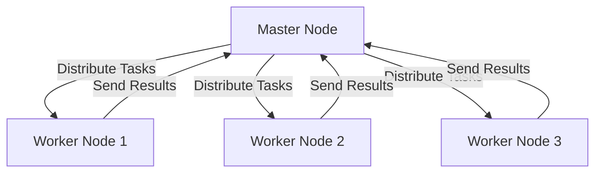

## 22.10 Large-Scale Distributed Systems Case Study

In this case study, we delve into the intricacies of designing and implementing large-scale distributed systems using Haskell. Our primary focus will be on leveraging Haskell's unique features and libraries, such as Cloud Haskell, to efficiently handle big data workloads. We will explore key design patterns like MapReduce, the actor model, and distributed messaging, which are essential for building scalable and fault-tolerant systems.

### Objective

The main objective of this case study is to provide a comprehensive understanding of how to design systems capable of processing large-scale data efficiently. We will demonstrate the application of various design patterns and Haskell-specific techniques to achieve this goal.

### Patterns Applied

1. **MapReduce**: A programming model used for processing large data sets with a distributed algorithm on a cluster.
2. **Actor Model**: A conceptual model to deal with concurrent computation, where "actors" are the universal primitives of concurrent computation.
3. **Distributed Messaging**: A method of communication between distributed systems, enabling them to exchange information and coordinate actions.

### Implementation

We will implement a distributed system using **Cloud Haskell**, a library that provides a set of abstractions for distributed computing in Haskell. Cloud Haskell allows us to build scalable and fault-tolerant applications by abstracting the complexities of distributed systems.

### References

- [Cloud Haskell](https://haskell-distributed.github.io/)

### Example: Processing Big Data Workloads Across a Cluster

#### Introduction to Cloud Haskell

Cloud Haskell is a distributed computing framework that brings Erlang-style concurrency and distribution to Haskell. It provides a set of abstractions for building distributed applications, including process management, messaging, and fault tolerance.

#### Setting Up the Environment

To get started with Cloud Haskell, ensure you have the necessary Haskell tools installed, such as GHC (Glasgow Haskell Compiler) and Cabal. You can install Cloud Haskell using Cabal:

```bash
cabal update
cabal install distributed-process
```

#### Designing the System

Let's design a system that processes large-scale data using the MapReduce pattern. Our system will consist of several components:

1. **Master Node**: Responsible for distributing tasks and collecting results.
2. **Worker Nodes**: Perform computations on data chunks and return results to the master node.
3. **Data Storage**: A distributed file system or database to store input and output data.

#### Implementing the Master Node

The master node coordinates the entire process. It divides the input data into chunks, assigns tasks to worker nodes, and aggregates the results.

```haskell
{-# LANGUAGE DeriveGeneric #-}

import Control.Distributed.Process
import Control.Distributed.Process.Node
import Control.Monad (forM_)
import Data.Binary
import GHC.Generics (Generic)
import Network.Transport.TCP (createTransport, defaultTCPParameters)

data Task = Task { taskId :: Int, taskData :: String }
  deriving (Generic, Show)

instance Binary Task

data Result = Result { resultId :: Int, resultData :: String }
  deriving (Generic, Show)

instance Binary Result

master :: [NodeId] -> Process ()
master workers = do
  let tasks = [Task i ("Data chunk " ++ show i) | i <- [1..10]]
  forM_ (zip tasks workers) $ \\(task, worker) -> do
    send worker task
  collectResults (length tasks)

collectResults :: Int -> Process ()
collectResults 0 = return ()
collectResults n = do
  Result _ resultData <- expect
  liftIO $ putStrLn $ "Received result: " ++ resultData
  collectResults (n - 1)
```

#### Implementing Worker Nodes

Worker nodes receive tasks from the master node, process the data, and send back the results.

```haskell
worker :: Process ()
worker = do
  Task taskId taskData <- expect
  let resultData = "Processed " ++ taskData
  send (processNodeId master) (Result taskId resultData)
```

#### Running the System

To run the system, we need to set up a network of nodes. Each node runs an instance of the Haskell runtime system, and they communicate over TCP.

```haskell
main :: IO ()
main = do
  Right transport <- createTransport "127.0.0.1" "10501" defaultTCPParameters
  node <- newLocalNode transport initRemoteTable
  runProcess node $ do
    masterPid <- spawnLocal $ master [nodeId node]
    spawnLocal worker
    return ()
```

### Visualizing the System Architecture

Below is a diagram representing the architecture of our distributed system using the MapReduce pattern.



**Diagram Description**: The master node distributes tasks to multiple worker nodes, which process the data and send results back to the master node.

### Key Considerations

- **Fault Tolerance**: Ensure that the system can handle node failures gracefully. Cloud Haskell provides mechanisms for monitoring and restarting failed processes.
- **Scalability**: Design the system to scale horizontally by adding more worker nodes as needed.
- **Data Distribution**: Use a distributed file system or database to store input and output data efficiently.

### Haskell Unique Features

Haskell's strong static typing and purity make it an excellent choice for building reliable distributed systems. The use of monads and type classes allows for elegant abstractions and composability.

### Differences and Similarities

- **MapReduce vs. Actor Model**: MapReduce is a data processing pattern, while the actor model is a concurrency model. Both can be used together to build distributed systems.
- **Distributed Messaging**: This pattern is essential for communication between nodes in a distributed system, regardless of the concurrency model used.

### Try It Yourself

Experiment with the code examples by modifying the number of tasks or worker nodes. Observe how the system behaves with different configurations and data sizes.

### Knowledge Check

- What are the key components of a distributed system using the MapReduce pattern?
- How does Cloud Haskell facilitate distributed computing in Haskell?
- What are the benefits of using Haskell for building distributed systems?

### Embrace the Journey

Remember, this is just the beginning. As you progress, you'll build more complex and interactive distributed systems. Keep experimenting, stay curious, and enjoy the journey!

## Quiz: Large-Scale Distributed Systems Case Study



### What is the primary role of the master node in a MapReduce system?

- [x] Distributing tasks and collecting results
- [ ] Processing data chunks
- [ ] Storing input and output data
- [ ] Monitoring worker nodes

> **Explanation:** The master node is responsible for distributing tasks to worker nodes and collecting the results.

### Which library is used in Haskell for distributed computing?

- [x] Cloud Haskell
- [ ] Haskell MPI
- [ ] Haskell Spark
- [ ] Haskell Hadoop

> **Explanation:** Cloud Haskell is a library that provides abstractions for distributed computing in Haskell.

### What is the actor model used for?

- [x] Concurrent computation
- [ ] Data storage
- [ ] Network communication
- [ ] User interface design

> **Explanation:** The actor model is a conceptual model for dealing with concurrent computation.

### How does Cloud Haskell handle node failures?

- [x] By providing mechanisms for monitoring and restarting failed processes
- [ ] By ignoring failed nodes
- [ ] By logging errors
- [ ] By sending alerts to administrators

> **Explanation:** Cloud Haskell includes mechanisms for monitoring and restarting failed processes to ensure fault tolerance.

### What is a key benefit of using Haskell for distributed systems?

- [x] Strong static typing and purity
- [ ] Dynamic typing
- [ ] Weak typing
- [ ] Lack of type safety

> **Explanation:** Haskell's strong static typing and purity contribute to building reliable distributed systems.

### Which pattern is essential for communication between nodes in a distributed system?

- [x] Distributed Messaging
- [ ] Singleton
- [ ] Observer
- [ ] Factory

> **Explanation:** Distributed messaging is crucial for communication between nodes in a distributed system.

### What is the main advantage of using the MapReduce pattern?

- [x] Efficient processing of large data sets
- [ ] Simplified user interfaces
- [ ] Enhanced security
- [ ] Reduced network latency

> **Explanation:** The MapReduce pattern is designed for efficient processing of large data sets.

### How can a distributed system be scaled horizontally?

- [x] By adding more worker nodes
- [ ] By increasing the CPU power of existing nodes
- [ ] By reducing the number of tasks
- [ ] By decreasing the data size

> **Explanation:** Horizontal scaling involves adding more worker nodes to handle increased load.

### What is the purpose of using a distributed file system in a distributed system?

- [x] To store input and output data efficiently
- [ ] To process data faster
- [ ] To reduce memory usage
- [ ] To simplify code

> **Explanation:** A distributed file system is used to store input and output data efficiently across multiple nodes.

### True or False: The actor model and MapReduce can be used together in a distributed system.

- [x] True
- [ ] False

> **Explanation:** The actor model and MapReduce can be combined to build distributed systems, as they address different aspects of computation and data processing.




