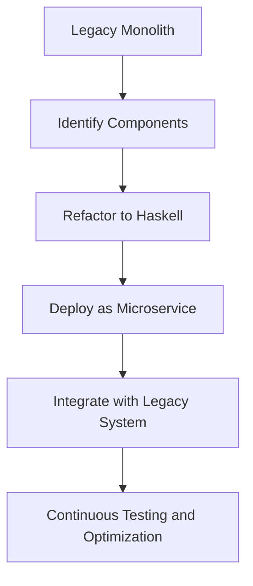

## 22.11 Refactoring Legacy Systems to Haskell

Refactoring legacy systems to Haskell is a strategic decision that can lead to significant improvements in reliability, maintainability, and scalability. This section explores the challenges, strategies, and benefits of migrating existing applications to Haskell, providing expert guidance for software engineers and architects.

### Introduction

Legacy systems are often the backbone of many organizations, providing critical functionality that has been developed and refined over many years. However, these systems can become difficult to maintain and evolve due to outdated technologies, complex codebases, and lack of modern programming paradigms. Haskell, with its strong emphasis on functional programming, immutability, and type safety, offers a compelling alternative for refactoring these systems.

### Challenges in Refactoring Legacy Systems

Refactoring legacy systems to Haskell involves several challenges that must be addressed to ensure a successful migration:

1. **Interoperability**: Legacy systems often rely on specific libraries, frameworks, or languages that may not have direct equivalents in Haskell. Ensuring seamless interoperability between existing components and new Haskell code is crucial.

2. **Gradual Replacement**: Completely rewriting a legacy system in Haskell may not be feasible due to time, cost, and risk constraints. A gradual replacement strategy allows for incremental migration, minimizing disruption.

3. **Complexity and Size**: Legacy systems can be large and complex, making it difficult to identify and isolate components for refactoring.

4. **Skill Gap**: Teams may lack experience with Haskell, requiring training and adaptation to new paradigms and tools.

5. **Performance Considerations**: Ensuring that the refactored system meets or exceeds the performance of the legacy system is essential.

### Strategies for Refactoring to Haskell

To address these challenges, several strategies can be employed:

#### 1. Foreign Function Interface (FFI)

The Foreign Function Interface (FFI) in Haskell allows for calling functions written in other languages, such as C. This can be used to integrate existing libraries or components that are not feasible to rewrite immediately.

```haskell
{-# LANGUAGE ForeignFunctionInterface #-}

import Foreign.C.Types

-- Example of calling a C function from Haskell
foreign import ccall "math.h sin" c_sin :: CDouble -> CDouble

main :: IO ()
main = do
    let angle = 1.0
    print (c_sin angle)
```

**Key Considerations**:
- Ensure proper memory management and error handling when interfacing with foreign code.
- Use FFI as a temporary solution while gradually replacing foreign components with Haskell equivalents.

#### 2. Microservices Architecture

Adopting a microservices architecture can facilitate the gradual replacement of legacy components with Haskell services. This approach allows for independent deployment, scaling, and development of individual services.

**Benefits**:
- **Isolation**: Each service can be developed, tested, and deployed independently.
- **Scalability**: Services can be scaled independently based on demand.
- **Flexibility**: Allows for a mix of technologies, enabling gradual migration to Haskell.

**Example**: Rewriting a critical component, such as an authentication service, in Haskell while maintaining the rest of the system in its original form.

#### 3. Domain-Driven Design (DDD)

Applying Domain-Driven Design principles can help in identifying and isolating core business logic that can be refactored into Haskell. This involves understanding the domain, defining bounded contexts, and creating a ubiquitous language.

**Steps**:
- **Identify Core Domains**: Focus on areas of the system that provide the most value and are most in need of refactoring.
- **Define Bounded Contexts**: Clearly delineate the boundaries of each domain to facilitate independent development.
- **Develop a Ubiquitous Language**: Ensure that all stakeholders have a common understanding of domain concepts.

#### 4. Incremental Refactoring

Incremental refactoring involves gradually replacing parts of the legacy system with Haskell components. This approach minimizes risk and allows for continuous delivery of new features and improvements.

**Process**:
- **Identify Candidates for Refactoring**: Focus on components that are high-risk, high-value, or frequently changed.
- **Develop Haskell Equivalents**: Implement the identified components in Haskell, ensuring feature parity and performance.
- **Integrate and Test**: Seamlessly integrate the new Haskell components with the existing system, conducting thorough testing to ensure compatibility.

### Example: Rewriting Critical Components in Haskell

Consider a legacy system responsible for processing financial transactions. The system is written in a combination of C++ and Java, with critical components such as transaction validation and risk assessment.

**Objective**: Refactor the transaction validation component to Haskell to leverage its strong type system and functional programming capabilities.

#### Step 1: Analyze the Existing Component

- **Understand the Logic**: Document the existing logic and identify key functions and data structures.
- **Identify Dependencies**: Determine external dependencies, such as databases or third-party services.

#### Step 2: Design the Haskell Solution

- **Define Data Types**: Use Haskell's algebraic data types to model transactions and validation rules.
- **Implement Core Logic**: Translate the existing logic into pure functions, leveraging Haskell's pattern matching and higher-order functions.

```haskell
data Transaction = Transaction
    { amount :: Double
    , currency :: String
    , accountId :: String
    } deriving (Show)

validateTransaction :: Transaction -> Either String Transaction
validateTransaction tx
    | amount tx <= 0 = Left "Invalid amount"
    | currency tx /= "USD" = Left "Unsupported currency"
    | otherwise = Right tx
```

#### Step 3: Integrate with the Legacy System

- **Use FFI**: If necessary, use FFI to call existing C++ functions or libraries.
- **Microservices Approach**: Deploy the Haskell component as a microservice, exposing a REST API for integration with the legacy system.

#### Step 4: Test and Optimize

- **Conduct Thorough Testing**: Ensure the new component meets all functional and performance requirements.
- **Optimize for Performance**: Use profiling tools to identify and address performance bottlenecks.

### Visualizing the Migration Process

Below is a diagram illustrating the migration process from a monolithic legacy system to a microservices architecture with Haskell components.



**Diagram Explanation**: This flowchart outlines the steps involved in refactoring a legacy monolith to a microservices architecture with Haskell components, emphasizing the iterative nature of the process.

### Haskell Unique Features

Haskell offers several unique features that make it particularly well-suited for refactoring legacy systems:

- **Strong Static Typing**: Haskell's type system helps catch errors at compile time, reducing runtime failures.
- **Immutability**: By default, data in Haskell is immutable, leading to safer and more predictable code.
- **Lazy Evaluation**: Haskell's lazy evaluation model allows for efficient handling of large data structures and complex computations.
- **Concurrency and Parallelism**: Haskell provides robust support for concurrent and parallel programming, essential for modern, scalable systems.

### Differences and Similarities with Other Patterns

Refactoring legacy systems to Haskell shares similarities with other migration patterns, such as:

- **Replatforming**: Moving to a new platform while maintaining existing functionality.
- **Rearchitecting**: Redesigning the system architecture to improve scalability and maintainability.

However, Haskell's functional programming paradigm introduces unique considerations, such as the need to adapt to immutability and pure functions.

### Design Considerations

When refactoring to Haskell, consider the following:

- **Performance**: Ensure that the refactored system meets performance requirements, leveraging Haskell's optimization capabilities.
- **Maintainability**: Focus on writing clean, idiomatic Haskell code that is easy to maintain and extend.
- **Risk Management**: Use incremental refactoring and thorough testing to mitigate risks associated with migration.

### Conclusion

Refactoring legacy systems to Haskell is a challenging but rewarding endeavor. By leveraging Haskell's strengths in functional programming, type safety, and concurrency, organizations can achieve significant improvements in reliability, maintainability, and scalability. Remember, this is just the beginning. As you progress, you'll build more complex and interactive systems. Keep experimenting, stay curious, and enjoy the journey!

### Knowledge Check

- **What are the key challenges in refactoring legacy systems to Haskell?**
- **How can the Foreign Function Interface (FFI) be used in the migration process?**
- **What are the benefits of adopting a microservices architecture during refactoring?**
- **How does Domain-Driven Design (DDD) aid in the refactoring process?**
- **What are the unique features of Haskell that make it suitable for refactoring legacy systems?**

### Exercises

1. **Identify a component in a legacy system you are familiar with. Outline a plan for refactoring it to Haskell, considering the challenges and strategies discussed.**

2. **Implement a simple Haskell microservice that performs a specific function from a legacy system. Integrate it with the existing system using FFI or a REST API.**

3. **Conduct a performance comparison between the legacy component and the refactored Haskell component. Analyze the results and identify areas for optimization.**

## Quiz: Refactoring Legacy Systems to Haskell



### What is a key challenge in refactoring legacy systems to Haskell?

- [x] Interoperability with existing components
- [ ] Lack of libraries in Haskell
- [ ] Haskell's inability to handle concurrency
- [ ] Difficulty in writing Haskell code

> **Explanation:** Interoperability with existing components is a significant challenge when refactoring legacy systems to Haskell, as it involves integrating new Haskell code with existing technologies.

### How can the Foreign Function Interface (FFI) assist in the migration process?

- [x] By allowing Haskell to call functions written in other languages
- [ ] By automatically converting legacy code to Haskell
- [ ] By providing a graphical interface for migration
- [ ] By optimizing Haskell code for performance

> **Explanation:** The FFI allows Haskell to call functions written in other languages, facilitating integration with existing libraries or components that are not feasible to rewrite immediately.

### What is a benefit of adopting a microservices architecture during refactoring?

- [x] Independent deployment and scaling of services
- [ ] Simplified codebase with fewer components
- [ ] Elimination of all legacy code
- [ ] Automatic performance improvements

> **Explanation:** A microservices architecture allows for independent deployment and scaling of services, making it easier to gradually replace legacy components with Haskell services.

### How does Domain-Driven Design (DDD) aid in the refactoring process?

- [x] By identifying and isolating core business logic for refactoring
- [ ] By providing a tool for automatic code conversion
- [ ] By simplifying the user interface
- [ ] By reducing the number of required developers

> **Explanation:** DDD helps in identifying and isolating core business logic that can be refactored into Haskell, ensuring a focused and effective migration process.

### What is a unique feature of Haskell that makes it suitable for refactoring legacy systems?

- [x] Strong static typing
- [ ] Dynamic typing
- [ ] Lack of concurrency support
- [ ] Object-oriented programming

> **Explanation:** Haskell's strong static typing helps catch errors at compile time, reducing runtime failures and making it suitable for refactoring legacy systems.

### Which strategy involves gradually replacing parts of the legacy system with Haskell components?

- [x] Incremental refactoring
- [ ] Complete rewrite
- [ ] Automated migration
- [ ] Code obfuscation

> **Explanation:** Incremental refactoring involves gradually replacing parts of the legacy system with Haskell components, minimizing risk and allowing for continuous delivery.

### What is a key benefit of using Haskell's lazy evaluation in refactoring?

- [x] Efficient handling of large data structures
- [ ] Immediate execution of all expressions
- [ ] Simplified error handling
- [ ] Automatic code optimization

> **Explanation:** Haskell's lazy evaluation model allows for efficient handling of large data structures and complex computations, which is beneficial in refactoring.

### How can Haskell's type system aid in refactoring legacy systems?

- [x] By catching errors at compile time
- [ ] By allowing runtime type changes
- [ ] By eliminating the need for testing
- [ ] By simplifying the code syntax

> **Explanation:** Haskell's type system helps catch errors at compile time, reducing runtime failures and aiding in the refactoring process.

### What is a common pitfall when using FFI in Haskell?

- [x] Improper memory management
- [ ] Lack of performance benefits
- [ ] Difficulty in writing Haskell code
- [ ] Incompatibility with all foreign languages

> **Explanation:** Improper memory management is a common pitfall when using FFI in Haskell, as it involves interfacing with foreign code that may not adhere to Haskell's memory safety guarantees.

### True or False: Haskell's immutability by default leads to safer and more predictable code.

- [x] True
- [ ] False

> **Explanation:** True. Haskell's immutability by default leads to safer and more predictable code, as it eliminates side effects and ensures data consistency.


