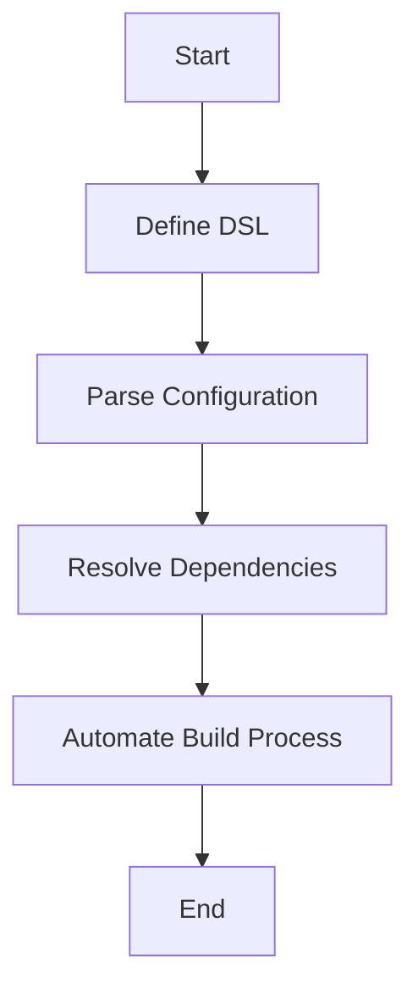

## 22.12 Building a Package Manager or Build Tool

Creating a package manager or build tool is a complex task that requires a deep understanding of software architecture, dependency management, and the specific needs of the ecosystem it serves. In this section, we will explore how to build such tools using Haskell, leveraging its powerful type system, functional programming paradigms, and advanced design patterns.

### Introduction

Package managers and build tools are essential components of modern software development. They automate the process of downloading, installing, updating, and managing software packages, as well as compiling and building software projects. Examples include `npm` for JavaScript, `pip` for Python, and `Cabal` or `Stack` for Haskell.

#### Key Concepts

- **Dependency Resolution**: The process of determining which versions of software packages are compatible with each other.
- **Build Automation**: Automating the compilation and linking of source code into executable programs.
- **Configuration Management**: Handling the configuration files that dictate how software should be built and run.

### Patterns Used

#### Domain-Specific Languages (DSLs)

DSLs are specialized languages tailored to a specific application domain. In the context of package managers and build tools, DSLs can be used to define configuration files, build scripts, and dependency specifications.

#### Dependency Resolution Algorithms

These algorithms are crucial for determining the correct versions of packages to install, ensuring compatibility and avoiding conflicts.

### Implementation

#### Leveraging Haskell's Parsing and Type System

Haskell's strong type system and powerful parsing libraries make it an excellent choice for building package managers and build tools. Libraries like `Parsec` and `Megaparsec` can be used to parse configuration files, while Haskell's type system ensures that dependencies and configurations are handled safely and correctly.

### Example: Developing a Build Tool Similar to Stack or Cabal

Let's walk through the process of developing a simple build tool using Haskell. We'll focus on key components such as parsing configuration files, resolving dependencies, and automating the build process.

#### Step 1: Define the DSL for Configuration

First, we need to define a DSL for our configuration files. This DSL will specify the dependencies and build instructions for a project.

```haskell
{-# LANGUAGE OverloadedStrings #-}

import Text.Megaparsec
import Text.Megaparsec.Char
import Data.Void
import Data.Text (Text)

type Parser = Parsec Void Text

data Dependency = Dependency
  { depName :: String
  , depVersion :: String
  } deriving (Show)

data Config = Config
  { projectName :: String
  , dependencies :: [Dependency]
  } deriving (Show)

parseConfig :: Parser Config
parseConfig = do
  _ <- string "project"
  space1
  name <- some letterChar
  space1
  _ <- string "dependencies"
  space1
  deps <- parseDependencies
  return $ Config name deps

parseDependencies :: Parser [Dependency]
parseDependencies = many parseDependency

parseDependency :: Parser Dependency
parseDependency = do
  name <- some letterChar
  space1
  version <- some (digitChar <|> char '.')
  space
  return $ Dependency name version
```

#### Step 2: Implement Dependency Resolution

Next, we need to implement a dependency resolution algorithm. This involves checking the specified dependencies against available versions and resolving any conflicts.

```haskell
resolveDependencies :: [Dependency] -> IO [Dependency]
resolveDependencies deps = do
  -- Simulate fetching available versions from a repository
  let availableVersions = [("base", "4.14.0.0"), ("containers", "0.6.2.1")]
  return $ filter (\d -> any (\\(n, v) -> n == depName d && v == depVersion d) availableVersions) deps
```

#### Step 3: Automate the Build Process

Finally, we automate the build process by compiling the source code and linking it into an executable. This step will vary depending on the specific requirements of the project and the tools available.

```haskell
buildProject :: Config -> IO ()
buildProject config = do
  putStrLn $ "Building project: " ++ projectName config
  resolvedDeps <- resolveDependencies (dependencies config)
  putStrLn $ "Resolved dependencies: " ++ show resolvedDeps
  -- Simulate the build process
  putStrLn "Compiling source code..."
  putStrLn "Linking executable..."
  putStrLn "Build successful!"
```

### Visualizing the Process

Below is a flowchart illustrating the process of building a package manager or build tool in Haskell:



### Haskell Unique Features

Haskell's unique features, such as its strong static typing, lazy evaluation, and powerful abstraction capabilities, make it particularly well-suited for building robust and reliable package managers and build tools. The language's emphasis on pure functions and immutability ensures that side effects are minimized, leading to more predictable and maintainable code.

### Differences and Similarities

While package managers and build tools share common goals, they differ in their specific implementations and focus areas. Package managers primarily handle the installation and management of software packages, while build tools focus on compiling and linking source code. However, both require careful handling of dependencies and configurations.

### Design Considerations

When designing a package manager or build tool, consider the following:

- **Scalability**: Ensure that the tool can handle large projects with many dependencies.
- **Usability**: Provide a user-friendly interface and clear documentation.
- **Extensibility**: Allow for easy addition of new features and support for different languages or platforms.

### Try It Yourself

Experiment with the provided code examples by modifying the configuration DSL or implementing additional features such as version constraints or custom build steps. This hands-on approach will deepen your understanding of the concepts discussed.

### Knowledge Check

- What are the key components of a package manager or build tool?
- How does Haskell's type system aid in dependency resolution?
- What are the benefits of using a DSL for configuration files?

### Embrace the Journey

Building a package manager or build tool is a challenging but rewarding endeavor. As you progress, you'll gain valuable insights into software architecture, dependency management, and the power of Haskell's functional programming paradigm. Keep experimenting, stay curious, and enjoy the journey!

## Quiz: Building a Package Manager or Build Tool



### What is a key benefit of using Haskell for building package managers?

- [x] Strong static typing
- [ ] Dynamic typing
- [ ] Weak typing
- [ ] No typing

> **Explanation:** Haskell's strong static typing helps ensure that dependencies and configurations are handled safely and correctly.

### Which library is commonly used in Haskell for parsing configuration files?

- [x] Megaparsec
- [ ] NumPy
- [ ] React
- [ ] Flask

> **Explanation:** Megaparsec is a popular parsing library in Haskell used for parsing configuration files.

### What is the primary focus of a build tool?

- [x] Compiling and linking source code
- [ ] Installing software packages
- [ ] Managing user accounts
- [ ] Designing user interfaces

> **Explanation:** Build tools focus on compiling and linking source code into executable programs.

### What does DSL stand for in the context of configuration files?

- [x] Domain-Specific Language
- [ ] Data Science Language
- [ ] Distributed System Language
- [ ] Dynamic Scripting Language

> **Explanation:** DSL stands for Domain-Specific Language, which is used to define configuration files and build scripts.

### Which of the following is a common task for a package manager?

- [x] Dependency resolution
- [ ] User authentication
- [ ] Image rendering
- [ ] Network routing

> **Explanation:** Dependency resolution is a common task for package managers, ensuring compatibility between software packages.

### What is a key consideration when designing a package manager?

- [x] Scalability
- [ ] Color scheme
- [ ] Font size
- [ ] Screen resolution

> **Explanation:** Scalability is important to ensure that the package manager can handle large projects with many dependencies.

### How does Haskell's lazy evaluation benefit package manager development?

- [x] Minimizes side effects
- [ ] Increases side effects
- [ ] Decreases performance
- [ ] Complicates code

> **Explanation:** Haskell's lazy evaluation minimizes side effects, leading to more predictable and maintainable code.

### What is the purpose of a dependency resolution algorithm?

- [x] Determine compatible package versions
- [ ] Encrypt user data
- [ ] Render graphics
- [ ] Manage network connections

> **Explanation:** Dependency resolution algorithms determine which versions of software packages are compatible with each other.

### Which of the following is a feature of Haskell that aids in building reliable tools?

- [x] Immutability
- [ ] Mutability
- [ ] Dynamic typing
- [ ] Weak typing

> **Explanation:** Haskell's immutability ensures that data cannot be changed once created, leading to more reliable tools.

### True or False: Package managers and build tools have the same primary focus.

- [ ] True
- [x] False

> **Explanation:** Package managers primarily handle the installation and management of software packages, while build tools focus on compiling and linking source code.



By following this guide, you will gain a comprehensive understanding of how to build a package manager or build tool using Haskell. This knowledge will empower you to create robust, scalable, and efficient tools that can handle complex software projects.


