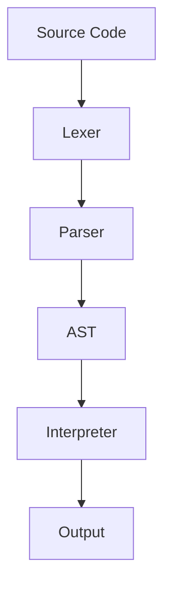

## 22.2 Building a Compiler or Interpreter

Building a compiler or interpreter is a fascinating journey that combines theory with practical application. In this section, we will explore how to create a language processor using Haskell, leveraging its powerful functional programming features and design patterns. Our focus will be on the Interpreter pattern and the use of monads for state and error handling. We will also delve into parsing expressions using libraries like **Parsec** or **Megaparsec**.

### Objective

The primary objective of this guide is to provide you with the knowledge and tools necessary to build a compiler or interpreter in Haskell. We will cover the essential components, from parsing to evaluation, and demonstrate how to develop a domain-specific language (DSL) and its compiler.

### Patterns Applied

- **Interpreter Pattern**: This pattern is used to define a representation of the grammar of a language and an interpreter that uses the representation to interpret sentences in the language.
- **Monads for State and Error Handling**: Monads provide a way to handle side effects, such as state and errors, in a functional programming context.

### Implementation Overview

1. **Parsing**: Use libraries like **Parsec** or **Megaparsec** to parse expressions.
2. **Abstract Syntax Tree (AST)**: Define an AST to represent the structure of the parsed code.
3. **Evaluation**: Implement an interpreter to evaluate the AST.
4. **Error Handling**: Use monads to manage errors and state during parsing and evaluation.

### Parsing with Parsec and Megaparsec

Parsing is the first step in building a compiler or interpreter. It involves analyzing a sequence of tokens to determine its grammatical structure. Haskell provides powerful libraries like **Parsec** and **Megaparsec** for this purpose.

#### Introduction to Parsec and Megaparsec

**Parsec** and **Megaparsec** are libraries for constructing parsers in Haskell. They allow you to define parsers in a declarative style, making it easier to read and maintain.

- **Parsec**: A mature library for parsing text.
- **Megaparsec**: An advanced version of Parsec with additional features and better error messages.

#### Basic Parsing Example

Let's start with a simple example of parsing arithmetic expressions using Megaparsec.

```haskell
{-# LANGUAGE OverloadedStrings #-}

import Text.Megaparsec
import Text.Megaparsec.Char
import Data.Void

type Parser = Parsec Void String

data Expr
  = Add Expr Expr
  | Sub Expr Expr
  | Mul Expr Expr
  | Div Expr Expr
  | Lit Integer
  deriving (Show)

parseExpr :: Parser Expr
parseExpr = makeExprParser term operatorTable

term :: Parser Expr
term = parens parseExpr <|> literal

literal :: Parser Expr
literal = Lit <$> lexeme L.decimal

operatorTable :: [[Operator Parser Expr]]
operatorTable =
  [ [ InfixL (Mul <$ symbol "*")
    , InfixL (Div <$ symbol "/") ]
  , [ InfixL (Add <$ symbol "+")
    , InfixL (Sub <$ symbol "-") ]
  ]

lexeme :: Parser a -> Parser a
lexeme = L.lexeme space

symbol :: String -> Parser String
symbol = L.symbol space

parens :: Parser a -> Parser a
parens = between (symbol "(") (symbol ")")
```

In this example, we define a simple arithmetic expression parser using Megaparsec. The `Expr` data type represents the abstract syntax tree (AST) for arithmetic expressions. The `parseExpr` function uses `makeExprParser` to handle operator precedence.

### Abstract Syntax Tree (AST)

The AST is a crucial component of a compiler or interpreter. It represents the structure of the parsed code in a tree format, where each node corresponds to a construct in the language.

#### Defining the AST

In our example, the `Expr` data type serves as the AST for arithmetic expressions. Each constructor of `Expr` represents a different kind of expression, such as addition, subtraction, multiplication, division, or a literal integer.

### Evaluation

Once we have the AST, the next step is to evaluate it. This involves traversing the AST and performing the operations it represents.

#### Implementing the Interpreter

Let's implement a simple interpreter for our arithmetic expressions.

```haskell
evaluate :: Expr -> Integer
evaluate (Lit n) = n
evaluate (Add x y) = evaluate x + evaluate y
evaluate (Sub x y) = evaluate x - evaluate y
evaluate (Mul x y) = evaluate x * evaluate y
evaluate (Div x y) = evaluate x `div` evaluate y
```

The `evaluate` function recursively traverses the AST and performs the corresponding arithmetic operations.

### Error Handling with Monads

Error handling is an essential aspect of building a robust compiler or interpreter. Monads provide a powerful way to manage errors in a functional programming context.

#### Using the Either Monad

The `Either` monad is commonly used for error handling in Haskell. It represents a computation that can either result in a value (`Right`) or an error (`Left`).

```haskell
evaluateSafe :: Expr -> Either String Integer
evaluateSafe (Lit n) = Right n
evaluateSafe (Add x y) = (+) <$> evaluateSafe x <*> evaluateSafe y
evaluateSafe (Sub x y) = (-) <$> evaluateSafe x <*> evaluateSafe y
evaluateSafe (Mul x y) = (*) <$> evaluateSafe x <*> evaluateSafe y
evaluateSafe (Div x y) = do
  denominator <- evaluateSafe y
  if denominator == 0
    then Left "Division by zero"
    else (`div` denominator) <$> evaluateSafe x
```

In this example, `evaluateSafe` uses the `Either` monad to handle errors, such as division by zero.

### Developing a Domain-Specific Language (DSL)

A domain-specific language (DSL) is a language tailored to a specific application domain. Building a DSL involves defining its syntax, semantics, and implementation.

#### Example: A Simple DSL for Arithmetic

Let's extend our arithmetic expression parser and interpreter to create a simple DSL.

```haskell
data Statement
  = Assign String Expr
  | Print Expr
  deriving (Show)

type Environment = [(String, Integer)]

interpret :: [Statement] -> Environment -> IO Environment
interpret [] env = return env
interpret (stmt:stmts) env = do
  env' <- interpretStmt stmt env
  interpret stmts env'

interpretStmt :: Statement -> Environment -> IO Environment
interpretStmt (Assign var expr) env = do
  let value = evaluate expr
  return ((var, value) : env)
interpretStmt (Print expr) env = do
  print (evaluate expr)
  return env
```

In this example, we define a simple DSL with two statements: `Assign` for variable assignment and `Print` for printing expressions. The `interpret` function evaluates a list of statements in a given environment.

### Visualizing the Compiler Architecture

To better understand the architecture of our compiler or interpreter, let's visualize the process using a flowchart.



**Diagram Description**: This flowchart illustrates the process of building a compiler or interpreter. The source code is first processed by a lexer, which tokenizes the input. The parser then analyzes the tokens to produce an abstract syntax tree (AST). Finally, the interpreter evaluates the AST to produce the output.

### References

- [Megaparsec](https://hackage.haskell.org/package/megaparsec): A powerful parsing library for Haskell.

### Try It Yourself

Experiment with the code examples provided in this guide. Try modifying the parser to support additional arithmetic operations or extend the DSL with new statements. This hands-on approach will deepen your understanding of building a compiler or interpreter in Haskell.

### Knowledge Check

- What is the role of an abstract syntax tree (AST) in a compiler or interpreter?
- How can monads be used for error handling in Haskell?
- What are the benefits of using a library like Megaparsec for parsing?

### Embrace the Journey

Building a compiler or interpreter is a challenging yet rewarding endeavor. As you progress, you'll gain a deeper understanding of language design and implementation. Remember, this is just the beginning. Keep experimenting, stay curious, and enjoy the journey!

## Quiz: Building a Compiler or Interpreter



### What is the primary role of an abstract syntax tree (AST) in a compiler or interpreter?

- [x] To represent the structure of the parsed code
- [ ] To execute the code directly
- [ ] To tokenize the input
- [ ] To handle errors during parsing

> **Explanation:** The AST represents the structure of the parsed code, serving as an intermediate representation between parsing and evaluation.

### Which library is commonly used in Haskell for parsing expressions?

- [x] Megaparsec
- [ ] QuickCheck
- [ ] Hspec
- [ ] Aeson

> **Explanation:** Megaparsec is a powerful library for constructing parsers in Haskell.

### How does the `Either` monad help in error handling?

- [x] It represents computations that can result in a value or an error
- [ ] It only handles state management
- [ ] It is used for logging
- [ ] It is used for concurrency

> **Explanation:** The `Either` monad is used for computations that can result in either a value (`Right`) or an error (`Left`).

### What is the purpose of the `evaluate` function in our interpreter?

- [x] To traverse the AST and perform operations
- [ ] To parse the input code
- [ ] To tokenize the source code
- [ ] To handle errors

> **Explanation:** The `evaluate` function traverses the AST and performs the corresponding operations to produce a result.

### Which of the following is a statement in our simple DSL?

- [x] Assign
- [x] Print
- [ ] Loop
- [ ] Function

> **Explanation:** Our simple DSL includes `Assign` for variable assignment and `Print` for printing expressions.

### What does the `makeExprParser` function do in Megaparsec?

- [x] It handles operator precedence in parsing expressions
- [ ] It evaluates expressions
- [ ] It tokenizes the input
- [ ] It manages state

> **Explanation:** `makeExprParser` is used to handle operator precedence when parsing expressions.

### How can you extend the DSL to support new statements?

- [x] By adding new constructors to the `Statement` data type
- [ ] By modifying the `evaluate` function
- [ ] By changing the `Either` monad
- [ ] By using a different parsing library

> **Explanation:** To extend the DSL, you can add new constructors to the `Statement` data type and update the interpreter accordingly.

### What is the benefit of using a declarative style for defining parsers?

- [x] It makes the code easier to read and maintain
- [ ] It improves performance
- [ ] It reduces memory usage
- [ ] It simplifies error handling

> **Explanation:** A declarative style for defining parsers makes the code more readable and maintainable.

### What is the role of the `interpret` function in our DSL?

- [x] To evaluate a list of statements in a given environment
- [ ] To parse the input code
- [ ] To handle errors
- [ ] To tokenize the source code

> **Explanation:** The `interpret` function evaluates a list of statements in a given environment, updating the environment as needed.

### True or False: The `evaluateSafe` function uses the `Either` monad to handle errors.

- [x] True
- [ ] False

> **Explanation:** The `evaluateSafe` function uses the `Either` monad to handle errors, such as division by zero.


