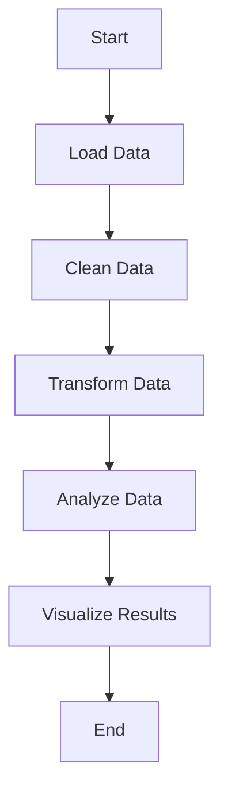

## 22.3 Data Science and Machine Learning Applications

In this section, we delve into the application of Haskell in the realm of data science and machine learning. Haskell, with its strong type system and functional programming paradigms, offers unique advantages for building robust and efficient data-driven applications. We will explore key libraries, design patterns, and practical examples to illustrate how Haskell can be effectively used for data analysis and modeling.

### Introduction to Haskell in Data Science

Haskell's functional nature makes it an excellent choice for data science, where transformations and data manipulations are core activities. The language's emphasis on immutability, pure functions, and strong typing ensures that data transformations are predictable and reliable. Moreover, Haskell's lazy evaluation model allows for efficient handling of large datasets.

#### Why Use Haskell for Data Science?

- **Immutability**: Ensures data integrity and simplifies reasoning about code.
- **Strong Typing**: Catches errors at compile time, reducing runtime failures.
- **Concurrency**: Haskell's concurrency model is well-suited for parallel data processing.
- **Expressiveness**: Functional programming paradigms allow for concise and expressive data transformations.

### Key Tools and Libraries

To harness Haskell's power for data science, several libraries provide the necessary tools for numerical computations and data manipulation.

#### HMatrix

HMatrix is a comprehensive library for numerical computations in Haskell. It provides functionalities for linear algebra, including matrix operations, eigenvalue computations, and more.

- **Installation**: You can install HMatrix using Cabal or Stack.

```bash
cabal install hmatrix
```

- **Basic Usage**: Here's a simple example demonstrating matrix multiplication using HMatrix.

```haskell
import Numeric.LinearAlgebra

main :: IO ()
main = do
    let a = (3><3) [1..9] :: Matrix Double
        b = (3><3) [9,8..1] :: Matrix Double
        c = a <> b
    print c
```

- **Explanation**: In this example, we define two 3x3 matrices `a` and `b` and perform matrix multiplication using the `<>` operator.

#### Accelerate

Accelerate is a library for high-performance array computations in Haskell, designed to leverage GPU acceleration for intensive computations.

- **Installation**: Install Accelerate via Cabal or Stack.

```bash
cabal install accelerate
```

- **Basic Usage**: Below is an example of using Accelerate for parallel array processing.

```haskell
import Data.Array.Accelerate as A
import Data.Array.Accelerate.LLVM.Native as CPU

main :: IO ()
main = do
    let arr = fromList (Z :. 10) [0..9] :: Vector Int
    let result = CPU.run $ A.map (+1) (use arr)
    print result
```

- **Explanation**: This example demonstrates how to increment each element of an array using GPU acceleration.

### Design Patterns in Haskell for Data Science

Haskell's functional programming paradigms lend themselves well to certain design patterns that are particularly useful in data science applications.

#### Monadic Pipelines

Monadic pipelines allow for chaining operations in a clean and readable manner, which is particularly useful for data processing workflows.

- **Example**: Consider a data processing pipeline that reads data, filters it, and then applies a transformation.

```haskell
import Control.Monad

processData :: [Int] -> [Int]
processData = filter even >=> map (*2)

main :: IO ()
main = do
    let data = [1..10]
    print $ processData data
```

- **Explanation**: Here, we use the `>=>` operator to compose two functions: filtering even numbers and doubling them.

#### Functional Transformations

Functional transformations involve using higher-order functions to manipulate data, a common requirement in data science.

- **Example**: Using `map` and `fold` to compute the sum of squares.

```haskell
sumOfSquares :: [Int] -> Int
sumOfSquares = foldr (+) 0 . map (^2)

main :: IO ()
main = do
    let data = [1..5]
    print $ sumOfSquares data
```

- **Explanation**: This example demonstrates how to transform a list by squaring each element and then summing the results.

### Implementing Machine Learning Algorithms

Haskell can be used to implement machine learning algorithms in a functional style, leveraging its powerful abstractions.

#### Linear Regression

Linear regression is a fundamental machine learning algorithm used for predictive modeling.

- **Implementation**: Below is a simple implementation of linear regression using HMatrix.

```haskell
import Numeric.LinearAlgebra

linearRegression :: Matrix Double -> Vector Double -> Vector Double
linearRegression x y = inv (tr x <> x) <> tr x <> y

main :: IO ()
main = do
    let x = (3><2) [1,1,1,2,1,3] :: Matrix Double
        y = vector [1,2,3] :: Vector Double
    print $ linearRegression x y
```

- **Explanation**: This code performs linear regression by computing the coefficients that minimize the error between the predicted and actual values.

#### K-Means Clustering

K-Means is a popular clustering algorithm used to partition data into distinct groups.

- **Implementation**: Here's a basic implementation of K-Means clustering.

```haskell
import Numeric.LinearAlgebra
import Data.List (minimumBy)
import Data.Function (on)

kMeans :: Int -> [Vector Double] -> [Vector Double]
kMeans k points = iterate (updateCentroids points) initialCentroids !! 10
  where
    initialCentroids = take k points
    updateCentroids pts centroids = map (mean . flip cluster pts) centroids
    cluster c = filter ((== c) . closest centroids)
    closest cs p = minimumBy (compare `on` distance p) cs
    distance p1 p2 = norm_2 (p1 - p2)
    mean vs = sum vs / fromIntegral (length vs)

main :: IO ()
main = do
    let points = [vector [1,2], vector [2,3], vector [3,4], vector [5,6]]
    print $ kMeans 2 points
```

- **Explanation**: This implementation initializes centroids and iteratively updates them based on the mean of assigned points.

### Visualizing Data Science Workflows

Visualizing data science workflows can help in understanding the flow of data and transformations applied. Below is a simple flowchart representing a typical data processing pipeline.



- **Description**: This flowchart illustrates the sequential steps in a data processing workflow, from loading data to visualizing results.

### References and Further Reading

- [HMatrix Documentation](https://hackage.haskell.org/package/hmatrix)
- [Accelerate Documentation](https://hackage.haskell.org/package/accelerate)
- [Functional Programming in Haskell](https://www.oreilly.com/library/view/functional-programming-in/9781492042659/)

### Knowledge Check

- **Question**: What are the benefits of using Haskell for data science?
- **Exercise**: Implement a simple logistic regression algorithm using HMatrix.

### Embrace the Journey

Remember, this is just the beginning. As you progress, you'll build more complex data science applications using Haskell. Keep experimenting, stay curious, and enjoy the journey!

## Quiz: Data Science and Machine Learning Applications



### What is a key advantage of using Haskell for data science?

- [x] Strong typing and immutability
- [ ] Dynamic typing
- [ ] Object-oriented design
- [ ] Weak typing

> **Explanation:** Haskell's strong typing and immutability ensure data integrity and reduce runtime errors.

### Which library is used for GPU computations in Haskell?

- [ ] HMatrix
- [x] Accelerate
- [ ] QuickCheck
- [ ] Aeson

> **Explanation:** Accelerate is designed for high-performance array computations and can leverage GPU acceleration.

### What is the purpose of the `<>` operator in HMatrix?

- [x] Matrix multiplication
- [ ] Element-wise addition
- [ ] Transposing a matrix
- [ ] Inverting a matrix

> **Explanation:** The `<>` operator is used for matrix multiplication in HMatrix.

### How does Haskell's lazy evaluation benefit data science applications?

- [x] Efficient handling of large datasets
- [ ] Faster execution of small datasets
- [ ] Simplifies syntax
- [ ] Reduces memory usage

> **Explanation:** Lazy evaluation allows Haskell to process large datasets efficiently without loading everything into memory at once.

### What is the `>=>` operator used for in Haskell?

- [x] Composing monadic functions
- [ ] Defining new data types
- [ ] Performing arithmetic operations
- [ ] Creating lists

> **Explanation:** The `>=>` operator is used to compose monadic functions, allowing for clean and readable pipelines.

### Which pattern is commonly used for chaining operations in data processing workflows?

- [x] Monadic pipelines
- [ ] Singleton pattern
- [ ] Observer pattern
- [ ] Factory pattern

> **Explanation:** Monadic pipelines allow for chaining operations in a clean and readable manner, ideal for data processing.

### What is a common use case for the Accelerate library?

- [x] Parallel array processing
- [ ] String manipulation
- [ ] Database queries
- [ ] Web development

> **Explanation:** Accelerate is used for parallel array processing, leveraging GPU acceleration for intensive computations.

### What does the `map` function do in Haskell?

- [x] Applies a function to each element of a list
- [ ] Filters elements of a list
- [ ] Reduces a list to a single value
- [ ] Sorts a list

> **Explanation:** The `map` function applies a given function to each element of a list, transforming it.

### True or False: Haskell's type system can catch errors at runtime.

- [ ] True
- [x] False

> **Explanation:** Haskell's strong type system catches errors at compile time, reducing runtime failures.

### What is the primary focus of the HMatrix library?

- [x] Numerical computations and linear algebra
- [ ] Web development
- [ ] Text processing
- [ ] Network programming

> **Explanation:** HMatrix is focused on numerical computations and provides functionalities for linear algebra.


