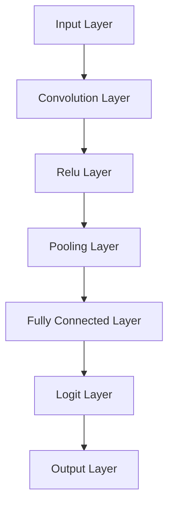

## 22.4 Neural Networks and AI Patterns in Haskell

In this section, we delve into the fascinating world of neural networks and AI patterns within the Haskell programming language. As expert software engineers and architects, you are likely familiar with the imperative approaches to building neural networks. However, Haskell offers a unique perspective by leveraging functional programming paradigms to create efficient, scalable, and maintainable AI models.

### Introduction to Neural Networks in Haskell

Neural networks are computational models inspired by the human brain, designed to recognize patterns and make decisions. In Haskell, we can harness the power of functional programming to represent these networks in a concise and expressive manner. The key lies in understanding how functional patterns can be applied to model the layers, neurons, and connections within a neural network.

#### Why Use Haskell for Neural Networks?

- **Expressiveness**: Haskell's type system and higher-order functions allow for clear and concise representation of neural network architectures.
- **Immutability**: Ensures that data structures remain unchanged, reducing the risk of side effects and bugs.
- **Lazy Evaluation**: Enables efficient handling of large datasets and complex computations.
- **Concurrency**: Haskell's lightweight concurrency model facilitates parallel processing, crucial for training large networks.

### Functional Patterns for Neural Networks

Functional programming offers several patterns that can be effectively applied to neural networks:

1. **Higher-Order Functions**: Use functions as first-class citizens to define layers and activation functions.
2. **Monads**: Manage state and side effects during training and evaluation.
3. **Type Classes**: Define generic interfaces for different types of layers and networks.
4. **Recursion**: Implement iterative processes such as backpropagation.

### Building Neural Networks with Grenade

Grenade is a Haskell library designed for deep learning, providing tools to build and train neural networks. It leverages Haskell's functional nature to offer a unique approach to AI development.

#### Getting Started with Grenade

To begin using Grenade, ensure you have Haskell and Cabal installed. You can then add Grenade to your project by including it in your Cabal file:

```haskell
build-depends: base >=4.7 && <5, grenade
```

#### Example: Building a Convolutional Neural Network

Let's walk through the process of building a simple convolutional neural network (CNN) using Grenade.

##### Step 1: Define the Network Architecture

In Grenade, you define a network using a type-level list that specifies the layers and their configurations.

```haskell
{-# LANGUAGE DataKinds #-}
{-# LANGUAGE TypeOperators #-}

import Grenade

type MyNetwork = Network '[ Convolution 'D2 28 28 1 5 5 1 1
                          , Relu
                          , Pooling 'D2 24 24 2 2 2 2
                          , FullyConnected 288 10
                          , Logit
                          ] '[ 'D2 28 28 1, 'D2 24 24 5, 'D2 12 12 5, 'D1 288, 'D1 10 ]
```

- **Convolution Layer**: Extracts features from the input image.
- **Relu Layer**: Introduces non-linearity.
- **Pooling Layer**: Reduces dimensionality.
- **Fully Connected Layer**: Maps features to output classes.
- **Logit Layer**: Applies the softmax function for classification.

##### Step 2: Initialize the Network

Initialize the network with random weights:

```haskell
import Grenade.Core

main :: IO ()
main = do
  net <- randomNetwork
  putStrLn "Network initialized."
```

##### Step 3: Train the Network

Training involves feeding data through the network and updating weights based on the error.

```haskell
trainNetwork :: MyNetwork -> [TrainingData] -> MyNetwork
trainNetwork net data = foldl' trainStep net data
  where
    trainStep n (input, target) = train n input target
```

- **Training Data**: Consists of input-output pairs.
- **Train Function**: Updates the network weights.

##### Step 4: Evaluate the Network

Evaluate the network's performance on test data:

```haskell
evaluateNetwork :: MyNetwork -> [TestData] -> Double
evaluateNetwork net data = accuracy
  where
    accuracy = calculateAccuracy net data
```

### Visualizing Neural Network Architecture

To better understand the flow of data through the network, let's visualize the architecture using a Mermaid.js diagram.



**Diagram Description**: This flowchart illustrates the progression of data through a convolutional neural network, highlighting the transformation at each layer.

### Haskell Unique Features in AI Patterns

Haskell's unique features enhance the implementation of AI patterns:

- **Type Safety**: Ensures correctness of network configurations.
- **Lazy Evaluation**: Efficiently handles large datasets.
- **Pure Functions**: Simplifies reasoning about code behavior.

### Differences and Similarities with Other Patterns

While neural networks in Haskell share similarities with traditional imperative implementations, the functional approach emphasizes immutability and type safety. This can lead to more robust and maintainable code.

### Try It Yourself

Experiment with the provided code by modifying the network architecture or training parameters. Observe how changes affect the network's performance.

### Knowledge Check

- **Question**: What are the benefits of using Haskell for neural networks?
- **Challenge**: Modify the CNN to include additional layers and observe the impact on accuracy.

### Summary

In this section, we explored the application of functional programming patterns to neural networks in Haskell. By leveraging libraries like Grenade, we can build efficient and expressive AI models. Remember, this is just the beginning. As you continue your journey, you'll discover more advanced techniques and patterns to enhance your AI projects.

## Quiz: Neural Networks and AI Patterns in Haskell



### What is a key advantage of using Haskell for neural networks?

- [x] Type safety and immutability
- [ ] Dynamic typing
- [ ] Lack of concurrency support
- [ ] Imperative programming style

> **Explanation:** Haskell's type safety and immutability ensure robust and error-free neural network implementations.

### Which library is commonly used for deep learning in Haskell?

- [x] Grenade
- [ ] TensorFlow
- [ ] PyTorch
- [ ] Keras

> **Explanation:** Grenade is a Haskell library specifically designed for deep learning.

### What is the purpose of the Relu layer in a neural network?

- [x] Introduce non-linearity
- [ ] Reduce dimensionality
- [ ] Extract features
- [ ] Apply softmax function

> **Explanation:** The Relu layer introduces non-linearity, allowing the network to learn complex patterns.

### How does Haskell's lazy evaluation benefit neural networks?

- [x] Efficient handling of large datasets
- [ ] Faster execution of imperative code
- [ ] Simplified debugging
- [ ] Enhanced dynamic typing

> **Explanation:** Lazy evaluation allows Haskell to efficiently handle large datasets by evaluating expressions only when needed.

### What is the role of the Fully Connected layer in a CNN?

- [x] Map features to output classes
- [ ] Extract features from input
- [ ] Reduce dimensionality
- [ ] Introduce non-linearity

> **Explanation:** The Fully Connected layer maps the extracted features to the output classes for classification.

### Which pattern is used to manage state and side effects in Haskell?

- [x] Monads
- [ ] Higher-Order Functions
- [ ] Recursion
- [ ] Type Classes

> **Explanation:** Monads are used in Haskell to manage state and side effects, providing a structured way to handle computations.

### What is a benefit of using type classes in neural networks?

- [x] Define generic interfaces for layers
- [ ] Increase code verbosity
- [ ] Simplify imperative code
- [ ] Enhance dynamic typing

> **Explanation:** Type classes allow for the definition of generic interfaces, making it easier to implement and extend neural network layers.

### How can you visualize a neural network architecture in Haskell?

- [x] Using Mermaid.js diagrams
- [ ] Using TensorBoard
- [ ] Using matplotlib
- [ ] Using Excel charts

> **Explanation:** Mermaid.js diagrams can be used to visually represent neural network architectures in Haskell documentation.

### What is the primary function of the Logit layer in a CNN?

- [x] Apply the softmax function for classification
- [ ] Extract features
- [ ] Reduce dimensionality
- [ ] Introduce non-linearity

> **Explanation:** The Logit layer applies the softmax function to produce probabilities for classification.

### True or False: Haskell's concurrency model is beneficial for training large neural networks.

- [x] True
- [ ] False

> **Explanation:** Haskell's lightweight concurrency model facilitates parallel processing, which is beneficial for training large neural networks.


