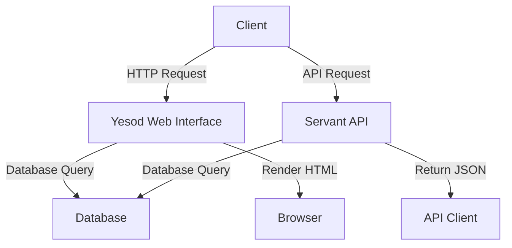

## 22.5 Web Development with Yesod and Servant

In this section, we delve into the world of web development using Haskell, focusing on two powerful frameworks: Yesod and Servant. These frameworks allow us to build robust, scalable web applications and APIs with Haskell's strong type system and functional programming paradigms. We'll explore the concepts of MVC (Model-View-Controller), RESTful design, and authentication patterns, providing a comprehensive guide to building a blog platform or an e-commerce site.

### Introduction to Yesod and Servant

Yesod and Servant are two of the most popular frameworks for web development in Haskell. They leverage Haskell's strengths to provide type-safe, efficient, and maintainable web applications and APIs.

- **Yesod**: A high-level web framework that emphasizes type safety and compile-time guarantees. It is designed for building complex web applications with a focus on performance and security.
- **Servant**: A framework for building type-safe web APIs. It allows you to define your API at the type level, ensuring that your implementation matches the specification.

### Why Choose Haskell for Web Development?

Haskell offers several advantages for web development:

- **Type Safety**: Haskell's strong static type system helps catch errors at compile time, reducing runtime errors.
- **Concurrency**: Haskell's lightweight threads and asynchronous programming capabilities make it suitable for handling concurrent web requests.
- **Maintainability**: Functional programming paradigms promote clean, modular code that is easier to maintain and extend.
- **Performance**: Haskell's lazy evaluation and efficient runtime system can lead to high-performance web applications.

### Building a Web Application with Yesod

Let's start by building a simple blog platform using Yesod. We'll cover the key components of a Yesod application, including routing, handlers, templates, and database integration.

#### Setting Up a Yesod Project

To create a new Yesod project, you can use the `yesod` command-line tool. First, ensure you have the Haskell toolchain installed, including GHC and Cabal. Then, run the following command:

```bash
cabal update
cabal install yesod-bin
yesod init
```

This will prompt you to choose a project template. For our blog platform, select the `postgres` template, which sets up a PostgreSQL-backed Yesod application.

#### Project Structure

A Yesod project typically has the following structure:

- **`config/`**: Configuration files, including database settings.
- **`src/`**: Haskell source files for your application.
- **`templates/`**: HTML templates for rendering views.
- **`static/`**: Static files such as CSS and JavaScript.
- **`app/`**: Application entry point and routing definitions.

#### Defining Routes

In Yesod, routes are defined in the `config/routes` file. Each route maps a URL pattern to a handler function. Here's an example of defining routes for our blog platform:

```
/ HomeR GET
/blog BlogR GET
/blog/#PostId PostR GET
/blog/new NewPostR GET POST
```

- **`HomeR`**: The home page route.
- **`BlogR`**: The blog listing page.
- **`PostR`**: A specific blog post, identified by `PostId`.
- **`NewPostR`**: The page for creating a new blog post.

#### Handlers and Templates

Handlers are functions that process requests and generate responses. In Yesod, handlers are defined in the `src/Handler` directory. Here's an example of a handler for the home page:

```haskell
-- src/Handler/Home.hs
module Handler.Home where

import Import

getHomeR :: Handler Html
getHomeR = defaultLayout $ do
    setTitle "Welcome to My Blog"
    $(widgetFile "homepage")
```

The `defaultLayout` function sets up the HTML layout, and `$(widgetFile "homepage")` includes the `homepage.hamlet` template.

#### Database Integration

Yesod uses Persistent, a type-safe database library, to interact with databases. Define your database schema in `config/models`:

```
Post
    title Text
    content Textarea
    deriving Show
```

This defines a `Post` entity with a `title` and `content`. Persistent generates Haskell types and functions for interacting with the database.

#### Authentication and Authorization

Yesod provides built-in support for authentication and authorization. You can use the `yesod-auth` package to add user authentication to your application. Here's a simple example of setting up authentication:

```haskell
-- src/Foundation.hs
import Yesod.Auth

instance Yesod MyApp where
    authRoute _ = Just $ AuthR LoginR

    isAuthorized HomeR _ = return Authorized
    isAuthorized _ _ = isAuthenticated
```

This configuration requires users to be authenticated to access routes other than the home page.

### Building a Type-Safe API with Servant

Now, let's explore how to build a type-safe API using Servant. We'll create an API for our blog platform that allows clients to fetch and create blog posts.

#### Defining the API

In Servant, you define your API at the type level using combinators. Here's an example of a simple API for our blog platform:

```haskell
-- src/API.hs
{-# LANGUAGE DataKinds #-}
{-# LANGUAGE TypeOperators #-}

module API where

import Servant

type BlogAPI =
       "posts" :> Get '[JSON] [Post]
  :<|> "posts" :> ReqBody '[JSON] Post :> Post '[JSON] Post

blogAPI :: Proxy BlogAPI
blogAPI = Proxy
```

This defines two endpoints:

- **`GET /posts`**: Returns a list of blog posts.
- **`POST /posts`**: Creates a new blog post.

#### Implementing the Server

To implement the server, you provide handlers for each endpoint. Here's an example:

```haskell
-- src/Server.hs
module Server where

import Servant
import API

server :: Server BlogAPI
server = getPosts :<|> createPost

  where
    getPosts :: Handler [Post]
    getPosts = return [] -- Fetch posts from the database

    createPost :: Post -> Handler Post
    createPost post = return post -- Insert post into the database
```

The `Server` type is a type synonym for a tuple of handlers, one for each endpoint.

#### Running the API

To run the API, you need to set up a WAI application and run it with a web server like Warp:

```haskell
-- src/Main.hs
module Main where

import Network.Wai
import Network.Wai.Handler.Warp
import Servant
import API
import Server

main :: IO ()
main = run 8080 (serve blogAPI server)
```

This starts a web server on port 8080, serving the API defined by `blogAPI`.

### Integrating Yesod and Servant

Yesod and Servant can be integrated to build applications that serve both web pages and APIs. You can use Yesod for the web interface and Servant for the API, sharing the same database and authentication mechanisms.

#### Example: Building an E-commerce Site

Let's consider an example of building an e-commerce site with Yesod and Servant. The site will have a web interface for browsing products and an API for managing orders.

##### Defining the Data Model

Define the data model for products and orders in `config/models`:

```
Product
    name Text
    price Double
    deriving Show

Order
    productId ProductId
    quantity Int
    deriving Show
```

##### Setting Up Routes and Handlers

Define routes for the web interface and API:

```
/ HomeR GET
/products ProductsR GET
/orders OrdersR GET POST
```

Implement handlers for the web interface in `src/Handler`:

```haskell
-- src/Handler/Products.hs
module Handler.Products where

import Import

getProductsR :: Handler Html
getProductsR = do
    products <- runDB $ selectList [] [Asc ProductName]
    defaultLayout $ do
        setTitle "Products"
        $(widgetFile "products")
```

Implement the API using Servant:

```haskell
-- src/API.hs
type ECommerceAPI =
       "products" :> Get '[JSON] [Product]
  :<|> "orders" :> ReqBody '[JSON] Order :> Post '[JSON] Order

eCommerceAPI :: Proxy ECommerceAPI
eCommerceAPI = Proxy

-- src/Server.hs
server :: Server ECommerceAPI
server = getProducts :<|> createOrder

  where
    getProducts :: Handler [Product]
    getProducts = return [] -- Fetch products from the database

    createOrder :: Order -> Handler Order
    createOrder order = return order -- Insert order into the database
```

##### Running the Application

Set up the main application to run both Yesod and Servant:

```haskell
-- src/Main.hs
module Main where

import Network.Wai
import Network.Wai.Handler.Warp
import Yesod
import API
import Server
import Application (makeFoundation, makeApplication)

main :: IO ()
main = do
    foundation <- makeFoundation
    app <- makeApplication foundation
    run 8080 $ app
```

### Design Patterns in Yesod and Servant

Yesod and Servant naturally incorporate several design patterns:

- **MVC (Model-View-Controller)**: Yesod follows the MVC pattern, separating the data model, view templates, and controller logic.
- **RESTful Design**: Servant encourages RESTful API design by defining resources and actions at the type level.
- **Authentication Patterns**: Yesod's authentication system provides patterns for user login, session management, and access control.

### Haskell Unique Features

Haskell's unique features enhance Yesod and Servant development:

- **Type-Level Programming**: Servant's type-level API definitions ensure that your implementation matches the specification.
- **Monads and Functors**: Yesod and Servant leverage monads for handling side effects, such as database access and HTTP requests.
- **Lazy Evaluation**: Haskell's lazy evaluation allows efficient handling of large data sets and streaming responses.

### Differences and Similarities

Yesod and Servant serve different purposes but can be integrated seamlessly:

- **Yesod**: Best for building full-featured web applications with complex user interfaces.
- **Servant**: Ideal for building type-safe APIs that can be consumed by various clients.

### Try It Yourself

Experiment with the code examples provided in this section. Try modifying the routes, handlers, and templates to add new features to the blog platform or e-commerce site. Consider integrating additional libraries for features like real-time updates or payment processing.

### Visualizing the Architecture

Below is a diagram representing the architecture of a web application using Yesod and Servant:



**Diagram Description**: This diagram illustrates the interaction between clients, the Yesod web interface, the Servant API, and the database. Clients can access the web interface or API, both of which interact with the database to fetch or store data.

### Knowledge Check

- What are the main differences between Yesod and Servant?
- How does Haskell's type system benefit web development?
- What are some common design patterns used in Yesod and Servant applications?

### Summary

In this section, we've explored web development with Yesod and Servant, two powerful frameworks in the Haskell ecosystem. We've covered the basics of setting up a Yesod project, defining routes and handlers, integrating a database, and building a type-safe API with Servant. By leveraging Haskell's unique features, you can build robust, scalable web applications and APIs.

Remember, this is just the beginning. As you progress, you'll build more complex and interactive web applications. Keep experimenting, stay curious, and enjoy the journey!

## Quiz: Web Development with Yesod and Servant



### What is the primary purpose of Yesod in Haskell web development?

- [x] Building high-level web applications
- [ ] Creating type-safe APIs
- [ ] Managing database connections
- [ ] Handling concurrency

> **Explanation:** Yesod is designed for building high-level web applications with a focus on type safety and performance.

### Which framework is used for building type-safe APIs in Haskell?

- [ ] Yesod
- [x] Servant
- [ ] Warp
- [ ] Persistent

> **Explanation:** Servant is a Haskell framework specifically designed for building type-safe web APIs.

### What design pattern does Yesod naturally follow?

- [x] MVC (Model-View-Controller)
- [ ] Singleton
- [ ] Factory
- [ ] Observer

> **Explanation:** Yesod follows the MVC pattern, separating the data model, view templates, and controller logic.

### How does Servant ensure that your API implementation matches the specification?

- [x] By defining the API at the type level
- [ ] By using runtime checks
- [ ] By generating documentation
- [ ] By enforcing coding standards

> **Explanation:** Servant uses type-level programming to define APIs, ensuring that the implementation matches the specification.

### What is a key advantage of using Haskell for web development?

- [x] Strong static type system
- [ ] Dynamic typing
- [ ] Lack of concurrency support
- [ ] Weak performance

> **Explanation:** Haskell's strong static type system helps catch errors at compile time, reducing runtime errors.

### In Yesod, where are routes typically defined?

- [ ] In the `src/Handler` directory
- [x] In the `config/routes` file
- [ ] In the `templates/` directory
- [ ] In the `static/` directory

> **Explanation:** Routes in Yesod are defined in the `config/routes` file, mapping URL patterns to handler functions.

### What is the purpose of the `defaultLayout` function in Yesod?

- [x] To set up the HTML layout for a page
- [ ] To define database models
- [ ] To handle API requests
- [ ] To manage static files

> **Explanation:** The `defaultLayout` function sets up the HTML layout for a page in Yesod.

### Which package in Yesod provides built-in support for authentication?

- [ ] yesod-core
- [x] yesod-auth
- [ ] yesod-static
- [ ] yesod-persistent

> **Explanation:** The `yesod-auth` package provides built-in support for authentication in Yesod applications.

### How do you run a Servant API on a web server?

- [ ] By using the `yesod` command-line tool
- [ ] By compiling with GHC
- [x] By setting up a WAI application and running it with Warp
- [ ] By using the `servant-cli` tool

> **Explanation:** To run a Servant API, you set up a WAI application and run it with a web server like Warp.

### True or False: Yesod and Servant can be integrated to serve both web pages and APIs.

- [x] True
- [ ] False

> **Explanation:** Yesod and Servant can be integrated to build applications that serve both web pages and APIs, sharing the same database and authentication mechanisms.




