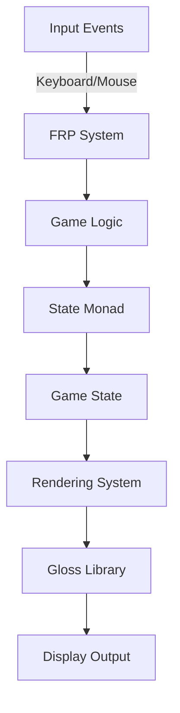

## 22.6 Game Development with Functional Principles

Game development is a fascinating field that combines creativity with technical prowess. In this section, we will explore how Haskell, a purely functional programming language, can be used to design and develop games. We will focus on leveraging functional programming principles, such as Functional Reactive Programming (FRP) and state monads, to create efficient and scalable game logic. We will also introduce popular Haskell libraries like Gloss and SDL2, which facilitate game development.

### Introduction to Functional Game Development

Functional programming offers a unique approach to game development, emphasizing immutability, pure functions, and declarative code. This paradigm can lead to more predictable and maintainable codebases, which is particularly beneficial in complex game systems. Let's delve into some key concepts and patterns that are instrumental in functional game development.

#### Functional Reactive Programming (FRP)

FRP is a paradigm for working with time-varying values and event-driven systems. It is particularly well-suited for game development, where you need to manage continuous updates and user interactions. FRP allows you to express game logic in terms of data flows and transformations, making it easier to reason about and maintain.

**Key Concepts of FRP:**

- **Signals**: Represent continuous time-varying values.
- **Events**: Represent discrete occurrences over time.
- **Behaviors**: Combine signals and events to model dynamic systems.

#### State Monads

State monads provide a way to handle mutable state in a purely functional manner. In game development, managing game state is crucial, and state monads offer a clean and composable way to do so.

**Benefits of Using State Monads:**

- **Encapsulation**: Encapsulate state transformations within monadic actions.
- **Composability**: Compose complex stateful computations from simpler ones.
- **Purity**: Maintain purity by isolating state changes within the monad.

### Libraries for Game Development in Haskell

Several libraries in Haskell can aid in game development by providing abstractions and utilities for graphics, input handling, and more. Two popular libraries are Gloss and SDL2.

#### Gloss

Gloss is a simple and easy-to-use library for creating 2D graphics in Haskell. It abstracts away the low-level details of OpenGL, allowing you to focus on the game logic and design.

**Features of Gloss:**

- **Simple API**: Provides a high-level API for drawing shapes, images, and text.
- **Animation Support**: Easily create animations by updating the display at a fixed rate.
- **Event Handling**: Handle keyboard and mouse events with ease.

#### SDL2

SDL2 is a more comprehensive library that provides access to multimedia, graphics, and input devices. It is suitable for more complex game projects that require fine-grained control over the rendering pipeline and input handling.

**Features of SDL2:**

- **Cross-Platform**: Supports multiple platforms, including Windows, macOS, and Linux.
- **Low-Level Access**: Provides low-level access to graphics, audio, and input devices.
- **Extensibility**: Easily extendable with additional modules and libraries.

### Example Project: Creating a 2D Platformer Game

Let's walk through the process of creating a simple 2D platformer game using Haskell. We will use Gloss for rendering and FRP for handling game logic.

#### Setting Up the Project

First, ensure you have Haskell and the necessary libraries installed. You can use Cabal or Stack to manage dependencies.

```bash
cabal update
cabal install gloss
```

#### Designing the Game

Our platformer game will feature a player character that can move left and right, jump, and interact with platforms. We will use FRP to manage the game logic and state monads to handle the game state.

**Game Components:**

- **Player**: Represents the player character with position, velocity, and state.
- **Platform**: Represents static platforms that the player can stand on.
- **Game State**: Encapsulates the entire game state, including the player and platforms.

#### Implementing the Game Logic

Let's start by defining the data structures for the player and platforms.

```haskell
-- Define the Player data type
data Player = Player
  { playerPos :: (Float, Float)  -- Position (x, y)
  , playerVel :: (Float, Float)  -- Velocity (vx, vy)
  , playerState :: PlayerState   -- Current state (e.g., standing, jumping)
  }

-- Define the Platform data type
data Platform = Platform
  { platformPos :: (Float, Float)  -- Position (x, y)
  , platformSize :: (Float, Float) -- Size (width, height)
  }

-- Define the GameState data type
data GameState = GameState
  { player :: Player
  , platforms :: [Platform]
  }
```

#### Handling Input and Events

We will use FRP to handle input events and update the game state. Gloss provides a convenient way to handle keyboard and mouse events.

```haskell
-- Handle keyboard input
handleInput :: Event -> GameState -> GameState
handleInput (EventKey (SpecialKey KeyLeft) Down _ _) state =
  state { player = (player state) { playerVel = (-5, snd (playerVel (player state))) } }
handleInput (EventKey (SpecialKey KeyRight) Down _ _) state =
  state { player = (player state) { playerVel = (5, snd (playerVel (player state))) } }
handleInput (EventKey (SpecialKey KeySpace) Down _ _) state =
  state { player = (player state) { playerVel = (fst (playerVel (player state)), 10) } }
handleInput _ state = state
```

#### Updating the Game State

We will use a state monad to encapsulate the game state updates. This allows us to compose complex state transformations from simpler ones.

```haskell
-- Update the game state
updateGameState :: Float -> GameState -> GameState
updateGameState dt state = execState (updatePlayer dt) state

-- Update the player
updatePlayer :: Float -> State GameState ()
updatePlayer dt = do
  gameState <- get
  let p = player gameState
  let (px, py) = playerPos p
  let (vx, vy) = playerVel p
  let newPos = (px + vx * dt, py + vy * dt)
  let newVel = (vx, vy - 9.8 * dt)  -- Apply gravity
  put gameState { player = p { playerPos = newPos, playerVel = newVel } }
```

#### Rendering the Game

Finally, we will use Gloss to render the game state. Gloss provides a simple API for drawing shapes and images.

```haskell
-- Render the game state
renderGameState :: GameState -> Picture
renderGameState state = pictures [renderPlayer (player state), renderPlatforms (platforms state)]

-- Render the player
renderPlayer :: Player -> Picture
renderPlayer p = translate x y $ color blue $ rectangleSolid 20 40
  where (x, y) = playerPos p

-- Render the platforms
renderPlatforms :: [Platform] -> Picture
renderPlatforms ps = pictures $ map renderPlatform ps

-- Render a single platform
renderPlatform :: Platform -> Picture
renderPlatform p = translate x y $ color green $ rectangleSolid w h
  where (x, y) = platformPos p
        (w, h) = platformSize p
```

#### Running the Game

Now that we have implemented the game logic and rendering, we can run the game using Gloss.

```haskell
main :: IO ()
main = play
  (InWindow "Platformer" (800, 600) (100, 100))  -- Window settings
  white                                          -- Background color
  60                                             -- Frames per second
  initialState                                   -- Initial game state
  renderGameState                                -- Render function
  handleInput                                    -- Input handler
  updateGameState                                -- Update function

-- Define the initial game state
initialState :: GameState
initialState = GameState
  { player = Player (0, 0) (0, 0) Standing
  , platforms = [Platform (-100, -50) (200, 20)]
  }
```

### Try It Yourself

Now that we've walked through the creation of a simple platformer game, try modifying the code to add new features or mechanics. Here are some ideas:

- **Add Enemies**: Introduce enemies that the player must avoid or defeat.
- **Implement Scoring**: Add a scoring system that rewards the player for collecting items or defeating enemies.
- **Create Levels**: Design multiple levels with increasing difficulty.

### Visualizing Game Architecture

To better understand the architecture of our game, let's visualize the flow of data and events using a Mermaid.js diagram.



**Diagram Explanation:**

- **Input Events**: Captures user inputs from the keyboard and mouse.
- **FRP System**: Processes input events and updates the game logic.
- **Game Logic**: Encapsulates the rules and mechanics of the game.
- **State Monad**: Manages the game state in a purely functional manner.
- **Game State**: Represents the current state of the game, including the player and platforms.
- **Rendering System**: Converts the game state into visual output using Gloss.
- **Gloss Library**: Handles the low-level rendering and display output.

### Conclusion

Game development in Haskell offers a unique opportunity to apply functional programming principles to create efficient and maintainable game systems. By leveraging FRP and state monads, we can manage complex game logic and state in a declarative and composable manner. Libraries like Gloss and SDL2 provide the necessary tools to bring our games to life with graphics and input handling.

Remember, this is just the beginning. As you progress, you'll build more complex and interactive games. Keep experimenting, stay curious, and enjoy the journey!

## Quiz: Game Development with Functional Principles



### What is the primary benefit of using Functional Reactive Programming (FRP) in game development?

- [x] It allows for declarative expression of time-varying values and events.
- [ ] It simplifies the rendering process.
- [ ] It provides low-level access to graphics hardware.
- [ ] It eliminates the need for a game loop.

> **Explanation:** FRP allows developers to express game logic in terms of data flows and transformations, making it easier to manage time-varying values and events.

### Which Haskell library is known for providing a simple API for 2D graphics?

- [x] Gloss
- [ ] SDL2
- [ ] OpenGL
- [ ] Vulkan

> **Explanation:** Gloss is a Haskell library that provides a high-level API for creating 2D graphics, making it easy to develop simple games and visualizations.

### What is the role of the state monad in game development?

- [x] To encapsulate and manage game state transformations.
- [ ] To handle input events.
- [ ] To render graphics.
- [ ] To manage audio playback.

> **Explanation:** The state monad is used to encapsulate state transformations, allowing for composable and pure management of game state.

### Which of the following is a key concept of FRP?

- [x] Signals
- [ ] Threads
- [ ] Buffers
- [ ] Shaders

> **Explanation:** Signals are a fundamental concept in FRP, representing continuous time-varying values.

### How does Gloss handle input events?

- [x] Through a callback function that processes keyboard and mouse events.
- [ ] By polling input devices directly.
- [ ] By using a separate input library.
- [ ] By integrating with SDL2.

> **Explanation:** Gloss provides a callback function mechanism to handle input events, allowing developers to process keyboard and mouse interactions.

### What is the primary advantage of using a purely functional language like Haskell for game development?

- [x] Predictable and maintainable codebases.
- [ ] Faster execution speed.
- [ ] Direct access to hardware.
- [ ] Built-in support for 3D graphics.

> **Explanation:** Functional programming in Haskell emphasizes immutability and pure functions, leading to more predictable and maintainable codebases.

### In the provided example, what does the `updateGameState` function do?

- [x] It updates the game state based on the current state and time delta.
- [ ] It handles input events.
- [ ] It renders the game state.
- [ ] It initializes the game window.

> **Explanation:** The `updateGameState` function updates the game state by applying transformations based on the current state and time delta.

### What is the purpose of the `renderGameState` function in the example?

- [x] To convert the game state into visual output using Gloss.
- [ ] To handle input events.
- [ ] To manage game state transitions.
- [ ] To initialize the game logic.

> **Explanation:** The `renderGameState` function is responsible for converting the game state into visual output, using Gloss to render shapes and images.

### Which of the following is NOT a feature of the SDL2 library?

- [x] High-level API for 2D graphics.
- [ ] Cross-platform support.
- [ ] Low-level access to graphics and input devices.
- [ ] Extensibility with additional modules.

> **Explanation:** SDL2 provides low-level access to graphics and input devices, but it does not offer a high-level API for 2D graphics like Gloss does.

### True or False: In Haskell, the state monad allows for mutable state management.

- [x] True
- [ ] False

> **Explanation:** The state monad allows for mutable state management in a purely functional manner, encapsulating state changes within monadic actions.


