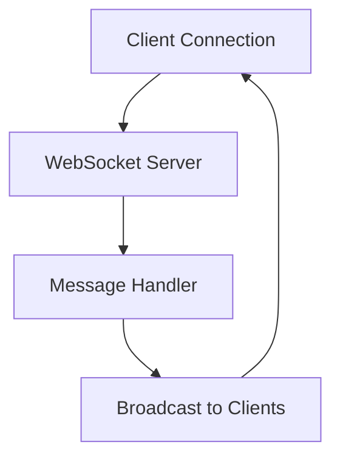
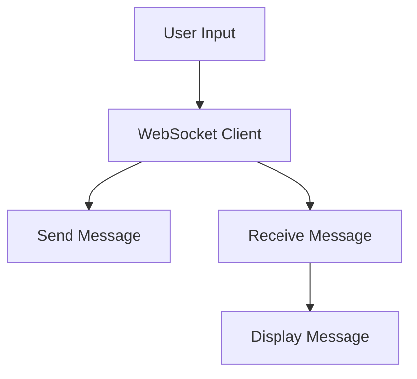
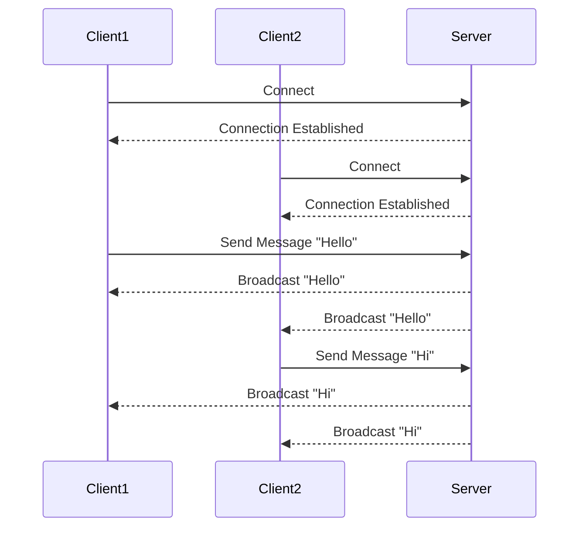

## 22.7 Designing a Real-Time Chat Application

Designing a real-time chat application in Haskell presents a unique set of challenges and opportunities. By leveraging Haskell's powerful concurrency model and functional programming paradigms, we can build a robust, scalable, and efficient chat system. In this guide, we will explore the design patterns and libraries that make this possible, focusing on concurrency patterns, websockets, and event-driven architecture.

### Challenge: Building a Chat App for Real-Time Communication

Real-time chat applications require handling multiple concurrent connections, ensuring low latency, and providing a seamless user experience. The key challenges include:

- **Concurrency Management**: Efficiently handling multiple simultaneous connections.
- **Real-Time Updates**: Ensuring messages are delivered instantly.
- **Scalability**: Supporting a growing number of users without performance degradation.
- **Fault Tolerance**: Maintaining service availability despite failures.

### Patterns Used

To address these challenges, we will employ several design patterns:

- **Concurrency Patterns**: Utilizing Haskell's lightweight threads and Software Transactional Memory (STM) for managing concurrent operations.
- **WebSockets**: Establishing persistent connections for real-time communication.
- **Event-Driven Architecture**: Reacting to events such as message receipt and user actions.

### Implementation

We will use the **Warp** and **WebSockets** libraries to implement our chat application. Warp is a high-performance web server library, while WebSockets provides the necessary tools for real-time communication.

#### Setting Up the Environment

Before we dive into the code, ensure you have the necessary Haskell environment set up. You can use Stack or Cabal to manage your Haskell projects. Install the required libraries:

```bash
stack install warp websockets
```

#### Designing the Chat Server

The chat server will handle incoming connections, manage user sessions, and broadcast messages to all connected clients.

##### Server Architecture

The server architecture involves:

1. **Connection Management**: Accepting new connections and maintaining a list of active clients.
2. **Message Handling**: Receiving messages from clients and broadcasting them.
3. **Concurrency Control**: Using STM to manage shared state safely.

Here's a high-level overview of the server architecture:



##### Implementing the Server

Let's start by implementing the server using Warp and WebSockets.

```haskell
{-# LANGUAGE OverloadedStrings #-}

import Network.Wai
import Network.Wai.Handler.Warp
import Network.WebSockets
import Control.Concurrent.STM
import Control.Monad (forever)
import qualified Data.Text as T
import qualified Data.Text.IO as T

type Client = (T.Text, Connection)
type ServerState = TVar [Client]

-- Initialize the server state
newServerState :: IO ServerState
newServerState = newTVarIO []

-- Add a client to the server state
addClient :: Client -> ServerState -> STM ()
addClient client state = modifyTVar' state (client :)

-- Remove a client from the server state
removeClient :: Client -> ServerState -> STM ()
removeClient client state = modifyTVar' state (filter (/= client))

-- Broadcast a message to all clients
broadcast :: T.Text -> ServerState -> IO ()
broadcast message state = do
    clients <- readTVarIO state
    mapM_ (\\(_, conn) -> sendTextData conn message) clients

-- Application logic for each client
application :: ServerState -> ServerApp
application state pending = do
    conn <- acceptRequest pending
    let client = ("Anonymous", conn)
    atomically $ addClient client state
    talk client state
    where
        talk client@(name, conn) state = forever $ do
            msg <- receiveData conn
            T.putStrLn $ name <> ": " <> msg
            atomically $ broadcast msg state
```

**Explanation:**

- **ServerState**: A `TVar` containing a list of connected clients.
- **addClient/removeClient**: Functions to manage the list of clients.
- **broadcast**: Sends a message to all connected clients.
- **application**: Handles each client connection, receiving and broadcasting messages.

#### Designing the Chat Client

The client will connect to the server, send messages, and display incoming messages.

##### Client Architecture

The client architecture involves:

1. **Connection Establishment**: Connecting to the WebSocket server.
2. **User Interface**: Displaying messages and accepting user input.
3. **Message Handling**: Sending and receiving messages.

Here's a high-level overview of the client architecture:



##### Implementing the Client

Let's implement a simple client using WebSockets.

```haskell
{-# LANGUAGE OverloadedStrings #-}

import Network.WebSockets
import Control.Monad (forever)
import qualified Data.Text as T
import qualified Data.Text.IO as T

clientApp :: ClientApp ()
clientApp conn = do
    putStrLn "Connected!"
    _ <- forkIO $ forever $ do
        msg <- receiveData conn
        T.putStrLn msg
    talk conn

talk :: Connection -> IO ()
talk conn = forever $ do
    line <- T.getLine
    sendTextData conn line

main :: IO ()
main = runClient "127.0.0.1" 9160 "/" clientApp
```

**Explanation:**

- **clientApp**: Connects to the server and starts listening for messages.
- **talk**: Reads user input and sends it to the server.

### Visualizing the System

To better understand the flow of messages in our chat application, let's visualize the interaction between the server and clients.



### Design Considerations

When designing a real-time chat application, consider the following:

- **Scalability**: Use load balancing and distributed systems to handle a large number of connections.
- **Security**: Implement authentication and encryption to protect user data.
- **Fault Tolerance**: Use techniques like message queues and retries to handle failures gracefully.

### Haskell Unique Features

Haskell's unique features, such as strong typing, immutability, and STM, make it well-suited for building reliable and maintainable real-time systems. The use of STM allows for safe concurrent operations without the complexity of locks.

### Differences and Similarities

Real-time chat applications in Haskell differ from those in imperative languages due to Haskell's functional nature. However, the core principles of concurrency and event-driven architecture remain the same.

### Try It Yourself

Experiment with the chat application by modifying the code:

- **Add Authentication**: Implement a simple login system.
- **Enhance the UI**: Use a library like Brick to create a more interactive interface.
- **Implement Private Messaging**: Allow users to send direct messages to each other.

### References and Links

- [Warp](https://hackage.haskell.org/package/warp)
- [WebSockets](https://hackage.haskell.org/package/websockets)

### Knowledge Check

- How does Haskell's STM help in managing concurrency?
- What are the benefits of using WebSockets for real-time communication?
- How can you scale a chat application to support thousands of users?

### Embrace the Journey

Building a real-time chat application in Haskell is a rewarding experience that showcases the power of functional programming. Remember, this is just the beginning. As you progress, you'll discover more ways to enhance and optimize your application. Keep experimenting, stay curious, and enjoy the journey!

## Quiz: Designing a Real-Time Chat Application



### What is the primary challenge in designing a real-time chat application?

- [x] Handling multiple concurrent connections
- [ ] Designing a complex user interface
- [ ] Implementing a database
- [ ] Creating a static website

> **Explanation:** The primary challenge is efficiently handling multiple concurrent connections to ensure real-time communication.

### Which library is used for real-time communication in Haskell?

- [x] WebSockets
- [ ] Aeson
- [ ] Conduit
- [ ] Persistent

> **Explanation:** The WebSockets library is used to establish persistent connections for real-time communication.

### What is the role of the `broadcast` function in the chat server?

- [x] Sending a message to all connected clients
- [ ] Receiving messages from clients
- [ ] Establishing a connection with clients
- [ ] Disconnecting clients

> **Explanation:** The `broadcast` function sends a message to all connected clients, ensuring everyone receives the message.

### How does Haskell's STM contribute to concurrency management?

- [x] It allows safe concurrent operations without locks
- [ ] It provides a graphical user interface
- [ ] It handles network connections
- [ ] It manages database transactions

> **Explanation:** STM allows for safe concurrent operations by managing shared state without the need for locks.

### What is a key benefit of using Warp in a chat application?

- [x] High-performance web server capabilities
- [ ] Advanced graphical rendering
- [ ] Database management
- [ ] File system operations

> **Explanation:** Warp provides high-performance web server capabilities, making it suitable for handling real-time communication.

### Which pattern is crucial for handling real-time updates in a chat application?

- [x] Event-Driven Architecture
- [ ] Model-View-Controller
- [ ] Singleton Pattern
- [ ] Factory Pattern

> **Explanation:** Event-Driven Architecture is crucial for handling real-time updates by reacting to events such as message receipt.

### What is the purpose of the `talk` function in the client implementation?

- [x] Reading user input and sending it to the server
- [ ] Establishing a connection with the server
- [ ] Displaying messages
- [ ] Disconnecting from the server

> **Explanation:** The `talk` function reads user input and sends it to the server, facilitating communication.

### How can you enhance the chat application's user interface?

- [x] Use a library like Brick for a more interactive interface
- [ ] Implement a complex database schema
- [ ] Use a different programming language
- [ ] Focus on backend optimizations

> **Explanation:** Using a library like Brick can enhance the user interface by providing more interactive elements.

### What is a potential security measure for a chat application?

- [x] Implementing authentication and encryption
- [ ] Using a simple text-based protocol
- [ ] Allowing anonymous access
- [ ] Disabling all network connections

> **Explanation:** Implementing authentication and encryption helps protect user data and secure the application.

### True or False: Haskell's functional nature makes it unsuitable for real-time applications.

- [ ] True
- [x] False

> **Explanation:** False. Haskell's functional nature, along with its concurrency model, makes it well-suited for real-time applications.




