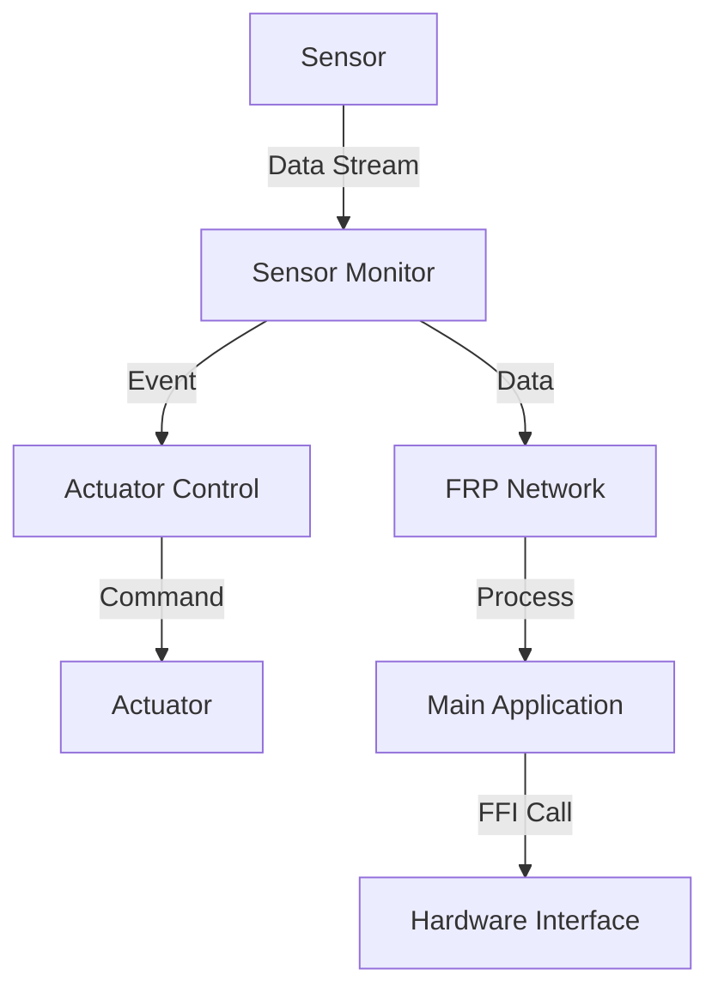

## 22.8 Implementing IoT Systems with Haskell

The Internet of Things (IoT) is revolutionizing the way we interact with devices, enabling seamless communication between the physical and digital worlds. Haskell, with its strong emphasis on functional programming, offers unique advantages for developing IoT systems. In this section, we will explore how to implement IoT systems using Haskell, focusing on functional reactive programming, concurrency, and interfacing with hardware via the Foreign Function Interface (FFI).

### Introduction to IoT Systems

IoT systems consist of interconnected devices that collect and exchange data. These devices, often equipped with sensors and actuators, require efficient software solutions to process data and perform actions. Haskell's functional programming paradigm, with its emphasis on immutability and pure functions, provides a robust foundation for building reliable and maintainable IoT applications.

### Patterns Applied in IoT Systems

#### Functional Reactive Programming (FRP)

Functional Reactive Programming is a paradigm for working with time-varying values and event-driven systems. In the context of IoT, FRP allows us to model sensor data as continuous streams, enabling real-time processing and response to changes in the environment.

#### Concurrency

Concurrency is crucial in IoT systems to handle multiple devices and data streams simultaneously. Haskell's lightweight concurrency model, supported by Software Transactional Memory (STM) and the `async` library, allows us to manage concurrent tasks efficiently.

### Interfacing with Hardware via FFI

The Foreign Function Interface (FFI) in Haskell enables interaction with hardware components by calling functions written in other programming languages, such as C. This capability is essential for accessing low-level device APIs and libraries.

### Example: Monitoring Sensors and Actuators with Haskell

Let's delve into a practical example of implementing an IoT system using Haskell. We will create a simple application that monitors temperature sensors and controls actuators based on the sensor data.

#### Step 1: Setting Up the Environment

Before we begin coding, ensure you have the Haskell Platform installed. You can use Cabal or Stack as your build tool. For this example, we'll use Stack.

```bash
# Install Stack if you haven't already
curl -sSL https://get.haskellstack.org/ | sh

# Create a new Haskell project
stack new iot-system
cd iot-system
```

#### Step 2: Defining the Data Model

We will define a simple data model to represent sensor readings and actuator states.

```haskell
-- src/IoTModel.hs

module IoTModel where

data SensorReading = SensorReading
  { sensorId :: String
  , temperature :: Double
  } deriving (Show, Eq)

data ActuatorState = ActuatorState
  { actuatorId :: String
  , isActive :: Bool
  } deriving (Show, Eq)
```

#### Step 3: Implementing Functional Reactive Programming

We will use the `reactive-banana` library to implement FRP in our application. First, add the library to your project's dependencies.

```yaml
# stack.yaml

dependencies:
- base >= 4.7 && < 5
- reactive-banana
- reactive-banana-wx
```

Now, let's create a module to handle sensor data streams using FRP.

```haskell
-- src/SensorMonitor.hs

module SensorMonitor where

import IoTModel
import Reactive.Banana
import Reactive.Banana.Frameworks

-- Simulate sensor data stream
sensorDataStream :: IO (AddHandler SensorReading)
sensorDataStream = do
  (addHandler, fire) <- newAddHandler
  -- Simulate sensor data generation
  _ <- forkIO $ forever $ do
    threadDelay 1000000 -- 1 second
    fire (SensorReading "sensor1" (randomRIO (20.0, 30.0)))
  return addHandler

-- Process sensor data
processSensorData :: AddHandler SensorReading -> MomentIO ()
processSensorData addHandler = do
  eSensorReading <- fromAddHandler addHandler
  let eHighTemp = filterE (\r -> temperature r > 25.0) eSensorReading
  reactimate $ fmap (putStrLn . show) eHighTemp
```

#### Step 4: Implementing Concurrency

We will use Haskell's `async` library to handle concurrent tasks, such as reading sensor data and controlling actuators.

```haskell
-- src/ActuatorControl.hs

module ActuatorControl where

import IoTModel
import Control.Concurrent.Async

-- Simulate actuator control
controlActuator :: ActuatorState -> IO ()
controlActuator state = do
  putStrLn $ "Controlling actuator: " ++ show state
  threadDelay 500000 -- 0.5 second

-- Concurrently control multiple actuators
controlActuatorsConcurrently :: [ActuatorState] -> IO ()
controlActuatorsConcurrently states = do
  asyncs <- mapM (async . controlActuator) states
  mapM_ wait asyncs
```

#### Step 5: Interfacing with Hardware via FFI

To interface with hardware, we need to use the FFI to call functions from a C library. Let's assume we have a C library that provides functions to read sensor data and control actuators.

```c
// sensor.h

#ifndef SENSOR_H
#define SENSOR_H

double read_temperature(const char* sensor_id);
void control_actuator(const char* actuator_id, int state);

#endif // SENSOR_H
```

We can create Haskell bindings to these functions using the FFI.

```haskell
-- src/FFI.hs

{-# LANGUAGE ForeignFunctionInterface #-}

module FFI where

import Foreign.C.String
import Foreign.C.Types

foreign import ccall "sensor.h read_temperature"
  c_read_temperature :: CString -> IO CDouble

foreign import ccall "sensor.h control_actuator"
  c_control_actuator :: CString -> CInt -> IO ()
```

#### Step 6: Integrating All Components

Finally, let's integrate all components into a main application.

```haskell
-- src/Main.hs

module Main where

import IoTModel
import SensorMonitor
import ActuatorControl
import FFI
import Control.Monad

main :: IO ()
main = do
  -- Set up sensor data stream
  addHandler <- sensorDataStream

  -- Process sensor data
  network <- compile $ processSensorData addHandler
  actuate network

  -- Control actuators based on sensor data
  let actuators = [ActuatorState "actuator1" True, ActuatorState "actuator2" False]
  controlActuatorsConcurrently actuators

  -- Interact with hardware via FFI
  withCString "sensor1" $ \sensorId -> do
    temp <- c_read_temperature sensorId
    putStrLn $ "Temperature from FFI: " ++ show temp

  withCString "actuator1" $ \actuatorId -> do
    c_control_actuator actuatorId 1
```

### Visualizing IoT System Architecture

To better understand the architecture of our IoT system, let's visualize the components and their interactions using a Mermaid.js diagram.



**Diagram Description:** The diagram illustrates the flow of data from sensors to the main application, highlighting the use of FRP for processing sensor data and concurrency for controlling actuators. The FFI is used to interface with hardware components.

### Key Takeaways

- **Functional Reactive Programming**: FRP is a powerful paradigm for handling time-varying values and event-driven systems in IoT applications.
- **Concurrency**: Haskell's lightweight concurrency model allows efficient management of multiple tasks, crucial for IoT systems.
- **Foreign Function Interface**: The FFI enables Haskell to interact with hardware components, providing access to low-level device APIs.

### Try It Yourself

Experiment with the code examples by modifying sensor data generation or actuator control logic. Try integrating additional sensors or actuators to expand the system's capabilities.

### Further Reading

- [Reactive Banana Documentation](https://hackage.haskell.org/package/reactive-banana)
- [Haskell FFI Tutorial](https://wiki.haskell.org/FFI)
- [Concurrency in Haskell](https://www.haskell.org/ghc/docs/latest/html/users_guide/concurrent.html)

### Knowledge Check

- How does Functional Reactive Programming benefit IoT systems?
- What role does concurrency play in managing IoT devices?
- How can the FFI be used to interface with hardware in Haskell?

### Embrace the Journey

Implementing IoT systems with Haskell is an exciting journey that combines functional programming principles with real-world applications. Remember, this is just the beginning. As you progress, you'll build more complex and interactive IoT systems. Keep experimenting, stay curious, and enjoy the journey!

## Quiz: Implementing IoT Systems with Haskell



### What is the primary advantage of using Functional Reactive Programming (FRP) in IoT systems?

- [x] It allows for modeling sensor data as continuous streams.
- [ ] It simplifies hardware interfacing.
- [ ] It reduces the need for concurrency.
- [ ] It eliminates the need for the FFI.

> **Explanation:** FRP is particularly useful in IoT systems for modeling sensor data as continuous streams, enabling real-time processing and response to environmental changes.

### How does Haskell's concurrency model benefit IoT systems?

- [x] It allows efficient management of multiple tasks.
- [ ] It simplifies the use of the FFI.
- [ ] It eliminates the need for FRP.
- [ ] It provides direct access to hardware components.

> **Explanation:** Haskell's lightweight concurrency model, supported by STM and the `async` library, allows efficient management of multiple tasks, which is crucial for handling multiple devices and data streams in IoT systems.

### What is the role of the Foreign Function Interface (FFI) in Haskell IoT applications?

- [x] It enables interaction with hardware components.
- [ ] It simplifies concurrency management.
- [ ] It provides a framework for FRP.
- [ ] It eliminates the need for type safety.

> **Explanation:** The FFI in Haskell allows interaction with hardware components by calling functions written in other programming languages, such as C, which is essential for accessing low-level device APIs and libraries.

### Which library is used in the example to implement Functional Reactive Programming?

- [x] reactive-banana
- [ ] async
- [ ] STM
- [ ] lens

> **Explanation:** The `reactive-banana` library is used in the example to implement Functional Reactive Programming, allowing us to model sensor data as continuous streams.

### What is the purpose of the `async` library in the example?

- [x] To handle concurrent tasks such as reading sensor data and controlling actuators.
- [ ] To interface with hardware components.
- [ ] To model sensor data as continuous streams.
- [ ] To simplify type-level programming.

> **Explanation:** The `async` library is used to handle concurrent tasks, such as reading sensor data and controlling actuators, which is crucial for managing multiple devices and data streams in IoT systems.

### What is the significance of using `withCString` in the FFI example?

- [x] It converts a Haskell `String` to a C-style string for FFI calls.
- [ ] It simplifies concurrency management.
- [ ] It models sensor data as continuous streams.
- [ ] It eliminates the need for type safety.

> **Explanation:** `withCString` is used to convert a Haskell `String` to a C-style string, which is necessary for making FFI calls to functions that expect C-style strings.

### How can you expand the IoT system example provided?

- [x] By integrating additional sensors or actuators.
- [ ] By eliminating the use of the FFI.
- [ ] By reducing the number of concurrent tasks.
- [ ] By simplifying the data model.

> **Explanation:** You can expand the IoT system example by integrating additional sensors or actuators, allowing the system to monitor and control more devices.

### What is the role of the `reactimate` function in the FRP example?

- [x] It triggers actions in response to events.
- [ ] It simplifies concurrency management.
- [ ] It interfaces with hardware components.
- [ ] It models sensor data as continuous streams.

> **Explanation:** The `reactimate` function is used to trigger actions in response to events, such as printing high-temperature sensor readings in the FRP example.

### What is the purpose of the `compile` function in the FRP example?

- [x] To compile the FRP network for execution.
- [ ] To simplify concurrency management.
- [ ] To interface with hardware components.
- [ ] To model sensor data as continuous streams.

> **Explanation:** The `compile` function is used to compile the FRP network for execution, allowing the system to process sensor data and respond to events.

### True or False: The FFI allows Haskell to call functions written in other programming languages, such as C.

- [x] True
- [ ] False

> **Explanation:** True. The Foreign Function Interface (FFI) in Haskell allows it to call functions written in other programming languages, such as C, enabling interaction with hardware components and low-level device APIs.


