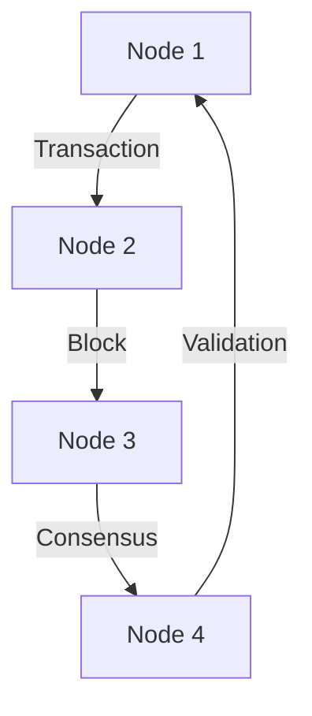

## 22.9 Blockchain Applications with Haskell

Blockchain technology has revolutionized the way we think about data integrity, security, and decentralization. Haskell, with its strong emphasis on correctness and functional purity, is an excellent choice for developing blockchain applications. In this section, we will explore how Haskell is used in blockchain projects, focusing on cryptographic patterns, consensus algorithms, and notable projects like Cardano. We'll also delve into creating smart contracts and custom blockchain solutions using Haskell.

### Introduction to Blockchain and Haskell

Blockchain is a distributed ledger technology that enables secure and transparent record-keeping without the need for a central authority. It relies on cryptographic techniques to ensure data integrity and consensus algorithms to maintain agreement across distributed nodes.

Haskell's features, such as strong static typing, immutability, and pure functions, make it well-suited for blockchain development. These features help in building reliable and maintainable systems, which are crucial in the blockchain domain where security and correctness are paramount.

### Key Concepts in Blockchain Development

Before diving into Haskell-specific implementations, let's review some fundamental concepts in blockchain development:

- **Cryptographic Patterns**: These include hash functions, digital signatures, and encryption techniques that ensure data security and integrity.
- **Consensus Algorithms**: Mechanisms like Proof of Work (PoW), Proof of Stake (PoS), and Byzantine Fault Tolerance (BFT) that enable distributed nodes to agree on the state of the blockchain.
- **Smart Contracts**: Self-executing contracts with the terms of the agreement directly written into code, allowing for automated and trustless transactions.

### Why Haskell for Blockchain?

Haskell offers several advantages for blockchain development:

- **Strong Type System**: Haskell's type system helps catch errors at compile time, reducing runtime failures.
- **Immutability**: Immutable data structures align well with the blockchain's append-only nature.
- **Concurrency**: Haskell's concurrency model, with Software Transactional Memory (STM) and lightweight threads, is beneficial for handling the parallel nature of blockchain operations.
- **Mathematical Precision**: Haskell's roots in mathematics make it ideal for implementing cryptographic algorithms and consensus protocols.

### Case Study: Cardano

Cardano is a prominent blockchain platform that leverages Haskell for its development. It aims to provide a more secure and scalable infrastructure for the deployment of decentralized applications and smart contracts.

#### Cardano's Architecture

Cardano's architecture is divided into two layers:

1. **Cardano Settlement Layer (CSL)**: Handles the cryptocurrency transactions using the ADA token.
2. **Cardano Computation Layer (CCL)**: Supports smart contracts and decentralized applications.

This separation allows for greater flexibility and scalability, enabling updates to be made to the computation layer without affecting the settlement layer.

#### Consensus Algorithm: Ouroboros

Cardano uses the Ouroboros consensus algorithm, a Proof of Stake (PoS) protocol designed to be energy-efficient and secure. Ouroboros is implemented in Haskell, leveraging its strong type system and mathematical precision to ensure correctness.

### Implementing Blockchain Components in Haskell

Let's explore how to implement key blockchain components using Haskell.

#### Cryptographic Patterns

Cryptographic functions are essential for ensuring data integrity and security in blockchain applications. Here's an example of implementing a simple hash function using Haskell's `cryptonite` library:

```haskell
import Crypto.Hash (hashWith, SHA256(..))
import qualified Data.ByteString.Char8 as BS

-- Function to compute SHA256 hash of a given string
computeHash :: String -> String
computeHash input = show (hashWith SHA256 (BS.pack input))

main :: IO ()
main = do
    let input = "Hello, Blockchain!"
    putStrLn $ "SHA256 Hash: " ++ computeHash(input)
```

In this example, we use the `cryptonite` library to compute the SHA256 hash of a given input string. The `hashWith` function takes a hashing algorithm and a ByteString, returning the hash as a digest.

#### Consensus Algorithms

Implementing a consensus algorithm involves designing a protocol that allows distributed nodes to agree on the blockchain's state. Here's a simplified example of a Proof of Stake (PoS) mechanism:

```haskell
import System.Random (randomRIO)

-- Simulate a list of stakeholders with their respective stakes
type Stakeholder = (String, Int)
stakeholders :: [Stakeholder]
stakeholders = [("Alice", 50), ("Bob", 30), ("Charlie", 20)]

-- Function to select a stakeholder based on their stake
selectStakeholder :: IO String
selectStakeholder = do
    let totalStake = sum (map snd stakeholders)
    rand <- randomRIO (1, totalStake)
    return $ selectByStake rand stakeholders

-- Helper function to select a stakeholder based on a random number
selectByStake :: Int -> [Stakeholder] -> String
selectByStake _ [] = error "No stakeholders available"
selectByStake rand ((name, stake):rest)
    | rand <= stake = name
    | otherwise = selectByStake (rand - stake) rest

main :: IO ()
main = do
    selected <- selectStakeholder
    putStrLn $ "Selected Stakeholder: " ++ selected
```

In this example, we simulate a list of stakeholders with their respective stakes. The `selectStakeholder` function randomly selects a stakeholder based on their stake, simulating a simple PoS mechanism.

### Creating Smart Contracts with Haskell

Smart contracts are self-executing contracts with the terms of the agreement directly written into code. Haskell's strong typing and functional purity make it an excellent choice for developing secure and reliable smart contracts.

#### Example: Simple Escrow Contract

Let's implement a simple escrow contract in Haskell:

```haskell
data EscrowState = AwaitingPayment | AwaitingDelivery | Complete deriving (Show, Eq)

data Escrow = Escrow
    { buyer :: String
    , seller :: String
    , amount :: Double
    , state :: EscrowState
    } deriving (Show)

-- Function to make a payment
makePayment :: Escrow -> Escrow
makePayment escrow
    | state escrow == AwaitingPayment = escrow { state = AwaitingDelivery }
    | otherwise = error "Invalid state transition"

-- Function to confirm delivery
confirmDelivery :: Escrow -> Escrow
confirmDelivery escrow
    | state escrow == AwaitingDelivery = escrow { state = Complete }
    | otherwise = error "Invalid state transition"

main :: IO ()
main = do
    let escrow = Escrow "Alice" "Bob" 100.0 AwaitingPayment
    let escrowAfterPayment = makePayment escrow
    let escrowAfterDelivery = confirmDelivery escrowAfterPayment
    print escrowAfterDelivery
```

In this example, we define an `Escrow` data type with states representing the contract's lifecycle. The `makePayment` and `confirmDelivery` functions transition the contract between states, ensuring that the contract logic is followed correctly.

### Visualizing Blockchain Architecture

To better understand the architecture of a blockchain application, let's visualize a simple blockchain network using a Mermaid.js diagram.



**Diagram Description**: This diagram represents a simple blockchain network where nodes communicate transactions, form blocks, reach consensus, and validate the blockchain state.

### Haskell Unique Features in Blockchain

Haskell's unique features, such as lazy evaluation and type classes, provide additional benefits in blockchain development:

- **Lazy Evaluation**: Allows for efficient handling of large data structures, such as transaction logs and blockchains.
- **Type Classes**: Enable polymorphic functions, making it easier to implement generic blockchain components.

### Differences and Similarities with Other Languages

While Haskell offers unique advantages, it's important to understand how it compares to other languages commonly used in blockchain development, such as Solidity and Rust:

- **Solidity**: Primarily used for Ethereum smart contracts, Solidity is imperative and lacks Haskell's strong type system and immutability.
- **Rust**: Known for its performance and safety, Rust shares some similarities with Haskell in terms of immutability and type safety but differs in its imperative nature.

### Design Considerations

When developing blockchain applications in Haskell, consider the following:

- **Security**: Ensure that cryptographic functions and consensus algorithms are implemented correctly to prevent vulnerabilities.
- **Scalability**: Design the system to handle increasing numbers of transactions and nodes efficiently.
- **Interoperability**: Consider how the blockchain will interact with other systems and platforms.

### Try It Yourself

Experiment with the code examples provided in this section. Try modifying the cryptographic functions, consensus algorithms, and smart contract logic to better understand their workings. Consider implementing additional features, such as transaction validation or network communication, to build a more complete blockchain application.

### References and Further Reading

- [Cardano](https://cardano.org/)
- [Haskell Cryptography Libraries](https://hackage.haskell.org/packages/#cat:Cryptography)
- [Ouroboros: A Provably Secure Proof-of-Stake Blockchain Protocol](https://eprint.iacr.org/2016/889.pdf)

### Knowledge Check

- What are the key advantages of using Haskell for blockchain development?
- How does the Ouroboros consensus algorithm differ from traditional Proof of Work?
- What are the benefits of using type classes in blockchain applications?

### Embrace the Journey

Remember, blockchain development is a rapidly evolving field. As you explore Haskell's capabilities in this domain, stay curious and open to new ideas. The journey of building secure and scalable blockchain applications is both challenging and rewarding. Keep experimenting, learning, and contributing to the blockchain community.

## Quiz: Blockchain Applications with Haskell



### What is a key advantage of using Haskell for blockchain development?

- [x] Strong static typing
- [ ] Dynamic typing
- [ ] Weak typing
- [ ] No typing

> **Explanation:** Haskell's strong static typing helps catch errors at compile time, reducing runtime failures.

### Which consensus algorithm is used by Cardano?

- [x] Ouroboros
- [ ] Proof of Work
- [ ] Proof of Authority
- [ ] Raft

> **Explanation:** Cardano uses the Ouroboros consensus algorithm, a Proof of Stake protocol designed for security and efficiency.

### What is a smart contract?

- [x] A self-executing contract with terms written in code
- [ ] A traditional paper contract
- [ ] A verbal agreement
- [ ] A legal document

> **Explanation:** Smart contracts are self-executing contracts with the terms of the agreement directly written into code.

### What is the primary purpose of cryptographic patterns in blockchain?

- [x] Ensuring data security and integrity
- [ ] Improving performance
- [ ] Reducing costs
- [ ] Increasing complexity

> **Explanation:** Cryptographic patterns ensure data security and integrity in blockchain applications.

### How does lazy evaluation benefit blockchain development in Haskell?

- [x] Efficient handling of large data structures
- [ ] Faster execution of all operations
- [ ] Simplified code syntax
- [ ] Improved network communication

> **Explanation:** Lazy evaluation allows for efficient handling of large data structures, such as transaction logs and blockchains.

### What is the role of type classes in Haskell blockchain applications?

- [x] Enable polymorphic functions
- [ ] Simplify syntax
- [ ] Improve performance
- [ ] Reduce memory usage

> **Explanation:** Type classes enable polymorphic functions, making it easier to implement generic blockchain components.

### What is the main difference between Haskell and Solidity?

- [x] Haskell has a strong type system and immutability
- [ ] Solidity is a functional language
- [ ] Haskell is imperative
- [ ] Solidity has lazy evaluation

> **Explanation:** Haskell has a strong type system and immutability, while Solidity is imperative and lacks these features.

### What should be considered when designing blockchain applications in Haskell?

- [x] Security, scalability, and interoperability
- [ ] Only performance
- [ ] Only cost
- [ ] Only user interface

> **Explanation:** Security, scalability, and interoperability are crucial considerations in blockchain application design.

### What is the benefit of using the `cryptonite` library in Haskell?

- [x] Provides cryptographic functions
- [ ] Simplifies syntax
- [ ] Improves performance
- [ ] Reduces memory usage

> **Explanation:** The `cryptonite` library provides cryptographic functions essential for blockchain applications.

### True or False: Haskell's immutability aligns well with the blockchain's append-only nature.

- [x] True
- [ ] False

> **Explanation:** Haskell's immutability aligns well with the blockchain's append-only nature, ensuring data integrity.


