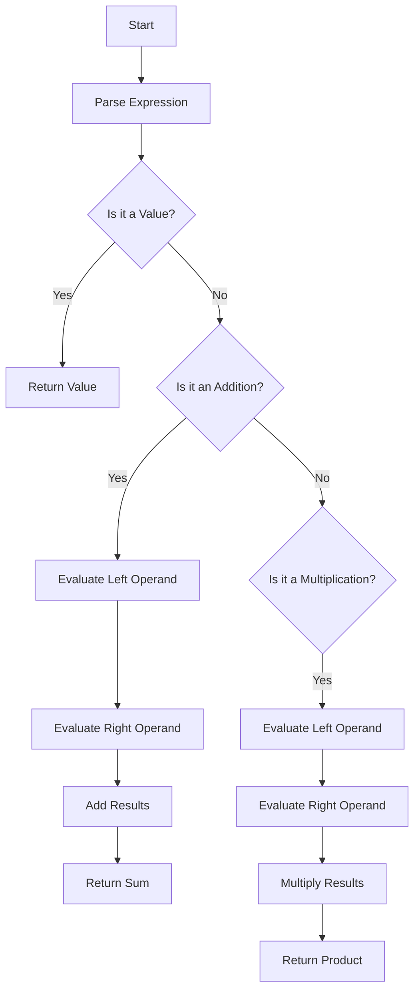

## 23.2 Continuing Education and Resources

As expert software engineers and architects, the journey of mastering Haskell design patterns is ongoing. This section provides a roadmap for continuing education, offering resources and strategies to deepen your understanding and stay current with advancements in Haskell and functional programming.

### Next Steps: Advanced Topics and Further Learning Opportunities

#### 1. Delve into Advanced Functional Programming Concepts

To further enhance your expertise, explore advanced functional programming concepts that extend beyond basic design patterns. Topics such as **dependent types**, **type-level programming**, and **category theory** offer profound insights into the theoretical underpinnings of Haskell.

- **Dependent Types**: Investigate how dependent types can be used to encode more precise types and invariants in your programs. Resources like "Type-Driven Development with Idris" by Edwin Brady can provide a foundational understanding, even though Idris is a different language, the concepts are applicable to Haskell.

- **Type-Level Programming**: Engage with type-level programming in Haskell, which allows you to perform computations at the type level. Books like "Thinking with Types" by Sandy Maguire are excellent resources for this topic.

- **Category Theory**: Understanding category theory can provide a deeper comprehension of Haskell's abstractions. "Category Theory for Programmers" by Bartosz Milewski is a highly recommended resource.

#### 2. Explore Concurrency and Parallelism

Concurrency and parallelism are crucial for building scalable and efficient applications. Haskell offers unique paradigms for handling these aspects:

- **Software Transactional Memory (STM)**: Learn how STM can be used to manage concurrency in a more declarative and less error-prone manner. The book "Parallel and Concurrent Programming in Haskell" by Simon Marlow is an excellent guide.

- **Asynchronous Programming**: Explore libraries like `async` and `STM` for managing asynchronous tasks. Experiment with the `Par` monad for parallel computations.

#### 3. Investigate Domain-Specific Languages (DSLs)

Designing DSLs in Haskell can lead to more expressive and maintainable code. Consider the following resources:

- **"DSLs in Action" by Debasish Ghosh**: Although not Haskell-specific, this book provides valuable insights into DSL design principles that can be applied in Haskell.

- **Haskell Libraries**: Explore libraries like `optparse-applicative` for building command-line interfaces and `servant` for web APIs, which are essentially DSLs for specific domains.

### Resources: Books, Online Courses, and Tutorials

#### Books

1. **"Real World Haskell" by Bryan O'Sullivan, Don Stewart, and John Goerzen**: A comprehensive guide that covers practical aspects of Haskell programming.

2. **"Haskell Programming from First Principles" by Christopher Allen and Julie Moronuki**: A thorough introduction to Haskell, covering both basic and advanced topics.

3. **"Learn You a Haskell for Great Good!" by Miran Lipovača**: A fun and accessible introduction to Haskell, ideal for reinforcing foundational concepts.

4. **"Parallel and Concurrent Programming in Haskell" by Simon Marlow**: Focuses on concurrency and parallelism, essential for building high-performance applications.

#### Online Courses

1. **"Functional Programming in Haskell" on Coursera**: Offered by the University of Glasgow, this course covers both introductory and advanced topics in Haskell.

2. **"Haskell: Functional Programming and Haskell" on Udemy**: A comprehensive course that covers Haskell fundamentals and advanced topics.

3. **"Advanced Functional Programming in Haskell" on Pluralsight**: Focuses on advanced Haskell concepts and techniques.

#### Tutorials and Blogs

1. **Haskell Wiki**: A community-driven resource with tutorials, examples, and documentation on various Haskell topics.

2. **FP Complete Blog**: Offers articles and tutorials on advanced Haskell topics, including performance optimization and concurrency.

3. **School of Haskell**: Provides interactive tutorials and a platform for learning Haskell through practical exercises.

### Suggestions: Participating in Haskell Communities and Attending Conferences

#### 1. Join Haskell Communities

Engaging with the Haskell community can provide support, inspiration, and opportunities for collaboration. Consider joining the following:

- **Haskell-Cafe Mailing List**: A long-standing community where you can ask questions, share insights, and discuss Haskell-related topics.

- **Reddit's r/haskell**: A vibrant community for sharing news, articles, and discussions about Haskell.

- **Haskell on Stack Overflow**: A platform for asking technical questions and getting answers from experienced Haskell developers.

#### 2. Attend Conferences and Meetups

Conferences and meetups are excellent opportunities to learn from experts, network with peers, and stay updated on the latest developments in Haskell.

- **ICFP (International Conference on Functional Programming)**: A premier conference for functional programming, including Haskell.

- **Haskell eXchange**: An annual conference focused on Haskell, featuring talks from industry leaders and researchers.

- **Local Haskell Meetups**: Search for Haskell meetups in your area to connect with local developers and participate in workshops and talks.

### Code Examples and Exercises

To reinforce your learning, try the following exercises:

#### Exercise 1: Implement a Simple DSL

Create a simple DSL for arithmetic expressions in Haskell. Use algebraic data types to represent expressions and implement an evaluator.

```haskell
-- Define the data type for arithmetic expressions
data Expr = Val Int
          | Add Expr Expr
          | Mul Expr Expr

-- Implement the evaluator function
eval :: Expr -> Int
eval (Val n)   = n
eval (Add x y) = eval x + eval y
eval (Mul x y) = eval x * eval y

-- Example usage
main :: IO ()
main = do
    let expr = Add (Val 2) (Mul (Val 3) (Val 4))
    print $ eval expr  -- Output: 14
```

**Try It Yourself**: Modify the DSL to include subtraction and division operations. Implement error handling for division by zero.

#### Exercise 2: Explore Concurrency with STM

Implement a simple bank account system using STM to handle concurrent transactions safely.

```haskell
import Control.Concurrent.STM

-- Define the bank account as an STM TVar
type Account = TVar Int

-- Deposit function
deposit :: Account -> Int -> STM ()
deposit account amount = do
    balance <- readTVar account
    writeTVar account (balance + amount)

-- Withdraw function
withdraw :: Account -> Int -> STM ()
withdraw account amount = do
    balance <- readTVar account
    if balance >= amount
        then writeTVar account (balance - amount)
        else error "Insufficient funds"

-- Example usage
main :: IO ()
main = do
    account <- atomically $ newTVar 1000
    atomically $ deposit account 500
    atomically $ withdraw account 200
    finalBalance <- atomically $ readTVar account
    print finalBalance  -- Output: 1300
```

**Try It Yourself**: Extend the system to handle multiple accounts and implement a transfer function between accounts.

### Visualizing Concepts

To aid understanding, let's visualize the flow of a simple DSL evaluator using a Mermaid.js flowchart.



**Description**: This flowchart represents the evaluation process of a simple arithmetic DSL. It shows how expressions are parsed and evaluated based on their type (value, addition, or multiplication).

### References and Links

- [Haskell Wiki](https://wiki.haskell.org/)
- [FP Complete Blog](https://www.fpcomplete.com/blog/)
- [School of Haskell](https://www.schoolofhaskell.com/)
- [ICFP Conference](https://icfpconference.org/)
- [Haskell eXchange](https://skillsmatter.com/conferences/13662-haskell-exchange-2023)

### Knowledge Check

To ensure you've grasped the concepts, consider the following questions:

1. What are the benefits of using dependent types in Haskell?
2. How does STM differ from traditional locking mechanisms in concurrency?
3. What are the key components of a DSL in Haskell?
4. How can you participate in the Haskell community to enhance your learning?

### Embrace the Journey

Remember, mastering Haskell design patterns is a continuous journey. As you explore advanced topics, engage with the community, and experiment with new ideas, you'll deepen your understanding and contribute to the evolving landscape of functional programming. Keep experimenting, stay curious, and enjoy the journey!

## Quiz: Continuing Education and Resources



### What is a key benefit of using dependent types in Haskell?

- [x] They allow encoding more precise types and invariants.
- [ ] They simplify the syntax of Haskell programs.
- [ ] They improve runtime performance.
- [ ] They eliminate the need for type inference.

> **Explanation:** Dependent types enable encoding more precise types and invariants, allowing for more robust and error-free code.

### Which book is recommended for learning about concurrency in Haskell?

- [x] "Parallel and Concurrent Programming in Haskell" by Simon Marlow
- [ ] "Real World Haskell" by Bryan O'Sullivan
- [ ] "Learn You a Haskell for Great Good!" by Miran Lipovača
- [ ] "Haskell Programming from First Principles" by Christopher Allen

> **Explanation:** "Parallel and Concurrent Programming in Haskell" by Simon Marlow focuses specifically on concurrency and parallelism in Haskell.

### What is the purpose of the `Par` monad in Haskell?

- [x] To facilitate parallel computations.
- [ ] To handle asynchronous I/O operations.
- [ ] To manage stateful computations.
- [ ] To simplify error handling.

> **Explanation:** The `Par` monad is used to facilitate parallel computations in Haskell.

### How can you engage with the Haskell community?

- [x] Join the Haskell-Cafe mailing list.
- [x] Participate in Reddit's r/haskell.
- [ ] Only read Haskell books.
- [ ] Avoid online forums.

> **Explanation:** Engaging with the Haskell community through mailing lists and forums like Reddit's r/haskell can provide valuable insights and support.

### What is a DSL in Haskell?

- [x] A Domain-Specific Language tailored for specific tasks.
- [ ] A type of Haskell library.
- [ ] A design pattern for concurrency.
- [ ] A syntax extension for Haskell.

> **Explanation:** A DSL (Domain-Specific Language) in Haskell is a language tailored for specific tasks, often implemented using Haskell's expressive type system.

### Which conference is focused on functional programming, including Haskell?

- [x] ICFP (International Conference on Functional Programming)
- [ ] JavaOne
- [ ] PyCon
- [ ] WWDC

> **Explanation:** ICFP (International Conference on Functional Programming) is a premier conference focused on functional programming, including Haskell.

### What is the role of STM in Haskell?

- [x] To manage concurrency in a declarative manner.
- [ ] To improve type inference.
- [ ] To simplify syntax.
- [ ] To handle network programming.

> **Explanation:** STM (Software Transactional Memory) in Haskell is used to manage concurrency in a more declarative and less error-prone manner.

### Which online platform offers interactive Haskell tutorials?

- [x] School of Haskell
- [ ] Stack Overflow
- [ ] Reddit
- [ ] GitHub

> **Explanation:** School of Haskell provides interactive tutorials and a platform for learning Haskell through practical exercises.

### What is a benefit of attending Haskell conferences?

- [x] Networking with peers and learning from experts.
- [ ] Avoiding community engagement.
- [ ] Focusing solely on online resources.
- [ ] Reducing learning opportunities.

> **Explanation:** Attending Haskell conferences provides opportunities to network with peers, learn from experts, and stay updated on the latest developments.

### True or False: "Thinking with Types" by Sandy Maguire is a recommended resource for type-level programming in Haskell.

- [x] True
- [ ] False

> **Explanation:** "Thinking with Types" by Sandy Maguire is indeed a recommended resource for learning about type-level programming in Haskell.


