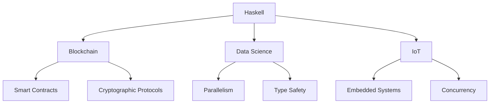

## 23.3 The Future of Haskell and Functional Programming

As we delve into the future of Haskell and functional programming, it's essential to understand the current trends, potential applications in emerging technologies, and the broader impact of functional paradigms on the software industry. This exploration will provide insights into how Haskell, with its unique features and capabilities, is poised to influence the future of software development.

### Trends in Haskell and Functional Programming

#### Adoption in Industry

Haskell, traditionally seen as an academic language, has been gradually gaining traction in the industry. Companies like Facebook, GitHub, and Standard Chartered have adopted Haskell for specific projects, recognizing its strengths in reliability, maintainability, and expressiveness.

- **Reliability and Safety**: Haskell's strong static typing and purity make it an excellent choice for applications where correctness is critical. This has led to its adoption in finance, where errors can be costly, and in blockchain technologies, where security is paramount.

- **Maintainability**: The immutability and declarative nature of Haskell code contribute to easier maintenance and refactoring. This is particularly beneficial in large codebases where understanding and modifying code can be challenging.

- **Expressiveness**: Haskell's concise syntax and powerful abstractions allow developers to express complex ideas succinctly. This expressiveness is a significant advantage in domains like data science and machine learning, where complex algorithms need to be implemented efficiently.

#### Language Developments

Haskell continues to evolve, with ongoing developments aimed at improving performance, usability, and interoperability. Key areas of focus include:

- **GHC Improvements**: The Glasgow Haskell Compiler (GHC) is continually being enhanced to improve performance and support new language features. Recent updates have focused on optimizing compilation times and runtime performance, making Haskell more competitive with other languages.

- **Language Extensions**: Haskell's extensibility through language extensions allows developers to experiment with new features and paradigms. Extensions like Generalized Algebraic Data Types (GADTs) and Type Families have expanded Haskell's capabilities, enabling more expressive and flexible code.

- **Interoperability**: Efforts to improve interoperability with other languages and platforms, such as JavaScript (via GHCJS) and WebAssembly, are making Haskell more versatile and accessible for a broader range of applications.

### The Potential Role of Haskell in Emerging Technologies

Haskell's unique features position it well for several emerging technologies. Let's explore some areas where Haskell could play a significant role:

#### Blockchain and Cryptocurrencies

Haskell's emphasis on correctness and security makes it a natural fit for blockchain and cryptocurrency applications. Its strong type system can help prevent common programming errors that could lead to vulnerabilities in smart contracts and blockchain protocols.

- **Smart Contracts**: Haskell's purity and immutability align well with the deterministic nature of smart contracts. Languages like Plutus, used in the Cardano blockchain, are based on Haskell, leveraging its strengths to ensure secure and reliable contract execution.

- **Cryptographic Protocols**: The precision and mathematical rigor of Haskell make it suitable for implementing cryptographic protocols, where correctness is crucial.

#### Data Science and Machine Learning

While Haskell is not traditionally associated with data science, its functional paradigm offers several advantages for machine learning and data processing tasks.

- **Parallelism and Concurrency**: Haskell's support for parallelism and concurrency can be leveraged to process large datasets efficiently. Libraries like Accelerate and Repa enable high-performance computing in Haskell, making it a viable option for data-intensive applications.

- **Type Safety**: The strong type system in Haskell can help prevent errors in data processing pipelines, ensuring that data transformations are applied correctly.

#### Internet of Things (IoT)

The IoT landscape presents unique challenges, including resource constraints and the need for reliable, low-latency communication. Haskell's efficiency and reliability make it a promising candidate for IoT applications.

- **Embedded Systems**: Haskell's ability to produce efficient, low-level code through tools like Asterius (for WebAssembly) makes it suitable for embedded systems, where performance and resource usage are critical.

- **Concurrency**: The concurrency model in Haskell, particularly Software Transactional Memory (STM), can be used to manage communication and data processing in IoT networks effectively.

### The Impact of Functional Programming Paradigms

Functional programming paradigms, with Haskell as a leading example, are influencing the broader software development landscape. Let's discuss some of the key impacts:

#### Emphasis on Immutability and Pure Functions

The principles of immutability and pure functions, central to functional programming, are being adopted in other programming paradigms. These principles lead to more predictable and testable code, reducing the likelihood of bugs and making systems easier to reason about.

- **Concurrency and Parallelism**: Immutability simplifies concurrent programming by eliminating race conditions and side effects. This has led to the adoption of functional concepts in languages like Java and C#, which now offer functional features to facilitate concurrent programming.

- **Testability**: Pure functions, which have no side effects, are inherently easier to test. This has influenced testing practices across the industry, encouraging developers to write more modular and testable code.

#### Declarative Programming

Functional programming promotes a declarative style, where developers specify what they want to achieve rather than how to achieve it. This shift towards declarative programming is evident in the rise of domain-specific languages (DSLs) and frameworks that abstract away implementation details.

- **Infrastructure as Code**: Tools like Terraform and AWS CloudFormation adopt a declarative approach to infrastructure management, allowing developers to define infrastructure requirements without specifying the exact steps to provision resources.

- **UI Frameworks**: Modern UI frameworks, such as React, embrace a declarative approach to building user interfaces, inspired by functional programming principles.

### Code Examples and Visualizations

To illustrate the concepts discussed, let's explore some code examples and visualizations that highlight Haskell's capabilities and potential applications.

#### Example: Implementing a Simple Smart Contract in Haskell

```haskell
{-# LANGUAGE OverloadedStrings #-}

module SimpleContract where

import Data.Text (Text)

-- Define a simple smart contract data type
data Contract = Contract
  { contractName :: Text
  , contractValue :: Int
  } deriving (Show)

-- Function to create a new contract
createContract :: Text -> Int -> Contract
createContract name value = Contract
  { contractName = name
  , contractValue = value
  }

-- Function to validate a contract
validateContract :: Contract -> Bool
validateContract contract = contractValue contract > 0

-- Example usage
main :: IO ()
main = do
  let contract = createContract "MyContract" 100
  print contract
  print $ validateContract contract
```

In this example, we define a simple smart contract data type and functions to create and validate contracts. This demonstrates Haskell's expressiveness and type safety, which are valuable in blockchain applications.

#### Visualization: Haskell's Role in Emerging Technologies



This diagram illustrates the potential applications of Haskell in emerging technologies, highlighting its strengths in blockchain, data science, and IoT.

### Knowledge Check

Let's reinforce the concepts covered with some questions and exercises:

- **Question**: What are the key advantages of using Haskell for blockchain applications?
- **Exercise**: Modify the smart contract example to include a function that updates the contract value, ensuring that the new value is always positive.

### Embrace the Journey

As we explore the future of Haskell and functional programming, it's important to remember that this is just the beginning. The landscape of software development is constantly evolving, and Haskell's unique features position it well to address the challenges and opportunities that lie ahead. Keep experimenting, stay curious, and enjoy the journey!

### Conclusion

In conclusion, the future of Haskell and functional programming is bright, with significant potential for growth and impact across various domains. As the industry continues to recognize the benefits of functional paradigms, Haskell is poised to play a crucial role in shaping the future of software development.

## Quiz: The Future of Haskell and Functional Programming



### What are some key advantages of using Haskell in blockchain applications?

- [x] Reliability and security
- [x] Strong type system
- [ ] High-level syntax
- [ ] Dynamic typing

> **Explanation:** Haskell's reliability, security, and strong type system make it suitable for blockchain applications.

### Which of the following is a trend in Haskell's language development?

- [x] GHC improvements
- [ ] Decreased focus on type safety
- [ ] Removal of language extensions
- [ ] Less emphasis on interoperability

> **Explanation:** GHC improvements are a key trend in Haskell's language development, focusing on performance and new features.

### How does Haskell's immutability benefit concurrent programming?

- [x] Eliminates race conditions
- [ ] Increases side effects
- [ ] Complicates code maintenance
- [ ] Reduces testability

> **Explanation:** Immutability eliminates race conditions, making concurrent programming safer and more predictable.

### What is a potential role of Haskell in IoT applications?

- [x] Efficient embedded systems
- [ ] High resource consumption
- [ ] Complex syntax
- [ ] Lack of concurrency support

> **Explanation:** Haskell's efficiency and concurrency support make it suitable for embedded systems in IoT applications.

### Which of the following is a benefit of declarative programming in functional languages?

- [x] Simplifies code reasoning
- [x] Encourages modular design
- [ ] Increases implementation details
- [ ] Reduces abstraction

> **Explanation:** Declarative programming simplifies reasoning and encourages modular design by abstracting implementation details.

### What is a key feature of Haskell that supports data science applications?

- [x] Parallelism and concurrency
- [ ] Lack of type safety
- [ ] High-level syntax
- [ ] Dynamic typing

> **Explanation:** Haskell's parallelism and concurrency support make it suitable for data-intensive applications in data science.

### How does Haskell's type system benefit machine learning applications?

- [x] Prevents errors in data processing
- [ ] Increases code complexity
- [x] Ensures correct data transformations
- [ ] Reduces code readability

> **Explanation:** Haskell's type system prevents errors and ensures correct data transformations in machine learning applications.

### What is a challenge of using Haskell in industry?

- [x] Perception as an academic language
- [ ] Lack of type safety
- [ ] Poor performance
- [ ] Limited expressiveness

> **Explanation:** Haskell is often perceived as an academic language, which can be a challenge for industry adoption.

### Which of the following is an emerging technology where Haskell can play a significant role?

- [x] Blockchain
- [ ] Legacy systems
- [ ] Procedural programming
- [ ] Static websites

> **Explanation:** Haskell's strengths in reliability and security make it suitable for blockchain applications.

### True or False: Haskell's emphasis on immutability and pure functions is influencing other programming paradigms.

- [x] True
- [ ] False

> **Explanation:** Haskell's emphasis on immutability and pure functions is influencing other programming paradigms, leading to more predictable and testable code.


