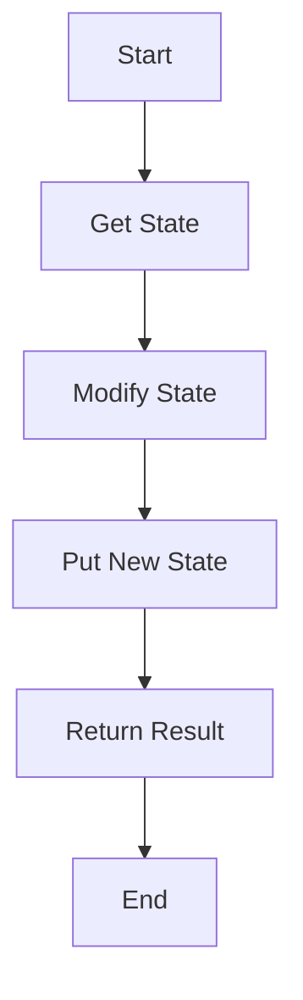

## 23.4 Final Thoughts on Design Patterns in Haskell

### Reflection on the Importance of Design Patterns

Design patterns are the cornerstone of crafting high-quality software. They provide a shared language for developers, enabling them to communicate complex ideas succinctly and effectively. In Haskell, a language renowned for its expressive power and mathematical rigor, design patterns take on a unique flavor. They are not merely templates for solving common problems but are deeply intertwined with the language's functional paradigm, emphasizing immutability, higher-order functions, and strong static typing.

#### The Role of Design Patterns in Haskell

1. **Enhancing Code Reusability and Maintainability**: Design patterns in Haskell promote code reuse and maintainability by providing proven solutions to recurring problems. They help developers avoid reinventing the wheel and focus on solving domain-specific challenges.

2. **Facilitating Communication**: By using well-known patterns, Haskell developers can communicate their design intentions more clearly. This shared vocabulary reduces misunderstandings and accelerates the development process.

3. **Encouraging Best Practices**: Design patterns encapsulate best practices, guiding developers towards writing clean, efficient, and robust code. They help in structuring code in a way that is both scalable and adaptable to change.

4. **Leveraging Haskell's Unique Features**: Haskell's type system, lazy evaluation, and emphasis on pure functions allow for innovative adaptations of traditional design patterns. For example, the use of monads and type classes can lead to more flexible and composable designs.

### Encouragement to Apply Patterns in Real-World Projects

As we conclude this guide, it's essential to emphasize the practical application of the design patterns you've learned. Here are some steps to help you integrate these patterns into your projects:

1. **Identify Recurrent Problems**: Start by identifying common problems in your projects that could benefit from a design pattern. Look for areas where code is duplicated, difficult to maintain, or prone to errors.

2. **Select Appropriate Patterns**: Choose patterns that best fit the problem at hand. Consider the trade-offs and ensure that the pattern aligns with the overall architecture and design goals of your project.

3. **Experiment and Iterate**: Don't be afraid to experiment with different patterns. Haskell's type system and functional nature make it easy to refactor and iterate on designs. Use this flexibility to explore various approaches and find the most effective solution.

4. **Collaborate and Share**: Share your experiences and insights with the Haskell community. Collaboration can lead to new ideas and improvements, benefiting both your projects and the broader community.

5. **Reflect and Learn**: After implementing a pattern, take the time to reflect on its effectiveness. Consider what worked well and what could be improved. Use these insights to refine your approach in future projects.

### Code Examples and Visualizations

To illustrate the application of design patterns in Haskell, let's revisit some key patterns with code examples and visualizations.

#### Example: The State Monad Pattern

The State Monad is a powerful pattern in Haskell for managing stateful computations. It encapsulates state transitions and provides a clean interface for state manipulation.

```haskell
import Control.Monad.State

-- A simple stateful computation that increments a counter
incrementCounter :: State Int Int
incrementCounter = do
    counter <- get
    put (counter + 1)
    return counter

-- Running the stateful computation
main :: IO ()
main = do
    let initialState = 0
    let (result, finalState) = runState incrementCounter initialState
    putStrLn $ "Result: " ++ show result
    putStrLn $ "Final State: " ++ show finalState
```

In this example, the `State` monad is used to encapsulate a computation that increments a counter. The `get` and `put` functions are used to access and modify the state, respectively.

#### Visualization: State Monad Flow



This flowchart illustrates the sequence of operations in a stateful computation using the State Monad. It begins with retrieving the current state, modifying it, updating the state, and returning the result.

### Knowledge Check

To reinforce your understanding, consider the following questions:

- How does the State Monad pattern improve code organization in stateful computations?
- What are the benefits of using design patterns in Haskell compared to other programming languages?
- How can you leverage Haskell's type system to enhance the flexibility of design patterns?

### Embrace the Journey

Remember, mastering design patterns in Haskell is a journey, not a destination. As you continue to explore and apply these patterns, you'll gain deeper insights into the language and its capabilities. Stay curious, keep experimenting, and enjoy the process of crafting elegant and efficient software.

### Quiz: Final Thoughts on Design Patterns in Haskell



### What is one of the primary benefits of using design patterns in Haskell?

- [x] Enhancing code reusability and maintainability
- [ ] Increasing code complexity
- [ ] Reducing code readability
- [ ] Limiting the use of Haskell's type system

> **Explanation:** Design patterns enhance code reusability and maintainability by providing proven solutions to common problems.

### How do design patterns facilitate communication among developers?

- [x] By providing a shared vocabulary
- [ ] By increasing code verbosity
- [ ] By enforcing strict coding standards
- [ ] By limiting the use of comments

> **Explanation:** Design patterns provide a shared vocabulary that helps developers communicate design intentions more clearly.

### What is a unique feature of Haskell that influences its design patterns?

- [x] Strong static typing
- [ ] Dynamic typing
- [ ] Lack of type inference
- [ ] Weak type system

> **Explanation:** Haskell's strong static typing is a unique feature that influences its design patterns, allowing for more flexible and composable designs.

### Which pattern is used to manage stateful computations in Haskell?

- [x] State Monad Pattern
- [ ] Singleton Pattern
- [ ] Factory Pattern
- [ ] Observer Pattern

> **Explanation:** The State Monad Pattern is used to manage stateful computations in Haskell.

### What should you do after implementing a design pattern in a project?

- [x] Reflect and learn from the experience
- [ ] Ignore the results
- [ ] Avoid sharing insights with others
- [ ] Discard the pattern immediately

> **Explanation:** After implementing a design pattern, it's important to reflect and learn from the experience to improve future projects.

### How can Haskell's type system enhance the flexibility of design patterns?

- [x] By allowing for more composable designs
- [ ] By restricting code reuse
- [ ] By enforcing rigid design structures
- [ ] By limiting the use of higher-order functions

> **Explanation:** Haskell's type system enhances the flexibility of design patterns by allowing for more composable designs.

### What is a key consideration when selecting a design pattern for a project?

- [x] Aligning with the overall architecture and design goals
- [ ] Choosing the most complex pattern available
- [ ] Ignoring the problem at hand
- [ ] Disregarding the project's requirements

> **Explanation:** It's important to select a design pattern that aligns with the overall architecture and design goals of the project.

### What is the first step in applying design patterns to a project?

- [x] Identify recurrent problems
- [ ] Select a random pattern
- [ ] Implement without planning
- [ ] Avoid using patterns

> **Explanation:** The first step is to identify recurrent problems that could benefit from a design pattern.

### How can collaboration benefit the application of design patterns?

- [x] By leading to new ideas and improvements
- [ ] By increasing project isolation
- [ ] By reducing code quality
- [ ] By limiting innovation

> **Explanation:** Collaboration can lead to new ideas and improvements, benefiting both individual projects and the broader community.

### True or False: Design patterns in Haskell are only useful for small projects.

- [ ] True
- [x] False

> **Explanation:** Design patterns in Haskell are useful for projects of all sizes, providing structure and best practices that enhance code quality and maintainability.



As you continue your journey in mastering Haskell design patterns, remember that the knowledge and skills you've gained are powerful tools for crafting high-quality software. Embrace the challenges, celebrate your successes, and keep pushing the boundaries of what's possible with Haskell.
